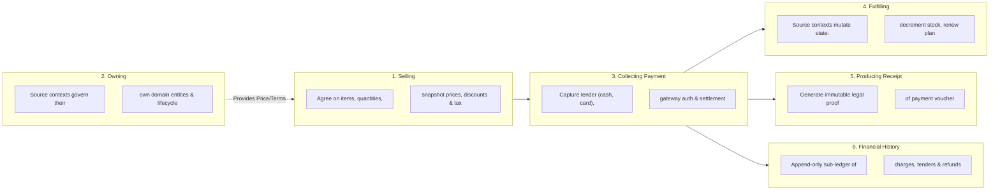
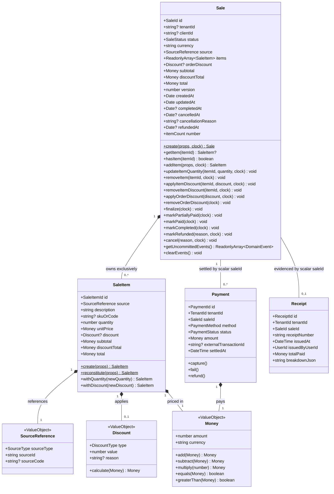
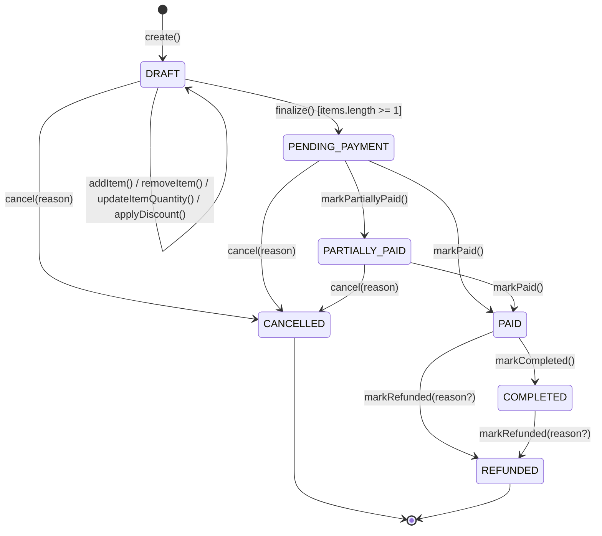
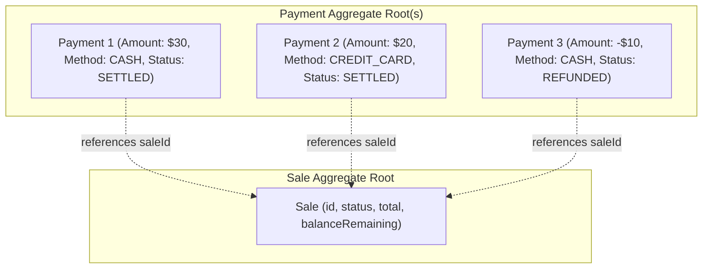
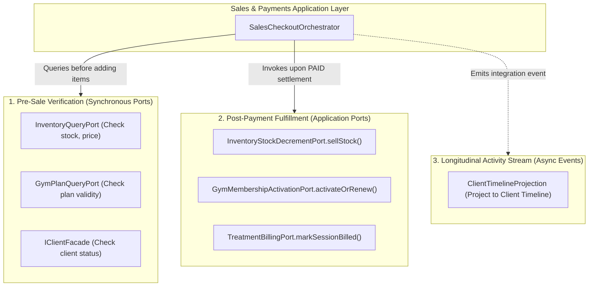
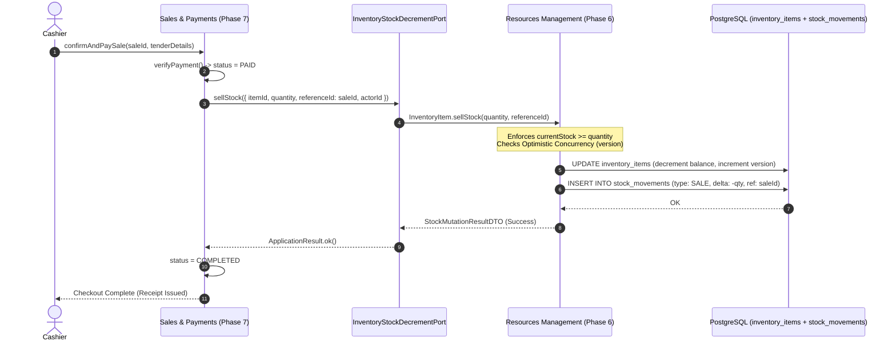

# Phase 7: Sales & Payments — Architectural Contract & Subsystem Specification

- **Document**: `docs/architecture/sales-payments.md`
- **Status**: Authoritative Architectural Contract
- **Domain**: Phase 7 — Sales & Payments
- **Role**: Principal Domain Architect / Staff Platform Engineer
- **Date**: 2026-09-17

---

## 1. Purpose

The **Sales & Payments** bounded context exists to provide a unified, authoritative commercial transaction and settlement engine for the entire Kinergy platform.

In an integrated health, wellness, and fitness business, commercial transactions originate across distinct operational areas:

- Clinical rehabilitation consultations and kinesiology therapy sessions (Phase 4)
- Gym membership plans, renewals, and visit passes (Phase 5)
- Consumable inventory purchases: supplements, protein shakes, healthy meals, and wellness drinks (Phase 6)
- Facility amenities, room rentals, workshops, and custom services (Phase 3 & Future)

Without a centralized Sales & Payments context, each operational area is forced to invent its own invoicing, tender handling, discount logic, receipt generation, and payment gateway bindings. This fragmentation leads to:

1. Inconsistent financial ledgers and fragmented client billing histories.
2. Inability to execute a single, unified point-of-sale (POS) checkout combining goods and services (e.g., a client buying a gym membership, a therapy session, and a smoothie in one transaction).
3. Leakage of payment gateway credentials, fiscal compliance, and tax calculation rules into clinical, scheduling, and inventory domain models.

### Foundational Architectural Principle

> **"References Over Ownership."**  
> The Sales context records and settles the commercial transaction. It never becomes the owner of the things being sold, the people buying them, or the physical inventory fulfilling them.

To guarantee bounded context integrity, the platform strictly delineates six distinct responsibilities:



1. **Selling Something**: The commercial agreement. Assembles line items, applies order/item discounts, calculates taxes, snapshots current prices, and determines the total payable balance. Governed by the `Sale` aggregate.
2. **Owning the Thing Being Sold**: The source bounded context remains the sole authority over the underlying business entity (e.g., Gym owns `Membership` and `MembershipPlan`; Resources owns `InventoryItem`; Kinesiology owns `TreatmentSession`). Sales holds **references**, never ownership.
3. **Collecting Payment**: The financial transfer of value. Executes tender transactions (cash drawer, credit card terminal, digital wallet, payment gateway), verifies authorizations, and tracks payment settlement status. Governed by the `Payment` aggregate.
4. **Fulfilling the Thing Being Sold**: The operational execution triggered by commercial settlement. Handled strictly by the owning source domain via established application ports (e.g., Resources decrements stock via `InventoryStockDecrementPort`; Gym extends membership periods; Kinesiology records the session as billed).
5. **Producing a Receipt**: The issuance of an immutable, tamper-evident legal voucher (`Receipt`) displaying transaction date, line item breakdown, tax details, payment method, cashier attribution, and unique receipt number.
6. **Recording Financial History**: The append-only, immutable record of every commercial charge, payment authorization, void, and refund for operational and audit reporting.

---

## 2. Bounded Context Definition

```
┌────────────────────────────────────────────────────────────────────────────────────────┐
│                        SALES & PAYMENTS BOUNDED CONTEXT                                 │
│                                                                                        │
│  WHAT IT OWNS:                                                                         │
│  ✓ Sales Orders & Checkout Sessions (Sale)                                             │
│  ✓ Snapshot Line Items (SaleItem)                                                      │
│  ✓ Discounts & Promotional Adjustments (Discount)                                      │
│  ✓ Payment Transactions & Settlement Records (Payment)                                 │
│  ✓ Payment Method Configurations (PaymentMethod)                                       │
│  ✓ Customer Receipts & Proof-of-Purchase (Receipt)                                     │
│  ✓ Commercial Order Lifecycle (DRAFT → PENDING → PAID → COMPLETED → REFUNDED)          │
│  ✓ Point-of-Sale (POS) Checkout Workflows                                              │
│                                                                                        │
│  WHAT IT DOES NOT OWN:                                                                 │
│  ✗ Master Client Profiles & Identities (Owned by Client Management)                    │
│  ✗ User Authentication & Permissions (Owned by IAM)                                    │
│  ✗ Physical Stock Balances & Movement Ledgers (Owned by Resources / Inventory)         │
│  ✗ Capital Assets & Depreciation (Owned by Resources / Fixed Assets)                   │
│  ✗ Membership Validity Dates & Turnstile Rules (Owned by Gym Management)               │
│  ✗ Clinical Notes, Diagnoses & SOAP Records (Owned by Kinesiology)                     │
│  ✗ Room Schedules & Appointment Calendars (Owned by Scheduling)                        │
│  ✗ General Ledger (GL) Double-Entry Bookkeeping & Fiscal Tax Filings (Accounting)     │
└────────────────────────────────────────────────────────────────────────────────────────┘
```

### Prevention of the "Everything Financial" Anti-Pattern

A frequent failure mode in monolithic platforms is expanding the sales module into a catch-all financial dumping ground that subsumes inventory valuation, therapist commission tracking, equipment depreciation, gym billing rules, and general ledger accounting.

Kinergy strictly prevents this anti-pattern through the following boundaries:

1. **Inventory Valuation Remains in Resources**: Consumable inventory working capital ($\sum \text{currentStock} \times \text{purchaseCost}$) and fixed asset book value ($\sum \text{currentEstimatedValue}$) are strictly governed and computed by Phase 6 Resources. Sales & Payments does not manage or recalculate asset book values.
2. **Membership Lifecycle Remains in Gym**: Whether a client is eligible to enter the facility, whether a membership is frozen, and how grace periods are evaluated are strictly governed by Gym Management (`AccessEligibilityEngine`). Sales only processes the commercial subscription fee and signals payment completion.
3. **Clinical Documentation Remains in Kinesiology**: Therapists document SOAP progress notes in Kinesiology. Sales has zero visibility into medical assessments or diagnostic details.
4. **Sales is a Commercial Sub-Ledger, Not a General Ledger**: Sales & Payments records commercial transactions and settlement events. It does not maintain a double-entry chart of accounts, debit/credit balancing, or corporate fiscal returns.

---

## 3. Core Conceptual Model

The conceptual domain model consists of the following foundational concepts:



### Conceptual Specifications

1. **`Sale`**:
   The primary commercial aggregate root representing a purchase agreement between Kinergy and a customer. Encapsulates order state, items, discounts, calculated taxes, and payment fulfillment status.
2. **`SaleItem`**:
   An entity within the `Sale` aggregate representing an individual line item. Stores a permanent commercial snapshot of the unit price, description, quantity, tax rate, and applied discount at the moment of sale.
3. **`Payment`**:
   An autonomous aggregate root representing a monetary settlement transaction. Captures tender method (`CASH`, `CREDIT_CARD`, `DEBIT_CARD`, `BANK_TRANSFER`, `DIGITAL_WALLET`), payment gateway transaction identifiers, status (`INITIATED`, `AUTHORIZED`, `SETTLED`, `FAILED`, `REFUNDED`), and timestamps.
4. **`Receipt`**:
   An autonomous, immutable legal document entity generated upon full or milestone payment. Contains a monotonically increasing receipt number (e.g. `REC-2026-000042`), timestamp, cashier attribution, and frozen summary JSON.
5. **`SourceReference`**:
   An immutable Value Object within `SaleItem` establishing the loose, typed link to the origin entity (`sourceType`: `INVENTORY_ITEM`, `MEMBERSHIP_PLAN`, `TREATMENT_SESSION`, `CUSTOM_SERVICE`, and `sourceId`: UUID string).
6. **`Money`**:
   The canonical platform Value Object (shared kernel) encapsulating an exact non-negative amount (fixed 2 decimal places / integer cents) and ISO-4217 currency code.
7. **`Discount`**:
   An immutable Value Object in the Sales bounded context representing a fixed-amount (`FIXED`) or percentage (`PERCENTAGE`) reduction applied strictly at the line-item level (`SaleItem.discount`), evaluated deterministically via integer cent Half-Up arithmetic (`calculate(eligibleAmount)`).

---

## 4. Aggregate Boundaries & Transactional Lifecycles

### 4.1 The `Sale` Aggregate Root

```
┌────────────────────────────────────────────────────────────────────────┐
│                        SALE AGGREGATE BOUNDARY                         │
│                                                                        │
│  [Sale Root Entity]                                                    │
│  - id: SaleId                                                          │
│  - tenantId?: string (Organization boundary)                           │
│  - clientId?: string (Optional walk-in client reference)               │
│  - status: SaleStatus (7 Canonical States)                             │
│  - currency: string (Normalized ISO-4217 standard)                     │
│  - source: SourceReference (Commercial origin reference)               │
│  - version: number (Optimistic Concurrency Control counter >= 1)       │
│  - orderDiscount: Discount? (Order-level reduction, deferred)          │
│  - subtotal: Money (Sum of line subtotals)                             │
│  - discountTotal: Money (Sum of line item discounts)                  │
│  - total: Money (Subtotal - discountTotal, guaranteed >= 0.00)         │
│  - timestamps: createdAt, updatedAt, completedAt?, cancelledAt?,       │
│                refundedAt?, cancellationReason?                        │
│                                                                        │
│  [Internal Owned Entities]                                             │
│  - items: ReadonlyArray<SaleItem> (Deeply encapsulated)                │
│    ├── id: SaleItemId                                                  │
│    ├── source: SourceReference (Value Object)                          │
│    ├── description: string (Checkout snapshot)                         │
│    ├── skuOrCode: string? (Checkout snapshot)                          │
│    ├── quantity: number (Positive decimal/integer, 3 decimal scale)    │
│    ├── unitPrice: Money (Gross unit price snapshot)                    │
│    ├── discount: Discount? (Line-item discount)                        │
│    ├── subtotal: Money (quantity * unitPrice)                          │
│    ├── discountTotal: Money (discount.calculate(subtotal))             │
│    └── total: Money (subtotal - discountTotal)                         │
│                                                                        │
│  TRANSACTIONAL INVARIANTS:                                             │
│  1. An item cannot be added/modified/removed unless status == DRAFT.   │
│  2. Finalization requires >= 1 line item (throws EmptySaleException).  │
│  3. Total = Subtotal - DiscountTotal. Total payable cannot be negative.│
│  4. Currencies of all items, discounts, and totals must be identical.  │
│  5. Cancellation requires non-empty reason; allowed only from DRAFT,   │
│     PENDING_PAYMENT, or PARTIALLY_PAID.                                │
│  6. Aggregate operations guarantee strict failure atomicity.           │
└────────────────────────────────────────────────────────────────────────┘
```

#### Invariants & Rules

1. **Commercial Immutability**: Once a `Sale` transitions out of `DRAFT` (into `PENDING_PAYMENT`, `PARTIALLY_PAID`, `PAID`, `COMPLETED`, `CANCELLED`, or `REFUNDED`), line items and discounts cannot be added, edited, or deleted (`SaleAlreadyFinalizedException` with code `'SALE_ALREADY_FINALIZED'`).
2. **Currency Consistency**: All items, discounts, and totals within a `Sale` must share the identical ISO-4217 currency code. Mixed-currency sales are strictly rejected (`InvalidSaleStateException`).
3. **Non-Negative Valuation & Invariant Reconciliation**: Line items and net order totals must never be negative. Fixed discounts exceeding line subtotal are strictly rejected with `InvalidDiscountException` (no silent clamping). Subtotal and discount totals reconcile deterministically:
   $$\text{Sale.subtotal} = \sum \text{SaleItem.subtotal}$$
   $$\text{Sale.discountTotal} = \sum \text{SaleItem.discountAmount}$$
   $$\text{Sale.total} = \text{Sale.subtotal} - \text{Sale.discountTotal} \ge \$0.00$$
4. **Optimistic Concurrency Control (OCC)**: The `Sale` aggregate root maintains an integer `version` field incremented on every lifecycle transition to prevent lost updates during concurrent operations.
5. **Failure Atomicity**: Any operation failing an invariant assertion aborts immediately before modifying state, staging zero uncommitted events.

#### Lifecycle State Machine (7 Canonical States)



### 4.2 The `Payment` Aggregate Root

#### Architectural Decision: Why `Payment` is an Autonomous Aggregate

Kinergy models `Payment` as an **autonomous aggregate root**, linked to `Sale` via scalar `saleId: string`, rather than an internal child entity of `Sale`.



#### Rationale

1. **Split-Tender Payments**: Front-desk operations frequently require split tenders (e.g., $30 paid in cash, $20 paid via credit card). Modeling payments as distinct records allows multiple tenders to settle a single sale cleanly.
2. **Asynchronous Gateway Latency**: Credit card terminal processing, online payment webhooks, and QR code transfers are asynchronous and prone to network retries. Autonomous payment aggregates allow the payment processing lifecycle (`INITIATED` $\rightarrow$ `AUTHORIZED` $\rightarrow$ `SETTLED`) to proceed without placing an exclusive database lock on the `Sale` aggregate.
3. **Independent Financial Auditing**: Payments represent concrete money movement involving external institutions (acquirers, merchant accounts, bank statements). They require their own state machines, retry policies, failure codes, and transaction references.
4. **Clean Refund Lineage**: A refund is a discrete financial movement. Modeling it as an autonomous payment transaction with negative or inverse tender links preserves an exact audit trail back to the original settlement.

### 4.3 `Receipt` Ownership & Immutability

`Receipt` is an **autonomous, immutable voucher entity**.

- **Issuance Rule**: Generated only when a `Sale` transitions to `PAID` (or receives a qualifying partial deposit).
- **Immutability Guarantee**: Once written with a unique sequential receipt number (`receiptNumber`), a `Receipt` is **read-only and immutable forever**. It can never be updated or deleted.
- **Refund Policy**: When a sale is refunded, the original receipt is **never** deleted or edited. Instead, an autonomous `RefundReceipt` (or `CreditNote`) is issued referencing the original receipt number.

---

## 5. Explicit Ownership Matrix

To eliminate any ambiguity across the engineering team, ownership is strictly established as follows:

| Concept                    | Owning Bounded Context   | Sales & Payments Role                 | Authoritative Boundary Rule                                                      |
| :------------------------- | :----------------------- | :------------------------------------ | :------------------------------------------------------------------------------- |
| **`Sale`**                 | **Sales & Payments**     | **Aggregate Root Owner**              | Full transactional ownership of order state, line items, and lifecycle.          |
| **`SaleItem`**             | **Sales & Payments**     | **Internal Entity Owner**             | Owns line item snapshot; lifetime bound to parent `Sale`.                        |
| **`Payment`**              | **Sales & Payments**     | **Autonomous Aggregate Owner**        | Owns tender capture, gateway references, and settlement lifecycle.               |
| **`Receipt`**              | **Sales & Payments**     | **Autonomous Document Owner**         | Owns legal receipt formatting, sequential numbering, and frozen output.          |
| **`Client`**               | **Client Management**    | **Customer Reference** (`clientId?`)  | Master identity owned by Phase 2. Sales stores optional unconstrained reference. |
| **`User` (Cashier/Staff)** | **Identity (IAM)**       | **Actor Reference** (`cashierId`)     | User identities, sessions, and credentials owned by Phase 1.                     |
| **`InventoryItem`**        | **Resources Management** | **Source Reference** (`sourceId`)     | Physical stock and warehouse catalog owned by Phase 6.                           |
| **`StockMovement`**        | **Resources Management** | **External Trigger via Port**         | Stock ledger owned by Phase 6. Sales triggers movement via capability port.      |
| **`FixedAsset`**           | **Resources Management** | **Never Owned by Sales**              | Capital equipment and depreciation owned by Phase 6.                             |
| **`Membership`**           | **Gym Management**       | **External Trigger via Port**         | Membership validity and freeze state owned by Phase 5.                           |
| **`MembershipPlan`**       | **Gym Management**       | **Source Reference** (`sourceId`)     | Commercial plan definition and validity terms owned by Phase 5.                  |
| **`AttendanceRecord`**     | **Gym Management**       | **Never Owned by Sales**              | Facility check-in and access eligibility owned by Phase 5.                       |
| **`TreatmentSession`**     | **Kinesiology**          | **Source Reference** (`sourceId`)     | Clinical care, diagnoses, and SOAP notes owned by Phase 4.                       |
| **`Appointment` / `Room`** | **Scheduling**           | **Correlation Reference** (`apptId?`) | Calendar reservations and room capacities owned by Phase 3.                      |

---

## 6. Source References Architecture & Deep Analysis

### 6.1 The Source Reference Pattern

When a sale line item is created, it points to a source entity using the **Typed Identifier-Based Source Reference pattern**:

```typescript
export enum SourceType {
  INVENTORY_ITEM = 'INVENTORY_ITEM', // Consumable goods requiring physical stock deduction
  MEMBERSHIP_PLAN = 'MEMBERSHIP_PLAN', // Gym membership contracts requiring subscription activation
  TREATMENT_SESSION = 'TREATMENT_SESSION', // Clinical treatments requiring session billing reconciliation
  CUSTOM_SERVICE = 'CUSTOM_SERVICE', // Ad-hoc commercial fees, rentals, or manual line items
}

export class SourceReference {
  readonly sourceType: SourceType;
  readonly sourceId: string; // External UUID in the owning context (or "CUSTOM")
  readonly sourceCode?: string; // Human-readable code (SKU, PlanCode, ServiceCode)
}
```

### 6.2 Source-by-Source Detailed Analysis

The table below explicitly analyzes how Sales & Payments interacts with every potential source of charges:

| Source Type                                                 | 1. Source Owner                     | 2. Sales Responsibility                                                                   | 3. Source Reference                                                               |                                  4. Validates Existence?                                  |                                                  5. May Mutate Source?                                                   |                                        6. Can Source Be Deleted After Sale?                                        | 7. What If Source Changes Later?                                                                                                          |
| :---------------------------------------------------------- | :---------------------------------- | :---------------------------------------------------------------------------------------- | :-------------------------------------------------------------------------------- | :---------------------------------------------------------------------------------------: | :----------------------------------------------------------------------------------------------------------------------: | :----------------------------------------------------------------------------------------------------------------: | :---------------------------------------------------------------------------------------------------------------------------------------- |
| **1. `TreatmentSession`**                                   | **Kinesiology (Phase 4)**           | Records billing of the clinical session; collects patient/client payment; issues receipt. | `sourceType: TREATMENT_SESSION`<br>`sourceId: treatmentSessionId`                 | **Yes**, queries treatment query port; verifies session exists and is completed/billable. |   **No**, Sales invokes `TreatmentBillingPort.markSessionBilled()` upon settlement. Sales never touches medical notes.   | **No**, clinical sessions are immutable legal medical records. Medico-legal retention protects them from deletion. | `SaleItem` retains its frozen price/service snapshot. If the clinical note is amended, the commercial billing amount does **not** change. |
| **2. `Gym Membership / Plan`**                              | **Gym Management (Phase 5)**        | Collects membership subscription or renewal fee; issues receipt.                          | `sourceType: MEMBERSHIP_PLAN`<br>`sourceId: membershipPlanId`                     |               **Yes**, queries plan query port; verifies plan is `ACTIVE`.                |   **No**, Sales invokes `GymMembershipActivationPort` to activate/renew. Sales never mutates validity dates directly.    |       **No**, plans with historical memberships/sales are `ARCHIVED`, never hard-deleted from the database.        | `SaleItem` retains the frozen plan price at checkout. If the gym administrator raises the plan price next week, past sales remain frozen. |
| **3. `Healthy Meal`**                                       | **Resources (Phase 6 Consumables)** | Sells meal at POS/kitchen; collects payment; requests inventory depletion.                | `sourceType: INVENTORY_ITEM`<br>`sourceId: inventoryItemId`<br>`sourceCode: SKU`  |  **Yes**, queries inventory query port; checks active item and available stock on hand.   | **No**, Sales invokes `InventoryStockDecrementPort.sellStock()`. Sales never writes to `inventory_items.quantityOnHand`. |    **No**, inventory items with transaction history are `ARCHIVED` (soft-delete), never hard-deleted from SQL.     | `SaleItem` retains frozen meal description and price. If kitchen updates recipe cost or retail price, past sales remain frozen.           |
| **4. `Healthy Drink`**                                      | **Resources (Phase 6 Consumables)** | Sells beverage at reception/bar; collects payment; requests stock deduction.              | `sourceType: INVENTORY_ITEM`<br>`sourceId: inventoryItemId`<br>`sourceCode: SKU`  |      **Yes**, checks item status and verifies `quantityOnHand >= requestedQuantity`.      |    **No**, Sales requests deduction via capability port. Resources verifies OCC and logs append-only `SALE` movement.    |      **No**, protected by relational integrity in Resources. Deletion blocked if historical movements exist.       | `SaleItem` retains frozen drink description and price. Historical inventory valuation and accounting remain intact.                       |
| **5. Future Sellable Service** (e.g. Room Rental, Workshop) | **Scheduling / Facility Context**   | Assembles service fee; collects payment; confirms booking reservation.                    | `sourceType: CUSTOM_SERVICE`<br>`sourceId: serviceOrRoomId`                       |                 **Yes**, verifies room/amenity reservation availability.                  |                                **No**, invokes scheduling port to confirm booked window.                                 |                               **No**, reservation records remain archived for audit.                               | Commercial terms remain frozen in `SaleItem`. Future price tier changes do not affect historical rentals.                                 |
| **6. Future Sellable Product** (e.g. Branded Apparel, Gear) | **Resources / Retail Catalog**      | Point-of-sale checkout; collects tender; coordinates stock deduction.                     | `sourceType: INVENTORY_ITEM`<br>`sourceId: retailItemId`<br>`sourceCode: Barcode` |                        **Yes**, verifies stock and active status.                         |                               **No**, delegates stock mutation strictly to inventory port.                               |                            **No**, retail items with sales movements are soft-archived.                            | Price and tax rate frozen in `SaleItem` remain immutable forever.                                                                         |

### 6.3 Permanent Commercial Snapshotting Invariant

> [!IMPORTANT]
> **The Snapshotting Invariant**:  
> A `SaleItem` must **never** perform runtime database joins to retrieve current product names, prices, or taxes from source tables.  
> At the moment an item is added to a `Sale`, the application layer resolves the source item and copies its details into the `SaleItem` record:
>
> - `description`: Exact product name at checkout
> - `skuOrCode`: SKU or plan code at checkout
> - `unitPrice`: Exact unit price at checkout
> - `taxRate`: Applicable tax percentage at checkout

If an administrator subsequently changes the price of "Whey Protein Shake" from $5.00 to $6.50 in Resources, all historical sales records, receipts, and revenue reports remain **100% frozen at $5.00**.

---

## 7. Cross-Domain Integration Architecture

### 7.1 Integration Strategy (Decoupled & Anti-Speculative)

In accordance with Kinergy's Clean Architecture standards, cross-domain integration follows three established patterns:



1. **Pre-Sale Verification (Synchronous Query Ports)**:
   - When adding an item to a `Sale`, the Sales application layer calls query ports implemented by source contexts (or shared facades like `IClientFacade`) to verify that the item exists, is active, and has adequate stock.
2. **Post-Payment Fulfillment (In-Process Capability Ports)**:
   - When payment is confirmed (`PAID`), the `SalesCheckoutOrchestrator` invokes the source domain's registered capability port (`InventoryStockDecrementPort`, `GymMembershipActivationPort`, `TreatmentBillingPort`) in-process.
   - **No Distributed Transactions ($2\text{PC}$)**: Each port call executes within the source domain's autonomous consistency boundary.
3. **Timeline Projections (Asynchronous Domain Events)**:
   - Upon completion, Sales emits a `SaleCompletedIntegrationEvent`. An asynchronous projection handler writes a summary entry to `client_timeline_entries` (`source_module = 'SALES'`), enriching the client's longitudinal record without creating synchronous coupling.
   - **No Artificial Event Bus**: Direct in-process invocation is preferred; no complex distributed message broker (RabbitMQ/Kafka) is introduced where simple NestJS application ports suffice.

### 7.2 Client Relationship & Privacy Boundary

- **Ownership**: The master client profile is strictly owned by `modules/client`. Sales **never** duplicates customer names, addresses, or phone numbers in its database schema.
- **Organization Boundary**: `clientId` must belong to the identical `tenantId`.
- **Nullable / Optional Semantics**: `clientId?: string` is **strictly optional**. Front-desk retail purchases (e.g. walk-in visitor buying a bottle of water) do not require client registration.
- **GDPR & Anonymization Immunity**: If a client exercises their "Right to be Forgotten" (GDPR) and their record in `clients` is anonymized or purged, the financial records (`Sale`, `Payment`, `Receipt`) remain **100% intact**. The `clientId` becomes an orphaned or anonymized scalar string, preserving corporate fiscal audit history without violating privacy laws.

### 7.3 Resources Integration: Consumables & Stock Mutation

> **Fundamental Rule**:  
> **Sales records financial transactions; Resources owns physical stock mutation.**



- Sales **never** writes SQL queries to `inventory_items` or updates `quantity_on_hand`.
- Resources aggregate enforces the `currentStock >= quantity` non-negative invariant and optimistic concurrency control (`version`).
- If stock is depleted, the port returns an error (`ApplicationResult.fail('Insufficient stock')`). The payment is not captured, or an immediate void/compensation is executed.

### 7.4 Treatment & Gym Integration Flow

1. **Gym Management**:
   - Gym publishes sellable plans via `MembershipPlanRepository` query ports.
   - When a customer purchases a plan at checkout, Sales records `sourceType: MEMBERSHIP_PLAN`.
   - Upon payment settlement (`PAID`), Sales calls `GymMembershipActivationPort.activateOrRenew({ clientId, planId, paymentRef: saleId })`.
   - Gym Management computes the start date, end date, and assigns status `ACTIVE`.
2. **Kinesiology / Treatments**:
   - Therapists complete clinical treatment sessions in Kinesiology (`TreatmentSession`).
   - When the client arrives at reception to pay, the cashier selects the completed session.
   - Sales snapshots the agreed therapy fee and records `sourceType: TREATMENT_SESSION`.
   - Upon payment settlement, Sales calls `TreatmentBillingPort.markSessionBilled({ sessionId, saleId })`.
   - Kinesiology records the session as settled. Sales never accesses or stores SOAP progress notes.

---

## 8. Authorization & Security Boundary

### 8.1 Authorization Architecture & Canonical Permissions

In accordance with Phase 1 IAM architecture and ADR-0111, Sales & Payments defines fine-grained permissions using canonical dot-notation (`<resource>.<action>`):

| Permission Code       | Classification            | Operational Capabilities                                                                                           | Minimum Role                                           |
| :-------------------- | :------------------------ | :----------------------------------------------------------------------------------------------------------------- | :----------------------------------------------------- |
| **`sales.read`**      | **Read-Only**             | Query and view sales orders, cart items, order status, customer purchase histories.                                | `Receptionist`, `Trainer`, `Kitchen Staff`, `Owner`    |
| **`sales.create`**    | **Transactional**         | Initiate checkout sessions, add/remove items to draft orders, apply standard promotional discounts within limits.  | `Receptionist`, `Kitchen Staff`, `Owner`               |
| **`sales.manage`**    | **Financially Sensitive** | Apply discretionary discounts exceeding cashier thresholds (e.g. $> 15\%$), override prices, modify sale metadata. | `Manager`, `Owner`                                     |
| **`sales.cancel`**    | **Destructive**           | Cancel or void a draft or finalized sale prior to fulfillment; record mandatory cancellation reason.               | `Receptionist` (drafts), `Manager`/`Owner` (finalized) |
| **`payments.read`**   | **Read-Only**             | View payment transaction histories, tender methods, settlement timestamps, and payment statuses.                   | `Receptionist`, `Owner`                                |
| **`payments.create`** | **Transactional**         | Record cash collection, trigger card terminal pre-authorization, capture electronic tender.                        | `Receptionist`, `Kitchen Staff` (POS), `Owner`         |
| **`payments.manage`** | **Financially Sensitive** | Authorize compensating refunds, settle manual payment exceptions, process chargeback adjustments.                  | `Manager`, `Owner`                                     |
| **`receipts.read`**   | **Read-Only**             | View and download customer receipt vouchers for settled transactions.                                              | `Receptionist`, `Trainer`, `Client` (own), `Owner`     |
| **`receipts.manage`** | **Financially Sensitive** | Authorize receipt reprints, issue duplicate vouchers, generate fiscal credit notes.                                | `Receptionist` (standard reprint), `Owner`             |

#### Backward Compatibility Mapping

- `billing.read` implies `sales.read`, `payments.read`, and `receipts.read`.
- `billing.write` implies `sales.create` and `payments.create`.

### 8.2 Multi-Tenant Organization Isolation Guards

To guarantee absolute isolation between organizations:

1. **Cross-Tenant Sale Access Guard**: Repository queries enforce `where: { id, tenantId }`. Domain handlers assert `sale.tenantId === context.tenantId`.
2. **Cross-Tenant Payment Access Guard**: Settle and capture commands verify `payment.tenantId === context.tenantId` AND `sale.tenantId === payment.tenantId`.
3. **Cross-Tenant Receipt Access Guard**: Receipts are partitioned by `tenantId`. Sequential receipt numbers (`REC-2026-XXXX`) advance monotonically within each tenant's namespace.
4. **Cross-Tenant SourceReference Guard**: Capability query ports resolving catalog items (`INVENTORY_ITEM`, `MEMBERSHIP_PLAN`, `TREATMENT_SESSION`) assert `sourceItem.tenantId === context.tenantId`. Cross-tenant checkout attempts are rejected with `TenantMismatchException`.

### 8.3 Zero Client Trust & Actor Propagation

- Transport controllers **never accept** `actorId`, `userId`, or `tenantId` in request bodies.
- Actor identities are extracted from verified JWT tokens (`@CurrentUser()`) and injected directly into CQRS commands.

---

## 9. Audit & Telemetry Architecture

Sales & Payments strictly segregates events across three logging tiers to prevent audit bloat while maintaining immutable financial accountability:

```
┌────────────────────────────────────────────────────────────────────────┐
│                        THREE-TIER LOGGING TAXONOMY                     │
│                                                                        │
│  1. BUSINESS AUDIT (Append-Only Event Store / Compliance)              │
│     "What financially meaningful action occurred?"                     │
│     • Sale Finalized       • Payment Settled     • Receipt Issued      │
│     • Sale Cancelled       • Refund Executed     • Discount Override   │
│                                                                        │
│  2. APPLICATION LOGGING (Pino / CloudWatch / Datadog)                  │
│     "What did the software do?"                                        │
│     • Draft item added     • Cache hit/miss      • HTTP 200 response   │
│     • Draft quantity edit  • DB query duration   • Gateway timeout     │
│                                                                        │
│  3. SECURITY LOGGING (SIEM / Security Event Publisher)                 │
│     "Who attempted a protected or suspicious action?"                  │
│     • Access Denied (403)  • Cross-tenant probe  • Unauthenticated     │
│     • Token Replay         • Excess failed PIN   • Webhook signature   │
└────────────────────────────────────────────────────────────────────────┘
```

### 9.1 Evaluated Events & Audit Classification

- **Draft Cart Churn (`SaleItemAddedToDraft`, `SaleItemQuantityChangedInDraft`)**: Application log only. Pre-finalization cart updates carry zero financial commitment. Logging draft churn pollutes the permanent audit ledger.
- **Order Finalization (`SaleFinalized`)**: **Business Audit**. Permanently locks commercial items, prices, discounts, and order totals.
- **Settlement (`PaymentSettled`)**: **Business Audit**. Records funds captured, tender type, and cashier/terminal attribution.
- **Exceptions (`SaleCancelled`, `PaymentRefunded`)**: **Business Audit**. Records mandatory justification and authorizing manager ID.
- **Failures (`PaymentFailed`)**: **Security & Operational Log**. Preserves gateway decline reason code for fraud monitoring.

### 9.2 Sensitive Payment Information Protection (PCI-DSS)

1. **Never Logged, Never Stored**:
   - Primary Account Numbers (PAN / full 16 digits).
   - Sensitive Authentication Data (SAD): CVV/CVC, expiration dates, terminal PINs.
   - Provider secrets: Gateway API keys, webhook signing secrets.
2. **Permitted Cardholder Data**: Last 4 digits (`**** 4242`), card brand (`VISA`), and gateway transaction reference ID.
3. **Transport Masking**: All logging interceptors sanitize request and audit payloads with regex pattern matching.

### 9.3 Invariant: Financial Ledgers are Append-Only

Under no circumstances may a `Payment` record or `Receipt` record be deleted (`DELETE`) or retroactively altered (`UPDATE`) in the database. Correction of an erroneously recorded payment must be executed via an explicit compensating transaction (`VOID` or `REFUND`).

---

## 10. Multi-Tenancy & Branch Scoping

1. **Strict Organization Scoping**:
   - Every `Sale`, `SaleItem`, `Payment`, and `Receipt` table includes an indexed `tenant_id` column.
   - All repository queries and mutation commands require an explicit `tenantId` parameter extracted from the verified `AuthenticatedUserContext`.
   - Direct cross-tenant data visibility is mathematically impossible at the database query level.
2. **Future Branch Support (`branchId`)**:
   - To support Kinergy's multi-branch expansion roadmap without future schema breakage, all commercial aggregates will include an optional scalar `branchId?: string` field (defaulting to the primary facility).
   - This allows independent register balancing, cash drawer accounting, and branch revenue reporting under a single unified business tenant.

---

## 11. Future Extensibility (Without Speculative Code)

The Sales & Payments architecture is intentionally designed to scale gracefully across future business requirements without modifying core domain invariants:

1. **Additional Sales Sources**:
   - Introducing new sellable goods (e.g. online wellness workshops, physical merchandise, healthy food meal plans) requires only adding a new entry to the `SourceType` enum and registering an application fulfillment port. Zero changes to the `Sale` or `Payment` aggregates.
2. **Multiple Payment Methods & Gateways**:
   - Decoupling `Payment` from `Sale` natively supports split payments (e.g. part cash, part card) and partial deposits.
   - External payment processors (Stripe, MercadoPago, local POS card terminals) integrate via a clean `PaymentGatewayPort` application interface. The core domain remains 100% agnostic to external gateway APIs.
3. **Omnichannel & Self-Checkout**:
   - The same `Sale` aggregate can be driven by a front-desk receptionist UI, a client mobile self-checkout app, or an automated e-commerce web portal.
4. **Walk-In / Anonymous Customers**:
   - By modeling `clientId` as optional (`clientId?: string`), Kinergy natively supports guest purchases (e.g. a walk-in visitor buying a bottle of water) without forcing staff to create artificial client profiles in the CRM.

---

## 12. Scope & Delivery Guarantees for Phase 7.1

### 12.1 Phase 7.1 Guarantees (Delivered in Core Domain)

1. **Pure TypeScript Domain Core (`packages/core/src/sales/domain/`)**: Fully decoupled from frameworks (`@nestjs/*`, `@prisma/*`), libraries, or databases.
2. **Sale Aggregate Root (`Sale`)**: Governs commercial checkout agreement, progressive immutability, 7-state commercial lifecycle, optimistic concurrency control (`version`), and domain events.
3. **Internal Entity Ownership (`SaleItem`)**: Owned exclusively by `Sale`, permanently snapshotting description, SKU, unit price, quantity, and discount.
4. **Shared Value Objects**: Cent-guarded `Money`, `Discount`, `SourceReference`, `SaleId`, `SaleItemId`.
5. **Deterministic Arithmetic**: 13 exact formulas calculating subtotals, item discounts, order discount, and total payable $\ge 0.00$.
6. **Strongly Typed Exceptions**: Hierarchical `SaleDomainException` tree exposing machine-readable `code` properties and enforcing failure atomicity.
7. **Zero-Mock Domain Tests**: Authoritative test suites covering construction, snapshotting, lifecycle transitions, hardening, and deterministic error codes with 100% pass rate.

### 12.2 Explicit Non-Goals for Phase 7.1 (Deferred Milestones)

1. **Payment Aggregate Implementation**: Autonomous `Payment` aggregate root, payment methods, transaction settlement, and gateway drivers remain conceptual until Phase 7.2.
2. **Receipt Generation & Printing**: Legal receipt vouchers, sequential counters, and thermal printer drivers are deferred to Phase 7.3.
3. **Application & Infrastructure Layers**: NestJS modules, controllers, CQRS command handlers, Prisma repositories, and database migrations are deferred to Phase 7.x application milestones.
4. **General Ledger (GL) Accounting**: Double-entry accounting, balance sheets, chart of accounts, and corporate tax returns belong to a future accounting context.
5. **Fiscal Electronic Invoicing**: Government tax agency integrations (SII, AFIP, SAT, IRS) belong to future regional localization modules.

---

## 13. The Cross-Domain Architectural Contract

Every pull request, implementation task, and test suite in Phase 7 must strictly satisfy these non-negotiable cross-domain rules:

1. **Rule 1 — References Over Ownership**: Sales & Payments holds scalar/typed references to external entities (`clientId`, `sourceId`, `cashierId`). It must never import, nest, or own domain entities from Client, Gym, Resources, Kinesiology, or Scheduling.
2. **Rule 2 — No Cross-Context Relational Foreign Keys**: In `schema.prisma`, tables in Sales & Payments must never define relational foreign keys (`references: [...]`) to tables of other bounded contexts.
3. **Rule 3 — Permanent Commercial Price Snapshotting**: `SaleItem` must permanently snapshot unit price, description, and tax rate at checkout. It must never dynamically query source tables for historical prices.
4. **Rule 4 — Autonomous Payment Aggregates**: `Payment` is an autonomous aggregate root linked to `Sale` via scalar `saleId`. Payments must never be embedded as mutable private arrays inside `Sale`.
5. **Rule 5 — Immutable Legal Receipts**: `Receipt` is write-once, read-only. Once issued with a receipt number, it can never be updated or deleted. Compensations require an explicit `RefundReceipt`.
6. **Rule 6 — Append-Only Financial Ledgers**: Payment records and financial transaction logs are strictly append-only. Zero SQL `DELETE` operations are permitted on financial tables.
7. **Rule 7 — Monetary Value Object Consistency**: All monetary amounts must use the canonical `Money` value object with exact integer-cents arithmetic and explicit ISO-4217 currency codes. Floating-point currency math is strictly prohibited.
8. **Rule 8 — Stock Mutation Authority**: Sales must never directly update inventory balances in the database. Stock deductions must pass through `InventoryStockDecrementPort`, respecting Resources OCC versioning and non-negative constraints.
9. **Rule 9 — Optional Client Association**: `clientId` must remain optional on `Sale` to accommodate walk-in and guest customers without CRM pollution.
10. **Rule 10 — Multi-Tenant Isolation**: Every database table, query, command, and handler must enforce strict `tenantId` scoping.
11. **Rule 11 — Pure Domain Core**: The domain layer in `packages/core/src/sales/` must remain 100% pure TypeScript with zero imports of `@nestjs/*`, `@prisma/*`, or external frameworks.
12. **Rule 12 — Aligned Permissions**: All endpoints must enforce the established platform RBAC security pipeline using `@UseGuards(AuthenticationGuard, AuthorizationGuard)` and the canonical `Billing` permission catalog.
13. **Rule 13 — Medico-Legal Privacy Isolation**: Sales transactions involving kinesiology clinical treatments must capture only the commercial fee and appointment reference; they must never receive, store, or display SOAP clinical notes or medical assessments.
14. **Rule 14 — Membership Validity Independence**: Sales records membership fees; Gym Management remains the sole authority for evaluating access eligibility, expiration dates, and anti-passback turnstile rules.
