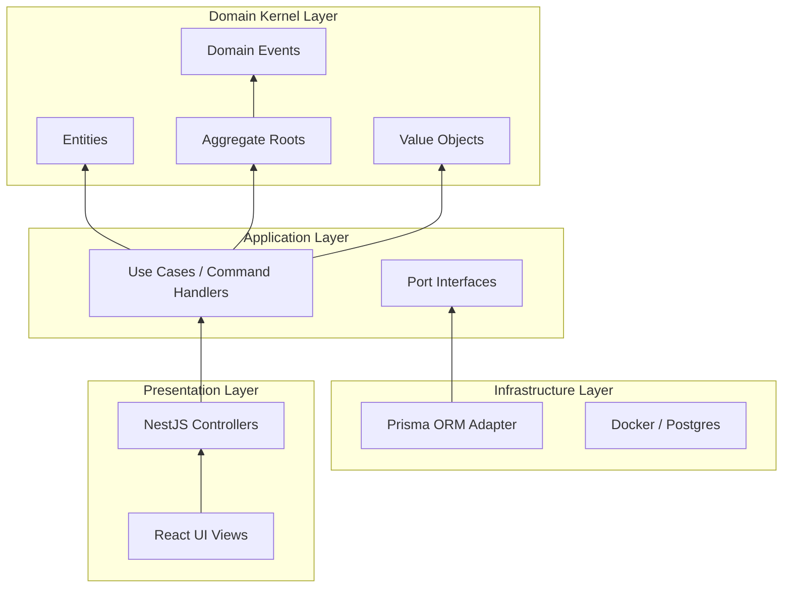
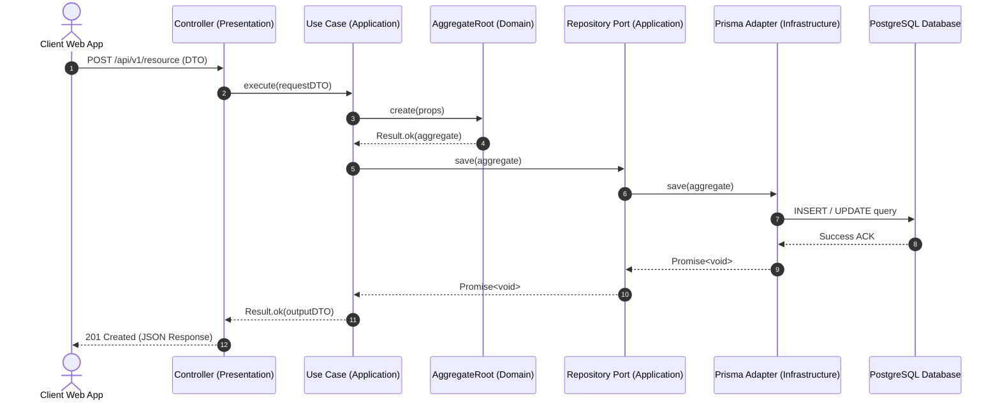

# System Architecture Guide

## Clean Architecture Layers

The Kinergy Platform strictly enforces **Clean Architecture** boundaries. Dependencies flow inward: **Infrastructure -> Presentation -> Application -> Domain Kernel**.



### Layer Responsibilities

1. **Domain Layer (`apps/api/src/shared/kernel/`)**:
   - Contains pure business logic, entities, aggregates, value objects, and domain events.
   - **Zero framework dependencies** (no NestJS, Prisma, Express, or React imports).
2. **Application Layer (`apps/api/src/shared/common/`)**:
   - Defines application use cases (`IUseCase<IRequest, IResponse>`) and port contracts (`IRepository<T>`, `IIdentityContext`, `ILoggerPort`, `IAuditService`).
   - Orchestrates domain objects to fulfill business requirements.
3. **Infrastructure Layer (`apps/api/src/platform/`)**:
   - Implements application port interfaces (e.g., `PrismaService`, `PlatformLoggerService`, `PlaceholderAuditService`).
   - Handles database connections, external APIs, and platform utilities.
4. **Presentation Layer (`apps/api/src/` & `apps/web/src/`)**:
   - Web frontend views (React + Vite) and REST API HTTP controllers (NestJS).
   - Responsible for HTTP routing, request parsing, DTO validation, and response serialization.

---

## Monorepo Directory Structure

```
kinergy-platform/
├── apps/
│   ├── api/                    # NestJS Backend Application
│   │   ├── src/
│   │   │   ├── config/         # Zod-validated env configuration
│   │   │   ├── contexts/       # Bounded Context registration boundaries
│   │   │   ├── platform/       # Enterprise platform services (Prisma, Identity, Logging, Audit)
│   │   │   └── shared/         # DDD Domain Kernel & Application Common
│   │   │       ├── common/     # UseCase ports & Guard utilities
│   │   │       └── kernel/     # Entity, AggregateRoot, ValueObject, Result, IDomainEvent
│   │   └── project.json
│   └── web/                    # React 18 + Vite Web Application
│       ├── src/
│       │   ├── components/     # Reusable UI primitives
│       │   ├── features/       # Feature modules
│       │   ├── layouts/        # Application layout shells
│       │   ├── providers/      # TanStack Query & React Router wrappers
│       │   └── routes/         # Routing table
│       └── project.json
├── packages/                   # Shared Workspace Libraries
│   ├── config/                 # @kinergy-platform/config
│   ├── types/                  # @kinergy-platform/types
│   ├── ui/                     # @kinergy-platform/ui
│   ├── utils/                  # @kinergy-platform/utils
│   └── validation/             # @kinergy-platform/validation
├── docs/                       # Architecture & Business Documentation
│   ├── adr/                    # Architectural Decision Records (0001-0015)
│   └── architecture/           # Architecture Guides & Mermaid Diagrams
├── infrastructure/             # Docker & Deployment Infrastructure
│   └── docker/                 # PostgreSQL 16 & Adminer docker-compose
└── prisma/                     # Database Schema & Seed Runner
```

---

## Request Execution Flow Sequence


