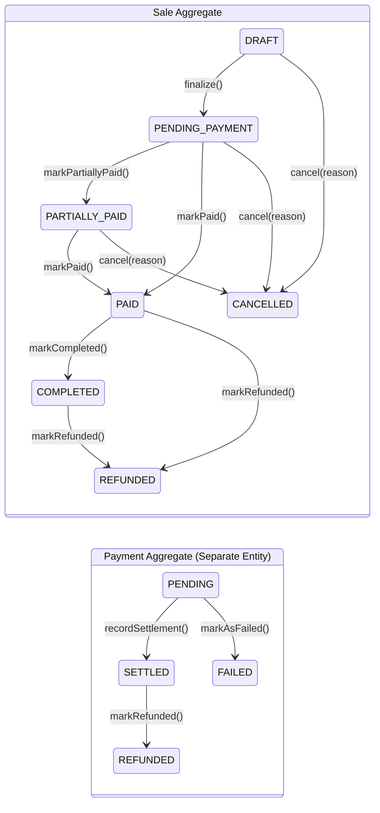

# Authoritative Sale Lifecycle & State Transition Matrix — Milestone 7.8

- **Status**: Authoritative Architectural Baseline (APPROVED & EXECUTABLE)
- **Bounded Context**: Sales & Payments (`packages/core/src/sales/`, `apps/api/src/sales/`)
- **Aggregate Root**: `Sale` (`packages/core/src/sales/domain/sale.aggregate.ts`)
- **Governing ADRs**:
  - [ADR-0115: Payment Domain Canonical Architecture, Aggregate Boundaries, and Tender Decoupling](../adr/0115-payment-domain-canonical-architecture.md)
  - [ADR-0116: Payment State Machine, Lifecycle Specification, and Financial Transition Determinism](../adr/0116-payment-state-machine-and-lifecycle-specification.md)
  - [ADR-0118: Sale Reference and Receipt Identification Strategy](../adr/0118-sale-reference-and-receipt-identification-strategy.md)
  - [ADR-0119: Sale Aggregate Boundary, Invariants, and Commercial Transaction Integrity](../adr/0119-sale-aggregate-boundary-and-invariants.md)
- **Related Documents**:
  - [Authoritative Sale Invariant Catalog](sale-invariants-catalog.md)
  - [Sale-Payment Cross-Aggregate Coordination](sale-payment-coordination.md)
- **Executable Test Suite**:
  - [`packages/core/src/sales/domain/__tests__/sale-lifecycle-hardening.spec.ts`](../../packages/core/src/sales/domain/__tests__/sale-lifecycle-hardening.spec.ts)
  - [`packages/core/src/sales/domain/__tests__/sale-lifecycle.spec.ts`](../../packages/core/src/sales/domain/__tests__/sale-lifecycle.spec.ts)

---

## 1. Executive Summary & Aggregate Scope

In accordance with DDD aggregate design principles and ADR-0119, the `Sale` aggregate root is the sole transactional authority for the commercial lifecycle of a point-of-sale checkout order. External callers are strictly prohibited from bypassing aggregate validation rules or modifying the lifecycle state via public property mutation.

### Core Architectural Guarantees:

1. **Unrestricted Mutation Prohibited**: Direct assignment (`sale.status = SaleStatus.PAID`) is prevented at both compile-time and runtime. The aggregate exposes a read-only getter `get status(): SaleStatus` with **no setter**.
2. **Explicit Domain Operations**: State transitions occur strictly through named domain operations that enforce preconditions, validation rules, and causal chronological logging.
3. **Decoupled Payment State Machine**: As mandated by ADR-0115 and ADR-0116, the `Payment` aggregate owns tender authorization and settlement. The `Sale` aggregate models commercial debt obligations. Payment failure or gateway retries do **not** mutate or corrupt the `Sale` state.
4. **Irreversible Terminal States**: Once a `Sale` reaches `CANCELLED` or `REFUNDED`, all state transitions and cart mutations are permanently rejected.

---

## 2. Sale Status Definitions

The platform recognizes exactly seven commercial lifecycle statuses:

| Status            | Category                    | Commercial Meaning                                                                                        | Permitted Transitions Out             |
| :---------------- | :-------------------------- | :-------------------------------------------------------------------------------------------------------- | :------------------------------------ |
| `DRAFT`           | Initial / Active            | Cart open for ringing items, adjusting quantities, applying line discounts. No debt obligation committed. | `PENDING_PAYMENT`, `CANCELLED`        |
| `PENDING_PAYMENT` | Committed / Awaiting Tender | Cart is frozen. Commercial agreement locked. Awaiting customer tender collection or gateway payment.      | `PARTIALLY_PAID`, `PAID`, `CANCELLED` |
| `PARTIALLY_PAID`  | Active Settlement           | Partial tender collected ($\$0 < \text{tender} < \text{debt}$). Additional tender required.               | `PAID`, `CANCELLED`                   |
| `PAID`            | Settled                     | Full tender collected ($\text{tender} \ge \text{debt}$). Commercial debt discharged.                      | `COMPLETED`, `REFUNDED`               |
| `COMPLETED`       | Fulfilled                   | Commercial order fulfilled and closed. Goods/services delivered. Receipt issued.                          | `REFUNDED`                            |
| `CANCELLED`       | **Terminal**                | Commercial agreement terminated before debt settlement. Cart voided with reason.                          | _(None — Terminal)_                   |
| `REFUNDED`        | **Terminal**                | Post-settlement commercial reversal. Funds returned to customer. Order permanently closed.                | _(None — Terminal)_                   |

---

## 3. Authoritative $7 \times 7$ State Transition Matrix

The table below exhaustively defines every possible source-to-target state transition in the `Sale` aggregate ($7 \times 7 = 49$ combinations):

| Source State $\downarrow$ / Target State $\rightarrow$ |       `DRAFT`        |   `PENDING_PAYMENT`   |      `PARTIALLY_PAID`      |           `PAID`           |      `COMPLETED`      |          `CANCELLED`           |         `REFUNDED`         |
| :----------------------------------------------------- | :------------------: | :-------------------: | :------------------------: | :------------------------: | :-------------------: | :----------------------------: | :------------------------: |
| **`DRAFT`**                                            |     ❌ _(Self)_      |    ✅ `finalize()`    | ❌ _(Must finalize first)_ | ❌ _(Must finalize first)_ | ❌ _(Must pay first)_ |      ✅ `cancel(reason)`       |     ❌ _(Never paid)_      |
| **`PENDING_PAYMENT`**                                  | ❌ _(Cannot reopen)_ |      ❌ _(Self)_      |  ✅ `markPartiallyPaid()`  |      ✅ `markPaid()`       | ❌ _(Must pay first)_ |      ✅ `cancel(reason)`       |     ❌ _(Never paid)_      |
| **`PARTIALLY_PAID`**                                   | ❌ _(Cannot reopen)_ | ❌ _(Cannot regress)_ |        ❌ _(Self)_         |      ✅ `markPaid()`       | ❌ _(Must pay first)_ |      ✅ `cancel(reason)`       | ❌ _(Use cancel pre-PAID)_ |
| **`PAID`**                                             |    ❌ _(Settled)_    |    ❌ _(Settled)_     |       ❌ _(Settled)_       |        ❌ _(Self)_         | ✅ `markCompleted()`  |  ❌ _(Cannot cancel settled)_  |    ✅ `markRefunded()`     |
| **`COMPLETED`**                                        |    ❌ _(Closed)_     |     ❌ _(Closed)_     |       ❌ _(Closed)_        |       ❌ _(Closed)_        |      ❌ _(Self)_      | ❌ _(Cannot cancel completed)_ |    ✅ `markRefunded()`     |
| **`CANCELLED`** _(Terminal)_                           |          ❌          |          ❌           |             ❌             |             ❌             |          ❌           |          ❌ _(Self)_           |             ❌             |
| **`REFUNDED`** _(Terminal)_                            |          ❌          |          ❌           |             ❌             |             ❌             |          ❌           |               ❌               |        ❌ _(Self)_         |

### Transition Invariant Rules:

1. **Self-Transitions (Repeated Calls)**: Are strictly prohibited. If `sale.status === targetStatus`, calling the transition operation throws `InvalidSaleTransitionException` to prevent accidental idempotent misreporting or double-event dispatch.
2. **Terminal Inviolability**: `CANCELLED` and `REFUNDED` sales have `isTerminal() === true`. Any attempt to transition out of them throws `InvalidSaleTransitionException`.
3. **Settled Cancellation Guard**: Once a sale reaches `PAID` or `COMPLETED`, it cannot be `CANCELLED`. Debt discharge can only be reversed through formal `REFUNDED` domain procedures.
4. **Direct Settlement Guard**: A sale cannot transition directly from `DRAFT` to `PAID` or `PARTIALLY_PAID` without passing through `PENDING_PAYMENT` (via `finalize()`).

---

## 4. Explicit Domain Operations

The `Sale` aggregate exposes explicit, intention-revealing methods for lifecycle state progression:

```typescript
export class Sale {
  // Read-only status property
  public get status(): SaleStatus;

  // Lifecycle state inquiry
  public isTerminal(): boolean;
  public canTransitionTo(targetStatus: SaleStatus): boolean;

  // Domain transitions
  public finalize(clock?: Clock): void;
  public markPendingPayment(clock?: Clock): void; // Alias for finalize()
  public markPartiallyPaid(clock?: Clock): void;
  public markPaid(clock?: Clock): void;
  public markCompleted(clock?: Clock): void;
  public cancel(reason: string, clock?: Clock): void;
  public markRefunded(clock?: Clock): void;
}
```

### Precondition & Verification Matrix by Method:

| Method                                            | Permitted Source States                      | Preconditions Enforced                                                                                             | Resulting State   |
| :------------------------------------------------ | :------------------------------------------- | :----------------------------------------------------------------------------------------------------------------- | :---------------- |
| `finalize(clock?)` / `markPendingPayment(clock?)` | `DRAFT`                                      | Cart must contain $\ge 1$ item (`EmptySaleException`). Subtotal and Total recalculated.                            | `PENDING_PAYMENT` |
| `markPartiallyPaid(clock?)`                       | `PENDING_PAYMENT`                            | Requires valid progression; total tender collected $< \text{sale.total}$.                                          | `PARTIALLY_PAID`  |
| `markPaid(clock?)`                                | `PENDING_PAYMENT`, `PARTIALLY_PAID`          | Reconciles full settlement; tender $\ge \text{sale.total}$. Sets `paidAt` timestamp.                               | `PAID`            |
| `markCompleted(clock?)`                           | `PAID`                                       | All fulfillment tasks complete. Sets `completedAt` timestamp.                                                      | `COMPLETED`       |
| `cancel(reason, clock?)`                          | `DRAFT`, `PENDING_PAYMENT`, `PARTIALLY_PAID` | Non-empty cancellation reason required (`InvalidSaleStateException`). Sets `cancelledAt` and `cancellationReason`. | `CANCELLED`       |
| `markRefunded(clock?)`                            | `PAID`, `COMPLETED`                          | Post-settlement refund authorization. Sets `refundedAt` timestamp.                                                 | `REFUNDED`        |

---

## 5. Payment State Machine Decoupling & Failure Isolation

A fundamental requirement of ADR-0115 and ADR-0116 is the complete autonomy of the `Payment` aggregate lifecycle from the `Sale` aggregate lifecycle:



### Decoupling Rules:

1. **No Shared Transactional Mutability**: `Payment` instances do not directly invoke `sale.markPaid()` or `sale.cancel()`.
2. **Payment Failure Does Not Void Sale**: When a payment attempt fails (`payment.markAsFailed('Gateway Timeout')`), the `Sale` aggregate remains strictly in `PENDING_PAYMENT`. The customer may retry with a different tender method (e.g. alternate card or cash).
3. **Application Orchestration**: Application use cases (`RecordPaymentHandler`, `CompletePaymentHandler`) coordinate cross-aggregate workflows:
   - Check `sale.status === SaleStatus.PENDING_PAYMENT || sale.status === SaleStatus.PARTIALLY_PAID`.
   - Authorize / capture payment via `Payment` aggregate.
   - Upon confirmed settlement of tender covering the sale total, invoke `sale.markPaid(clock)`.

---

## 6. Automated Test Verification

The transition matrix and lifecycle invariants are backed by 63 unit tests in [`sale-lifecycle-hardening.spec.ts`](../../packages/core/src/sales/domain/__tests__/sale-lifecycle-hardening.spec.ts):

1. **Section 1: Prevention of Arbitrary Public Status Mutation**
   - Asserts no public status setter exists.
   - Verifies runtime reflection rejection.
2. **Section 2: Comprehensive $7 \times 7$ Transition Matrix Verification**
   - Systematically tests all 49 source/target combinations.
   - Validates that `canTransitionTo()` and actual transition invocations yield exact permitted or rejected outcomes.
3. **Section 3: Terminal States Rigidity**
   - Asserts `isTerminal()` returns true strictly for `CANCELLED` and `REFUNDED`.
   - Confirms that cart mutation (`addItem`, `removeItem`, `applyDiscount`) is rejected on terminal states.
4. **Section 4: Repeated Transition Idempotency Rejection**
   - Proves `sale.finalize()` on `PENDING_PAYMENT` throws `InvalidSaleTransitionException`.
   - Proves `sale.markPaid()` on `PAID` throws `InvalidSaleTransitionException`.
   - Proves `sale.cancel()` on `CANCELLED` throws `InvalidSaleTransitionException`.
5. **Section 5: Cancellation Rules & Immutability**
   - Asserts whitespace-only and empty cancellation reasons are rejected.
   - Asserts cancellation is rejected on `PAID` and `COMPLETED` sales.
6. **Section 6: Separation of Payment State Machine & Payment Failure Handling**
   - Proves a failed payment retains `sale.status === PENDING_PAYMENT`.
   - Demonstrates subsequent retry payment successfully settling the sale to `PAID`.
