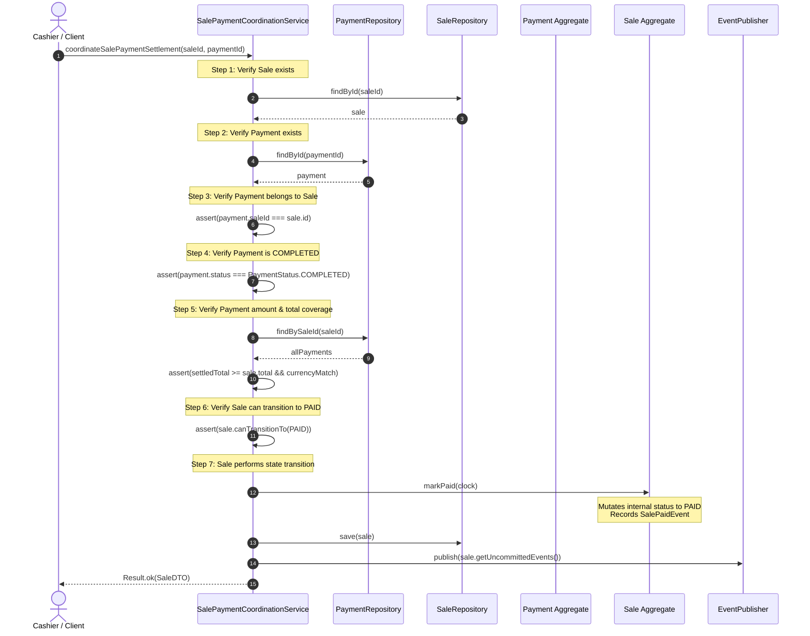

# Authoritative Sale-Payment Cross-Aggregate Coordination — Milestone 7.8

- **Status**: Authoritative Architectural Baseline (APPROVED & EXECUTABLE)
- **Bounded Context**: Sales & Payments (`packages/core/src/sales/`, `apps/api/src/sales/`)
- **Governing ADRs**:
  - [ADR-0115: Payment Domain Canonical Architecture, Aggregate Boundaries, and Tender Decoupling](../adr/0115-payment-domain-canonical-architecture.md)
  - [ADR-0116: Payment State Machine, Lifecycle Specification, and Financial Transition Determinism](../adr/0116-payment-state-machine-and-lifecycle-specification.md)
  - [ADR-0119: Sale Aggregate Boundary, Invariants, and Commercial Transaction Integrity](../adr/0119-sale-aggregate-boundary-and-invariants.md)
- **Related Documents**:
  - [Authoritative Sale Invariant Catalog](sale-invariants-catalog.md)
  - [Sale Lifecycle & State Transition Matrix](sale-lifecycle-transition-matrix.md)
- **Executable Test Suite**:
  - [`packages/core/src/sales/application/__tests__/sale-payment-coordination.spec.ts`](../../packages/core/src/sales/application/__tests__/sale-payment-coordination.spec.ts)
  - [`packages/core/src/sales/application/__tests__/payment-application.spec.ts`](../../packages/core/src/sales/application/__tests__/payment-application.spec.ts)

---

## 1. Executive Summary & Distributed Domain Boundaries

In distributed Domain-Driven Design (DDD), maintaining transactional boundaries between aggregates is essential to avoid god-objects, circular dependencies, and distributed locking deadlocks. In the Kinergy Platform:

1. **`Payment` Aggregate Owns Payment Lifecycle**:
   - Manages payment tender authorization, provider rails, references, and the 4-state lifecycle (`PENDING`, `COMPLETED`, `FAILED`, `CANCELLED`) defined in ADR-0116.
   - Decoupled from cart line items, discounts, and customer billing models.
2. **`Sale` Aggregate Owns Sale Lifecycle & Commercial Totals**:
   - Manages cart ringing, line item ownership, commercial totals calculation, and the 7-state lifecycle (`DRAFT`, `PENDING_PAYMENT`, `PARTIALLY_PAID`, `PAID`, `COMPLETED`, `CANCELLED`, `REFUNDED`) defined in ADR-0119.
   - Has zero knowledge of credit card tokens, terminal identifiers, or payment provider rail mechanics.
3. **Application Layer Coordinates Cross-Aggregate Settlement**:
   - Neither aggregate imports, mutates, or persists the other.
   - The critical business rule is enforced: **A `Sale` cannot be marked `PAID` without a valid, completed `Payment` covering its commercial debt obligation.**

---

## 2. Cross-Aggregate Architecture & Boundary Isolation

### Strict Non-Coupling Rules:

- **No Direct Aggregate Merging**: `Sale` does not contain a collection of `Payment` entities; `Payment` does not contain `Sale`. Coupling is purely identifier-based (`payment.saleId: SaleId`).
- **No Direct State Manipulation**: `Sale` cannot invoke `payment.complete()`, `payment.fail()`, or `payment.cancel()`.
- **No Direct Persistence Mutation**: `Payment` cannot invoke `saleRepository.save()`.
- **No State Machine Duplication**: `Sale` does not implement payment rail failure logic. Payment failure does not alter or corrupt `Sale` status.

---

## 3. The 7-Step Authoritative Verification Pipeline

Implemented in [`SalePaymentCoordinationService`](../../packages/core/src/sales/application/services/sale-payment-coordination.service.ts) and [`CoordinateSalePaymentHandler`](../../packages/core/src/sales/application/handlers/coordinate-sale-payment.handler.ts):

| Step # | Verification Rule                   | Enforcement Mechanism                                                                                                                                                                       | Failure Exception                                                     | HTTP Status |
| :----: | :---------------------------------- | :------------------------------------------------------------------------------------------------------------------------------------------------------------------------------------------ | :-------------------------------------------------------------------- | :---------: |
| **1**  | **Sale Exists**                     | Lookup `Sale` by ID and verify multi-tenant isolation.                                                                                                                                      | `SaleNotFoundException`                                               |     404     |
| **2**  | **Payment Exists**                  | Lookup `Payment` by ID and verify multi-tenant isolation.                                                                                                                                   | `PaymentNotFoundException`                                            |     404     |
| **3**  | **Payment Belongs to Sale**         | Assert `payment.saleId.value === sale.id.value`.                                                                                                                                            | `PaymentSaleMismatchException`                                        |     400     |
| **4**  | **Payment is COMPLETED**            | Assert `payment.status === PaymentStatus.COMPLETED`. Payments in `PENDING`, `FAILED`, or `CANCELLED` status are rejected.                                                                   | `PaymentNotCompletedException`                                        |     422     |
| **5**  | **Valid Payment Amount & Currency** | - Currency match: `payment.amount.currency === sale.currency` - Positive tender: `payment.amount.cents > 0` - Debt coverage: $\sum \text{completedPayments} \ge \text{sale.total}$. | `PaymentCurrencyMismatchException` `InsufficientPaymentException` | 400 422 |
| **6**  | **Sale Can Become PAID**            | Assert `sale.canTransitionTo(SaleStatus.PAID)`. Target sale must currently be in `PENDING_PAYMENT` or `PARTIALLY_PAID`.                                                                     | `InvalidSaleTransitionException`                                      |     409     |
| **7**  | **Authoritative Domain Transition** | Invoke `sale.markPaid(clock)`. The `Sale` aggregate mutates its internal state, advances its version, and records `SalePaidEvent`. Persist `Sale`.                                          | Persistence/OCC Exception                                             |  409 / 500  |

---

## 4. Comprehensive Test Coverage Matrix

The cross-aggregate coordination is rigorously validated in [`sale-payment-coordination.spec.ts`](../../packages/core/src/sales/application/__tests__/sale-payment-coordination.spec.ts) covering all 8 mandatory distributed domain scenarios:

| Test Scenario                                                   | Input Conditions                                                                        | Expected Outcome                                                                                      | Invariant Proved                                                      |
| :-------------------------------------------------------------- | :-------------------------------------------------------------------------------------- | :---------------------------------------------------------------------------------------------------- | :-------------------------------------------------------------------- |
| **1. completed Payment $\rightarrow$ valid Sale transition**    | `Sale` in `PENDING_PAYMENT`, `Payment` in `COMPLETED` covering full order total ($100). | `isSuccess === true`, `sale.status === PAID`, `SalePaidEvent` dispatched.                             | Normal settlement path succeeds; Payment aggregate remains untouched. |
| **1b. Multi-Payment Settlement**                                | `Sale` in `PARTIALLY_PAID` ($40 settled), second `Payment` in `COMPLETED` ($60).        | `isSuccess === true`, `sale.status === PAID`.                                                         | Progressive settlement correctly discharges remaining debt.           |
| **2. pending Payment $\rightarrow$ rejected**                   | `Sale` in `PENDING_PAYMENT`, `Payment` in `PENDING` status.                             | `isFailure === true`, throws `PaymentNotCompletedException`. `sale.status` remains `PENDING_PAYMENT`. | Prevents premature debt discharge on unconfirmed funds.               |
| **3. failed Payment $\rightarrow$ rejected**                    | `Sale` in `PENDING_PAYMENT`, `Payment` in `FAILED` status.                              | `isFailure === true`, throws `PaymentNotCompletedException`. `sale.status` remains `PENDING_PAYMENT`. | Failed transactions cannot settle commercial orders.                  |
| **4. cancelled Payment $\rightarrow$ rejected**                 | `Sale` in `PENDING_PAYMENT`, `Payment` in `CANCELLED` status.                           | `isFailure === true`, throws `PaymentNotCompletedException`. `sale.status` remains `PENDING_PAYMENT`. | Voided tender cannot settle commercial orders.                        |
| **5. Payment belonging to another Sale $\rightarrow$ rejected** | `Payment` issued for `saleB`, coordination attempted against `saleA`.                   | `isFailure === true`, throws `PaymentSaleMismatchException`. Both sales remain unsettled.             | Strict aggregate scoping prevents cross-sale tender hijacking.        |
| **6. missing Payment $\rightarrow$ rejected**                   | Non-existent `paymentId`.                                                               | `isFailure === true`, throws `PaymentNotFoundException`.                                              | Prevents phantom settlement.                                          |
| **6b. missing Sale $\rightarrow$ rejected**                     | Non-existent `saleId`.                                                                  | `isFailure === true`, throws `SaleNotFoundException`.                                                 | Prevents orphan settlement.                                           |
| **7. repeated PAID transition $\rightarrow$ rejected**          | `Sale` already in `PAID` status.                                                        | `isFailure === true`, throws `InvalidSaleTransitionException` ("already in PAID status").             | Prevents double-settlement and duplicate event emission.              |
| **8. cancelled Sale $\rightarrow$ rejected**                    | `Sale` in `CANCELLED` terminal status, `Payment` in `COMPLETED`.                        | `isFailure === true`, throws `InvalidSaleTransitionException` ("terminal state 'CANCELLED'").         | Voided commercial agreements cannot be resurrected or settled.        |
| **9. Insufficient Payment Amount**                              | Settled tender sum ($50) < order debt ($100).                                           | `isFailure === true`, throws `InsufficientPaymentException`.                                          | Prevents uncollateralized order discharge.                            |
| **10. Currency Mismatch**                                       | `Payment` in `EUR`, `Sale` in `USD`.                                                    | `isFailure === true`, throws `PaymentCurrencyMismatchException`.                                      | Prevents foreign exchange corruption without explicit conversion.     |
| **11. Autonomous Aggregate Isolation**                          | Reflective inspection of `Sale` and `Payment` runtime objects.                          | Zero direct mutators, references, or state machine coupling between aggregates.                       | Absolute DDD aggregate boundary adherence.                            |
