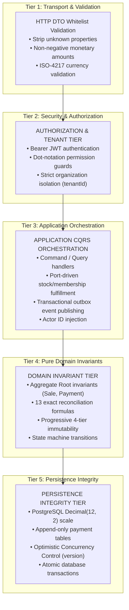

# Sales & Payments — Executable Business Rules & Invariants Specification

- **Status**: Authoritative Behavioral Contract Baseline (APPROVED & EXECUTABLE)
- **Bounded Context**: Sales & Payments (`packages/core/src/sales/`, `apps/api/src/sales/`)
- **Author**: Principal Business Domain Engineer & Lead Financial Domain Architect
- **Governing ADRs**:
  - [ADR-0108: Deterministic Financial Representation and Currency Modeling](../adr/0108-money-representation.md)
  - [ADR-0109: Payment Lifecycle, Multi-Tender Settlement, and Financial Immutability](../adr/0109-payment-lifecycle.md)
  - [ADR-0110: Sale Transaction Ownership and Source Bounded-Context Integrity](../adr/0110-sale-ownership.md)
  - [ADR-0111: Sales & Payments Authorization, Organization Isolation, and Audit Boundaries](../adr/0111-sales-payments-authorization-and-audit.md)
  - [ADR-0112: Sales & Payments Bounded Context Establishment](../adr/0112-sales-bounded-context.md)

---

## 1. Architectural Responsibility & Invariant Tiers

To maintain strict Clean Architecture boundaries and eliminate misplaced business logic, all business rules within Sales & Payments are classified into five explicit architectural tiers:



---

## 2. Sale Business Rules

| Rule ID       | Rule Statement                                                                                                                                                                                                             | Architectural Tier | Enforcement Mechanism                                                                                                        |
| :------------ | :------------------------------------------------------------------------------------------------------------------------------------------------------------------------------------------------------------------------- | :----------------- | :--------------------------------------------------------------------------------------------------------------------------- |
| **`SALE-01`** | **Tenant Identity Invariant**: Every `Sale` must be explicitly associated with a non-empty `tenantId` at creation. Cross-tenant mutation or query is strictly impossible.                                                  | `DOMAIN INVARIANT` | `Sale.create({ tenantId, source, ... })` asserts non-empty `tenantId`                                                        |
| **`SALE-02`** | **Cashier Attribution**: Every `Sale` must record the authenticated user ID (`cashierId`) of the staff member who initiated checkout. Request bodies cannot supply `cashierId`.                                            | `SECURITY & APP`   | Extracted from `@CurrentUser().userId`, published in `SaleCreatedEvent`                                                      |
| **`SALE-03`** | **Optional Client Association**: `clientId` is optional (`clientId?: string`). Omitting `clientId` denotes an anonymous walk-in retail purchase. If provided, `clientId` must be non-empty and reference an active client. | `DOMAIN INVARIANT` | `Sale.create()` asserts `clientId !== ''`                                                                                    |
| **`SALE-04`** | **Initial Lifecycle State**: A newly instantiated `Sale` starts strictly in `DRAFT` status.                                                                                                                                | `DOMAIN INVARIANT` | `Sale.create()` initializes `_status = SaleStatus.DRAFT`                                                                     |
| **`SALE-05`** | **Empty Order Finalization Prohibition**: A `Sale` cannot transition out of `DRAFT` to `PENDING_PAYMENT` with zero line items.                                                                                             | `DOMAIN INVARIANT` | `Sale.finalize()` throws `EmptySaleException` (`EMPTY_SALE`)                                                                 |
| **`SALE-06`** | **Single Currency Homogeneity**: Every line item, discount, subtotal, and total within a `Sale` must use the identical ISO-4217 currency. Mixed currencies within a checkout session are rejected.                         | `DOMAIN INVARIANT` | `Sale.addItem()` throws `InvalidSaleStateException` on currency mismatch                                                     |
| **`SALE-07`** | **Non-Negative Total Guard**: The final payable order total (`total`) must always be $\ge 0.00$. Under no circumstance may discounts reduce the total below zero.                                                          | `DOMAIN INVARIANT` | Formula: $\text{total} = \max(0, \text{subtotal} - \text{discountTotal})$                                                    |
| **`SALE-08`** | **Finalization Immutability Milestone**: Once a `Sale` departs `DRAFT`, commercial terms are locked. Items cannot be added, modified, or deleted. Order discounts cannot be altered.                                       | `DOMAIN INVARIANT` | `Sale.assertDraftState()` throws `SaleAlreadyFinalizedException` (`SALE_ALREADY_FINALIZED`)                                  |
| **`SALE-09`** | **Cancellation Permissibility**: A `Sale` may transition to `CANCELLED` from `DRAFT`, `PENDING_PAYMENT`, or `PARTIALLY_PAID`. Requires a non-empty `cancellationReason`.                                                   | `DOMAIN INVARIANT` | `Sale.cancel(reason)` throws `InvalidSaleStateException` (`INVALID_CANCELLATION_REASON`) or `InvalidSaleTransitionException` |
| **`SALE-10`** | **Full Settlement Transition**: A `Sale` transitions to `PAID` upon full settlement confirmation. Permitted from `PENDING_PAYMENT` or `PARTIALLY_PAID`.                                                                    | `DOMAIN INVARIANT` | `Sale.markPaid()` throws `InvalidSaleTransitionException` from invalid states                                                |
| **`SALE-11`** | **Partial Settlement Transition**: A `Sale` transitions to `PARTIALLY_PAID` upon recording a partial payment tender. Permitted only from `PENDING_PAYMENT`.                                                                | `DOMAIN INVARIANT` | `Sale.markPartiallyPaid()` throws `InvalidSaleTransitionException` from invalid states                                       |
| **`SALE-12`** | **Order Completion Prerequisite**: A `Sale` transitions to `COMPLETED` from `PAID` upon outbound fulfillment confirmation.                                                                                                 | `DOMAIN & APP`     | `Sale.markCompleted()` sets `completedAt`, throws `InvalidSaleTransitionException` if not `PAID`                             |
| **`SALE-13`** | **Compensating Refund Transition**: A `Sale` transitions to `REFUNDED` upon execution of a full compensating refund. Permitted from `PAID` or `COMPLETED`.                                                                 | `DOMAIN INVARIANT` | `Sale.markRefunded(reason?)` sets `refundedAt`, throws `InvalidSaleTransitionException` if not `PAID`/`COMPLETED`            |

---

## 3. SaleItem Business Rules

| Rule ID       | Rule Statement                                                                                                                                                                                                                                                                                                    | Architectural Tier     | Enforcement Mechanism                                                                       |
| :------------ | :---------------------------------------------------------------------------------------------------------------------------------------------------------------------------------------------------------------------------------------------------------------------------------------------------------------- | :--------------------- | :------------------------------------------------------------------------------------------ |
| **`ITEM-01`** | **Exclusive Parent Ownership**: `SaleItem` has no global identity or standalone repository. It is an internal child entity exclusively created, updated, and persisted through the `Sale` aggregate root (`addItem`, `updateItemQuantity`, `applyItemDiscount`, `removeItemDiscount`, `removeItem`).              | `DOMAIN INVARIANT`     | `Sale.addItem()`, `Sale.removeItem()`                                                       |
| **`ITEM-02`** | **Strict Positive Quantity**: Quantity must be a finite, strictly positive number: $$0.001 \le \text{quantity} \le 999,999$$ Normalized to 3 decimal places (`Math.round((q + EPS) * 1000) / 1000`). Values $< 0.0005$ round down to 0 and throw `InvalidSaleItemException`. Values $> 999,999$ are rejected.     | `DOMAIN INVARIANT`     | `SaleItem.assertValidQuantity()` throws `InvalidSaleItemException`                          |
| **`ITEM-03`** | **Non-Negative Unit Price Snapshot**: Gross unit price snapshot must be non-negative: $$\text{unitPrice} \ge 0.00$$ Stored as canonical `Money`. Zero-price items represent authorized promotional complimentary gifts. Negative values rejected. Once established, unit price is never dynamically recalculated. | `DOMAIN INVARIANT`     | `Money.create()`, `SaleItem.assertValidUnitPrice()`                                         |
| **`ITEM-04`** | **Permanent Commercial Snapshotting**: `SaleItem` must permanently freeze `description`, `skuOrCode`, and `unitPrice` at checkout. Dynamic SQL joins to source catalog tables at query time are strictly prohibited.                                                                                              | `DOMAIN & PERSISTENCE` | Stored as immutable entity fields and standalone columns in `sale_items`                    |
| **`ITEM-05`** | **Unconstrained Source Reference**: `SourceReference` must be recorded as an immutable Value Object (`sourceType`, `sourceId`, `sourceCode`). No relational foreign keys to upstream tables may exist in `schema.prisma`.                                                                                         | `DOMAIN INVARIANT`     | `SourceReference` Value Object (`Object.freeze(this)`)                                      |
| **`ITEM-06`** | **Source Existence & Tenant Verification**: When an item is added, Sales queries the owning domain's query port to verify that the entity exists, is `ACTIVE`, and belongs to the identical `tenantId`.                                                                                                           | `APPLICATION`          | `AddSaleItemUseCase`                                                                        |
| **`ITEM-07`** | **Item Discount Cap & Non-Negative Floor**: Line-item discounts are capped at the item gross subtotal. An item total can never become negative: $$\text{lineDiscount} = \min(\text{subtotal}, \text{calcReduction})$$ Half-Up cent rounding applies. Negative discounts or percentages $> 100\%$ are rejected.    | `DOMAIN INVARIANT`     | `Discount.calculateReduction()`, `SaleItem.discountTotal`                                   |
| **`ITEM-08`** | **Line Net & Total Determinism**: Item financial amounts are calculated deterministically: $$\text{subtotal} = \text{unitPrice} \times \text{quantity}$$ $$\text{total} = \text{subtotal} - \text{discountTotal}$$ Pre-tax line net total is guaranteed $\ge 0.00$. (Tax calculation deferred to Phase 7.3+).     | `DOMAIN INVARIANT`     | `SaleItem.subtotal`, `SaleItem.total`, `Money.multiply()`                                   |
| **`ITEM-09`** | **Post-Finalization Freeze**: `SaleItem` attributes, quantities, discounts, and parent collection cannot be updated, adjusted, or deleted once the parent `Sale` departs `DRAFT` status.                                                                                                                          | `DOMAIN INVARIANT`     | `Sale.assertDraftState()` throws `SaleAlreadyFinalizedException` (`SALE_ALREADY_FINALIZED`) |

### Historical Snapshot Traceability Chain

```text
Requirement: REQ-HIST-01 (Historical Commercial Truth)
    ↓
Business Rules: SALE-08 (Commercial Lock), ITEM-04 (Permanent Snapshot), ITEM-09 (Post-Finalization Freeze)
    ↓
SaleItem Invariants: ITEM-01 (Ownership), ITEM-02 (Quantity), ITEM-03 (Price), ITEM-07 (Discount Cap)
    ↓
Domain Implementation:
  - packages/core/src/sales/domain/sale.aggregate.ts
  - packages/core/src/sales/domain/entities/sale-item.entity.ts
  - packages/core/src/sales/domain/value-objects/source-reference.vo.ts
    ↓
Executable Test Suites:
  - packages/core/src/sales/domain/__tests__/sale-item-historical-snapshot.spec.ts (Scenarios 1–8)
  - packages/core/src/sales/domain/__tests__/sale-item-integration.spec.ts
  - packages/core/src/sales/domain/__tests__/sale-item.entity.spec.ts
```

---

## 4. Payment Business Rules

| Rule ID      | Rule Statement                                                                                                                                                                                                                                             | Architectural Tier     | Enforcement Mechanism                                     |
| :----------- | :--------------------------------------------------------------------------------------------------------------------------------------------------------------------------------------------------------------------------------------------------------- | :--------------------- | :-------------------------------------------------------- |
| **`PAY-01`** | **Autonomous Aggregate Root**: `Payment` is an autonomous aggregate root linked to `Sale` via scalar `saleId`. Multiple payments may settle one sale (`Sale 1 -> 0..* Payment`).                                                                           | `DOMAIN INVARIANT`     | `Payment` aggregate boundary                              |
| **`PAY-02`** | **Strict Positive Tender Amount**: The amount of a charge payment must be strictly positive: $$\text{amount} > 0.00$$ Zero-amount payments are rejected.                                                                                                   | `DOMAIN INVARIANT`     | `Payment.create()` throws `InvalidPaymentAmountException` |
| **`PAY-03`** | **Tender Method Taxonomy**: Allowed payment methods are strictly: `CASH`, `CARD`, `QR_CODE`, `BANK_TRANSFER`, `DIGITAL_WALLET`.                                                                                                                            | `DOMAIN INVARIANT`     | `PaymentMethod` enum                                      |
| **`PAY-04`** | **Decoupled Payment State Taxonomy**: Internal payment states are strictly: `PENDING`, `AUTHORIZED`, `SETTLED`, `FAILED`, `CANCELLED`.                                                                                                                     | `DOMAIN INVARIANT`     | `PaymentStatus` enum                                      |
| **`PAY-05`** | **Immediate Cash Settlement**: Cash tenders skip `AUTHORIZED` and transition directly `PENDING` $\rightarrow$ `SETTLED` upon cashier drawer confirmation.                                                                                                  | `DOMAIN INVARIANT`     | `Payment.settleCash()`                                    |
| **`PAY-06`** | **Electronic Pre-Authorization**: Card transactions may transition `PENDING` $\rightarrow$ `AUTHORIZED` upon external gateway hold verification, requiring external authorization code.                                                                    | `DOMAIN INVARIANT`     | `Payment.authorize(ref, expiry)`                          |
| **`PAY-07`** | **Settlement Immutability Invariant**: A `Payment` in `SETTLED` status is **permanently immutable**. Zero SQL `UPDATE` or `DELETE` operations are permitted. State transitions out of `SETTLED` are forbidden.                                             | `DOMAIN & PERSISTENCE` | `Payment.assertNotSettled()`, DB triggers                 |
| **`PAY-08`** | **Electronic Overpayment Prohibition**: An electronic payment (Card, QR, Bank Transfer) cannot exceed the outstanding balance: $$\text{Payment.amount} \le \text{Sale.balanceRemaining}$$ Attempts to charge an amount exceeding the balance are rejected. | `APPLICATION`          | `RecordPaymentUseCase`                                    |
| **`PAY-09`** | **Cash Overpayment & Change Handling**: When physical cash tendered exceeds the balance: `Payment.amount` is recorded as the exact balance-settling amount; the POS captures `tenderedAmount` and `changeGiven` for drawer balancing.                      | `APPLICATION & UI`     | `RecordPaymentUseCase`                                    |
| **`PAY-10`** | **Partial Payment Acceptance**: Partial payments are permitted. Settling a partial payment decrements `Sale.balanceRemaining` and places the sale in `PARTIALLY_PAID`.                                                                                     | `DOMAIN INVARIANT`     | `Sale.recordPayment()`                                    |
| **`PAY-11`** | **Tender Cancellation**: A payment may transition to `CANCELLED` only from `PENDING` or `AUTHORIZED`. Once cancelled, it is terminal.                                                                                                                      | `DOMAIN INVARIANT`     | `Payment.cancel(reason)`                                  |
| **`PAY-12`** | **Append-Only Compensating Refunds**: Refunds are never in-place mutations of original payments. Refunds are autonomous compensating records (`PaymentRefund` or direction `REFUND`) referencing `originalPaymentId` and `saleId`.                         | `DOMAIN INVARIANT`     | `RefundPaymentUseCase`                                    |
| **`PAY-13`** | **Refund Ceiling**: The cumulative refunded amount for a payment cannot exceed the original settled tender amount: $$\sum \text{Refunds} \le \text{originalPayment.amount}$$                                                                               | `DOMAIN INVARIANT`     | `Payment.assertRefundWithinLimit()`                       |

---

## 5. Receipt Business Rules

| Rule ID      | Rule Statement                                                                                                                                                                                                 | Architectural Tier | Enforcement Mechanism               |
| :----------- | :------------------------------------------------------------------------------------------------------------------------------------------------------------------------------------------------------------- | :----------------- | :---------------------------------- |
| **`REC-01`** | **Voucher Nature (Not Financial Truth)**: A `Receipt` is an immutable, customer-facing legal proof-of-purchase voucher. Financial source of truth resides strictly in `Sale` and settled `Payment` aggregates. | `DOMAIN LAW`       | Architectural documentation & model |
| **`REC-02`** | **Automatic Issuance Trigger**: A `Receipt` is generated automatically when a `Sale` transitions to `PAID` (or upon confirmation of an official deposit).                                                      | `APPLICATION`      | `IssueReceiptUseCase`               |
| **`REC-03`** | **Sequential Monotonic Numbering**: Every receipt receives a gap-free, monotonically increasing alphanumeric receipt number per tenant (e.g. `REC-2026-000421`). Counter is tenant-partitioned.                | `PERSISTENCE`      | Database sequence / counter table   |
| **`REC-04`** | **Permanent Data Immutability**: Once created, a `Receipt` record can never be updated or deleted. Database foreign key constraints enforce `RESTRICT` on parent sales.                                        | `PERSISTENCE`      | DB triggers / Prisma middleware     |
| **`REC-05`** | **No Receipt Regeneration**: A settled transaction cannot generate a second primary receipt. Duplicate customer requests must re-render the existing receipt snapshot.                                         | `APPLICATION`      | `GetReceiptByIdQuery`               |
| **`REC-06`** | **Mandatory Duplicate Watermark**: Any reprint of an existing receipt must visibly render a `DUPLICATE / REPRINT` watermark, display the reprint timestamp, and log cashier attribution.                       | `APPLICATION & UI` | `RenderReceiptView`                 |
| **`REC-07`** | **Refund Voucher Separation**: Refunding a sale does not mutate or void the original receipt. A separate `RefundReceipt` or `CreditNote` (e.g. `CN-2026-000012`) is generated.                                 | `DOMAIN INVARIANT` | `IssueCreditNoteUseCase`            |

---

## 6. Deterministic Money & Arithmetic Rules

In accordance with ADR-0108, binary floating-point calculations (IEEE 754) are strictly prohibited. The domain enforces the following **13 exact reconciliation formulas**, executing in integer cents (`Math.round(amount * 100)`):

```
1.  Line Subtotal:
    lineSubtotal = round(quantity * unitPrice.amount * 100) / 100

2.  Line Discount:
    lineDiscount = min(lineSubtotal, calculatedLineReduction)

3.  Line Net Amount (Pre-Tax):
    lineNet = lineSubtotal - lineDiscount

4.  Line Tax:
    lineTax = round(lineNet * taxRate * 100) / 100

5.  Line Total:
    lineTotal = lineNet + lineTax

6.  Sale Gross Subtotal:
    saleSubtotal = Sum(lineSubtotal[i])

7.  Total Line Discounts:
    totalLineDiscounts = Sum(lineDiscount[i])

8.  Sale Net (Pre-Order Discount):
    saleNetPreOrderDisc = Sum(lineNet[i])

9.  Order-Level Discount:
    orderDiscountAmount = min(saleNetPreOrderDisc, orderDiscount.calculateReduction(saleNetPreOrderDisc))

10. Total All Discounts:
    totalDiscounts = totalLineDiscounts + orderDiscountAmount

11. Total Sale Tax:
    saleTaxTotal = Sum(lineTax[i])

12. Sale Total (Final Net Payable):
    saleTotal = max(0, saleSubtotal - totalDiscounts + saleTaxTotal)

13. Balance Remaining:
    balanceRemaining = max(0, saleTotal - Sum(SettledPayments.amount))
```

### Money Representation & Precision Rules

| Rule ID      | Rule Statement                                                                                                                                                                             | Architectural Tier | Enforcement Mechanism                           |
| :----------- | :----------------------------------------------------------------------------------------------------------------------------------------------------------------------------------------- | :----------------- | :---------------------------------------------- |
| **`MNY-01`** | **Integer Minor-Unit Math**: All intermediate addition, subtraction, and multiplications must operate on 64-bit safe integer minor units (cents) via `Math.round(amount * 100)`.           | `DOMAIN INVARIANT` | `Money` Value Object                            |
| **`MNY-02`** | **Half-Up Cent Rounding**: Fractional cent calculations must round half-up at the 2nd decimal place: $$\text{cents} = \text{round}((\text{rawUnits} + \text{Number.EPSILON}) \times 100)$$ | `DOMAIN INVARIANT` | `Money.round()`                                 |
| **`MNY-03`** | **Database Scale & Precision**: Persisted in PostgreSQL as fixed-point decimal `@db.Decimal(12, 2)` (supporting amounts up to $\$9,999,999,999.99$).                                       | `PERSISTENCE`      | `schema.prisma`                                 |
| **`MNY-04`** | **Structured API Serialization**: Emitted over REST JSON as `{ "amount": 49.99, "currency": "USD" }`. Never serialized as unformatted raw floats.                                          | `TRANSPORT`        | `MoneyDTO` serializer                           |
| **`MNY-05`** | **Non-Negative Guard**: Prices, subtotals, totals, payments, and discounts must be $\ge 0.00$. Negative values are rejected by constructor assertion.                                      | `DOMAIN INVARIANT` | `Money.create()` throws `InvalidMoneyException` |

---

## 7. Organization & Multi-Tenant Isolation Rules

| Rule ID      | Rule Statement                                                                                                                                                                                                                                                                                          | Architectural Tier | Enforcement Mechanism                                  |
| :----------- | :------------------------------------------------------------------------------------------------------------------------------------------------------------------------------------------------------------------------------------------------------------------------------------------------------ | :----------------- | :----------------------------------------------------- |
| **`ORG-01`** | **Cross-Tenant Sale Isolation**: Every sale query and command requires verified `tenantId`. A user cannot view or mutate a `Sale` belonging to another organization.                                                                                                                                    | `SECURITY & APP`   | `where: { id, tenantId }`; throws `404 / 403`          |
| **`ORG-02`** | **Cross-Tenant Payment Isolation**: A `Payment` can only settle a `Sale` where `payment.tenantId === sale.tenantId === context.tenantId`.                                                                                                                                                               | `DOMAIN & APP`     | Handler assertion                                      |
| **`ORG-03`** | **Cross-Tenant Receipt Isolation**: Receipts are partitioned by `tenantId`. Numbering sequences advance independently per tenant.                                                                                                                                                                       | `PERSISTENCE`      | Multi-column sequence key `(tenant_id, sequence_name)` |
| **`ORG-04`** | **Cross-Tenant SourceReference Guard**: Capability query ports resolving catalog items (`INVENTORY_ITEM`, `MEMBERSHIP_PLAN`, `TREATMENT_SESSION`) assert `sourceItem.tenantId === context.tenantId`. Attempting to sell an item belonging to another tenant is rejected with `TenantMismatchException`. | `APPLICATION`      | `SourceVerificationPort`                               |

---

## 8. Authorization & Access Control Rules

In accordance with Phase 1 IAM architecture, permissions follow canonical dot notation:

| Rule ID       | Operation                                                    | Required Permission | Allowed Roles                                                  | Classification            |
| :------------ | :----------------------------------------------------------- | :------------------ | :------------------------------------------------------------- | :------------------------ |
| **`AUTH-01`** | View sales orders and order summaries                        | `sales.read`        | `Owner`, `Manager`, `Receptionist`, `Trainer`, `Kitchen Staff` | **Read-Only**             |
| **`AUTH-02`** | Create new checkout sessions & add draft items               | `sales.create`      | `Owner`, `Manager`, `Receptionist`, `Kitchen Staff`            | **Transactional**         |
| **`AUTH-03`** | Apply discretionary discounts above cashier limit ($> 15\%$) | `sales.manage`      | `Owner`, `Manager`                                             | **Financially Sensitive** |
| **`AUTH-04`** | Cancel or void a draft or finalized sale                     | `sales.cancel`      | `Receptionist` (drafts), `Owner`/`Manager` (finalized)         | **Destructive**           |
| **`AUTH-05`** | View payment transaction histories & gateway logs            | `payments.read`     | `Owner`, `Manager`, `Receptionist`                             | **Read-Only**             |
| **`AUTH-06`** | Record cash tender or trigger terminal payment               | `payments.create`   | `Owner`, `Manager`, `Receptionist`, `Kitchen Staff`            | **Transactional**         |
| **`AUTH-07`** | Authorize compensating refunds or manual exceptions          | `payments.manage`   | `Owner`, `Manager`                                             | **Financially Sensitive** |
| **`AUTH-08`** | View and download customer receipts                          | `receipts.read`     | `Owner`, `Manager`, `Receptionist`, `Trainer`, `Client` (own)  | **Read-Only**             |
| **`AUTH-09`** | Authorize duplicate receipt reprints or credit notes         | `receipts.manage`   | `Owner`, `Manager`, `Receptionist` (reprints)                  | **Financially Sensitive** |

### Backward Compatibility

- Tokens with `billing.read` grant `sales.read`, `payments.read`, and `receipts.read`.
- Tokens with `billing.write` grant `sales.create` and `payments.create`.

---

## 9. Audit & Security Rules

### 9.1 Business Audit Logging (Durable Compliance Events)

| Rule ID      | Event Trigger                           | Audited Event Name        | Payload Captured                                                                                |
| :----------- | :-------------------------------------- | :------------------------ | :---------------------------------------------------------------------------------------------- |
| **`AUD-01`** | `Sale` enters `PENDING_PAYMENT`         | `SaleFinalized`           | `saleId`, `tenantId`, `cashierId`, `totalAmount`, `itemCount`, timestamp                        |
| **`AUD-02`** | `Sale` enters `CANCELLED`               | `SaleCancelled`           | `saleId`, `tenantId`, `actorId`, `cancellationReason`, timestamp                                |
| **`AUD-03`** | Discretionary discount override applied | `DiscountOverrideApplied` | `saleId`, `tenantId`, `actorId`, `authorizedByUserId`, `discountValue`, `reason`                |
| **`AUD-04`** | `Payment` enters `SETTLED`              | `PaymentSettled`          | `paymentId`, `saleId`, `tenantId`, `cashierId`, `method`, `amount`, timestamp                   |
| **`AUD-05`** | Payment terminal/gateway failure        | `PaymentFailed`           | `paymentId`, `saleId`, `tenantId`, `method`, `errorCode`, `reason` (Security Log)               |
| **`AUD-06`** | Compensating refund executed            | `PaymentRefunded`         | `refundId`, `originalPaymentId`, `saleId`, `tenantId`, `authorizedByUserId`, `amount`, `reason` |
| **`AUD-07`** | Customer receipt generated              | `ReceiptIssued`           | `receiptId`, `receiptNumber`, `saleId`, `tenantId`, `totalAmount`, timestamp                    |
| **`AUD-08`** | Duplicate receipt reprint performed     | `ReceiptReprinted`        | `receiptId`, `receiptNumber`, `saleId`, `tenantId`, `actorId`, timestamp (Security Log)         |

### 9.2 Excluded Ephemeral Cart Churn

- Draft cart modifications (`SaleItemAddedToDraft`, `SaleItemQuantityChangedInDraft`) are **NOT** business audit events. They are captured exclusively in transient application debug logs to prevent audit database pollution.

### 9.3 Sensitive Payment Data Redaction (PCI-DSS)

| Rule ID      | Rule Statement                                                                                                                                          | Architectural Tier | Enforcement Mechanism                     |
| :----------- | :------------------------------------------------------------------------------------------------------------------------------------------------------ | :----------------- | :---------------------------------------- |
| **`SEC-01`** | **Primary Account Number (PAN) Prohibition**: Full 16-digit card numbers must never be logged, cached, or persisted in application databases.           | `INFRASTRUCTURE`   | Zero PAN storage policy; PCI tokenization |
| **`SEC-02`** | **Sensitive Authentication Data (SAD) Prohibition**: Card CVV/CVC, expiration dates, terminal PINs, and PIN blocks must never enter the backend API.    | `TRANSPORT`        | Client-side PSP iframe tokenization       |
| **`SEC-03`** | **Provider Secret Protection**: Gateway secret keys, terminal HMAC secrets, and webhook signing secrets must never appear in log payloads.              | `INFRASTRUCTURE`   | Environment secrets manager               |
| **`SEC-04`** | **Permitted Cardholder Data**: Only card brand (`VISA`), masked PAN (`**** **** **** 4242`), and external reference (`ch_123`) may be logged or stored. | `APPLICATION`      | Payload sanitization interceptor          |

---

## 10. Traceability Matrix

### 10.1 Phase 7.1 Sale Domain Traceability

```text
Business Requirement
        ↓
Business Rule
        ↓
Sale Domain Rule
        ↓
Sale Aggregate Behavior
        ↓
Domain Test
```

| Business Requirement             | Business Rule                   | Domain Concept                        | Domain Behavior Guarantee                                                                           | Phase 7.1 Automated Test Suite (`packages/core/src/sales/domain/`)                                                                  |
| :------------------------------- | :------------------------------ | :------------------------------------ | :-------------------------------------------------------------------------------------------------- | :---------------------------------------------------------------------------------------------------------------------------------- |
| **Multi-Service POS Checkout**   | `SALE-01`, `SALE-05`, `ITEM-05` | `Sale`, `SaleItem`, `SourceReference` | `Sale.create()`, `Sale.addItem()`, `Sale.finalize()`                                                | [`__tests__/sale.aggregate.spec.ts`](file:///packages/core/src/sales/domain/__tests__/sale.aggregate.spec.ts)                       |
| **Price & Catalog Decoupling**   | `ITEM-04`, `ITEM-09`            | `SaleItem` snapshot attributes        | `SaleItem.create()`, `SaleItem.reconstitute()` freeze description, SKU, unitPrice, discount         | [`__tests__/sale-item.entity.spec.ts`](file:///packages/core/src/sales/domain/__tests__/sale-item.entity.spec.ts)                   |
| **Positive Quantity & Pricing**  | `ITEM-02`, `ITEM-03`            | `SaleItem` domain invariants          | Rejects zero/negative quantities, normalizes to 3 decimals, enforces non-negative Money             | [`__tests__/sale-item.entity.spec.ts`](file:///packages/core/src/sales/domain/__tests__/sale-item.entity.spec.ts)                   |
| **Exact Cent Reconciliation**    | `MNY-01`, `MNY-02`, `SALE-07`   | `Money` VO, 13 Formulas               | `recalculateTotals()` computes subtotals, item discounts, order discount, and total payable $\ge 0$ | [`__tests__/sale.aggregate.spec.ts`](file:///packages/core/src/sales/domain/__tests__/sale.aggregate.spec.ts)                       |
| **Commercial Immutability**      | `SALE-08`, `ITEM-09`            | Progressive Immutability Milestone    | `assertDraftState()` blocks adding, removing, editing items or discounts after departing `DRAFT`    | [`__tests__/sale-hardening.spec.ts`](file:///packages/core/src/sales/domain/__tests__/sale-hardening.spec.ts)                       |
| **Collection Safety**            | `ITEM-01`, `SALE-08`            | Encapsulated Collections              | `items` getter returns `Object.freeze([...items])`; date getters return defensive clones            | [`__tests__/sale-hardening.spec.ts`](file:///packages/core/src/sales/domain/__tests__/sale-hardening.spec.ts)                       |
| **7-State Commercial Lifecycle** | `SALE-04`, `SALE-09` to `13`    | `SaleStatus` State Machine            | `finalize()`, `markPartiallyPaid()`, `markPaid()`, `markCompleted()`, `markRefunded()`, `cancel()`  | [`__tests__/sale-lifecycle.spec.ts`](file:///packages/core/src/sales/domain/__tests__/sale-lifecycle.spec.ts)                       |
| **Cancellation Invariants**      | `SALE-09`                       | Order Cancellation Rule               | Allowed from `DRAFT`, `PENDING_PAYMENT`, `PARTIALLY_PAID`; requires non-empty reason string         | [`__tests__/sale-lifecycle.spec.ts`](file:///packages/core/src/sales/domain/__tests__/sale-lifecycle.spec.ts)                       |
| **Deterministic Domain Errors**  | `SALE-05`, `SALE-08`, `SALE-09` | `SaleDomainException` Hierarchy       | Throws typed errors with machine-readable `code` properties (`EMPTY_SALE`, etc.)                    | [`__tests__/sale-deterministic-errors.spec.ts`](file:///packages/core/src/sales/domain/__tests__/sale-deterministic-errors.spec.ts) |
| **Failure Atomicity**            | `SALE-01` to `SALE-13`          | Aggregate Consistency Boundary        | Failed operations abort prior to mutation; zero uncommitted events staged                           | [`__tests__/sale-deterministic-errors.spec.ts`](file:///packages/core/src/sales/domain/__tests__/sale-deterministic-errors.spec.ts) |
| **Exception Inheritance**        | `SALE-05`, `SALE-08`            | Domain Exception Classes              | Prototype chain preserved (`instanceof Error`, `instanceof SaleDomainException`)                    | [`exceptions/exceptions.spec.ts`](file:///packages/core/src/sales/domain/exceptions/exceptions.spec.ts)                             |
| **Discount Boundaries & Caps**   | `SALE-07`, `ITEM-07`            | `Discount` Value Object               | Validates percentage ($0-100\%$) and fixed amount; caps reduction at subtotal; requires reason      | [`__tests__/discount.vo.spec.ts`](file:///packages/core/src/sales/domain/__tests__/discount.vo.spec.ts)                             |
| **Unconstrained Source Ref**     | `ITEM-05`                       | `SourceReference` Value Object        | Validates sourceType, scalar sourceId, optional sourceCode without cross-context foreign keys       | [`__tests__/source-reference.vo.spec.ts`](file:///packages/core/src/sales/domain/__tests__/source-reference.vo.spec.ts)             |

### 10.2 Future Application & Integration Milestones (Deferred Scope)

The following architectural tiers are planned for subsequent milestones and are **not** implemented in Phase 7.1:

| Future Milestone | Area Covered                    | Governing Rules                | Target Test Suites                                  |
| :--------------- | :------------------------------ | :----------------------------- | :-------------------------------------------------- |
| **Phase 7.2**    | Payment Aggregate & Settlement  | `PAY-01` to `PAY-13`           | `payment.aggregate.spec.ts`, `settlement.spec.ts`   |
| **Phase 7.3**    | Customer Receipts & Printing    | `REC-01` to `REC-07`           | `receipt.entity.spec.ts`, `receipt-number.spec.ts`  |
| **Phase 7.4**    | CQRS Use Cases & App Ports      | `SALE-02`, `ITEM-06`, `ORG-04` | `create-sale.use-case.spec.ts`, `fulfill-sale.spec` |
| **Phase 7.5**    | REST Controllers & API Security | `AUTH-01` to `AUTH-09`         | `sales.controller.spec.ts`, `pci-sanitizer.spec.ts` |
