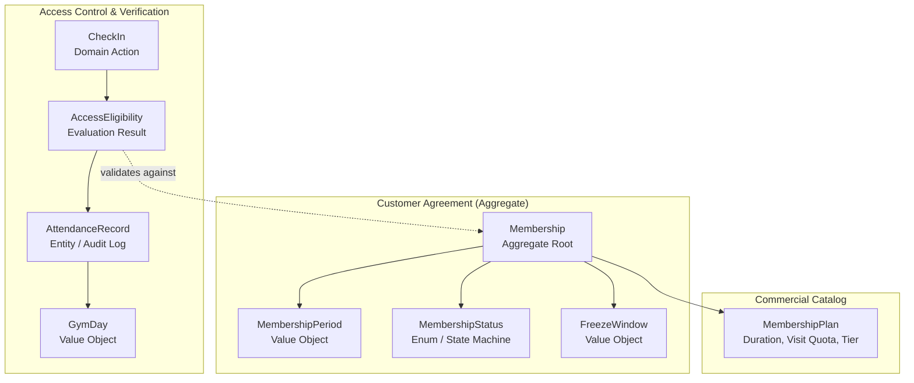

# Gym Management — Canonical Domain Vocabulary & Semantic Specification

- **Status**: Authoritative Ubiquitous Language Baseline
- **Bounded Context**: Gym Management (`packages/core/src/gym/`)
- **ADR Reference**: [ADR-0055](../adr/0055-gym-management-canonical-domain-vocabulary-and-semantic-contracts.md)

---

## 1. Executive Summary

In Domain-Driven Design (DDD), **Ubiquitous Language** ensures that domain experts, architects, engineers, and product stakeholders use identical terminology across documentation, source code, database schemas, test cases, and user interfaces.

This document defines the canonical domain vocabulary for **Gym Management (Phase 5)**.

---

## 2. Term Evaluation & Semantic Resolution

### 2.1 Deep Semantic Analysis of Core Concepts

#### 1. `Membership`

- **Definition**: The long-lived customer agreement granting a registered client access privileges to the fitness facility under specific plan terms.
- **Ownership**: Strictly owned by **Gym Management**.
- **Lifecycle**: Governed by `MembershipStatus` state machine (`PENDING` $\rightarrow$ `ACTIVE` $\rightleftharpoons$ `FROZEN` $\rightarrow$ `EXPIRED` / `CANCELLED` $\rightarrow$ `TERMINATED`).
- **Identity**: Requires a unique string UUID identifier (`id: string`).
- **Persistence**: Persisted as root row in `memberships` table with optimistic concurrency control (`version: number`).
- **Relationship**: Associates `clientId: string` (Client Management) with `planId: string` (`MembershipPlan`).
- **Forbidden Interpretation**: A `Membership` is NOT a user account (`User`), NOT a customer profile (`Client`), and NOT an entrance ticket/pass (`AttendanceRecord`).

#### 2. `MembershipPlan`

- **Definition**: The catalog specification defining commercial terms, duration in days, billing frequency, visit limits, and access tier classification.
- **Ownership**: Strictly owned by **Gym Management**.
- **Lifecycle**: Governed by catalog state (`DRAFT`, `ACTIVE`, `ARCHIVED`).
- **Identity**: Requires a unique identifier (`id: string`) and unique business code (`code: string`).
- **Persistence**: Persisted in `membership_plans` table.
- **Relationship**: Referenced by `Membership.planId`.
- **Forbidden Interpretation**: A `MembershipPlan` is NOT the customer's agreement; changing a plan's price or terms never retroactively mutates existing active memberships.

#### 3. `MembershipStatus`

- **Definition**: The explicit, discrete lifecycle state enum of a `Membership`.
- **Ownership**: Strictly owned by **Gym Management**.
- **Values**:
  - `PENDING`: Agreement created but awaiting activation date or initial payment confirmation.
  - `ACTIVE`: Fully valid and authorized for facility access.
  - `FROZEN`: Temporarily paused by member request or policy; access is suspended, and expiration is extended upon unfreezing.
  - `EXPIRED`: Natural end of `MembershipPeriod` reached without renewal.
  - `CANCELLED`: Voluntarily or administratively terminated prior to expiration date.
  - `TERMINATED`: Irrevocably closed following policy breach, fraud, or permanent account deletion.
- **Forbidden Interpretation**: `MembershipStatus` is NOT a security account status (`UserStatus` in IAM) and NOT a profile status (`ClientStatus` in Client Management).

#### 4. `MembershipPeriod`

- **Definition**: The immutable value object representing the continuous interval of time (`startDate: Date`, `endDate: Date`) during which a membership is legally valid for facility access.
- **Ownership**: Strictly owned by **Gym Management**.
- **Lifecycle**: Immutable upon creation.
- **Identity**: Value Object (structural equality; no independent ID).
- **Persistence**: Stored as columns (`start_date`, `end_date`) within the `memberships` table.
- **Forbidden Interpretation**: `MembershipPeriod` is NOT a recurring calendar series (`RecurrenceSeries` in Scheduling).

#### 5. `Renewal`

- **Definition**: The business operation that extends an active or recently expired membership's validity interval by computing a new `MembershipPeriod` upon receipt of recurring payment or contract renewal.
- **Ownership**: Strictly owned by **Gym Management**.
- **Lifecycle**: Domain Action resulting in `MembershipRenewedEvent`.
- **Identity**: N/A (Operation/Event).
- **Forbidden Interpretation**: Renewal does NOT create a separate duplicate customer or new membership ID; it preserves historical continuity of the existing `Membership` aggregate.

#### 6. `FreezeWindow`

- **Definition**: An approved temporary suspension interval (`frozenAt: Date`, `resumedAt?: Date`, `reason: string`) during which access is halted and the eventual expiration date is extended by the exact freeze duration upon reactivation.
- **Ownership**: Strictly owned by **Gym Management**.
- **Lifecycle**: State transition on `Membership` (`freeze()` $\rightarrow$ `unfreeze()`).
- **Forbidden Interpretation**: A freeze is NOT an administrative cancellation or account lockout.

#### 7. `AttendanceRecord` / `CheckIn`

- **Definition**:
  - `CheckIn`: The physical access attempt event at a facility turnstile, kiosk, or reception desk.
  - `AttendanceRecord`: The immutable, append-only domain entity capturing timestamp, method (`BARCODE`, `RFID`, `MANUAL`, `BIOMETRIC`, `QR_CODE`), facility zone, and outcome (`GRANTED`, `DENIED_EXPIRED`, `DENIED_FROZEN`, `DENIED_INACTIVE_CLIENT`, `DENIED_LIMIT_REACHED`).
- **Ownership**: Strictly owned by **Gym Management**.
- **Lifecycle**: Append-only log; records are immutable once written.
- **Identity**: Unique UUID (`id: string`).
- **Persistence**: Persisted in `attendance_records` table.
- **Forbidden Interpretation**: `AttendanceRecord` is NOT an appointment booking (`Appointment` in Scheduling) and NOT an appointment attendance compliance score.

#### 8. `GymDay`

- **Definition**: The timezone-aware business calendar day (`YYYY-MM-DD` in facility local timezone) used to compute daily visit quotas, operating hours, and attendance reporting without UTC/DST boundary discrepancies.
- **Ownership**: Strictly owned by **Gym Management**.
- **Type**: Immutable Value Object.
- **Forbidden Interpretation**: `GymDay` is NOT a raw UTC timestamp.

#### 9. `TrainerAssignment`

- **Definition**: Operational allocation linking a member with an assigned fitness trainer for personal training or gym floor orientation.
- **Ownership**: Assigned in **Gym Management**; identity owned by **Identity (IAM)** via `trainerId: string`.
- **Forbidden Interpretation**: Gym Management must NOT create a separate `Trainer` user entity or table.

---

## 3. Authoritative Canonical Vocabulary Table

| Canonical Term          | Conceptual Definition                                                                             | Owner Context      | DDD Type                | Allowed Values / States                                                                        | Prohibited Synonyms / Rejected Aliases                                          |
| :---------------------- | :------------------------------------------------------------------------------------------------ | :----------------- | :---------------------- | :--------------------------------------------------------------------------------------------- | :------------------------------------------------------------------------------ |
| **`Membership`**        | Long-lived agreement granting a client facility access privileges.                                | **Gym Management** | Aggregate Root          | `PENDING`, `ACTIVE`, `FROZEN`, `EXPIRED`, `CANCELLED`, `TERMINATED`                            | ❌ `Subscription`, `Pass`, `GymContract`, `GymCard`, `UserMembership`, `Member` |
| **`MembershipPlan`**    | Commercial product catalog definition detailing validity duration, visit limits, and access tier. | **Gym Management** | Aggregate Root / Entity | `DRAFT`, `ACTIVE`, `ARCHIVED`                                                                  | ❌ `Package`, `Tariff`, `PricingPlan`, `Tier`, `GymPackage`, `ServicePlan`      |
| **`MembershipStatus`**  | Explicit lifecycle state enum of a `Membership`.                                                  | **Gym Management** | Value Object / Enum     | `PENDING`, `ACTIVE`, `FROZEN`, `EXPIRED`, `CANCELLED`, `TERMINATED`                            | ❌ `SubscriptionState`, `MemberState`, `CardStatus`, `ContractStatus`           |
| **`MembershipPeriod`**  | Immutable validity time interval (`startDate`, `endDate`) of a membership.                        | **Gym Management** | Value Object            | Immutable interval                                                                             | ❌ `ValidityWindow`, `DateRange`, `DurationPeriod`, `ContractTerm`              |
| **`Renewal`**           | Domain operation extending a membership's validity interval upon re-subscription.                 | **Gym Management** | Domain Action / Policy  | N/A (Event / Command)                                                                          | ❌ `Re-subscription`, `Extension`, `Re-bill`, `Top-Up`                          |
| **`FreezeWindow`**      | Approved temporary suspension interval halting access and extending expiration.                   | **Gym Management** | Value Object            | `PENDING`, `ACTIVE`, `COMPLETED`                                                               | ❌ `PausePeriod`, `SuspensionWindow`, `Hold`, `VacationTime`                    |
| **`AttendanceRecord`**  | Immutable append-only audit record of a physical check-in attempt at a facility.                  | **Gym Management** | Entity / Log            | Immutable                                                                                      | ❌ `VisitRecord`, `TurnstileLog`, `EntryLog`, `Swipe`, `AccessLog`              |
| **`CheckIn`**           | The physical entry verification action at a facility turnstile or kiosk.                          | **Gym Management** | Domain Command / Action | N/A (Command)                                                                                  | ❌ `Swipe`, `Tap`, `Scan`, `ClockIn`, `Entry`, `GatePass`                       |
| **`AccessEligibility`** | Evaluated access decision outcome.                                                                | **Gym Management** | Value Object / Result   | `GRANTED`, `DENIED_EXPIRED`, `DENIED_FROZEN`, `DENIED_INACTIVE_CLIENT`, `DENIED_LIMIT_REACHED` | ❌ `PassStatus`, `EntryPermission`, `AllowAccess`, `GateResponse`               |
| **`GymDay`**            | Timezone-aware local business date (`YYYY-MM-DD`) for quota and operating calculations.           | **Gym Management** | Value Object            | Immutable                                                                                      | ❌ `BusinessDate`, `CalendarDay`, `FacilityDate`, `ShiftDate`                   |
| **`TrainerAssignment`** | Operational link associating a client/membership with an assigned fitness trainer.                | **Gym Management** | Value Object            | `ACTIVE`, `INACTIVE`                                                                           | ❌ `TrainerUser`, `Coach`, `Instructor`, `PersonalTrainer`                      |

---

## 4. Glossary & Development Governance Rules

1. **Strict Terminology Invariant**:
   - Every class, method, variable, API contract, database field, test case, domain event, and UI label MUST use the canonical term.
   - Code reviews and PR quality gates must reject non-canonical synonyms (e.g. `subscriptionId` $\rightarrow$ `membershipId`, `packageId` $\rightarrow$ `planId`, `swipeCard()` $\rightarrow$ `recordCheckIn()`).
2. **Casing & Naming Standards**:
   - **Domain Classes / Value Objects**: PascalCase (`Membership`, `MembershipPeriod`, `AttendanceRecord`, `GymDay`).
   - **Database Tables**: snake_case plural (`memberships`, `membership_plans`, `attendance_records`).
   - **Database Columns**: snake_case (`client_id`, `plan_id`, `start_date`, `end_date`, `check_in_time`, `access_result`).
   - **REST API Routes**: kebab-case plural (`/api/v1/gym/memberships`, `/api/v1/gym/plans`, `/api/v1/gym/attendance`).
   - **Domain Events**: PascalCase with past-tense verb (`MembershipPurchasedEvent`, `MembershipRenewedEvent`, `MembershipFrozenEvent`, `AttendanceRecordedEvent`).

---

## 5. Cross-Context Disambiguation Matrix

| Ambiguous Term | Meaning in Other Bounded Contexts                                                                                                                                | Meaning in Gym Management                                                                                                    | Disambiguation Rule                                                                                        |
| :------------- | :--------------------------------------------------------------------------------------------------------------------------------------------------------------- | :--------------------------------------------------------------------------------------------------------------------------- | :--------------------------------------------------------------------------------------------------------- |
| **Attendance** | **Scheduling**: Ratio of kept vs no-show appointments (`AppointmentAttendanceCompliance`).                                                                       | **Gym Management**: Physical facility check-in timestamp (`AttendanceRecord`).                                               | In Scheduling, use `AppointmentAttendanceCompliance`. In Gym, use `AttendanceRecord` / `CheckIn`.          |
| **Status**     | **Identity**: User account status (`UserStatus`: `ACTIVE`, `LOCKED`, `SUSPENDED`). **Client**: Client profile status (`ClientStatus`: `ACTIVE`, `ARCHIVED`). | **Gym Management**: Membership lifecycle status (`MembershipStatus`: `PENDING`, `ACTIVE`, `FROZEN`, `EXPIRED`, `CANCELLED`). | Always prefix status types with their owning aggregate (`UserStatus`, `ClientStatus`, `MembershipStatus`). |
| **Trainer**    | **Identity**: Practitioner user with `TRAINER` role. **Scheduling**: Resource assigned to treatment shifts.                                                  | **Gym Management**: Scalar reference (`trainerId: string`) in `TrainerAssignment`.                                           | Gym Management never instantiates a `Trainer` aggregate root.                                              |
