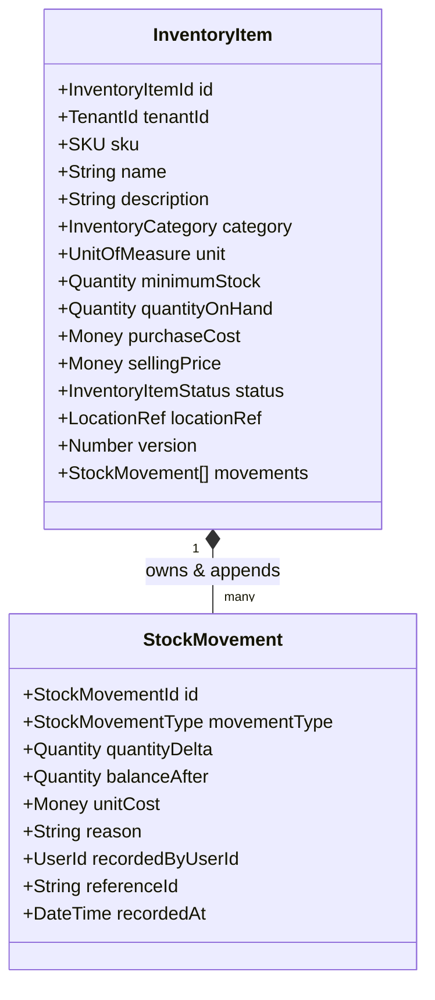
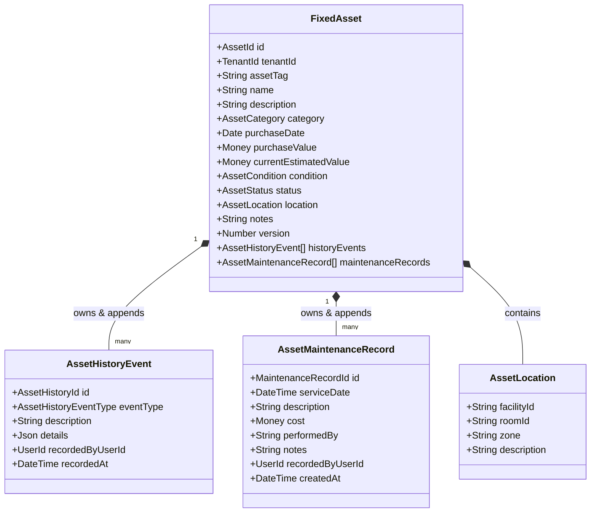

# Resources Management — Canonical Domain Vocabulary & Semantic Specification

- **Status**: Authoritative Ubiquitous Language Baseline
- **Bounded Context**: Resources Management (`packages/core/src/resources/`)
- **Governing ADRs**: [ADR-0081](../architecture/resources/adr/0081-resources-bounded-context-topology-and-domain-segregation.md), [ADR-0082](../architecture/resources/adr/0082-fixed-asset-domain-modeling-and-complete-segregation-from-inventory.md), [ADR-0083](../architecture/resources/adr/0083-inventory-movement-ledger-and-materialized-stock-mutation-strategy.md), [ADR-0085](../architecture/resources/adr/0085-fixed-asset-operational-lifecycle-state-machine-and-terminal-disposal-policy.md), [ADR-0088](../architecture/resources/adr/0088-inventory-category-classification-strategy.md), [ADR-0089](../architecture/resources/adr/0089-inventory-monetary-quantity-and-unit-precision-semantics.md), [ADR-0090](../architecture/resources/adr/0090-fixed-asset-classification-lifecycle-state-and-condition-rating-strategy.md)
- **Onboarding & Navigation**: [Senior Engineer Onboarding & Architecture Navigation Guide](../architecture/resources/onboarding.md)

---

## 1. Executive Summary & Ubiquitous Language Charter

In Domain-Driven Design (DDD), **Ubiquitous Language** ensures that domain experts, architects, software engineers, and product stakeholders use identical terminology across documentation, source code, database schemas, test cases, and user interfaces.

This document defines the canonical domain vocabulary, entity contracts, semantic models, and operational invariants for **Resources Management (Phase 6)**.

---

## 2. Fundamental Domain Segregation: Consumables vs. Fixed Assets

> ### ⚠️ Critical Ubiquitous Language Rule:
>
> **Resources Management contains two fundamentally different resource types:**  
> $$\text{\bf Consumable Resources} \neq \text{\bf Fixed Assets}$$  
> **Under no circumstances should both concepts be referred to collectively as "inventory."**

```
                            RESOURCES MANAGEMENT
                                     │
         ┌───────────────────────────┴───────────────────────────┐
         ▼                                                       ▼
CONSUMABLE INVENTORY                                        FIXED ASSETS
(Fungible, Depleted, Stock Ledger)              (Non-Fungible, Durable, Lifecycle Machine)
• Units of Supply (Tape, Wipes, Meals)          • Capital Property (Machines, Tables, IT)
• Tracked by SKU & Quantity Balance             • Tracked by Unique Asset Tag & Serial No.
• Depleted via Consumption & Retail Sale        • Persists over Years via Maintenance & Care
• Mutated via Double-Entry StockMovements       • Mutated via State Transitions & Transfers
• Valuation: Sum(quantityOnHand * unitCost)     • Valuation: Purchase Value & Estimated Book Value
```

- **Consumable Resources**: Supplies and retail goods intended to be consumed, applied, dispensed, or sold. They lose their individual identity upon stocking and are measured in aggregate counts or continuous volumes. Once used, they are depleted.
- **Fixed Assets**: Tangible capital property retained for ongoing business operations, treatments, or facility functions. They retain their unique physical identity for their entire operational lifespan, do not diminish in unit quantity when used, and require maintenance and depreciation tracking.

---

## 3. Consumable Inventory Sub-Domain Vocabulary

### 3.1 Inventory Core Concepts



#### 1. `InventoryItem` (Inventory Item / Product)

- **DDD Classification**: **Aggregate Root**.
- **Definition**: A distinct consumable supply, therapeutic retail good, or clinical material identified by a unique SKU, tracked as an aggregate fungible balance on hand at a facility.
- **Identity**: Unique UUID (`id: string`) paired with a business-unique Stock Keeping Unit (`sku: SKU`).
- **Persistence**: Persisted in PostgreSQL table `inventory_items` with optimistic concurrency versioning (`version: number`).
- **Forbidden Interpretation**: An `InventoryItem` is NOT a serialized piece of equipment (`FixedAsset`) and NOT a commercial customer order (`SalesOrder`).

#### 2. `quantityOnHand` (Stock Quantity / Balance)

- **DDD Classification**: **Value Object (`Quantity`)**.
- **Definition**: The authoritative, real-time physical balance of items currently available for consumption or sale at the facility.
- **Business Rule [INV-INV-2]**: **Strict Non-Negative Balance**:
  $$\text{quantityOnHand} \ge 0$$
  Stock can never drop below zero under any circumstance. Any operation attempting to deduct more stock than is available immediately aborts with `InsufficientStockException`.
- **Mathematical Invariant**: `quantityOnHand` is provably equal to the sum of all historical movement deltas:
  $$\text{quantityOnHand} \equiv \sum_{i=1}^{n} \text{quantityDelta}_i$$

#### 3. `minimumStock` (Reorder Threshold)

- **DDD Classification**: **Value Object (`Quantity`)**.
- **Definition**: The minimum safe quantity threshold below which operational replenishment alerts and low-stock warnings are triggered.
- **Business Rule [INV-INV-3]**: Must be non-negative ($\ge 0$). When $\text{quantityOnHand} \le \text{minimumStock}$, the item is flagged for operational attention.

#### 4. `purchaseCost` (Acquisition Cost Basis)

- **DDD Classification**: **Value Object (`Money: { amount: Decimal, currency: string }`)**.
- **Definition**: The gross monetary cost paid to acquire a single unit of the product from a vendor or distributor.
- **Valuation Basis**: Forms the financial baseline for calculating total inventory asset valuation on the balance sheet ($\text{quantityOnHand} \times \text{purchaseCostAmount}$).

#### 5. `sellingPrice` (Retail Commercial Price)

- **DDD Classification**: **Value Object (`Money: { amount: Decimal, currency: string }`)**.
- **Definition**: The commercial monetary price charged to a client, patient, or member when purchasing a unit of retail inventory at the front desk or counter.
- **Business Rule**: Must be non-negative ($\ge 0$). For internal-only supplies (e.g., disinfectant, treatment needles), `sellingPrice` is set to $0.00.

#### 6. `status` (Inventory Item Status)

- **DDD Classification**: **Domain Enum (`InventoryItemStatus`)**.
- **Values**:
  - `ACTIVE`: Fully operational. Restocking, sales, and clinical consumption are allowed.
  - `INACTIVE`: Temporarily suspended from operations. Restocking and retail sales are halted; existing stock may be audited or consumed.
  - `ARCHIVED`: Permanently discontinued. No further restocking or sales allowed. Item remains in database for historical movement traceability.

#### 7. `StockMovement` (Movement Ledger Entry)

- **DDD Classification**: **Child Entity (Immutable Ledger Row)**.
- **Definition**: An immutable, chronological transaction record capturing an atomic alteration in physical stock.
- **Properties**: `id`, `movementType`, `quantityDelta`, `balanceAfter`, `unitCost`, `reason`, `recordedByUserId`, `referenceId`, `recordedAt`.
- **Immutability Invariant**: Stock movements are append-only. Once persisted, rows in `stock_movements` can never be edited or deleted (`onDelete: Restrict`).

---

### 3.2 Authoritative Movement Types Matrix

Every physical stock alteration must be categorized under one of the canonical `StockMovementType` values:

| Movement Type        | Business Meaning                                                                             |                     Stock Effect                     | When Allowed                                                                                                  |                                Affects Asset Valuation?                                | External Sale vs. Internal Consumption                                           |
| :------------------- | :------------------------------------------------------------------------------------------- | :--------------------------------------------------: | :------------------------------------------------------------------------------------------------------------ | :------------------------------------------------------------------------------------: | :------------------------------------------------------------------------------- |
| **`PURCHASE`**       | Stock received from external vendor, distributor, or manufacturer.                           |            **+Delta**<br/>(Increases QOH)            | Allowed when item is `ACTIVE`. Requires positive quantity and mandatory receipt/invoice reason.               |   **YES**<br/>(Increases inventory asset value by $\Delta Q \times \text{unitCost}$)   | **External Acquisition** (Inflow from third-party vendor into facility).         |
| **`SALE`**           | Retail sale of merchandise, drinks, or supplements to a client or patient.                   |            **-Delta**<br/>(Decreases QOH)            | Allowed when item is `ACTIVE` and $\text{QOH} \ge \Delta Q$ (`[INV-INV-2]`). Requires positive selling price. | **YES**<br/>(Reduces inventory asset balance by $\Delta Q \times \text{purchaseCost}$) | **External Sale** (Outflow to client; generates commercial revenue).             |
| **`CONSUMPTION`**    | Internal usage of clinical supplies or facility materials during treatment/cleaning.         |            **-Delta**<br/>(Decreases QOH)            | Allowed when item is `ACTIVE` and $\text{QOH} \ge \Delta Q$. Requires session or treatment correlation ID.    |     **YES**<br/>(Reduces inventory asset balance as an operational expense / COGS)     | **Internal Consumption** (Strictly internal; zero commercial revenue generated). |
| **`ADJUSTMENT_IN`**  | Positive count correction resulting from cycle count audit or discovered unrecorded stock.   |            **+Delta**<br/>(Increases QOH)            | Allowed during inventory reconciliation. Requires an audited explanation note.                                |             **YES**<br/>(Increases inventory asset value on balance sheet)             | **Internal Reconciliation** (Internal physical count reconciliation).            |
| **`ADJUSTMENT_OUT`** | Negative count correction resulting from inventory shrinkage, discrepancy, or counting loss. |            **-Delta**<br/>(Decreases QOH)            | Allowed when $\text{QOH} \ge \Delta Q$. Requires an audited explanation note.                                 |            **YES**<br/>(Reduces inventory asset balance as shrinkage loss)             | **Internal Reconciliation** (Internal physical count reconciliation).            |
| **`CORRECTION`**     | Explicit reset of stock balance to a verified physical audit count.                          | **Variable**<br/>($Q_{\text{new}} - Q_{\text{old}}$) | Allowed only for authorized managerial roles during formal facility stocktaking audits.                       |           **YES**<br/>(Proportionate adjustment to balance sheet valuation)            | **Internal Reconciliation** (Internal physical audit baseline reset).            |
| **`SCRAP`**          | Removal of spoiled, expired, broken, or contaminated stock (meals, drinks, damaged goods).   |            **-Delta**<br/>(Decreases QOH)            | Allowed when $\text{QOH} \ge \Delta Q$. Requires mandatory reason describing defect or expiration.            |         **YES**<br/>(Reduces inventory asset balance as waste write-off loss)          | **Internal Disposal** (Internal disposal and write-off; zero revenue).           |

---

## 4. Fixed Assets Sub-Domain Vocabulary

### 4.1 Asset Core Concepts



#### 1. `FixedAsset` (Capital Asset)

- **DDD Classification**: **Aggregate Root**.
- **Definition**: A distinct, non-fungible physical item of durable capital property owned and operated by Kinergy facilities.
- **Identity**: Unique UUID (`id: string`) paired with a physical barcode/tag identifier (`assetTag: string`).
- **Persistence**: Persisted in PostgreSQL table `fixed_assets` with optimistic concurrency versioning (`version: number`).
- **Forbidden Interpretation**: A `FixedAsset` is NOT a consumable supply item (`InventoryItem`) and NOT a schedulable calendar booking (`Appointment`).

#### 2. `category` (Asset Category)

- **DDD Classification**: **Domain Enum (`AssetCategory`)**.
- **Values**:
  - `GYM_EQUIPMENT`: Cardio machines, weight benches, squat racks, cable stations.
  - `THERAPY_EQUIPMENT`: Clinical lasers, shockwave units, ultrasound generators, treatment tables.
  - `KITCHEN_EQUIPMENT`: Commercial refrigeration, shake blenders, ice machines.
  - `OFFICE_FURNITURE`: Reception desks, ergonomic therapist chairs, filing cabinets.
  - `ELECTRONICS`: Front-desk computers, sound systems, tablets, barcode scanners.
  - `CLEANING_EQUIPMENT`: Industrial floor scrubbers, sanitization foggers.

#### 3. `location` (Asset Physical Location)

- **DDD Classification**: **Value Object (`AssetLocation`)**.
- **Definition**: An informational coordinate structure capturing where an asset currently resides:
  - `facilityId: string`: Mandatory identifier of the branch or physical building.
  - `roomId?: string`: Optional reference to a treatment room or gym studio.
  - `zone?: string`: Optional sub-room placement (e.g. "Free Weight Area", "Cardio Deck").
  - `description?: string`: Human-readable placement notes.
- **Architectural Invariant**: Location is an **informational Value Object**, NOT a foreign key entity. Schedulable room bookings operate independently from asset locations ([ADR-0105](../architecture/resources/adr/0105-scheduling-and-fixed-asset-decoupling-invariant.md)).

#### 4. `purchaseValue` (Acquisition Cost Basis)

- **DDD Classification**: **Value Object (`Money: { amount: Decimal, currency: string }`)**.
- **Definition**: The gross financial acquisition cost paid when the asset was purchased and commissioned. Immutably preserved for historical capital accounting.

#### 5. `currentEstimatedValue` (Book / Economic Value)

- **DDD Classification**: **Value Object (`Money: { amount: Decimal, currency: string }`)**.
- **Definition**: The real-time estimated economic or book value of the asset, reflecting straight-line depreciation, condition degradation, or salvage appraisal.
- **Mutation**: Updated via `UpdateFixedAssetValuationCommand`, raising a `VALUE_UPDATED` history event.

#### 6. `status` (Operational Lifecycle State)

- **DDD Classification**: **Domain Enum & State Machine (`AssetStatus`)**.
- **Values & Transition Rules**:
  - `ACTIVE`: Commissioned and operational for gym members or patients.
  - `UNDER_MAINTENANCE`: Temporarily taken offline for servicing, preventive maintenance, or overhaul.
  - `DAMAGED`: Impaired due to breakdown or safety hazard pending evaluation.
  - `RETIRED`: Decommissioned due to age or obsolescence. Prohibits transfers and maintenance.
  - `SOLD`: **Terminal State [AST-INV-1]**. Permanently liquidated. Prohibits all future status changes, transfers, maintenance, and revaluations.

#### 7. `condition` (Physical Health Grade)

- **DDD Classification**: **Domain Enum (`AssetCondition`)**.
- **Values (Severity Ranked 1 to 5)**:
  - `EXCELLENT` (Rank 1): Pristine, like-new condition with zero degradation.
  - `GOOD` (Rank 2): Normal operational wear, fully functional.
  - `FAIR` (Rank 3): Noticeable cosmetic/mechanical wear; nearing scheduled servicing.
  - `NEEDS_REPAIR` (Rank 4): Unserviceable; requires prompt technician intervention.
  - `OUT_OF_SERVICE` (Rank 5): Complete breakdown, structural defect, or hazard; prohibited from operation.

#### 8. `maintenance` (Maintenance & Servicing)

- **DDD Classification**: **Child Entity (`AssetMaintenanceRecord`)**.
- **Definition**: An immutable servicing log recording preventive maintenance, repairs, inspections, or calibrations.
- **Properties**: `id`, `serviceDate`, `description`, `costAmount`, `costCurrency`, `performedBy`, `recordedByUserId`, `createdAt`.
- **Business Rule [AST-INV-4]**: Maintenance can only be recorded on assets in `ACTIVE`, `UNDER_MAINTENANCE`, or `DAMAGED` states. Maintenance is strictly forbidden on `RETIRED` or `SOLD` assets.

#### 9. `transfer` (Location Transfer)

- **DDD Classification**: **Domain Action (`transferLocation()`)**.
- **Definition**: Reassigning the physical placement of an asset to a new facility, room, or zone.
- **Business Rule [AST-INV-2]**: Location transfers are permitted only while an asset is operational (`ACTIVE`, `UNDER_MAINTENANCE`, `DAMAGED`). Transfers are strictly forbidden on `RETIRED` or `SOLD` assets.

#### 10. `history` (Audit Trail)

- **DDD Classification**: **Child Entity (`AssetHistoryEvent`)**.
- **Definition**: An immutable, chronological audit trail automatically capturing actor provenance, timestamps, event types, and structured transition payloads for every asset mutation.

---

## 5. Summary Glossary for Senior Engineers

| Canonical Term         | Owning Sub-Domain      | Core Responsibility                                                       | Anti-Pattern to Avoid                                              |
| :--------------------- | :--------------------- | :------------------------------------------------------------------------ | :----------------------------------------------------------------- |
| **`InventoryItem`**    | Consumable Inventory   | Manages fungible supply stock balances, UOM, and pricing.                 | Do NOT use for durable machines or capital equipment.              |
| **`StockMovement`**    | Consumable Inventory   | Immutable ledger entry recording quantity delta and balance snapshot.     | Do NOT overwrite stock balances directly without a ledger row.     |
| **`FixedAsset`**       | Fixed Assets           | Manages unique capital property, lifecycle states, and condition.         | Do NOT describe as "inventory."                                    |
| **`AssetStatus`**      | Fixed Assets           | Governs operational lifecycle via 5x5 state machine.                      | Do NOT allow state transitions after `SOLD` (terminal state).      |
| **`AssetCondition`**   | Fixed Assets           | Severity-ranked physical health rating (1=EXCELLENT to 5=OUT_OF_SERVICE). | Do NOT confuse condition rating with operational lifecycle status. |
| **`AssetLocation`**    | Fixed Assets           | Informational placement coordinates (`facilityId`, `roomId`, `zone`).     | Do NOT create relational foreign keys to schedulable rooms.        |
| **`ResourceOverview`** | Synthesized Read Model | Aggregates cross-domain operational counts and capital valuations.        | Do NOT perform state mutations from this read-only projection.     |
