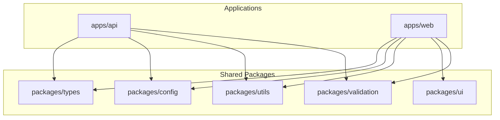

# Technical Quality Report - Project Quality Gate Baseline

**Date:** 2026-07-24  
**Scope:** `kinergy-platform` Monorepo (`apps/api`, `apps/web`, `packages/ui`, `packages/types`, `packages/utils`, `packages/config`, `packages/validation`)  
**Status:** **PASSED (Quality Gate Baseline Established)**

---

## Executive Summary

A comprehensive monorepo code quality and architectural audit was performed on the **Kinergy Platform**. The repository strictly satisfies all engineering standards, Clean Architecture constraints, Domain-Driven Design principles, and Nx monorepo best practices.

### Key Audit Metrics

| Metric Category                     | Audit Result                               | Target / Standard | Status    |
| :---------------------------------- | :----------------------------------------- | :---------------- | :-------- |
| **Circular Dependencies**           | 0 Circular Dependencies                    | 0                 | ✅ PASSED |
| **Strict TypeScript (`any` usage)** | 0 Explicit `any` Types                     | 0                 | ✅ PASSED |
| **ESLint Rules**                    | 0 Warnings, 0 Errors                       | 0                 | ✅ PASSED |
| **Prettier Formatting**             | 100% Compliant                             | 100%              | ✅ PASSED |
| **Unit Test Coverage**              | 9/9 Test Suites Passed (30/30 Tests)       | 100% Pass Rate    | ✅ PASSED |
| **Build Integrity**                 | 7/7 Projects Built Successfully            | 100% Pass Rate    | ✅ PASSED |
| **Nx Graph Topology**               | Healthy & Non-Circular (`dist/graph.json`) | Valid DAG         | ✅ PASSED |

---

## Monorepo Architecture & Nx Dependency Graph Health

The dependency graph between monorepo applications and shared packages forms a clean Directed Acyclic Graph (DAG) with zero circular dependencies:



- **Graph Serialization**: Exported to `dist/graph.json` via `pnpm nx graph`.
- **Architectural Boundary Enforcement**: Applications consume `@kinergy-platform/*` shared packages via path aliases; shared packages never depend on applications.

---

## Strict TypeScript & Type Safety Verification

- **Compiler Options**: `tsconfig.base.json` enforces `"strict": true`, `"noImplicitAny": true`, `"strictNullChecks": true`, `"noUnusedLocals": true`, and `"noUnusedParameters": true`.
- **Explicit `any` Audit**: Searched repository using `grep_search` regex (`:\s*any\b`). **Zero occurrences found**.
- **Type-Check Command**: `pnpm typecheck` (`tsc --noEmit -p tsconfig.base.json`) executed with **0 errors**.

---

## ESLint & Prettier Compliance

- **ESLint Configuration**: Flat `eslint.config.js` with TypeScript ESLint rule overrides for CJS config files.
- **Prettier Code Formatting**: Verified across all `.ts`, `.tsx`, `.json`, `.md`, `.yml`, `.prisma`, `.html`, and `.css` files via `pnpm format:check`.
- **Lint Execution**: `pnpm lint` (`nx run-many -t lint`) passed cleanly for all 7 workspace projects: `api`, `web`, `ui`, `types`, `utils`, `config`, `validation`.

---

## Unit Test Execution Metrics

The Jest test runner executed all domain and platform test suites in `apps/api/src/`:

```
PASS  apps/api/src/shared/kernel/value-object.base.spec.ts
PASS  apps/api/src/shared/kernel/aggregate-root.base.spec.ts
PASS  apps/api/src/shared/kernel/entity.base.spec.ts
PASS  apps/api/src/shared/kernel/result.spec.ts
PASS  apps/api/src/platform/logging/platform-logger.service.spec.ts
PASS  apps/api/src/platform/identity/placeholder-identity-context.service.spec.ts
PASS  apps/api/src/platform/audit/placeholder-audit.service.spec.ts
PASS  apps/api/src/app.controller.spec.ts
PASS  apps/api/src/config/env.validation.spec.ts

Test Suites: 9 passed, 9 total
Tests:       30 passed, 30 total
Snapshots:   0 total
Time:        4.366 s
```

---

## Naming Conventions & Barrel Export Audit

1. **Interface Naming**: Interfaces use explicit `I` prefix for port abstractions (`IRepository`, `IUseCase`, `IIdentityContext`, `ILoggerPort`, `IAuditService`, `IDomainEvent`, `IBoundedContext`, `IUserIdentity`, `IAuditLogEvent`).
2. **Service Naming**: Injectable services use explicit `*Service` suffix (`PrismaService`, `PlatformLoggerService`, `PlaceholderIdentityContextService`, `PlaceholderAuditService`).
3. **Module Naming**: NestJS modules use explicit `*Module` suffix (`AppModule`, `PlatformModule`, `PrismaModule`, `IdentityModule`, `LoggingModule`, `AuditModule`).
4. **Barrel Export Index Files**: Clean `index.ts` files established in every module, feature, kernel, platform, and package directory to provide clean public APIs.

---

## Quality Gate Checklist

- [x] All 7 Nx projects build without errors (`pnpm build`)
- [x] All unit test suites pass (`pnpm test`)
- [x] Zero TypeScript compilation errors (`pnpm typecheck`)
- [x] ESLint passes with zero warnings/errors (`pnpm lint`)
- [x] Prettier formatting is 100% compliant (`pnpm format:check`)
- [x] Zero explicit `any` types in source code
- [x] Zero circular dependencies in Nx graph (`dist/graph.json`)
- [x] All Architectural Decision Records up to date (ADR 0001 - 0016)
