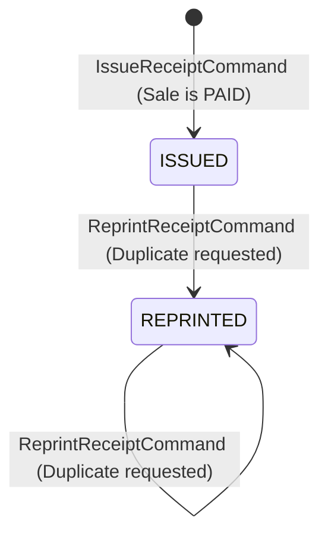

# Phase 7.7: Receipt Domain Architecture & Authoritative Specification

- **Document**: `docs/domain/receipt-domain-specification.md`
- **Status**: Authoritative Architecture & Domain Specification (APPROVED FOR MILESTONE 7.7)
- **Role**: Senior Technical Documentation Architect & Domain Architect
- **Bounded Context**: Sales & Payments (`packages/core/src/sales/`)
- **Governing ADRs**:
  - [ADR-0108: Deterministic Financial Representation and Currency Modeling](../adr/0108-money-representation.md)
  - [ADR-0109: Payment Lifecycle, Multi-Tender Settlement, and Financial Immutability](../adr/0109-payment-lifecycle.md)
  - [ADR-0110: Sale Transaction Ownership and Source Bounded-Context Integrity](../adr/0110-sale-ownership.md)
  - [ADR-0111: Sales & Payments Authorization, Organization Isolation, and Audit Boundaries](../adr/0111-sales-payments-authorization-and-audit.md)
  - [ADR-0112: Sales & Payments Bounded Context Establishment](../adr/0112-sales-bounded-context.md)
  - [ADR-0114: Canonical Monetary Policy, Deterministic Arithmetic, and Sale Totals Invariant Enforcement](../adr/0114-canonical-monetary-policy-and-sale-totals.md)
  - [ADR-0115: Payment Domain Canonical Architecture, Aggregate Boundaries, and Tender Decoupling](../adr/0115-payment-domain-canonical-architecture.md)
  - [ADR-0116: Payment State Machine, Lifecycle Specification, and Financial Transition Determinism](../adr/0116-payment-state-machine-and-lifecycle-specification.md)
  - [ADR-0117: Receipt Domain Boundary, Document Model, and Legal Proof-of-Purchase Invariants](../adr/0117-receipt-domain-boundary-and-document-model.md)
  - [ADR-0118: Sale Reference and Receipt Identification Strategy](../adr/0118-sale-reference-and-receipt-identification-strategy.md)
- **Governing Business Rules**: [`docs/domain/receipt-issuance-lifecycle.md`](receipt-issuance-lifecycle.md), [`docs/domain/receipt-snapshot-model.md`](receipt-snapshot-model.md)
- **API Response Contract**: [`docs/api/receipt-canonical-response-contract.md`](../api/receipt-canonical-response-contract.md)
- **Date**: 2026-09-25

---

## 1. Receipt Purpose

A `Receipt` is an **immutable, customer-facing legal proof-of-purchase voucher**.
Its singular mission is to provide definitive, tamper-proof documentary evidence of an already finalized and settled commercial transaction (`PAID` or `COMPLETED` Sale) with point-in-time customer attribution, itemized breakdown, and settled tender details.

A `Receipt` serves to:

- Guarantee legal consumer protection rights by evidencing what was purchased, when it was purchased, at what unit price, and under what tax/discount terms.
- Serve as the authoritative customer document for clinical insurance reimbursement, membership access verification, and consumable warranty claims.
- Enable deterministic reprints that render identical historical transaction data stamped with duplicate audit telemetry.

---

## 2. Receipt Boundary

`Receipt` is **NOT** an independent bounded context. It resides strictly within the **Sales & Payments Bounded Context** (`packages/core/src/sales/`).

Within this context:

- `Sale` acts as the commercial source of truth (order lines, catalog snapshots, price agreements, discounts, and payable totals).
- `Payment` acts as the monetary tender source of truth (cash drawer tags, payment gateway traces, multi-tender collections, and settlement state machines).
- `Receipt` acts as an autonomous document entity that binds and freezes the settled commercial agreement into an unalterable point-in-time document.

```text
┌────────────────────────────────────────────────────────────────────────┐
│                   Sales & Payments Bounded Context                     │
│                                                                        │
│   ┌─────────────────────┐             ┌────────────────────────────┐   │
│   │   Sale Aggregate    │             │     Payment Aggregate      │   │
│   │ (Commercial Truth)  │             │       (Tender Truth)       │   │
│   └──────────┬──────────┘             └─────────────┬──────────────┘   │
│              │ (Scalar saleId)                      │ (Tenders)        │
│              ▼                                      ▼                  │
│   ┌────────────────────────────────────────────────────────────────┐   │
│   │                   Receipt Aggregate Root                       │   │
│   │         (Immutable Proof-of-Purchase Document Voucher)         │   │
│   └────────────────────────────────────────────────────────────────┘   │
└────────────────────────────────────────────────────────────────────────┘
```

---

## 3. Receipt Ownership

The `Receipt` aggregate root is **owned exclusively by the Sales & Payments Bounded Context**.

- External bounded contexts (such as `Kinesiology`, `Gym Management`, or `Resources Management`) NEVER construct, mutate, or query receipts directly.
- Clinical sessions, gym memberships, and retail inventory interact with receipts exclusively through asynchronous domain event listening (`ReceiptIssuedEvent`) or via tenant-scoped application queries (`GetReceiptBySaleHandler`).
- Upstream contexts cannot modify, void, or recalculate receipt contents.

---

## 4. Relationship to Sale

The relationship between `Sale` and `Receipt` is governed by strict loose-coupling invariants:

1. **Scalar Foreign Reference**: `Receipt` references `Sale` strictly through its scalar identifier (`saleId: SaleId`). No direct aggregate memory references or ORM navigation properties link `Receipt` back into `Sale` domain entities.
2. **One-Way Dependency**: `Receipt` depends on `Sale`; `Sale` does NOT depend on `Receipt`. A `Sale` can exist independently in `PAID` status prior to receipt generation.
3. **Cardinality**: One `Sale` maps to **at most ONE primary `Receipt`** (`1:0..1`).
4. **Point-in-Time Snapshotting**: Upon receipt issuance, `Receipt` captures and freezes the line items (`SaleItem`), customer attribution, discounts, and commercial totals of the sale. Subsequent changes to upstream source entities never mutate the receipt.

---

## 5. Relationship to Payment

The relationship between `Payment` and `Receipt` guarantees multi-tender fidelity:

1. **Evidenced by Settled Tenders**: A `Receipt` can only be constructed from settled `Payment` aggregates in terminal `PaymentStatus.COMPLETED` status.
2. **Multi-Tender Collection**: `Receipt` embeds an immutable array of `ReceiptPaymentSnapshot` value objects documenting all tenders that contributed to settlement (e.g. split tender: $40 CASH + $60 QR).
3. **Settlement Coverage**: The sum of settled payment amounts in integer cents (`cents`) must equal or exceed the total payable amount of the receipt:
   $$\sum \text{payment.cents} \ge \text{receipt.total.cents}$$
4. **Lifecycle Independence**: Receipt issuance does not alter the payment state machine. Payments transition to `COMPLETED` independently before receipt issuance is triggered.

---

## 6. Receipt Lifecycle

The `Receipt` aggregate implements an append-only, write-once lifecycle model.
Generic CRUD operations (`updateReceipt`, `deleteReceipt`) and state setters (`setStatus`) are **strictly prohibited**.



| State       | Permitted Transitions     | Trigger & Actor                                | Business Semantics                                                                                                                                               |
| :---------- | :------------------------ | :--------------------------------------------- | :--------------------------------------------------------------------------------------------------------------------------------------------------------------- |
| `ISSUED`    | $\rightarrow$ `REPRINTED` | `IssueReceiptCommand` (System / Cashier)       | Initial voucher issuance upon full settlement. Sequence assigned, snapshots frozen. Version = 1.                                                                 |
| `REPRINTED` | $\rightarrow$ `REPRINTED` | `ReprintReceiptCommand` (Receptionist / Owner) | Duplicate copy requested. Commercial data remains 100% frozen. `reprintCount` increments by 1; `lastReprintedAt` updates to clock time; version increments by 1. |

- **No Voiding / Cancellation**: A receipt cannot be cancelled or voided. If a commercial sale is subsequently refunded, the original receipt remains an immutable audit voucher, and a separate compensating instrument (`CreditNote` or `RefundReceipt`) is issued.
- **Permanent Retention**: Receipts are never hard-deleted from persistence.

---

## 7. Issuance Rules

Codified by [REC-RULE-01 through REC-RULE-13](receipt-issuance-lifecycle.md):

1. **Commercial Settlement**: The underlying `Sale` must be in status `PAID` or `COMPLETED`. Issuance is strictly rejected if `Sale` is in `DRAFT`, `PENDING_PAYMENT`, `PARTIALLY_PAID`, or `CANCELLED`.
2. **Tender Settlement**: All evidencing payment tenders must be in terminal status `PaymentStatus.COMPLETED`. Pending, failed, or cancelled tenders are rejected.
3. **Full Payment Coverage**: Settled tenders must cover the payable sale total in integer cents. Underpaid sales are rejected.
4. **Tenant Isolation**: Caller tenant (`input.tenantId`), sale tenant (`sale.tenantId`), and payment tenant (`payment.tenantId`) must match identically.
5. **Role Authorization**: The issuing user must possess the `receipts.manage` permission.

---

## 8. Snapshot Rules

Dynamically querying tables on read is **strictly prohibited** by ADR-0117. `Receipt` captures point-in-time snapshots:

- **Client Snapshot (`ReceiptClientSnapshot`)**:
  - Registered customer: captures `clientId`, `referenceNumber`, `fullName`, `email`, and `phone` at checkout.
  - Walk-in customer: `clientSnapshot` is `null`.
  - Immune to future customer profile modifications.
- **Line Item Snapshots (`ReceiptItemSnapshot`)**:
  - Captures `itemId`, `sourceType`, `sourceId`, `description`, `skuOrCode`, `quantity`, `unitPrice`, `discountTotal`, `subtotal`, and `total`.
  - Unit prices and line descriptions remain permanently frozen, preserving historical transaction truth even if catalog prices change next year.
- **Payment Snapshots (`ReceiptPaymentSnapshot`)**:
  - Captures `paymentId`, `method`, `amount`, `status`, `reference`, and `paidAt`.
  - Preserves exact tender breakdown and gateway/drawer authorization references.

---

## 9. Immutability Rules

Immutability is enforced across all architectural tiers:

1. **Domain Aggregate Level**:
   - Aggregate properties are non-writable (`writable: false, configurable: false` via `Object.defineProperty`).
   - Snapshot arrays (`items`, `payments`) are frozen using `Object.freeze()`.
   - Aggregate instance is sealed using `Object.seal()`.
   - Modifying financial fields throws `TypeError` in strict mode.
2. **Application Level**:
   - No application use case exposes mutation paths for financial or snapshot fields.
   - `ReprintReceiptCommand` is the only command capable of mutating operational metadata.
3. **Persistence Level**:
   - `PrismaReceiptRepository.save()` executes explicit write-once enforcement.
   - On reprint (`version > 1`), `updateMany` updates **ONLY** `status`, `reprintCount`, `lastReprintedAt`, `version`, and `updatedAt`. Financial amounts and snapshots are omitted from the update payload.

---

## 10. Receipt Uniqueness & Idempotency

1. **Multiplicity Invariant**: **One Sale $\rightarrow$ at most ONE Primary Receipt**.
2. **Natural Idempotency Key**: `(tenantId, saleId)`.
3. **Persistence Enforcement**:
   - PostgreSQL unique composite index: `@@unique([tenantId, saleId], name: "unique_tenant_sale_receipt")`.
   - Prevents duplicate receipts even under parallel uncoordinated checkout requests.
4. **Concurrency Race Resolution**:
   - If Request A and Request B race past application pre-checks simultaneously:
     - Request A inserts the row and commits.
     - Request B encounters PostgreSQL unique violation `23505` (Prisma `P2002`).
     - `PrismaReceiptRepository.save()` intercepts `P2002` and throws `DuplicateReceiptException`.
     - `IssueReceiptHandler` catches `DuplicateReceiptException`, executes bounded retries, loads Request A's receipt, and returns it successfully.
     - Both callers receive the identical valid receipt voucher with zero duplicates created.

---

## 11. Number and Reference Strategy

Codified by [ADR-0118](../adr/0118-sale-reference-and-receipt-identification-strategy.md):

1. **Receipt Voucher Number (`ReceiptNumber`)**:
   - Format: `REC-YYYY-XXXXXX` (e.g. `REC-2026-000421`).
   - `REC-`: Literal prefix identifying receipt voucher.
   - `YYYY`: 4-digit calendar year of issuance.
   - `XXXXXX`: 6-digit zero-padded, strictly monotonic integer sequence starting from `000001` per tenant and resetting annually.
2. **PostgreSQL Sequence Engine**:
   - Allocated atomically via row-level upsert against `receipt_sequences` table:
     ```sql
     INSERT INTO "receipt_sequences" ("tenant_id", "year", "current_value", "updated_at")
     VALUES ($1, $2, 1, CURRENT_TIMESTAMP)
     ON CONFLICT ("tenant_id", "year")
     DO UPDATE SET
       "current_value" = "receipt_sequences"."current_value" + 1,
       "updated_at" = CURRENT_TIMESTAMP
     RETURNING "current_value";
     ```
   - Row-level lock eliminates table contention and guarantees gap-free monotonicity.
3. **Sale Commercial Reference (`saleReference`)**:
   - Captured as `sale.source.sourceCode ?? sale.id.value`.
   - Decouples technical `ReceiptId` UUID from customer-facing order reference.

---

## 12. Money Representation

Codified by [ADR-0108](../adr/0108-money-representation.md) and [ADR-0114](../adr/0114-canonical-monetary-policy-and-sale-totals.md):

- Monetary values are represented using the canonical `Money` domain Value Object and serialized via `MoneyResponseDto`.
- Format: `{ amount: number, currency: string, formatted: string, cents: number }`.
- **Primary Authoritative Computation Field**: `cents` (Integer minor units, scale: 0). Immune to binary floating-point drift.
- **Authoritative Lossless String**: `formatted` (2 decimal places, e.g. `"100.00"`).
- **Display Convenience**: `amount` (Float). Strictly display-only; clients must never perform math on `amount`.
- Invariant: Non-negative totals ($\text{total.cents} \ge 0$). Deterministic totals:
  $$\text{subtotal.cents} - \text{discountTotal.cents} = \text{total.cents}$$

---

## 13. Payment Representation

- **Single Tender Transactions**:
  - `paymentMethod`: Exposes primary tender method (`CASH`, `QR`).
  - `paymentStatus`: Exposes terminal settlement status (`COMPLETED`).
- **Split Tender Transactions**:
  - Detailed breakdown preserved in `payments: ReceiptPaymentSnapshot[]`.
  - Captures exact split amounts, distinct authorization codes/drawer tags (`reference`), and settled timestamps (`paidAt`).

---

## 14. Authorization & Security

Codified by [ADR-0111](../adr/0111-sales-payments-authorization-and-audit.md):

| Operation           | Route                                               | Permission Code   | Permitted Roles                              | Object-Level Ownership Scoping                                                                                                                            |
| :------------------ | :-------------------------------------------------- | :---------------- | :------------------------------------------- | :-------------------------------------------------------------------------------------------------------------------------------------------------------- |
| **Issue Receipt**   | `POST /sales/:saleId/receipt`<br>`POST /receipts`   | `receipts.manage` | `Owner`, `Manager`, `Receptionist`           | Scoped to caller tenant. Kitchen staff and trainers strictly rejected.                                                                                    |
| **Reprint Receipt** | `POST /receipts/:id/reprint`                        | `receipts.manage` | `Owner`, `Manager`, `Receptionist`           | Scoped to caller tenant. Stamped with duplicate watermark.                                                                                                |
| **View Receipt**    | `GET /sales/:saleId/receipt`<br>`GET /receipts/:id` | `receipts.read`   | `Owner`, `Manager`, `Receptionist`, `Client` | Clients can query **only their own** receipts (`receipt.clientId === user.clientId`). Trainers strictly forbidden from viewing general facility receipts. |

- Sensitive Data Protection: API responses NEVER expose internal payment gateway credentials, cardholder PANs, or database secret hashes.

---

## 15. API Contract

Codified by [`docs/api/receipt-canonical-response-contract.md`](../api/receipt-canonical-response-contract.md):

- Endpoints return `ReceiptResponseDto`.
- **Reference Fields**: `id`, `tenantId`, `saleId`, `receiptNumber`, `status`, `reprintCount`, `lastReprintedAt`.
- **Snapshot Fields**: `saleReference`, `issuedAt`, `clientSnapshot`, `items`, `itemCount`, `subtotal`, `discountTotal`, `total`, `currency`, `payments`, `paymentMethod`, `paymentStatus`.
- **Zero Internal Persistence Leaks**: `version` (OCC), `createdAt`, `updatedAt`, and raw Prisma `Decimal` instances are strictly excluded.

---

## 16. Persistence Strategy

- **Relational Tables**:
  - `receipts`: Stores the Receipt document entity. Monetary fields stored as PostgreSQL `DECIMAL(12, 2)`. Snapshots stored as native PostgreSQL `JSONB` (`client_snapshot`, `items_snapshot`, `payments_snapshot`).
  - `receipt_sequences`: Dedicated sequence generator table partitioned by `(tenant_id, year)`.
- **Isolation & Foreign Key Integrity**:
  - `Receipt.saleId` links to `Sale.id` with `onDelete: RESTRICT`.
  - Prevents accidental deletion of commercial sales that have legal proof-of-purchase vouchers attached.
- **Optimistic Concurrency Control (OCC)**:
  - Reprints enforce `updateMany where id = :id AND version = :priorVersion`.
  - Throws `ReceiptOptimisticLockException` upon concurrent reprint collision.

---

## 17. Explicit Accounting Exclusions

To prevent the "Accidental Accounting Monolith" anti-pattern (ADR-0117 Section 2), the Receipt domain explicitly excludes:

1. **General Ledger (GL)**: Does NOT post double-entry debits and credits, journal vouchers, or chart-of-accounts balances.
2. **Corporate Tax Declarations**: Does NOT generate monthly tax filings, fiscal authority transmissions, or VAT settlement declarations.
3. **Hardware Fiscal Printers**: Does NOT implement fiscal cash register memory chips, hardware ESC/POS baud drivers, or government cryptographic signing hardware.
4. **Electronic Invoicing (CFDI / SII / Facturación Electrónica)**: Does NOT transmit XML payloads to government tax agencies or generate government digital stamps.
5. **Accounts Receivable / Payable**: Does NOT manage credit terms, aging reports, or collection dunning cycles.
