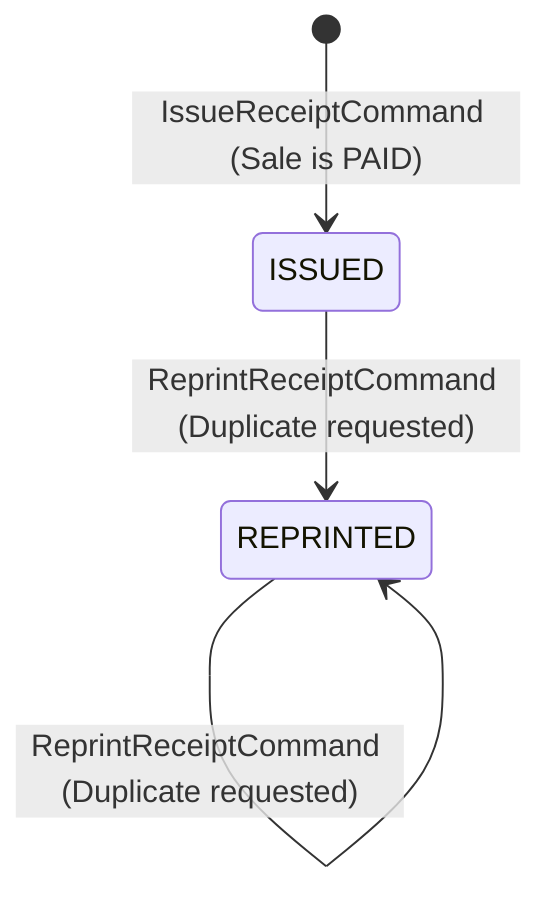

# Phase 7.7: Receipt Issuance Business Rules & Lifecycle Specification

- **Document**: `docs/domain/receipt-issuance-lifecycle.md`
- **Status**: Authoritative Business Rules & Lifecycle Specification (APPROVED FOR MILESTONE 7.7)
- **Role**: Senior Business Rules Engineer
- **Bounded Context**: Sales & Payments (`packages/core/src/sales/`)
- **Governing ADRs**:
  - [ADR-0108: Deterministic Financial Representation and Currency Modeling](../adr/0108-money-representation.md)
  - [ADR-0109: Payment Lifecycle, Multi-Tender Settlement, and Financial Immutability](../adr/0109-payment-lifecycle.md)
  - [ADR-0110: Sale Transaction Ownership and Source Bounded-Context Integrity](../adr/0110-sale-ownership.md)
  - [ADR-0111: Sales & Payments Authorization, Organization Isolation, and Audit Boundaries](../adr/0111-sales-payments-authorization-and-audit.md)
  - [ADR-0112: Sales & Payments Bounded Context Establishment](../adr/0112-sales-bounded-context.md)
  - [ADR-0114: Canonical Monetary Policy, Deterministic Arithmetic, and Sale Totals Invariant Enforcement](../adr/0114-canonical-monetary-policy-and-sale-totals.md)
  - [ADR-0115: Payment Domain Canonical Architecture, Aggregate Boundaries, and Tender Decoupling](../adr/0115-payment-domain-canonical-architecture.md)
  - [ADR-0116: Payment State Machine, Lifecycle Specification, and Financial Transition Determinism](../adr/0116-payment-state-machine-and-lifecycle-specification.md)
  - [ADR-0117: Receipt Domain Boundary, Document Model, and Legal Proof-of-Purchase Invariants](../adr/0117-receipt-domain-boundary-and-document-model.md)
- **Governing Business Rules**: [`docs/business-rules/sales-payments.md`](../business-rules/sales-payments.md)
- **Date**: 2026-09-24

---

## 1. Executive Summary & Design Mission

A `Receipt` is a customer-facing legal proof-of-purchase voucher evidencing an already settled commercial agreement.
Generic CRUD operations such as `UpdateReceipt` or mutable status setters like `setReceiptStatus()` are **strictly prohibited** by Kinergy architecture.

Receipt issuance follows an **explicit, controlled business lifecycle**:

1. It is initiated exclusively via explicit business commands: `IssueReceiptCommand` and `ReprintReceiptCommand`.
2. Issuance is governed by deterministic business rules verifying commercial settlement, tender completion, multi-tenant boundaries, and strict idempotency.
3. Once issued, a `Receipt` is permanently write-once. The only permitted operational state transition is recording duplicate reprints (`recordReprint()`).

---

## 2. Authoritative Business Lifecycle Matrix

| Rule ID         | Aspect / Decision                               | Authoritative Rule & Enforcement                                                                                                                                                                                                                                                           | Rejection / Action                                                                     |
| :-------------- | :---------------------------------------------- | :----------------------------------------------------------------------------------------------------------------------------------------------------------------------------------------------------------------------------------------------------------------------------------------- | :------------------------------------------------------------------------------------- |
| **REC-RULE-01** | **When a Receipt May Be Issued**                | A Receipt may be issued **exclusively** after the underlying `Sale` has achieved full financial settlement (status `PAID` or `COMPLETED`) with completed payments covering the full sale total.                                                                                            | Permitted and triggers immutable voucher generation.                                   |
| **REC-RULE-02** | **When Issuance Must Be Rejected**              | Issuance must be rejected if the Sale is unfinalized (`DRAFT`), awaiting tender (`PENDING_PAYMENT`), partially paid (`PARTIALLY_PAID`), or voided (`CANCELLED`); or if payments are underpaid, unsettled, failed, or cancelled.                                                            | Throws `ReceiptIssuanceRejectedException` / `ReceiptDomainException`.                  |
| **REC-RULE-03** | **Sale Must Be PAID**                           | **YES**. `sale.status === SaleStatus.PAID` (or `SaleStatus.COMPLETED`). A cart or pending invoice cannot be receipted.                                                                                                                                                                     | Rejected if status is `DRAFT`, `PENDING_PAYMENT`, `PARTIALLY_PAID`, or `CANCELLED`.    |
| **REC-RULE-04** | **Payment Must Be COMPLETED**                   | **YES**. All participating tenders evidencing the receipt must be in terminal `PaymentStatus.COMPLETED`. Pending or failed tenders cannot evidence proof-of-purchase.                                                                                                                      | Rejected if any tender is in `PENDING`, `FAILED`, or `CANCELLED`.                      |
| **REC-RULE-05** | **Payment Method Determination**                | For single-tender transactions, `receipt.paymentMethod` exposes the tender method (`CASH`, `QR`). For split-tenders, all methods are captured in `receipt.payments`; `receipt.paymentMethod` provides a convenience accessor for the primary tender.                                       | Determined deterministically from settled payment aggregate records.                   |
| **REC-RULE-06** | **Multiple Payments Representation**            | Supported seamlessly as an immutable array of `ReceiptPaymentSnapshot` VOs. The sum of settled payment amounts in minor integer units (cents) must equal or exceed the receipt payable total.                                                                                              | Validated in aggregate constructor: `totalSettledPaymentCents >= receipt.total.cents`. |
| **REC-RULE-07** | **Multiplicity: One Sale, One Primary Receipt** | One `Sale` maps to **at most ONE primary `Receipt`**. Generating multiple distinct receipt entities for the same sale is strictly forbidden.                                                                                                                                               | Database uniqueness on `(tenantId, saleId)`.                                           |
| **REC-RULE-08** | **Repeated Issuance (Idempotency)**             | Receipt creation is **STRICTLY IDEMPOTENT**. Repeated execution of `IssueReceiptCommand` for an already-receipted sale deterministically returns the existing receipt without creating a new entity or recalculating totals.                                                               | Idempotent return of existing `ReceiptDTO`.                                            |
| **REC-RULE-09** | **Cancelled Sale Handling**                     | A cancelled sale cannot be receipted. If a sale was cancelled before payment, receipt issuance is rejected.                                                                                                                                                                                | Throws `ReceiptIssuanceRejectedException`.                                             |
| **REC-RULE-10** | **Failed Payment Handling**                     | A failed payment (`PaymentStatus.FAILED`) cannot evidence proof-of-purchase.                                                                                                                                                                                                               | Throws `ReceiptIssuanceRejectedException`.                                             |
| **REC-RULE-11** | **Cancelled Payment Handling**                  | A cancelled payment (`PaymentStatus.CANCELLED`) cannot evidence proof-of-purchase.                                                                                                                                                                                                         | Throws `ReceiptIssuanceRejectedException`.                                             |
| **REC-RULE-12** | **Atomicity of Issuance**                       | The application command handler (`IssueReceiptHandler`) executes aggregate generation, atomic persistence to `ReceiptRepositoryPort`, and event publishing to `SalesEventPublisherPort` within a single transactional boundary.                                                            | Guarantees atomic generation without partial states.                                   |
| **REC-RULE-13** | **Reprint Mechanics**                           | Duplicate physical or digital customer copies are handled through `ReprintReceiptCommand`. The existing voucher is stamped with duplicate audit metadata: `reprintCount` is incremented by 1, and `lastReprintedAt` is updated to current clock time. Commercial data remains 100% frozen. | Emits `ReceiptReprintedEvent`.                                                         |

---

## 3. Invariant Protections (Non-Negotiable Boundaries)

1. **Receipt Issuance Must NOT Mutate Sale Totals**:
   - `sale.subtotal`, `sale.discountTotal`, and `sale.total` are read-only snapshot sources.
   - `IssueReceiptHandler` performs zero mutating operations on `Sale` monetary values.
2. **Receipt Issuance Must NOT Mutate SaleItem Prices or Quantities**:
   - Line items are read as pure sources for `ReceiptItemSnapshot.fromSaleItem()`.
   - No modifications to quantities, SKUs, or unit prices occur.
3. **Receipt Issuance Must NOT Mutate Discount Rules**:
   - Order-level and item-level discounts are captured as frozen line/order values.
   - No re-evaluation, expiration, or recalculation of discounts is triggered.
4. **Receipt Issuance Must NOT Bypass Payment Lifecycle Rules**:
   - Payments must achieve `COMPLETED` independently through the `PaymentLifecycleStateMachine`.
   - Receipt issuance does not force or transition payment states.
5. **Receipt Issuance Must NOT Introduce Accounting Behavior**:
   - Out of scope: General Ledger double-entry postings, VAT declaration reports, fiscal device protocols, revenue recognition schedules.

---

## 4. Application Commands & Lifecycle Transitions

### 4.1 `IssueReceiptCommand`

- **Port**: `ReceiptRepositoryPort.save(receipt)`
- **Preconditions**:
  - `Sale` exists and matches caller `tenantId`.
  - `sale.status === PAID || COMPLETED`.
  - `payments.filter(COMPLETED).sum >= sale.total`.
  - If already issued: returns existing `ReceiptDTO` (Idempotent).
- **Emitted Event**: `ReceiptIssuedEvent`

### 4.2 `ReprintReceiptCommand`

- **Port**: `ReceiptRepositoryPort.save(receipt)`
- **Preconditions**:
  - Caller possesses `receipts.manage` permission.
  - Receipt exists for given `receiptId` or `saleId`.
  - Matches caller `tenantId`.
- **Domain Action**: `receipt.recordReprint(clock)`
- **Emitted Event**: `ReceiptReprintedEvent`
