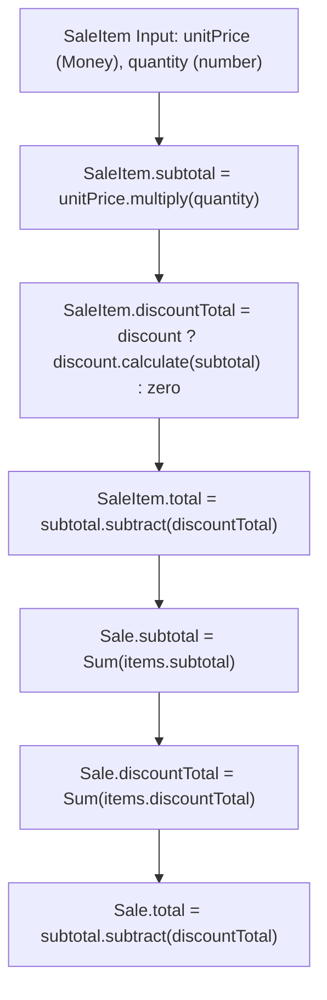

# Phase 7.4: Sale Totals Implementation & Financial Specification

- **Document**: `docs/domain/sale-totals-implementation.md`
- **Phase**: `7.4 — Sale Totals Calculation, Canonical Money Rules & Boundary Serialization`
- **Role**: Senior Financial Domain Architect / Lead Platform Engineer
- **Status**: **Authoritative Implemented Domain Specification**
- **Bounded Context**: Sales & Payments (`packages/core/src/sales/`)
- **Governing ADRs**:
  - [ADR-0108: Deterministic Financial Representation and Currency Modeling](../adr/0108-money-representation.md)
  - [ADR-0110: Sale Transaction Ownership and Source Bounded-Context Integrity](../adr/0110-sale-ownership.md)
  - [ADR-0112: Sales & Payments Bounded Context Establishment](../adr/0112-sales-bounded-context.md)
  - [ADR-0113: Item-Level Discount Domain Model, Deterministic Calculation, and Invariant Enforcement](../adr/0113-item-level-discounts.md)
  - [ADR-0114: Canonical Monetary Policy, Deterministic Arithmetic, and Sale Totals Invariant Enforcement](../adr/0114-canonical-monetary-policy-and-sale-totals.md)
- **Related Documentation**:
  - [`docs/architecture/sale-totals-and-money-rules.md`](../architecture/sale-totals-and-money-rules.md)
  - [`docs/architecture/sale-totals-acceptance.md`](../architecture/sale-totals-acceptance.md)
  - [`docs/domain/discount-implementation.md`](discount-implementation.md)
  - [`docs/domain/sale-item-implementation.md`](sale-item-implementation.md)
  - [`docs/business-rules/sales-payments.md`](../business-rules/sales-payments.md)
- **Date**: 2026-09-18

---

## 1. Executive Summary & Implementation Status

This specification defines the authoritative domain logic, persistence mappings, and API transport rules for **Milestone 7.4: Sale Totals Calculation, Canonical Money Rules & Boundary Serialization**.

Milestone 7.4 is **fully implemented and verified by automated regression test suites**:

1. **Domain Total Formulas**:
   $$\text{subtotal} = \sum (\text{item}.\text{quantity} \times \text{item}.\text{unitPrice})$$
   $$\text{discountTotal} = \sum (\text{valid line discounts})$$
   $$\text{total} = \text{subtotal} - \text{discountTotal}$$
2. **Strict Financial Invariants**: Non-negative amounts ($\text{subtotal} \ge 0, \text{discountTotal} \ge 0, \text{total} \ge 0$), discount capped at subtotal ($0 \le \text{discountTotal} \le \text{subtotal}$), and single currency homogeneity.
3. **Canonical Monetary Arithmetic**: Pure integer minor units (cents) with `Number.EPSILON` Commercial Half-Up rounding; complete elimination of IEEE-754 binary floating-point drift.
4. **Relational Persistence Isolation**: Bidirectional mapper maps `Money` to `Prisma.Decimal` and PostgreSQL `DECIMAL(12, 2)` without leaking Prisma into pure domain entities.
5. **Deterministic API Serialization**: Dual-mode exposure providing structured `{ amount, currency, formatted, cents }` and flat read models.
6. **Safety Net Verification**: 19 precision mathematical proofs and 4 static anti-pattern AST tests guarantee that floating-point operations cannot silently enter the codebase.

---

## 2. Canonical Monetary Contract & Rules

### 2.1 Domain Representation: `Money` Value Object

The platform represents all monetary amounts through the canonical `Money` Value Object (`packages/core/src/sales/domain/value-objects/money.vo.ts`):

- **Major Units (`amount: number`)**: Non-negative JavaScript number validated to at most 2 decimal places.
- **Currency (`currency: string`)**: Validated, normalized 3-letter uppercase ISO-4217 code.
- **Minor Units (`cents: number`)**: Internal integer minor units calculated deterministically via `Math.round((amount + Number.EPSILON) * 100)`.
- **Immutability**: Guaranteed via `Object.freeze(this)`.

### 2.2 Prohibited Operations

The following arithmetic patterns are **strictly banned** in domain and application logic:

- Binary floating-point arithmetic on monetary amounts (`a + b`, `a - b`, `a * b`).
- Using `parseFloat()` or `Number(money)` as calculation mechanisms.
- Calling `.toNumber()` on database decimals inside pure domain entities.
- Storing intermediate fractional cents (sub-cent values) in entities.

### 2.3 Precision & Rounding Hierarchy

- **Arithmetic Precision**: Fixed 2 decimal places (integer cents).
- **Rounding Mode**: Commercial Half-Up rounding (`Math.round(x + Number.EPSILON)`), halfway values ($0.005$) strictly round away from zero to $0.01$.
- **Quantity Precision**: Fractional quantities support up to 3 decimal places ($0.001$), normalized via `Math.round((quantity + Number.EPSILON) * 1000) / 1000`.
- **Database Precision**: PostgreSQL `@db.Decimal(12, 2)` (12 digits, 2 decimal scale, supporting up to $\$9,999,999,999.99$).

---

## 3. Aggregate Calculation Engine & Workflow

Financial calculations are owned strictly by domain entities and aggregate roots, never by controllers, services, or database queries.



### 3.1 Line Item Calculations (`SaleItem`)

1. **Item Subtotal**:
   ```ts
   const itemSubtotalCents = Math.round(
     Math.round((unitPrice.amount + Number.EPSILON) * 100) * quantity + Number.EPSILON,
   );
   const subtotal = Money.create(itemSubtotalCents / 100, currency);
   ```
2. **Item Discount**:
   - If no discount: `Money.zero(currency)`.
   - If fixed discount: verified that `discount.value <= subtotal.amount`, else throws `InvalidDiscountException`.
   - If percentage discount:
     ```ts
     const discountCents = Math.round((itemSubtotalCents * percentage) / 100 + Number.EPSILON);
     const discountTotal = Money.create(discountCents / 100, currency);
     ```
3. **Item Net Total**:
   ```ts
   const total = subtotal.subtract(discountTotal);
   ```

### 3.2 Aggregate Reconciliation (`Sale`)

`Sale.#recalculateTotals()` is invoked on every lifecycle mutation (`addItem`, `updateItemQuantity`, `applyItemDiscount`, `removeItemDiscount`, `removeItem`):

```ts
let subtotalCents = 0;
let discountTotalCents = 0;

for (const item of this._items) {
  subtotalCents += item.subtotal.cents;
  discountTotalCents += item.discountTotal.cents;
}

const totalCents = subtotalCents - discountTotalCents;

this._subtotal = Money.create(subtotalCents / 100, this._currency);
this._discountTotal = Money.create(discountTotalCents / 100, this._currency);
this._total = Money.create(totalCents / 100, this._currency);
```

Because all line subtotals and discounts are already rounded to exact integer cents, order aggregation is a pure integer sum and difference. **Zero repeated rounding, zero fractional leakage, and zero cumulative drift.**

---

## 4. Financial Invariants Matrix

| Invariant Rule                  | Mathematical Formulation                                                   | Enforcement Location                                | Consequence of Violation                                 |
| :------------------------------ | :------------------------------------------------------------------------- | :-------------------------------------------------- | :------------------------------------------------------- |
| **Non-Negative Subtotal**       | $\text{subtotal} \ge 0.00$                                                 | `SaleItem.create()`, `Sale.#recalculateTotals()`    | `InvalidMoneyException`                                  |
| **Non-Negative Discount Total** | $\text{discountTotal} \ge 0.00$                                            | `Discount.calculate()`, `Sale.#recalculateTotals()` | `InvalidMoneyException`                                  |
| **Non-Negative Total Payable**  | $\text{total} \ge 0.00$                                                    | `SaleItem.create()`, `Sale.#recalculateTotals()`    | `InvalidSaleStateException`                              |
| **Discount Capped at Subtotal** | $\text{discountTotal} \le \text{subtotal}$                                 | `Discount.calculate()`, `SaleItem.create()`         | `InvalidDiscountException` (no silent clamping)          |
| **Currency Homogeneity**        | $\forall i: \text{item}_{i}.\text{currency} = \text{sale}.\text{currency}$ | `Sale.addItem()`, `Money.add()`, `Money.subtract()` | `InvalidSaleStateException` / `InvalidMoneyException`    |
| **Reconstitution Identity**     | $\text{recomputedTotals} = \text{persistedTotals}$                         | `Sale.reconstitute()`, `SaleItem.reconstitute()`    | `InvalidSaleStateException` / `InvalidSaleItemException` |
| **Commercial Immutability**     | $\text{status} = \text{DRAFT}$ required for mutations                      | `Sale.assertDraftState()`                           | `SaleAlreadyFinalizedException`                          |

---

## 5. Discount Integration Semantics

### 5.1 Fixed Discounts

- **Definition**: Fixed absolute reduction in the item's currency (e.g. $\$10.00$ off).
- **Rule**: Fixed discount cannot exceed line subtotal.
- **Violation**: If $\text{fixedDiscount} > \text{subtotal}$, throws `InvalidDiscountException` (`FIXED_DISCOUNT_EXCEEDS_AMOUNT`). It is **never** silently clamped to the subtotal.

### 5.2 Percentage Discounts

- **Definition**: Relative percentage reduction ($0\% \le p \le 100\%$).
- **Calculation**: Multiplied against integer cent subtotal, rounded Commercial Half-Up.
- **Violation**: $p < 0$ or $p > 100$ throws `InvalidDiscountException` (`INVALID_PERCENTAGE`).

### 5.3 Multiple Line Discounts

- Each line item maintains its own optional `Discount`.
- When summing across an order, all valid line discounts are aggregated into `Sale.discountTotal`.
- Order-level order discounts remain deferred to avoid cross-line apportionment complexity.

---

## 6. Persistence & Relational Mapping Architecture

```text
Domain Money
     ↓
PrismaSaleMapper.toPersistence()
     ↓
Prisma.Decimal
     ↓
PostgreSQL NUMERIC/DECIMAL(12, 2)
```

and on rehydration:

```text
PostgreSQL NUMERIC/DECIMAL(12, 2)
     ↓
Prisma.Decimal
     ↓
PrismaSaleMapper.toDomain()
     ↓
Domain Money
```

- **Domain Isolation**: `packages/core/src/sales/domain` contains zero imports of `@prisma/client` or `Prisma.Decimal`.
- **Mapper**: `PrismaSaleMapper` converts `Money` into `new Prisma.Decimal(money.amount)` for persistence, and reads via `Money.create(raw.amount.toNumber(), raw.currency)`.
- **Integrity Validation**: Upon reconstitution, `Sale.reconstitute()` recalculates subtotal, discountTotal, and total from line items and asserts exact equality with persisted fields. If a direct SQL update or corruption altered totals by even $\$0.01$, reconstitution aborts with `InvalidSaleStateException`.

---

## 7. API Transport & Serialization Specification

### 7.1 Response Contract (`MoneyResponseDto`)

All monetary values in the Sales REST API are exposed using `MoneyResponseDto`:

```json
{
  "amount": 49.99,
  "currency": "USD",
  "formatted": "49.99",
  "cents": 4999
}
```

- `amount`: Fixed 2-decimal JavaScript number representing major currency units.
- `currency`: Normalized 3-letter ISO-4217 code.
- `formatted`: Fixed 2-decimal string (`"49.99"`) ensuring lossless representation for arbitrary-precision clients.
- `cents`: Integer minor units (`4999`) for payment gateway integration.

### 7.2 Flat Summary Read Models

For high-performance list queries and compact views, endpoints also expose flat scalar fields:

- `subtotalAmount: number` (e.g. `49.99`)
- `discountTotalAmount: number` (e.g. `10.00`)
- `totalAmount: number` (e.g. `39.99`)
- `currency: string` (e.g. `"USD"`)

---

## 8. Floating-Point Prohibition & Security Rationale

Binary floating-point arithmetic (IEEE-754) is prohibited for financial operations because binary representation cannot accurately represent base-10 fractional numbers:

| Base-10 Expression | IEEE-754 Binary Float Evaluation | Artifact / Hazard               |
| :----------------- | :------------------------------- | :------------------------------ |
| `0.1 + 0.2`        | `0.30000000000000004`            | Silent upward drift             |
| `0.7 + 0.1`        | `0.7999999999999999`             | Downward truncation to 79 cents |
| `1.00 - 0.90`      | `0.09999999999999998`            | 1-cent register shortage        |
| `0.29 * 100`       | `28.999999999999996`             | Downward truncation to 28 cents |
| `0.14 * 100`       | `14.000000000000002`             | Intermediate sub-cent leakage   |

In healthcare, wellness, and fitness billing:

1. **Fiscal Non-Compliance**: Mismatched invoice and tax records fail accounting audits.
2. **Payment Gateway Discrepancies**: Passing unrounded float numbers to gateways triggers transaction failures.
3. **Register Discrepancies**: Point-of-sale daily drawer reconciliations fail when phantom pennies accumulate.

---

## 9. Requirement-to-Test Traceability Matrix

```text
Requirement
    ↓
Domain Rule
    ↓
Use Case
    ↓
Persistence
    ↓
API
    ↓
Frontend Contract
    ↓
Test
```

| Requirement ID | Domain Rule                            | Use Case / Command                | Persistence Mapper          | API Transport DTO    | Automated Test Suite                     |
| :------------- | :------------------------------------- | :-------------------------------- | :-------------------------- | :------------------- | :--------------------------------------- |
| **REQ-7.4-01** | Mathematical Totals Formula            | `AddSaleItemHandler`              | `PrismaSaleMapper`          | `SaleResponseDto`    | `sale-application-totals.spec.ts`        |
| **REQ-7.4-02** | Zero Float Drift (Integer Cents)       | `Money.add()`, `Money.subtract()` | PostgreSQL `DECIMAL(12, 2)` | `MoneyResponseDto`   | `monetary-precision-safety-net.spec.ts`  |
| **REQ-7.4-03** | Commercial Half-Up Rounding            | `Discount.calculate()`            | Scale 2 columns             | `formatted` string   | `monetary-precision-safety-net.spec.ts`  |
| **REQ-7.4-04** | Non-Negative Invariants ($\ge \$0.00$) | `Sale.#recalculateTotals()`       | Check constraints           | `@Min(0)` validation | `sale-discount-invariants.spec.ts`       |
| **REQ-7.4-05** | Excessive Discount Rejection           | `SaleItem.create()`               | N/A (Transaction aborts)    | `400 Bad Request`    | `phase-7-3-discount-test-matrix.spec.ts` |
| **REQ-7.4-06** | Currency Homogeneity                   | `Sale.addItem()`                  | Single currency col         | ISO-4217 validation  | `monetary-precision-safety-net.spec.ts`  |
| **REQ-7.4-07** | Domain Purity Boundary                 | Hexagonal Domain Kernel           | Explicit mapper layer       | Decoupled DTOs       | `sales-monetary-anti-patterns.spec.ts`   |
| **REQ-7.4-08** | Reconstitution 1-Cent Integrity        | `Sale.reconstitute()`             | `toDomain()`                | Error 500 on drift   | `monetary-precision-safety-net.spec.ts`  |
| **REQ-7.4-09** | Commercial Locking on Finalize         | `FinalizeSaleHandler`             | Frozen records              | Read-only view       | `sale-hardening.spec.ts`                 |
