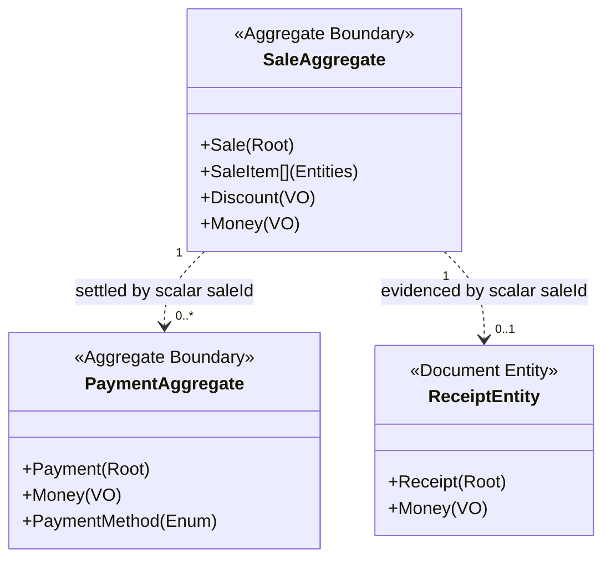
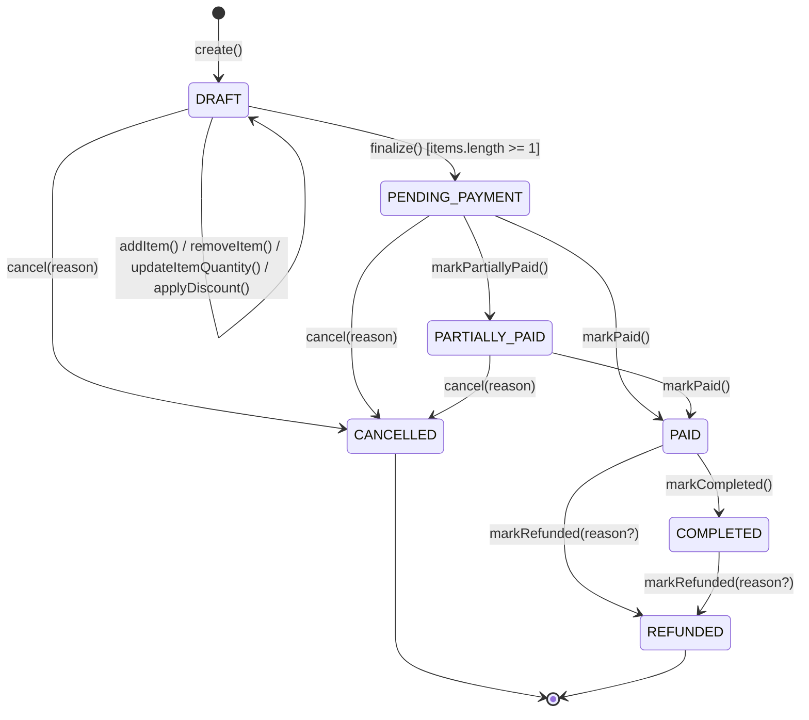
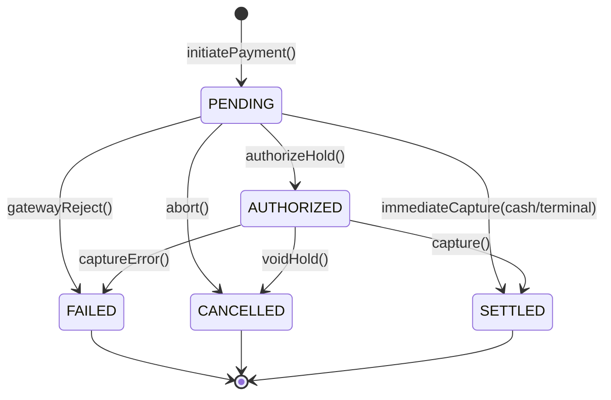
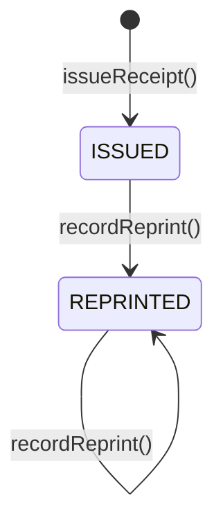
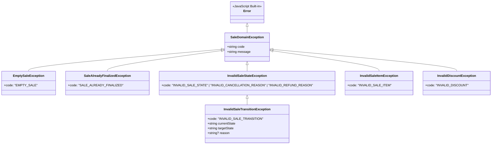

# Phase 7: Sales & Payments — Conceptual Domain Model Specification

- **Document**: `docs/domain/sales-payments.md`
- **Status**: Authoritative Domain Source of Truth
- **Milestone**: Phase 7.1 — Sale Domain Implementation & Invariant Synchronization
- **Role**: Principal Domain Designer / Staff Platform Architect
- **Date**: 2026-09-17

---

## 1. Executive Summary & Context

This document establishes the authoritative conceptual domain model for **Phase 7: Sales & Payments** of the Kinergy platform.

Following the core architectural law established in [`docs/architecture/sales-payments.md`](file:///c:/Projects/kinergy-platform/docs/architecture/sales-payments.md):

> **"References Over Ownership."**  
> The Sales & Payments domain models commercial agreements, customer checkout sessions, monetary tender collections, and receipt vouchers. It never takes ownership of the products, subscriptions, medical records, or clients that participate in those transactions.

This specification defines the ubiquitous domain language, aggregate boundaries, entity lifecycles, value objects, state machines, non-negotiable invariants, and business traceability before any production code is written.

---

## 2. Ubiquitous Language & Core Concepts

```
┌──────────────────────────────────────────────────────────────────────────────┐
│                    SALES & PAYMENTS UBIQUITOUS VOCABULARY                    │
│                                                                              │
│  Sale             The commercial transaction aggregate root representing a    │
│                   purchase agreement between Kinergy and a customer.         │
│                                                                              │
│  SaleItem         An internal line-item entity within a Sale capturing an     │
│                   immutable snapshot of what was purchased and at what price.│
│                                                                              │
│  Payment          An autonomous aggregate root representing a financial       │
│                   monetary tender transaction settling part or all of a Sale.│
│                                                                              │
│  Receipt          An immutable proof-of-purchase document voucher issued to   │
│                   the customer upon financial settlement.                    │
│                                                                              │
│  SourceReference  An immutable Value Object identifying the origin entity    │
│                   (e.g., inventory item, membership plan, treatment session).│
│                                                                              │
│  Money            A canonical Value Object representing a non-negative       │
│                   monetary amount with an explicit ISO-4217 currency.        │
│                                                                              │
│  Discount         An immutable Value Object representing a fixed-amount or   │
│                   percentage price reduction justified by a business reason. │
│                                                                              │
│  TaxRate          A Value Object representing an applicable sales/VAT levy.  │
│                                                                              │
│  PaymentMethod    An enumeration of accepted tender mechanisms (CASH, CARD,  │
│                   TRANSFER, WALLET, ACCOUNT_CREDIT).                         │
└──────────────────────────────────────────────────────────────────────────────┘
```

---

## 3. Domain Entity & Aggregate Specifications

### 3.1 `Sale` (Aggregate Root)

#### Purpose

`Sale` is the aggregate root governing the commercial agreement between the wellness facility and a customer. It orchestrates the addition, modification, and removal of line items, applies discounts, computes taxable amounts, tracks the remaining balance, and enforces commercial lifecycle state transitions.

#### Identity & Multi-Tenancy

- **`id: SaleId`**: Canonical Value Object uniquely identifying the sale within the platform (`SaleId.create()` or `SaleId.fromString()`).
- **`tenantId?: string`**: Organization boundary. An unconstrained scalar string identifying the tenant; cross-tenant operations are strictly forbidden. Optional during domain instantiation, strictly enforced at application/repository boundaries.
- **`clientId?: string`**: Optional reference to a registered Client (Phase 2). Omitting `clientId` models an anonymous front-desk walk-in retail purchase without CRM pollution.
- **`currency: string`**: Normalized 3-letter uppercase ISO-4217 standard currency code (e.g. `"USD"`, `"CAD"`).
- **`source: SourceReference`**: Value Object establishing the loose commercial origin (`sourceType`, `sourceId`, `sourceCode?`).
- **`status: SaleStatus`**: 7 canonical lifecycle states (`DRAFT`, `PENDING_PAYMENT`, `PARTIALLY_PAID`, `PAID`, `COMPLETED`, `CANCELLED`, `REFUNDED`).
- **`version: number`**: Integer counter ($\ge 1$) for Optimistic Concurrency Control (OCC), incremented on every lifecycle transition.
- **Actor Attribution**: Note that authenticated staff attribution (`cashierId`) is supplied to application command handlers and captured in domain events (`SaleCreatedEvent`, etc.) rather than stored as an internal state field of the aggregate root itself.

#### Aggregate Root Responsibility & Encapsulation

`Sale` is the **sole gateway** for mutating order state. External consumers cannot manipulate `SaleItem` entities directly; all line item additions, quantity adjustments, and discount evaluations must execute through methods on `Sale`:

- **Line Item Mutations**: `addItem(props, clock?)`, `updateItemQuantity(itemId, qty, clock?)`, `removeItem(itemId, clock?)`
- **Discounts**: `applyItemDiscount(itemId, discount, clock?)`, `removeItemDiscount(itemId, clock?)`, `applyOrderDiscount(discount, clock?)`, `removeOrderDiscount(clock?)`
- **Lifecycle Transitions**: `finalize(clock?)`, `markPartiallyPaid(clock?)`, `markPaid(clock?)`, `markCompleted(clock?)`, `markRefunded(reason?, clock?)`, `cancel(reason, clock?)`
- **Event Sourcing / Outbox**: `getUncommittedEvents()`, `clearEvents()`
- **Collection Safety & Defensive Copies**: The `items` getter returns `ReadonlyArray<SaleItem>` backed by `Object.freeze([...this._items])`. Mutating the returned array fails at runtime without affecting the aggregate's internal state. Date getters return defensive clones (`new Date(time)`).

#### Invariants Enforced by `Sale`

1. **Empty Order Prohibition**: A sale cannot transition out of `DRAFT` to `PENDING_PAYMENT` with zero items (`Sale.finalize()` throws `EmptySaleException` with code `'EMPTY_SALE'`).
2. **Monetary Non-Negativity**: The net total payable amount (`total`) must always be $\ge 0.00$. Line and order discounts are capped at the corresponding subtotal.
3. **Currency Homogeneity**: Every `SaleItem`, order discount, subtotal, and total within a `Sale` must share the identical ISO-4217 currency. Attempting to add an item with a mismatched currency throws `InvalidSaleStateException`.
4. **Commercial Locking**: Once a `Sale` departs `DRAFT` (into `PENDING_PAYMENT`, `PARTIALLY_PAID`, `PAID`, `COMPLETED`, `CANCELLED`, or `REFUNDED`), cart mutations (`addItem`, `removeItem`, `updateItemQuantity`, discounts) throw `SaleAlreadyFinalizedException` with code `'SALE_ALREADY_FINALIZED'`.
5. **Deterministic Reconciliation Invariant**:
   $$\text{Subtotal} = \sum (\text{SaleItem.subtotal})$$
   $$\text{TotalLineDiscounts} = \sum (\text{SaleItem.discountTotal})$$
   $$\text{NetPreOrderDiscount} = \text{Subtotal} - \text{TotalLineDiscounts}$$
   $$\text{OrderDiscountAmount} = \min(\text{NetPreOrderDiscount}, \text{orderDiscount.calculateReduction}(\text{NetPreOrderDiscount}))$$
   $$\text{DiscountTotal} = \text{TotalLineDiscounts} + \text{OrderDiscountAmount}$$
   $$\text{Total} = \max(0, \text{Subtotal} - \text{DiscountTotal})$$
6. **Cancellation Reason Invariant**: A sale can only be cancelled from `DRAFT`, `PENDING_PAYMENT`, or `PARTIALLY_PAID` and requires a non-empty `cancellationReason` string (`InvalidSaleStateException` with code `'INVALID_CANCELLATION_REASON'`).

#### Field Mutability Classification

- **Permanently Immutable (set at creation)**: `id`, `tenantId`, `currency`, `source`, `createdAt`.
- **Conditionally Mutable (only while `status == DRAFT`)**: `clientId`, `items`, `orderDiscount`.
- **Lifecycle Mutable (via explicit domain methods)**: `status`, `completedAt`, `cancelledAt`, `cancellationReason`, `refundedAt`, `version`, `updatedAt`.

---

### 3.2 `SaleItem` (Internal Entity)

#### Ownership & Aggregate Control

`SaleItem` is an **internal child entity** exclusively owned by the `Sale` aggregate root. It has no independent global identity, no standalone repository, and cannot be created, queried, or modified directly by external callers. The parent `Sale` aggregate root controls the entire lifecycle:

- Adding: `sale.addItem(props, clock?)`
- Modifying Quantity: `sale.updateItemQuantity(itemId, newQty, clock?)`
- Applying Discount: `sale.applyItemDiscount(itemId, discount, clock?)`
- Removing Discount: `sale.removeItemDiscount(itemId, clock?)`
- Removing Item: `sale.removeItem(itemId, clock?)`
- Querying: `sale.getItem(itemId)`, `sale.hasItem(itemId)`, `sale.itemCount`, and `sale.items` (frozen defensive array)

#### Historical Commercial Snapshot Principle

> [!IMPORTANT]
> **Historical Commercial Snapshot Law**:  
> A `SaleItem` represents what was commercially agreed upon and sold at the exact point in time of checkout.  
> The source catalog entity (e.g. `InventoryItem`, `MembershipPlan`, `TreatmentSession`) represents current operational catalog state.  
> Under no circumstance may a `SaleItem` dynamically query or re-read current catalog prices, descriptions, or availability from upstream source tables at runtime.

If a catalog product is repriced, renamed, discontinued, or archived, historical `SaleItem` records remain permanently frozen and valid.

#### Detailed Attributes & Semantics

- **`id: SaleItemId`**: Canonical Value Object uniquely identifying the line item locally within the sale.
- **`source: SourceReference`**: Value Object capturing origin entity (`sourceType`, `sourceId`, `sourceCode?`). Identifies the commercial origin without creating foreign keys or taking domain ownership.
- **`description: string`**: Non-empty, trimmed text snapshot of the purchased good or service at checkout. Subsequent catalog renaming does not alter this historical text.
- **`skuOrCode: string | null`**: Snapshot of the catalog SKU, plan code, or billing code at checkout.
- **`quantity: number`**: Finite, strictly positive number ($> 0$).
  - **Minimum Quantity**: `0.001` (values strictly $< 0.0005$ round down to `0` and throw `InvalidSaleItemException`).
  - **Maximum Quantity**: `999,999` (`SaleItem.MAX_QUANTITY`). Values exceeding this limit are deterministically rejected.
  - **Normalization**: Normalized to 3 decimal places (`Math.round((quantity + Number.EPSILON) * 1000) / 1000`), supporting both discrete integers and bulk/weighted goods.
  - **Rejections**: Zero, negative values, `NaN`, non-finite numbers, and values rounding to zero throw `InvalidSaleItemException`.
- **`unitPrice: Money`**: Canonical `Money` Value Object representing the agreed gross commercial price at checkout:
  - **Non-Negativity**: Must be $\ge 0.00$.
  - **Promotional / Complimentary Items**: Supported at `$0.00`.
  - **Negative Values**: Strictly rejected by `Money` and `SaleItem` invariants.
  - **No Dynamic Recalculation**: Once established, unit price is never refreshed from the source catalog.
- **`discount: Discount | null`**: Canonical `Discount` Value Object representing line-item reductions:
  - **Allowed Types**: `PERCENTAGE` ($0\%$ to $100\%$) or `FIXED_AMOUNT` ($\ge \$0.00$).
  - **Mandatory Audit Reason**: Non-empty trimmed string explaining the commercial justification.
  - **Cent Rounding**: Commercial Half-Up rounding in integer minor units.
  - **Ceiling / Cap**: Capped at line subtotal ($\min(\text{subtotal}, \text{calcReduction})$), guaranteeing that line net total is always $\ge \$0.00$.
  - **Zero Behavior**: $0\%$ or $\$0.00$ produces $\$0.00$ reduction and leaves net total identical to subtotal.
  - **Rejections**: Negative discounts, percentages $> 100\%$, and blank reason strings are rejected.
- **`subtotal: Money`** (alias: `lineSubtotal`): $\text{unitPrice.multiply(normalizedQuantity)}$, calculated via canonical `Money` with Half-Up cent rounding.
- **`discountTotal: Money`** (alias: `lineDiscountTotal`): $\min(\text{subtotal}, \text{discount.calculateReduction(subtotal)})$.
- **`total: Money`** (alias: `lineTotal`): $\text{subtotal.subtract(discountTotal)}$, guaranteed $\ge \$0.00$.

#### Immutability Milestones

1. **Creation & Cart Phase (`status == DRAFT`)**:
   - `description`, `skuOrCode`, `unitPrice`, and `source` are immutable snapshots established at insertion.
   - `quantity` and `discount` are conditionally mutable, but **only** via `Sale` aggregate root methods (`updateItemQuantity`, `applyItemDiscount`, `removeItemDiscount`).
   - `SaleItem` instances are frozen with `Object.freeze(this)`. Updates return replacement instances preserving entity identity.
2. **Finalization Milestone (`status != DRAFT`)**:
   - Once the parent `Sale` is finalized (`PENDING_PAYMENT`, `PARTIALLY_PAID`, `PAID`, `COMPLETED`, `CANCELLED`, `REFUNDED`), **all commercial terms are locked**.
   - Any attempt to add, remove, or modify items throws `SaleAlreadyFinalizedException`.
   - Historical item values and aggregate totals remain permanently immutable.

#### Historical Snapshot Traceability Matrix

The following end-to-end traceability chain connects high-level requirements to executable regression tests:

```text
Requirement: REQ-HIST-01 (Historical Commercial Truth)
    ↓
Business Rules: SALE-08 (Commercial Lock), ITEM-04 (Permanent Snapshot), ITEM-09 (Post-Finalization Freeze)
    ↓
SaleItem Invariants: ITEM-01 (Ownership), ITEM-02 (Quantity), ITEM-03 (Price), ITEM-07 (Discount Cap)
    ↓
Domain Implementation:
  - packages/core/src/sales/domain/sale.aggregate.ts
  - packages/core/src/sales/domain/entities/sale-item.entity.ts
  - packages/core/src/sales/domain/value-objects/source-reference.vo.ts
    ↓
Executable Test Suites:
  - packages/core/src/sales/domain/__tests__/sale-item-historical-snapshot.spec.ts (Scenarios 1–8)
  - packages/core/src/sales/domain/__tests__/sale-item-integration.spec.ts
  - packages/core/src/sales/domain/__tests__/sale-item.entity.spec.ts
```

| Step in Traceability  | Artifact / Identifier                   | Verified Behavior                                                                                                                                                       |
| :-------------------- | :-------------------------------------- | :---------------------------------------------------------------------------------------------------------------------------------------------------------------------- |
| **Requirement**       | `REQ-HIST-01`                           | Commercial transactions must preserve point-in-time checkout values regardless of source changes.                                                                       |
| **Business Rule**     | `SALE-08`, `ITEM-04`, `ITEM-09`         | Commercial terms freeze at checkout; dynamic joins to source catalog tables are forbidden.                                                                              |
| **Domain Rule**       | `ITEM-01` through `ITEM-09`             | Subtotal, discount capping, quantity bounds ($0.001$ to $999,999$), non-negative price, and unowned source reference.                                                   |
| **Implementation**    | `Sale`, `SaleItem`, `SourceReference`   | Immutable frozen value objects and entities; arithmetic via integer minor units; aggregate root gatekeeping.                                                            |
| **Verification Test** | `sale-item-historical-snapshot.spec.ts` | 8 dedicated regression scenarios: Price Change, Description Change, Status Change, Deletion/Archival, Finalized Sale, Encapsulation, Reconciliation, Failure Atomicity. |

---

### 3.3 `Payment` (Autonomous Aggregate Root)

#### Identity & Multi-Tenancy

- **`id: PaymentId`**: Canonical UUID uniquely identifying the financial transaction.
- **`tenantId: TenantId`**: Enforces organization-level isolation.
- **`saleId: SaleId`**: Unconstrained scalar reference to the `Sale` being settled.
- **`amount: Money`**: Monetary amount of this specific tender transaction ($> 0$).
- **`method: PaymentMethod`**: The tender mechanism (`CASH`, `CARD`, `QR_CODE`, `BANK_TRANSFER`, `DIGITAL_WALLET`).
- **`status: PaymentStatus`**: Lifecycle state (`PENDING`, `AUTHORIZED`, `SETTLED`, `FAILED`, `CANCELLED`).
- **`externalProviderState?: ExternalProviderState`**: Isolated Value Object encapsulating raw third-party gateway identifiers and payloads.
- **`cashierId: UserId`**: Identity of staff member recording or operating the tender.
- **`initiatedAt: DateTime`**: Timestamp of payment initiation.
- **`settledAt?: DateTime`**: Timestamp when funds were verified and permanently locked.

#### Decoupled Triad: Method vs. Status vs. External State

To prevent third-party gateway leakage, the domain strictly separates:

1. **`PaymentMethod` (Domain Enum)**: The commercial classification of tender (`CASH`, `CARD`, `QR_CODE`, `BANK_TRANSFER`, `DIGITAL_WALLET`).
2. **`PaymentStatus` (Internal State Machine)**: Internal business and accounting lifecycle (`PENDING`, `AUTHORIZED`, `SETTLED`, `FAILED`, `CANCELLED`).
3. **`ExternalProviderState` (Isolated Value Object)**: Third-party processor attributes (`provider: 'STRIPE' | 'TERMINAL' | 'MANUAL'`, `externalTransactionId`, `rawGatewayStatus`, `authorizationCode`). The core domain never evaluates raw provider statuses directly; adapters translate them at boundary ports.

#### Multi-Tender & Partial Payment Settlement

The domain explicitly supports **1-to-many payments per sale** (`Sale 1 -> 0..* Payment`):

1. **Split Tenders**: A customer paying a $100 bill with $40 Cash and $60 Credit Card produces two distinct `Payment` aggregates linked to the same `saleId`.
2. **Partial Deposits & Underpayment**:
   - A customer placing a $30 deposit on a $100 treatment plan generates a $30 settled payment.
   - `Sale.balanceRemaining` decrements to $70.00, placing the sale in `PARTIALLY_PAID`.
   - **Fulfillment Guard**: Underpayment is allowed during checkout, but the `Sale` **CANNOT** transition to `PAID` or `COMPLETED` until $\text{balanceRemaining} == 0$.
3. **Overpayment & Cash Change Handling**:
   - **Electronic Tenders (Card, QR, Transfer)**: Overpayment is strictly forbidden. The system will reject any electronic payment where $\text{amount} > \text{Sale.balanceRemaining}$.
   - **Cash Tenders**: If a customer pays with a larger denomination (e.g., $100 bill on a $75.50 balance), `Payment.amount` is recorded as the exact debt-settling amount ($75.50). The front-end POS records `tenderedAmount` ($100.00) and `changeGiven` ($24.50) for cash drawer balancing. The sale balance never drops below zero.

#### Refund Conceptual Architecture: Append-Only Compensating Records

- **No In-Place Mutation**: Settled payments are **permanently immutable**. A settled payment record is never edited, deleted, or transitioned to `REFUNDED`. In-place mutations violate double-entry bookkeeping and corrupt historical cash drawer reconciliations.
- **Compensating Transactions**: A refund is an autonomous compensating financial record (`PaymentRefund` or `Payment` with direction `REFUND`) referencing `originalPaymentId` and `saleId`, containing a positive scalar refund amount ($\le \text{originalPayment.amount}$), mandatory business justification, and `authorizedByUserId`.
- **Phase 7 Scope**: Phase 7.0 establishes this append-only data contract. Full automated external gateway refund dispatch (e.g. Stripe refund API execution) is scheduled for Phase 7.x extension.

---

### 3.4 `Receipt` (Autonomous Document Entity)

#### Nature of a Receipt: Proof vs. Financial Truth

> [!NOTE]
> **Is a Receipt a Financial Source of Truth?**  
> **No.** A `Receipt` is **NOT** the financial source of truth.  
> The financial truth is authoritatively governed by the `Sale` and `Payment` aggregates.  
> A `Receipt` is an **immutable, customer-facing legal voucher** that represents and evidences an already-settled financial transaction.

#### Generation, Immutability & Reprint Rules

1. **Generation Trigger**: Automatically generated once a `Sale` reaches `PAID` status (or upon recording an official partial deposit).
2. **No Regeneration**: Once issued, a receipt cannot be regenerated with a new identifier or altered financial data.
3. **No Deletion**: Deletion is prohibited by database foreign key constraints and audit policies.
4. **Reprint Behavior**: Customer reprint requests do **not** create a new receipt entity. The system re-renders the frozen receipt snapshot stamped with a mandatory `DUPLICATE / REPRINT` watermark, logging the reprint timestamp and operator in technical audit logs.
5. **Refund Representation**: When a sale is refunded, the original receipt remains frozen. A separate `CreditNote` or `RefundVoucher` is issued to document the reversal.

---

### 3.5 `SourceReference` (Value Object) & Source Analysis

#### Structure & Semantics

`SourceReference` is an immutable Value Object identifying what generated the charge:

```
SourceReference
├── sourceType: SourceType (INVENTORY_ITEM | MEMBERSHIP_PLAN | TREATMENT_SESSION | CUSTOM_SERVICE)
├── sourceId: string (Scalar UUID or "CUSTOM")
└── sourceCode?: string (Optional human-readable SKU or business identifier)
```

#### Detailed Source-by-Source Domain Matrix

| Source Type                                                 | 1. Source Owner                     | 2. Sales Responsibility                                                                   | 3. Source Reference                                                               |                                  4. Validates Existence?                                  |                                                  5. May Mutate Source?                                                   |                                        6. Can Source Be Deleted After Sale?                                        | 7. What If Source Changes Later?                                                                                                          |
| :---------------------------------------------------------- | :---------------------------------- | :---------------------------------------------------------------------------------------- | :-------------------------------------------------------------------------------- | :---------------------------------------------------------------------------------------: | :----------------------------------------------------------------------------------------------------------------------: | :----------------------------------------------------------------------------------------------------------------: | :---------------------------------------------------------------------------------------------------------------------------------------- |
| **1. `TreatmentSession`**                                   | **Kinesiology (Phase 4)**           | Records billing of the clinical session; collects patient/client payment; issues receipt. | `sourceType: TREATMENT_SESSION`<br>`sourceId: treatmentSessionId`                 | **Yes**, queries treatment query port; verifies session exists and is completed/billable. |   **No**, Sales invokes `TreatmentBillingPort.markSessionBilled()` upon settlement. Sales never touches medical notes.   | **No**, clinical sessions are immutable legal medical records. Medico-legal retention protects them from deletion. | `SaleItem` retains its frozen price/service snapshot. If the clinical note is amended, the commercial billing amount does **not** change. |
| **2. `Gym Membership / Plan`**                              | **Gym Management (Phase 5)**        | Collects membership subscription or renewal fee; issues receipt.                          | `sourceType: MEMBERSHIP_PLAN`<br>`sourceId: membershipPlanId`                     |               **Yes**, queries plan query port; verifies plan is `ACTIVE`.                |   **No**, Sales invokes `GymMembershipActivationPort` to activate/renew. Sales never mutates validity dates directly.    |       **No**, plans with historical memberships/sales are `ARCHIVED`, never hard-deleted from the database.        | `SaleItem` retains the frozen plan price at checkout. If the gym administrator raises the plan price next week, past sales remain frozen. |
| **3. `Healthy Meal`**                                       | **Resources (Phase 6 Consumables)** | Sells meal at POS/kitchen; collects payment; requests inventory depletion.                | `sourceType: INVENTORY_ITEM`<br>`sourceId: inventoryItemId`<br>`sourceCode: SKU`  |  **Yes**, queries inventory query port; checks active item and available stock on hand.   | **No**, Sales invokes `InventoryStockDecrementPort.sellStock()`. Sales never writes to `inventory_items.quantityOnHand`. |    **No**, inventory items with transaction history are `ARCHIVED` (soft-delete), never hard-deleted from SQL.     | `SaleItem` retains frozen meal description and price. If kitchen updates recipe cost or retail price, past sales remain frozen.           |
| **4. `Healthy Drink`**                                      | **Resources (Phase 6 Consumables)** | Sells beverage at reception/bar; collects payment; requests stock deduction.              | `sourceType: INVENTORY_ITEM`<br>`sourceId: inventoryItemId`<br>`sourceCode: SKU`  |      **Yes**, checks item status and verifies `quantityOnHand >= requestedQuantity`.      |    **No**, Sales requests deduction via capability port. Resources verifies OCC and logs append-only `SALE` movement.    |      **No**, protected by relational integrity in Resources. Deletion blocked if historical movements exist.       | `SaleItem` retains frozen drink description and price. Historical inventory valuation and accounting remain intact.                       |
| **5. Future Sellable Service** (e.g. Room Rental, Workshop) | **Scheduling / Facility Context**   | Assembles service fee; collects payment; confirms booking reservation.                    | `sourceType: CUSTOM_SERVICE`<br>`sourceId: serviceOrRoomId`                       |                 **Yes**, verifies room/amenity reservation availability.                  |                                **No**, invokes scheduling port to confirm booked window.                                 |                               **No**, reservation records remain archived for audit.                               | Commercial terms remain frozen in `SaleItem`. Future price tier changes do not affect historical rentals.                                 |
| **6. Future Sellable Product** (e.g. Branded Apparel, Gear) | **Resources / Retail Catalog**      | Point-of-sale checkout; collects tender; coordinates stock deduction.                     | `sourceType: INVENTORY_ITEM`<br>`sourceId: retailItemId`<br>`sourceCode: Barcode` |                        **Yes**, verifies stock and active status.                         |                               **No**, delegates stock mutation strictly to inventory port.                               |                            **No**, retail items with sales movements are soft-archived.                            | Price and tax rate frozen in `SaleItem` remain immutable forever.                                                                         |

---

### 3.6 `Money` (Canonical Shared Kernel Value Object)

In accordance with Phase 6 architectural standards, ADR-0098, and ADR-0108:

- **Mathematical Determinism**: Binary floating-point arithmetic (IEEE 754 `number`) is strictly prohibited for monetary calculations.
- **`amount: number`**: Represents major currency units (e.g. `$49.99`). Must be a finite, non-negative number ($0 \le \text{amount} < \infty$).
- **Precision & Scale**: Fixed scale of **2 decimal places** (integer cents / hundredths). Precision is enforced at instantiation:
  $$\text{amount} = \frac{\text{round}(\text{amount} \times 100)}{100}$$
- **`currency: string`**: Normalized 3-letter uppercase ISO-4217 standard currency code (e.g., `USD`, `CAD`, `EUR`). Default: `USD`.
- **Arithmetic Rules (Guaranteed Cent-Integer Math)**:
  - `add(other: Money)`: Requires identical currencies; computes $\frac{\text{round}(a \times 100) + \text{round}(b \times 100)}{100}$. Returns new `Money`.
  - `subtract(other: Money)`: Requires identical currencies; computes $\frac{\text{round}(a \times 100) - \text{round}(b \times 100)}{100}$. Throws `InvalidMoneyException` if result $< 0$.
  - `multiply(factor: number)`: Factor must be finite and $\ge 0$; computes $\frac{\text{round}(a \times 100 \times \text{factor})}{100}$. Returns new `Money`.
  - `isZero()`: Returns `true` if $\text{amount} === 0$.
- **Comparison Methods**:
  - `equals(other: Money)`: `this.currency === other.currency && this.amount === other.amount`.
  - `greaterThan(other: Money)`: Guarded currency check; `this.amount > other.amount`.
  - `greaterThanOrEqual(other: Money)`: Guarded currency check; `this.amount >= other.amount`.
  - `lessThan(other: Money)`: Guarded currency check; `this.amount < other.amount`.
  - `lessThanOrEqual(other: Money)`: Guarded currency check; `this.amount <= other.amount`.
- **Zero & Negative Values**:
  - Zero is instantiated via `Money.zero(currency)`.
  - Negative values are **strictly forbidden** in domain aggregates and throw `InvalidMoneyException`. Refunds and reversals are modeled as discrete compensating transactions, never as negative price quantities.
- **Persistence Representation (PostgreSQL / Prisma)**:
  - Stored as `Decimal @db.Decimal(12, 2)` alongside `currency String @db.VarChar(3)`.
  - Supports balances up to `$9,999,999,999.99` with zero decimal drift.
  - Repositories map bidirectional: `Money.create(Number(raw.amount), raw.currency)` and `new Prisma.Decimal(money.amount)`.
- **API Representation**:
  - Serialized as structured JSON object: `{ "amount": 49.99, "currency": "USD" }`.
- **Payment Gateway Conversion**:
  - External adapters convert deterministically:
    $$\text{amountInCents} = \text{round}(\text{money.amount} \times 100)$$
    $$\text{money} = \text{Money.create}\left(\frac{\text{cents}}{100}, \text{currency}\right)$$

---

### 3.7 `Discount` (Value Object)

#### Semantics & Types

```
Discount
├── type: DiscountType (FIXED_AMOUNT | PERCENTAGE)
├── value: number (Finite positive number)
├── reason: string (Mandatory business justification)
└── authorizedByUserId?: string (Required for overrides)
```

#### Deterministic Invariants & Rules

1. **Percentage Boundaries**: If `type == PERCENTAGE`, $0 < \text{value} \le 100$ with scale up to 2 decimal places (e.g. `12.5%`). A 100% discount reduces the balance to zero (complimentary item/service).
2. **Fixed Amount Boundaries**: If `type == FIXED_AMOUNT`, value must be $> 0$ in the sale's functional currency.
3. **Cap at Subtotal (Non-Negative Guard)**:
   - A discount can **never exceed the subtotal** to which it applies.
   - If a fixed discount of $50.00 is applied to a $35.00 item, the reduction is capped at $35.00. The net line total is $0.00; it never becomes negative.
4. **Rounding Policy**:
   - Percentage discounts round half-up at the cent boundary:
     $$\text{reductionAmount} = \frac{\text{round}\left(\text{subtotal} \times \frac{\text{percentage}}{100} \times 100\right)}{100}$$
5. **Hierarchy & Precedence**:
   - **Level 1 (Item-Level Discounts)**: Evaluated first against individual line item gross subtotals ($\text{quantity} \times \text{unitPrice}$).
   - **Level 2 (Order-Level Discount)**: Evaluated second against the net sum of all discounted line items.
6. **Mandatory Justification**:
   - Every discount requires a non-empty `reason` string (e.g., `"Seasonal Clinic Promo"`, `"Damaged outer seal"`, `"VIP Staff Benefit"`). Discretionary discounts without justification are rejected by domain validation.
7. **Authorization Overrides**:
   - Cashiers have discretionary discount authority up to a configured threshold (e.g., up to 15% or $20.00).
   - Discounts exceeding this threshold require `authorizedByUserId` linking to an IAM user with `Owner` or `Manager` role.

---

### 3.8 Deterministic Sale Totals & Reconciliation Formulas

To guarantee that corporate balance sheets, receipts, and payment transactions reconcile to the exact cent without penny discrepancies, the domain enforces the following 13 deterministic formulas:

```
1.  Line Subtotal:
    lineSubtotal = round(quantity * unitPrice.amount * 100) / 100

2.  Line Discount:
    lineDiscount = min(lineSubtotal, calculatedLineReduction)

3.  Line Net Amount (Pre-Tax):
    lineNet = lineSubtotal - lineDiscount

4.  Line Tax:
    lineTax = round(lineNet * taxRate * 100) / 100

5.  Line Total:
    lineTotal = lineNet + lineTax

6.  Sale Gross Subtotal:
    saleSubtotal = Sum(lineSubtotal[i])

7.  Total Line Discounts:
    totalLineDiscounts = Sum(lineDiscount[i])

8.  Sale Net (Pre-Order Discount):
    saleNetPreOrderDisc = Sum(lineNet[i])

9.  Order-Level Discount:
    orderDiscountAmount = min(saleNetPreOrderDisc, orderDiscount.calculateReduction(saleNetPreOrderDisc))

10. Total All Discounts:
    totalDiscounts = totalLineDiscounts + orderDiscountAmount

11. Total Sale Tax:
    saleTaxTotal = Sum(lineTax[i])

12. Sale Total (Final Net Payable):
    saleTotal = max(0, saleSubtotal - totalDiscounts + saleTaxTotal)

13. Balance Remaining:
    balanceRemaining = max(0, saleTotal - Sum(SettledPayments.amount))
```

---

### 3.9 Financial Immutability Milestones & Matrix

To guarantee mathematical and audit integrity, financial records undergo progressive immutability across four distinct lifecycle milestones:

| Milestone                 | Trigger Event            | Permanently Immutable Fields                                                                                                                                                                | Permitted Mutations                                                                                    |
| :------------------------ | :----------------------- | :------------------------------------------------------------------------------------------------------------------------------------------------------------------------------------------ | :----------------------------------------------------------------------------------------------------- |
| **1. Sale Creation**      | Enters `DRAFT`           | `id`, `tenantId`, `createdAt`, `initialCashierId`.                                                                                                                                          | `items`, `quantities`, `itemDiscounts`, `orderDiscount`, `notes`, `clientId`.                          |
| **2. Sale Finalization**  | Enters `PENDING_PAYMENT` | **All commercial terms locked**: `items` array, `description`, `skuOrCode`, `unitPrice`, `taxRate`, `itemDiscount`, `orderDiscount`, `subtotal`, `taxTotal`, `total`. Cart editing blocked. | `status`, `payments` relation, `completedAt`, `cancelledAt`, `cancellationReason`.                     |
| **3. Payment Completion** | Enters `SETTLED`         | **Entire payment record frozen**: `id`, `saleId`, `tenantId`, `amount`, `currency`, `method`, `settledAt`, `externalTransactionId`. SQL `UPDATE` and `DELETE` prohibited.                   | **None**. Settled records are write-once. Reversals require separate compensating refund records.      |
| **4. Receipt Issuance**   | Emitted upon `PAID`      | `id`, `receiptNumber`, `saleId`, `issuedAt`, `totalAmount`, `tenderBreakdownSnapshot`, `customerSnapshot`.                                                                                  | **None**. Permanent historical legal document. Reprints render existing document with duplicate stamp. |

---

### 3.10 Currency Strategy

1. **Initial Scope (Mono-Currency per Tenant)**:
   - Each tenant organization configures a single functional operating currency (default: `"USD"`).
   - Every `Sale` within that tenant must use the tenant's configured currency.
   - Mixed currencies within a single checkout session are strictly prohibited.
2. **Extension Path (Multi-Branch / Multi-Country Expansion)**:
   - Currency is modeled explicitly as a first-class property (`currency: string`) on every entity and Value Object.
   - When international facilities are introduced, currency per branch (`branchId`) will be activated without schema modifications or domain model breakage.

---

## 4. Aggregate Analysis & Boundaries



| Question                                 | `Sale` Aggregate                                                                                   | `Payment` Aggregate                                                                              | `Receipt` Document Entity                                             |
| :--------------------------------------- | :------------------------------------------------------------------------------------------------- | :----------------------------------------------------------------------------------------------- | :-------------------------------------------------------------------- |
| **1. Aggregate Root?**                   | `Sale`                                                                                             | `Payment`                                                                                        | `Receipt`                                                             |
| **2. Invariants Protected?**             | Total reconciliation, item consistency, non-negative amounts, commercial lock after draft.         | Payment amount non-negativity, valid tender method, terminal status protection.                  | Monotonic receipt sequence, immutability, customer voucher integrity. |
| **3. What changes atomically?**          | `Sale` and all its `SaleItem`s commit together in a single database transaction.                   | Individual payment state transitions (`INITIATED` $\rightarrow$ `SETTLED`) commit independently. | Write-once creation. Zero post-creation mutations.                    |
| **4. What changes independently?**       | Adding/removing items does not touch payments.                                                     | Gateway authorization retries occur without holding locks on the `Sale`.                         | Issued independently upon payment milestone.                          |
| **5. Never mutated after finalization?** | Line items, unit prices, discounts, tax rates, net total cannot be modified after leaving `DRAFT`. | Settled payment amounts and tender methods can never be updated.                                 | 100% frozen forever.                                                  |
| **6. Owning Bounded Context?**           | Sales & Payments                                                                                   | Sales & Payments                                                                                 | Sales & Payments                                                      |

---

## 5. Domain State Machines

### 5.1 `Sale` State Machine & Lifecycle Definitions

The `Sale` lifecycle governs the **commercial contract and fulfillment status** of an order. It is completely decoupled from individual tender attempts.



#### Sale Lifecycle States Defined (7 Canonical States)

Phase 7.1 strictly implements 7 canonical lifecycle states via `SaleStatus`:

- **`DRAFT`**: Active checkout session. Cashiers may add, remove, or modify items, adjust quantities, and apply discretionary line/order discounts. No customer payment obligation exists.
- **`PENDING_PAYMENT` (Finalized / Unpaid)**: The cashier has finalized the order via `finalize()`. All commercial line items, quantities, prices, discounts, and order totals are **permanently frozen**. The customer is presented with the final net payable total.
- **`PARTIALLY_PAID`**: At least one payment tender has settled ($> 0$), but outstanding balance remains. Fulfillment of physical items or gym memberships is withheld pending full settlement.
- **`PAID`**: All outstanding commercial balance is fully settled. Legal customer receipt voucher issuance is unlocked.
- **`COMPLETED`**: Commercial agreement is settled AND all physical goods have been decremented and service memberships activated via `markCompleted()`. Sets `completedAt`.
- **`CANCELLED`**: Commercial transaction voided or abandoned via `cancel(reason)`. Allowed only from `DRAFT`, `PENDING_PAYMENT`, or `PARTIALLY_PAID`. Sets `cancelledAt` and `cancellationReason`. Strictly terminal.
- **`REFUNDED`**: Full compensating reversal executed via `markRefunded(reason?)`. Allowed from `PAID` or `COMPLETED`. Sets `refundedAt`. Strictly terminal.

#### Formal Sale State Transition Matrix

The table below exhaustively defines every permitted and forbidden state transition for `Sale`:

| Source State      | Target State      | Trigger Method              | Allowed? | Invariants & Preconditions                                                          | Rejection Error Code          |
| :---------------- | :---------------- | :-------------------------- | :------: | :---------------------------------------------------------------------------------- | :---------------------------- |
| `[*]`             | `DRAFT`           | `Sale.create()`             | **YES**  | Valid `SourceReference`, valid ISO currency, optional `clientId` and `tenantId`.    | `INVALID_SALE_STATE`          |
| `DRAFT`           | `PENDING_PAYMENT` | `sale.finalize()`           | **YES**  | Requires $\ge 1$ line item (`items.length > 0`). Commercial terms permanently lock. | `EMPTY_SALE`                  |
| `DRAFT`           | `CANCELLED`       | `sale.cancel(reason)`       | **YES**  | Requires non-empty string `reason`.                                                 | `INVALID_CANCELLATION_REASON` |
| `DRAFT`           | `PAID`            | `sale.markPaid()`           |  **NO**  | Order must be finalized prior to payment settlement.                                | `INVALID_SALE_TRANSITION`     |
| `DRAFT`           | `COMPLETED`       | `sale.markCompleted()`      |  **NO**  | Must be finalized and paid first.                                                   | `INVALID_SALE_TRANSITION`     |
| `PENDING_PAYMENT` | `PARTIALLY_PAID`  | `sale.markPartiallyPaid()`  | **YES**  | Triggered upon partial payment tender settlement.                                   | `INVALID_SALE_TRANSITION`     |
| `PENDING_PAYMENT` | `PAID`            | `sale.markPaid()`           | **YES**  | Triggered upon full payment tender settlement.                                      | `INVALID_SALE_TRANSITION`     |
| `PENDING_PAYMENT` | `CANCELLED`       | `sale.cancel(reason)`       | **YES**  | Requires non-empty `reason`. Voids order before payment capture.                    | `INVALID_CANCELLATION_REASON` |
| `PENDING_PAYMENT` | `DRAFT`           | —                           |  **NO**  | Commercial terms cannot be un-finalized.                                            | `INVALID_SALE_TRANSITION`     |
| `PARTIALLY_PAID`  | `PAID`            | `sale.markPaid()`           | **YES**  | Triggered when remaining balance is settled.                                        | `INVALID_SALE_TRANSITION`     |
| `PARTIALLY_PAID`  | `CANCELLED`       | `sale.cancel(reason)`       | **YES**  | Requires non-empty `reason`. Application layer coordinates tender refund.           | `INVALID_CANCELLATION_REASON` |
| `PARTIALLY_PAID`  | `DRAFT`           | —                           |  **NO**  | Cannot revert partially paid commercial order.                                      | `INVALID_SALE_TRANSITION`     |
| `PAID`            | `COMPLETED`       | `sale.markCompleted()`      | **YES**  | Outbound fulfillment ports confirm stock deduction and membership activation.       | `INVALID_SALE_TRANSITION`     |
| `PAID`            | `REFUNDED`        | `sale.markRefunded(reason)` | **YES**  | Full compensating refund processed. Sets `refundedAt`.                              | `INVALID_REFUND_REASON`       |
| `PAID`            | `CANCELLED`       | `sale.cancel(reason)`       |  **NO**  | Paid sales must be refunded, not cancelled.                                         | `INVALID_SALE_TRANSITION`     |
| `COMPLETED`       | `REFUNDED`        | `sale.markRefunded(reason)` | **YES**  | Compensating reversal after order completion. Sets `refundedAt`.                    | `INVALID_REFUND_REASON`       |
| `COMPLETED`       | `*` (Other)       | Any                         |  **NO**  | Terminal state except for compensating refund.                                      | `INVALID_SALE_TRANSITION`     |
| `CANCELLED`       | `*` (Any)         | Any                         |  **NO**  | Strictly terminal. Zero transitions permitted.                                      | `INVALID_SALE_TRANSITION`     |
| `REFUNDED`        | `*` (Any)         | Any                         |  **NO**  | Strictly terminal. Zero transitions permitted.                                      | `INVALID_SALE_TRANSITION`     |

---

#### Separation of Concerns: Sale Lifecycle vs. Payment Lifecycle

> [!IMPORTANT]
> **Never Conflate Sale Lifecycle with Payment Lifecycle**:
>
> - **The `Sale` Lifecycle** governs commercial agreements, cart totals, and item fulfillment. There is **1 Sale** per checkout session.
> - **The `Payment` Lifecycle** governs individual tender attempts (cash, card, QR). There can be **0, 1, or many Payments** per Sale.
> - A `Payment` failure does **not** cancel a `Sale`. The customer can simply retry with another card or cash.
> - A `Sale` is only `PAID` when the algebraic sum of all settled payments satisfies the order total ($\sum \text{SettledPayments} \ge \text{Sale.total}$).

---

### 5.2 `Payment` State Machine & Transition Rules

The `Payment` state machine governs an autonomous monetary tender transaction:



#### Formal State Transition Matrix

The table below exhaustively defines every permitted and forbidden state transition for `Payment`:

| From         | To           | Allowed? | Reason                                                                          | Preconditions                                                                                  |
| :----------- | :----------- | :------: | :------------------------------------------------------------------------------ | :--------------------------------------------------------------------------------------------- |
| `[*]`        | `PENDING`    | **YES**  | Tender initiated at checkout.                                                   | Amount $> 0$, valid `tenantId`, `saleId`, and `PaymentMethod`.                                 |
| `PENDING`    | `AUTHORIZED` | **YES**  | Pre-authorization credit hold confirmed by gateway.                             | Gateway authorization reference code received; hold expiration timestamp set.                  |
| `PENDING`    | `SETTLED`    | **YES**  | Cash counted in drawer or instant electronic capture confirmed.                 | Full tender amount received; cashier or terminal confirmation logged.                          |
| `PENDING`    | `FAILED`     | **YES**  | Card declined, terminal timeout, hardware error, insufficient funds.            | Provider error code and descriptive failure reason recorded.                                   |
| `PENDING`    | `CANCELLED`  | **YES**  | Cashier aborts tender or customer switches to a different tender.               | No funds received or held; executed prior to gateway charge.                                   |
| `AUTHORIZED` | `SETTLED`    | **YES**  | Pre-authorized hold successfully captured.                                      | Capture request accepted within authorization validity window.                                 |
| `AUTHORIZED` | `CANCELLED`  | **YES**  | Cashier voids pre-authorization hold before capture.                            | Gateway void confirmed; hold released; no funds transferred.                                   |
| `AUTHORIZED` | `FAILED`     | **YES**  | Capture request rejected or pre-authorization hold expired.                     | Gateway capture rejection code recorded.                                                       |
| `AUTHORIZED` | `PENDING`    |  **NO**  | Cannot revert an active hold back to pending initiation.                        | —                                                                                              |
| `SETTLED`    | `*` (Any)    |  **NO**  | **Settled payments are permanently immutable**. Zero state mutations permitted. | Financial records cannot be altered. Reversals require autonomous compensating refund records. |
| `FAILED`     | `*` (Any)    |  **NO**  | Terminal state. Retry requires creating a new `Payment` aggregate.              | Failed attempts remain preserved for audit logging.                                            |
| `CANCELLED`  | `*` (Any)    |  **NO**  | Terminal state. Tender was aborted without financial transfer.                  | Preserved for cashier audit history.                                                           |

---

### 5.3 `Receipt` State Machine



#### Detailed Transition Table

| Source State           | Target State | Allowed Actor | Business Trigger / Reason                   | Invariant / Guard Rule                                           |
| :--------------------- | :----------- | :------------ | :------------------------------------------ | :--------------------------------------------------------------- |
| `[*] `                 | `ISSUED`     | System        | Sale reaches `PAID` (or qualifying deposit) | Monotonic receipt sequence assigned. Data permanently frozen.    |
| `ISSUED` / `REPRINTED` | `REPRINTED`  | Cashier       | Customer requests duplicate printout        | Receipt data unchanged. Increments reprint counter in audit log. |

---

### 5.4 Domain Exception Hierarchy & Error Behavior

To ensure deterministic, machine-readable error handling without leaking framework exceptions into the core domain, Phase 7.1 establishes a strongly typed exception hierarchy rooted in `SaleDomainException`:



#### Exception Taxonomy & Error Codes

| Exception Class                      | Machine-Readable `code`         | Trigger Scenario / Invariant Violated                                                                 |
| :----------------------------------- | :------------------------------ | :---------------------------------------------------------------------------------------------------- |
| **`SaleDomainException`**            | `'SALE_DOMAIN_ERROR'`           | Base class for all domain errors within Sales & Payments. Never thrown raw in production.             |
| **`EmptySaleException`**             | `'EMPTY_SALE'`                  | Attempting to finalize a `Sale` with zero items (`items.length === 0`).                               |
| **`SaleAlreadyFinalizedException`**  | `'SALE_ALREADY_FINALIZED'`      | Attempting to add/remove/edit items or apply discounts on a Sale departing `DRAFT` status.            |
| **`InvalidSaleTransitionException`** | `'INVALID_SALE_TRANSITION'`     | Attempting an illegal lifecycle transition (e.g. `DRAFT` $\rightarrow$ `PAID`, `CANCELLED` mutation). |
| **`InvalidSaleStateException`**      | `'INVALID_SALE_STATE'`          | Structural state violations, invalid currencies, negative amounts, or corrupt reconstitution totals.  |
| **`InvalidSaleStateException`**      | `'INVALID_CANCELLATION_REASON'` | Attempting to cancel a Sale with an empty or whitespace cancellation reason string.                   |
| **`InvalidSaleStateException`**      | `'INVALID_REFUND_REASON'`       | Providing an invalid/whitespace refund reason during refund transition.                               |
| **`InvalidSaleItemException`**       | `'INVALID_SALE_ITEM'`           | Non-positive quantity, empty description, or invalid unit price in `SaleItem`.                        |
| **`InvalidDiscountException`**       | `'INVALID_DISCOUNT'`            | Percentage $> 100\%$, negative value, empty justification reason, or invalid override credentials.    |

#### Failure Atomicity Guarantee

The `Sale` aggregate guarantees **strict failure atomicity** across all operations:

- When an invariant assertion or transition rule fails, the domain exception is thrown **immediately** before any aggregate state changes occur.
- No partial mutations are committed to `_items`, `_status`, or calculated totals.
- No uncommitted domain events are staged to `_uncommittedEvents`.
- The aggregate root remains in its clean, valid pre-call state.

---

## 6. Authorization & Access Control Architecture

In accordance with Phase 1 IAM standards and ADR-0111, Sales & Payments enforces fine-grained role-based permissions using canonical dot-notation:

### 6.1 Permission Catalog & Action Classification

| Permission Code       | Classification            | Operational Capabilities                                                                                           | Minimum Role                                           |
| :-------------------- | :------------------------ | :----------------------------------------------------------------------------------------------------------------- | :----------------------------------------------------- |
| **`sales.read`**      | **Read-Only**             | Query and view sales orders, cart items, order status, customer purchase histories.                                | `Receptionist`, `Trainer`, `Kitchen Staff`, `Owner`    |
| **`sales.create`**    | **Transactional**         | Initiate checkout sessions, add/remove items to draft orders, apply standard promotional discounts within limits.  | `Receptionist`, `Kitchen Staff`, `Owner`               |
| **`sales.manage`**    | **Financially Sensitive** | Apply discretionary discounts exceeding cashier thresholds (e.g. $> 15\%$), override prices, modify sale metadata. | `Manager`, `Owner`                                     |
| **`sales.cancel`**    | **Destructive**           | Cancel or void a draft or finalized sale prior to fulfillment; record mandatory cancellation reason.               | `Receptionist` (drafts), `Manager`/`Owner` (finalized) |
| **`payments.read`**   | **Read-Only**             | View payment transaction histories, tender methods, settlement timestamps, and payment statuses.                   | `Receptionist`, `Owner`                                |
| **`payments.create`** | **Transactional**         | Record cash collection, trigger card terminal pre-authorization, capture electronic tender.                        | `Receptionist`, `Kitchen Staff` (POS), `Owner`         |
| **`payments.manage`** | **Financially Sensitive** | Authorize compensating refunds, settle manual payment exceptions, process chargeback adjustments.                  | `Manager`, `Owner`                                     |
| **`receipts.read`**   | **Read-Only**             | View and download customer receipt vouchers for settled transactions.                                              | `Receptionist`, `Trainer`, `Client` (own), `Owner`     |
| **`receipts.manage`** | **Financially Sensitive** | Authorize receipt reprints, issue duplicate vouchers, generate fiscal credit notes.                                | `Receptionist` (standard reprint), `Owner`             |

#### Backward Compatibility

- `billing.read` implies `sales.read`, `payments.read`, and `receipts.read`.
- `billing.write` implies `sales.create` and `payments.create`.

### 6.2 Multi-Tenant Organization Isolation Guards

To guarantee absolute isolation between organizations:

1. **Cross-Tenant Sale Access Guard**: Repository queries enforce `where: { id, tenantId }`. Domain handlers assert `sale.tenantId === context.tenantId`.
2. **Cross-Tenant Payment Access Guard**: Settle and capture commands verify `payment.tenantId === context.tenantId` AND `sale.tenantId === payment.tenantId`.
3. **Cross-Tenant Receipt Access Guard**: Receipts are partitioned by `tenantId`. Sequential receipt numbers (`REC-2026-XXXX`) advance monotonically within each tenant's namespace.
4. **Cross-Tenant SourceReference Guard**: Capability query ports resolving catalog items (`INVENTORY_ITEM`, `MEMBERSHIP_PLAN`, `TREATMENT_SESSION`) assert `sourceItem.tenantId === context.tenantId`. Cross-tenant checkout attempts are rejected with `TenantMismatchException`.

### 6.3 Zero Client Trust & Actor Propagation

- Transport controllers **never accept** `actorId`, `userId`, or `tenantId` in request bodies.
- Actor identities are extracted from verified JWT tokens (`@CurrentUser()`) and injected directly into CQRS commands.

---

## 7. Audit Boundaries & Sensitive Information Protection

Sales & Payments strictly segregates events across three logging tiers to prevent audit bloat while maintaining immutable financial accountability:

```
┌────────────────────────────────────────────────────────────────────────┐
│                        THREE-TIER LOGGING TAXONOMY                     │
│                                                                        │
│  1. BUSINESS AUDIT (Append-Only Event Store / Compliance)              │
│     "What financially meaningful action occurred?"                     │
│     • Sale Finalized       • Payment Settled     • Receipt Issued      │
│     • Sale Cancelled       • Refund Executed     • Discount Override   │
│                                                                        │
│  2. APPLICATION LOGGING (Pino / CloudWatch / Datadog)                  │
│     "What did the software do?"                                        │
│     • Draft item added     • Cache hit/miss      • HTTP 200 response   │
│     • Draft quantity edit  • DB query duration   • Gateway timeout     │
│                                                                        │
│  3. SECURITY LOGGING (SIEM / Security Event Publisher)                 │
│     "Who attempted a protected or suspicious action?"                  │
│     • Access Denied (403)  • Cross-tenant probe  • Unauthenticated     │
│     • Token Replay         • Excess failed PIN   • Webhook signature   │
└────────────────────────────────────────────────────────────────────────┘
```

### 7.1 Evaluated Events & Audit Classification

- **Draft Cart Churn (`SaleItemAddedToDraft`, `SaleItemQuantityChangedInDraft`)**: Application log only. Pre-finalization cart updates carry zero financial commitment. Logging draft churn pollutes the permanent audit ledger.
- **Order Finalization (`SaleFinalized`)**: **Business Audit**. Permanently locks commercial items, prices, discounts, and order totals.
- **Settlement (`PaymentSettled`)**: **Business Audit**. Records funds captured, tender type, and cashier/terminal attribution.
- **Exceptions (`SaleCancelled`, `PaymentRefunded`)**: **Business Audit**. Records mandatory justification and authorizing manager ID.
- **Failures (`PaymentFailed`)**: **Security & Operational Log**. Preserves gateway decline reason code for fraud monitoring.

### 7.2 Sensitive Payment Information Protection (PCI-DSS)

1. **Never Logged, Never Stored**:
   - Primary Account Numbers (PAN / full 16 digits).
   - Sensitive Authentication Data (SAD): CVV/CVC, expiration dates, terminal PINs.
   - Provider secrets: Gateway API keys, webhook signing secrets.
2. **Permitted Cardholder Data**: Last 4 digits (`**** 4242`), card brand (`VISA`), and gateway transaction reference ID.
3. **Transport Masking**: All logging interceptors sanitize request and audit payloads with regex pattern matching.

---

## 8. Non-Negotiable Domain Invariants & Cross-Domain Contract

The following invariants are fundamental business laws of Kinergy. Any proposed code change that violates these rules must be rejected by architecture and automated domain tests:

### Invariant 1: References Over Ownership

> **Domain Law**: The Sales & Payments bounded context must **never** own, mutate, or duplicate domain models from Client, Resources, Gym, Kinesiology, or Scheduling.  
> It communicates strictly through unconstrained typed scalar references (`SourceReference`, `clientId`, `therapistId`, `cashierId`) and application capability ports.

### Invariant 2: Permanent Price Snapshotting

> **Domain Law**: A `SaleItem` must **permanently snapshot** commercial attributes (`description`, `skuOrCode`, `unitPrice`, `taxRate`) at the instant of creation.  
> Runtime database joins to source catalog tables for historical receipts or past sales are strictly prohibited.

### Invariant 3: Single-Currency Sales

> **Domain Law**: A single `Sale` must never contain mixed currencies.  
> Every line item, discount, tax, subtotal, and payment associated with a `Sale` must share the identical ISO-4217 currency code.

### Invariant 4: Non-Negative Financial Totals

> **Domain Law**: The net total payable of a `Sale` and the amount of a `Payment` cannot be negative.  
> Discounts exceeding the subtotal are capped such that $\text{total} \ge 0$. Reversals and refunds are modeled as distinct negative refund payments or explicit credit notes, never as negative line items on original sales.

### Invariant 5: Commercial Lock After Draft

> **Domain Law**: Once a `Sale` transitions out of `DRAFT` (into `PENDING_PAYMENT`, `PAID`, or `COMPLETED`), its items, quantities, discounts, and prices are **immutable**.  
> Adding, removing, or adjusting line items on a confirmed or paid sale is physically prevented by the domain aggregate.

### Invariant 6: Append-Only Financial Sub-Ledger

> **Domain Law**: Under no circumstances may a `Payment` record or `Receipt` record be deleted (`DELETE`) or retroactively edited (`UPDATE`) in the database.  
> All financial adjustments must be achieved through append-only compensating records (`VOID`, `REFUND`, `CREDIT_NOTE`).

### Invariant 7: Strict Organization Isolation

> **Domain Law**: Every commercial entity (`Sale`, `SaleItem`, `Payment`, `Receipt`) is strictly scoped by `tenantId`.  
> Cross-tenant queries, references, or mutations are impossible at both the domain model and persistence repository layers.

### Invariant 8: Receipt Legal Immutability

> **Domain Law**: A `Receipt` is a legal voucher representing an already-recorded financial transaction.  
> Modifying receipt contents after generation is prohibited. Duplicate prints must be explicitly stamped as reprints without altering stored transaction records.

### Invariant 9: Physical Stock Authority in Resources

> **Domain Law**: Sales must never write directly to `inventory_items` or decrement `quantityOnHand`.  
> All physical stock deductions must route through `InventoryStockDecrementPort`, ensuring Resources enforces its own non-negative stock and optimistic concurrency rules.

### Invariant 10: Medico-Legal Privacy Isolation

> **Domain Law**: Sales records billing of clinical therapy encounters via scalar reference only; it must **never** receive, store, or display SOAP clinical notes or medical diagnoses from Kinesiology.

### Invariant 11: Gym Membership Validity Independence

> **Domain Law**: Gym Management is the sole authority for membership dates, grace periods, and access eligibility.  
> Sales captures subscription fees and calls `GymMembershipActivationPort`; it never computes membership validity dates or turnstile permissions.

### Invariant 12: Anonymous Retail Purchase Support

> **Domain Law**: `clientId` must remain optional (`clientId?: string`) on `Sale` to support walk-in front-desk retail purchases without polluting the master CRM database.

---

## 9. Business Traceability Matrix

This matrix establishes the complete traceable chain from Business Requirements down to Domain Tests for Phase 7.1:

```text
Business Requirement
        ↓
Business Rule
        ↓
Sale Domain Rule
        ↓
Sale Aggregate Behavior
        ↓
Domain Test
```

| Business Requirement             | Business Rule (Ref)    | Sale Domain Rule                                                                                                 | Sale Aggregate Behavior                                                                            | Domain Test Suite (`packages/core/src/sales/domain/__tests__/`)                                                           |
| :------------------------------- | :--------------------- | :--------------------------------------------------------------------------------------------------------------- | :------------------------------------------------------------------------------------------------- | :------------------------------------------------------------------------------------------------------------------------ |
| **Unified Point of Sale**        | `SALE-01`, `SALE-05`   | Accepts heterogeneous items via unconstrained `SourceReference` without upstream coupling.                       | `Sale.create()`, `Sale.addItem()`, `Sale.finalize()`                                               | [`sale.aggregate.spec.ts`](file:///packages/core/src/sales/domain/__tests__/sale.aggregate.spec.ts)                       |
| **Price & Catalog Decoupling**   | `ITEM-04`, `ITEM-09`   | `SaleItem` permanently freezes description, SKU, unit price, and discount at checkout.                           | `SaleItem.create()`, `SaleItem.reconstitute()`                                                     | [`sale-item.entity.spec.ts`](file:///packages/core/src/sales/domain/__tests__/sale-item.entity.spec.ts)                   |
| **Exact Cent Reconciliation**    | `MNY-01`, `SALE-07`    | All financial math operates on integer cents with half-up rounding and $\ge 0.00$ guard.                         | `recalculateTotals()`, `Money.add()`, `Money.subtract()`                                           | [`sale.aggregate.spec.ts`](file:///packages/core/src/sales/domain/__tests__/sale.aggregate.spec.ts)                       |
| **Commercial Immutability**      | `SALE-08`, `ITEM-09`   | Once departing `DRAFT`, commercial line items and discounts cannot be added, edited, or cut.                     | `assertDraftState()` throws `SaleAlreadyFinalizedException` (`SALE_ALREADY_FINALIZED`)             | [`sale-hardening.spec.ts`](file:///packages/core/src/sales/domain/__tests__/sale-hardening.spec.ts)                       |
| **7-State Commercial Lifecycle** | `SALE-04`, `SALE-09`   | 7 canonical states (`DRAFT`, `PENDING_PAYMENT`, `PARTIALLY_PAID`, `PAID`, `COMPLETED`, `CANCELLED`, `REFUNDED`). | `finalize()`, `markPartiallyPaid()`, `markPaid()`, `markCompleted()`, `markRefunded()`, `cancel()` | [`sale-lifecycle.spec.ts`](file:///packages/core/src/sales/domain/__tests__/sale-lifecycle.spec.ts)                       |
| **Deterministic Domain Errors**  | `SALE-05`, `SALE-08`   | All invariant violations throw typed exceptions with machine-readable `code` properties.                         | `EmptySaleException`, `InvalidSaleTransitionException`, `InvalidSaleStateException`                | [`sale-deterministic-errors.spec.ts`](file:///packages/core/src/sales/domain/__tests__/sale-deterministic-errors.spec.ts) |
| **Failure Atomicity**            | `SALE-01` to `SALE-09` | Invalid operations abort prior to state mutation; zero uncommitted events staged on error.                       | Clean pre-call state preserved on rejected operations                                              | [`sale-deterministic-errors.spec.ts`](file:///packages/core/src/sales/domain/__tests__/sale-deterministic-errors.spec.ts) |
| **Defensive Encapsulation**      | `ITEM-01`, `SALE-08`   | Collections exposed as frozen views; items immutable via `withQuantity()` and `withDiscount()`.                  | `Object.freeze([...items])`, `Object.freeze(item)`                                                 | [`sale-hardening.spec.ts`](file:///packages/core/src/sales/domain/__tests__/sale-hardening.spec.ts)                       |
| **Walk-in Customer Support**     | `SALE-03`              | `clientId` remains optional (`clientId?: string`) to support guest retail transactions.                          | Optional scalar string handling in `Sale.create()`                                                 | [`sale.aggregate.spec.ts`](file:///packages/core/src/sales/domain/__tests__/sale.aggregate.spec.ts)                       |

---

## 10. Scope & Delivery Guarantees for Phase 7.1

### 10.1 What Phase 7.1 Guarantees (Delivered in Code)

1. **Pure TypeScript Domain Core**: `packages/core/src/sales/domain/` with zero framework dependencies (`@nestjs/*`, `@prisma/*`).
2. **Sale Aggregate Root (`Sale`)**: Full transactional ownership of order state, line items, versioning, progressive immutability, and domain events.
3. **Internal Child Entity (`SaleItem`)**: Child entity lifetime bound to `Sale`, snapshotting description, SKU, unit price, quantity, discount, subtotal, and total.
4. **Value Objects**: `SaleId`, `SaleItemId`, `SourceReference`, `Discount`, `Money` (cent-guarded arithmetic).
5. **State Machine**: 7 canonical states with strict transition validation and timestamp attribution (`completedAt`, `cancelledAt`, `refundedAt`).
6. **Deterministic Financial Math**: 13 exact reconciliation formulas operating in integer minor units.
7. **Strongly Typed Exception Hierarchy**: Base `SaleDomainException` and 6 specialized exception classes exposing machine-readable `code` properties.
8. **Comprehensive Behavioral Test Suite**: 8 co-located test suites validating all domain rules and invariants with 100% pass rate.

### 10.2 Explicit Non-Goals for Phase 7.1 (Deferred to Future Milestones)

1. **Payment Aggregate Implementation**: Concrete `Payment` entity, payment methods, transaction settlement, and gateway drivers remain conceptual until Phase 7.2.
2. **Receipt Generation & Fiscal Printing**: Legal receipt vouchers, sequential counters, and hardware thermal printing drivers remain conceptual until Phase 7.3.
3. **Application & Infrastructure Layers**: NestJS modules, controllers, CQRS command handlers, Prisma repositories, and database migrations are deferred to Phase 7.x application milestones.
4. **Double-Entry General Ledger**: General ledger accounting, chart of accounts, and corporate fiscal tax filings belong to a future accounting context.
