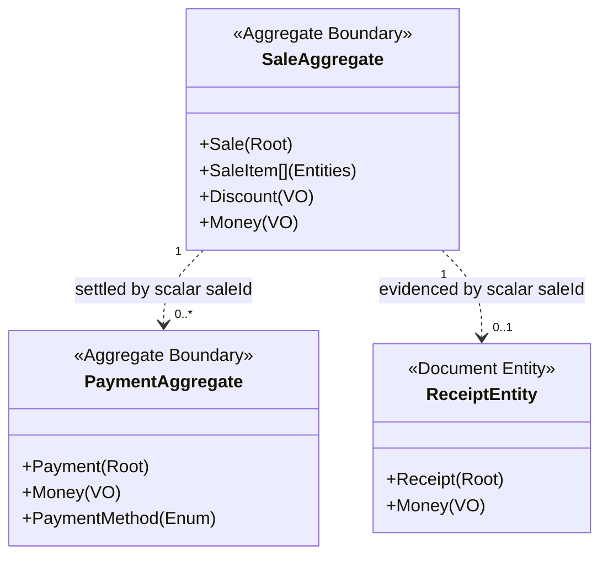
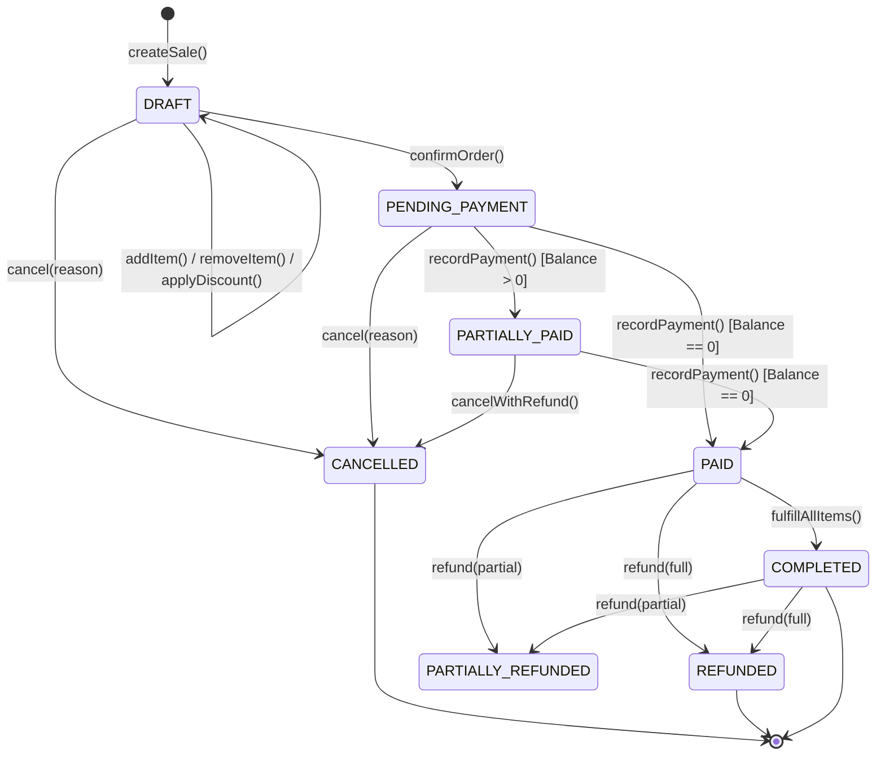
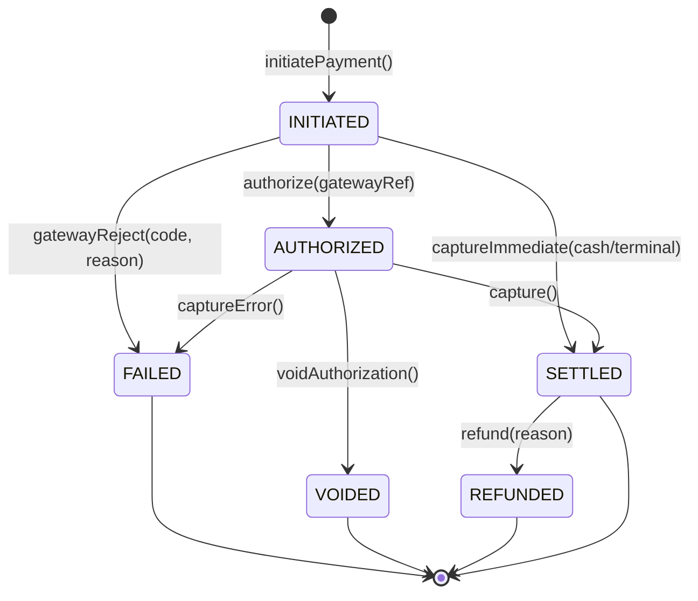
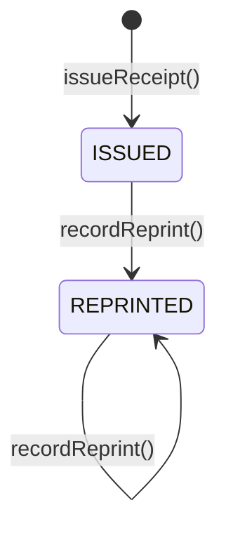

# Phase 7: Sales & Payments — Conceptual Domain Model Specification

- **Document**: `docs/domain/sales-payments.md`
- **Status**: Authoritative Domain Source of Truth
- **Milestone**: Phase 7.0 — Domain Modeling & Invariant Specification
- **Role**: Principal Domain Designer / Staff Platform Architect
- **Date**: 2026-09-17

---

## 1. Executive Summary & Context

This document establishes the authoritative conceptual domain model for **Phase 7: Sales & Payments** of the Kinergy platform.

Following the core architectural law established in [`docs/architecture/sales-payments.md`](file:///c:/Projects/kinergy-platform/docs/architecture/sales-payments.md):

> **"References Over Ownership."**  
> The Sales & Payments domain models commercial agreements, customer checkout sessions, monetary tender collections, and receipt vouchers. It never takes ownership of the products, subscriptions, medical records, or clients that participate in those transactions.

This specification defines the ubiquitous domain language, aggregate boundaries, entity lifecycles, value objects, state machines, non-negotiable invariants, and business traceability before any production code is written.

---

## 2. Ubiquitous Language & Core Concepts

```
┌──────────────────────────────────────────────────────────────────────────────┐
│                    SALES & PAYMENTS UBIQUITOUS VOCABULARY                    │
│                                                                              │
│  Sale             The commercial transaction aggregate root representing a    │
│                   purchase agreement between Kinergy and a customer.         │
│                                                                              │
│  SaleItem         An internal line-item entity within a Sale capturing an     │
│                   immutable snapshot of what was purchased and at what price.│
│                                                                              │
│  Payment          An autonomous aggregate root representing a financial       │
│                   monetary tender transaction settling part or all of a Sale.│
│                                                                              │
│  Receipt          An immutable proof-of-purchase document voucher issued to   │
│                   the customer upon financial settlement.                    │
│                                                                              │
│  SourceReference  An immutable Value Object identifying the origin entity    │
│                   (e.g., inventory item, membership plan, treatment session).│
│                                                                              │
│  Money            A canonical Value Object representing a non-negative       │
│                   monetary amount with an explicit ISO-4217 currency.        │
│                                                                              │
│  Discount         An immutable Value Object representing a fixed-amount or   │
│                   percentage price reduction justified by a business reason. │
│                                                                              │
│  TaxRate          A Value Object representing an applicable sales/VAT levy.  │
│                                                                              │
│  PaymentMethod    An enumeration of accepted tender mechanisms (CASH, CARD,  │
│                   TRANSFER, WALLET, ACCOUNT_CREDIT).                         │
└──────────────────────────────────────────────────────────────────────────────┘
```

---

## 3. Domain Entity & Aggregate Specifications

### 3.1 `Sale` (Aggregate Root)

#### Purpose

`Sale` is the aggregate root governing the commercial agreement between the wellness facility and a customer. It orchestrates the addition, modification, and removal of line items, applies discounts, computes taxable amounts, tracks the remaining balance, and enforces commercial lifecycle state transitions.

#### Identity & Multi-Tenancy

- **`id: SaleId`**: Canonical UUID uniquely identifying the sale within the platform.
- **`tenantId: TenantId`**: Strict organization boundary. A sale belongs to exactly one tenant; cross-tenant operations are strictly forbidden.
- **`branchId?: BranchId`**: Optional facility/branch identifier for multi-location operations.
- **`clientId?: ClientId`**: Optional reference to a registered Client (Phase 2). If omitted, the sale represents an anonymous front-desk walk-in customer.
- **`cashierId: UserId`**: Reference to the authenticated IAM user who initiated and managed the sale.

#### Aggregate Root Responsibility

`Sale` is the **sole gateway** for mutating order state. External consumers cannot manipulate `SaleItem` entities directly; all line item additions, quantity adjustments, and discount evaluations must execute through methods on `Sale` (`addItem()`, `updateItemQuantity()`, `removeItem()`, `applyOrderDiscount()`).

#### Invariants Enforced by `Sale`

1. **Empty Order Prohibition**: A sale cannot transition out of `DRAFT` to `PENDING_PAYMENT` or `PAID` with zero items.
2. **Monetary Non-Negativity**: The net total payable amount ($\text{total}$) must be $\ge 0$. Under no circumstances may discounts or promotions produce a negative sale total.
3. **Currency Homogeneity**: Every `SaleItem`, order discount, and tax calculation within a `Sale` must share the identical ISO-4217 currency.
4. **Commercial Locking**: Once a `Sale` transitions into `PAID`, `PARTIALLY_PAID`, `COMPLETED`, `CANCELLED`, or `REFUNDED`, line items cannot be added, modified, or removed.
5. **Reconciliation Invariant**:
   $$\text{Subtotal} = \sum (\text{SaleItem.lineSubtotal})$$
   $$\text{TotalDiscount} = \sum (\text{SaleItem.discountAmount}) + \text{OrderDiscount.amount}$$
   $$\text{TaxTotal} = \sum (\text{SaleItem.taxAmount})$$
   $$\text{Total} = \max(0, \text{Subtotal} - \text{TotalDiscount} + \text{TaxTotal})$$
   $$\text{BalanceRemaining} = \max(0, \text{Total} - \text{TotalSettledPayments})$$

#### Field Mutability Classification

- **Permanently Immutable (set at creation)**: `id`, `tenantId`, `createdAt`.
- **Conditionally Mutable (only while `status == DRAFT`)**: `clientId`, `items`, `orderDiscount`, `notes`.
- **Lifecycle Mutable (via explicit domain transitions)**: `status`, `completedAt`, `cancelledAt`, `cancellationReason`, `version`, `updatedAt`.

---

### 3.2 `SaleItem` (Internal Entity)

#### Ownership & Lifecycle

`SaleItem` is an **internal entity** exclusively owned by the `Sale` aggregate. It has no independent global existence, no standalone repository, and cannot be accessed, queried, or updated outside of its parent `Sale`.

#### Quantities & Pricing

- **`quantity: number`**: Finite positive decimal or integer ($> 0$). Supports fractional quantities for weighted consumables (e.g. bulk nutrition powders, grams) or integers for discrete items (bottles, memberships).
- **`unitPrice: Money`**: The gross unit price agreed upon at checkout.
- **`itemDiscount?: Discount`**: Optional line-item specific discount.
- **`taxRate?: TaxRate`**: Applicable tax rate applied to this specific item.
- **`lineSubtotal: Money`**: $\text{quantity} \times \text{unitPrice}$.
- **`lineTotal: Money`**: $\max(0, \text{lineSubtotal} - \text{discountAmount}) + \text{taxAmount}$.

#### The Permanent Snapshotting Requirement

> [!IMPORTANT]
> **Why `SaleItem` Must Snapshot Commercial Information**:  
> A `SaleItem` must **never** store a foreign key that dynamically joins to the product or membership table to display descriptions or prices at read time.
>
> Real-world prices change frequently:
>
> - A gym plan priced at $50/month in January is raised to $60/month in March.
> - A protein shake priced at $4.00 is discounted to $3.50 or increased to $4.50.
>
> If `SaleItem` queried source tables dynamically:
>
> 1. Historical sales totals would retroactively mutate whenever an administrator updated a product price.
> 2. Daily revenue reports, tax filings, and audited receipts would silently corrupt.
> 3. Discontinuing or deleting a product catalog entry would crash historical order queries.
>
> Therefore, `SaleItem` **permanently freezes**:
>
> - `description`: Exact text label (e.g., `"1-Month Standard Membership Plan"`, `"Optimum Whey Protein 2lb"`).
> - `skuOrCode`: Source SKU or business code at the moment of sale (e.g., `"PLAN-MTH-STD"`, `"PROT-WHEY-01"`).
> - `unitPrice`: Exact price snapshot.
> - `taxRate`: Exact tax percentage snapshot.

---

### 3.3 `Payment` (Autonomous Aggregate Root)

#### Identity & Relationship to `Sale`

- **`id: PaymentId`**: Canonical UUID uniquely identifying the financial transaction.
- **`tenantId: TenantId`**: Enforces organization-level isolation.
- **`saleId: SaleId`**: Unconstrained scalar reference to the `Sale` being settled.
- **`amount: Money`**: Monetary amount of this specific tender transaction ($> 0$ for charges, $< 0$ for refunds).
- **`method: PaymentMethod`**: The tender mechanism (`CASH`, `CREDIT_CARD`, `DEBIT_CARD`, `BANK_TRANSFER`, `DIGITAL_WALLET`, `ACCOUNT_CREDIT`).
- **`status: PaymentStatus`**: Lifecycle state (`INITIATED`, `AUTHORIZED`, `SETTLED`, `FAILED`, `REFUNDED`).
- **`externalTransactionId?: string`**: External gateway authorization code, terminal receipt number, or bank wire reference.
- **`cashierId: UserId`**: Identity of staff member recording or operating the tender.
- **`initiatedAt: DateTime`**: Timestamp of payment initiation.
- **`settledAt?: DateTime`**: Timestamp when funds were verified/settled.

#### Support for Multiple Payments per Sale (Split Tender)

The domain explicitly supports **one-to-many payments per sale**:

1. **Split Tenders**: A customer paying a $100 bill with $40 Cash and $60 Credit Card produces two distinct `Payment` aggregates linked to the same `saleId`.
2. **Partial Deposits**: A customer placing a $20 deposit on a $100 service, paying the remaining $80 upon arrival.
3. **Refund Traceability**: Refunding $30 on a card tender creates an autonomous refund payment record linked to the original transaction.

---

### 3.4 `Receipt` (Autonomous Document Entity)

#### Nature of a Receipt: Proof vs. Financial Truth

> [!NOTE]
> **Is a Receipt a Financial Source of Truth?**  
> **No.** A `Receipt` is **NOT** the financial source of truth.  
> The financial truth is authoritatively governed by the `Sale` and `Payment` aggregates.  
> A `Receipt` is an **immutable, customer-facing legal voucher** that represents and evidences an already-settled financial transaction.

#### Generation & Immutability Rules

1. **Generation Trigger**: Emitted automatically once a `Sale` reaches `PAID` status (or upon recording a partial deposit).
2. **Monotonic Sequential Numbering**: Every receipt receives a unique, human-readable, sequentially increasing receipt number within the tenant (e.g. `REC-2026-000184`).
3. **Absolute Immutability**: Once generated, a `Receipt` record can **never** be updated or deleted.
4. **Reprint Behavior**: If a customer requests a duplicate receipt, the system does **not** create a new receipt number or alter financial data. It re-renders the frozen receipt payload, marking the printed output with a `"DUPLICATE / REPRINT"` watermark and logging the reprint event in technical audit logs.
5. **Refund Representation**: When a sale is refunded, the original receipt is preserved. A separate `RefundVoucher` or `CreditNote` (e.g. `CN-2026-000012`) is generated to document the reversal.

---

### 3.5 `SourceReference` (Value Object)

#### Structure & Semantics

`SourceReference` is an immutable Value Object identifying what generated the charge:

```
SourceReference
├── sourceType: SourceType (INVENTORY_ITEM | MEMBERSHIP_PLAN | TREATMENT_SESSION | CUSTOM_SERVICE)
├── sourceId: string (Scalar UUID or "CUSTOM")
└── sourceCode?: string (Optional human-readable SKU or business identifier)
```

#### Validation & Ownership Boundary

- **Validation**: At the time of adding an item to a `Sale`, the application layer queries the owning context's query port (e.g., verifying `InventoryItem` exists, is `ACTIVE`, and has sufficient stock; or verifying `MembershipPlan` is `ACTIVE`).
- **Zero Foreign Keys**: `SourceReference` contains scalar strings only. There are no relational database foreign keys connecting `sale_items` to `inventory_items`, `membership_plans`, or `treatment_sessions`.
- **Fulfillment Dispatch**: When the sale transitions to `PAID`, an application orchestrator inspects `sourceType` to route fulfillment calls to the appropriate domain port:
  - `INVENTORY_ITEM` $\rightarrow$ `InventoryStockDecrementPort.sellStock(...)`
  - `MEMBERSHIP_PLAN` $\rightarrow$ `GymMembershipActivationPort.activateOrRenew(...)`
  - `TREATMENT_SESSION` $\rightarrow$ `TreatmentBillingPort.markSessionBilled(...)`
  - `CUSTOM_SERVICE` $\rightarrow$ No domain fulfillment required (commercial fee only).

---

### 3.6 `Money` (Canonical Shared Kernel Value Object)

In accordance with Phase 6 architectural standards and ADR-0098:

- **`amount: number`**: Finite, non-negative number ($0 \le \text{amount} < \infty$).
- **`currency: string`**: ISO-4217 standard 3-letter uppercase code (e.g., `USD`, `CAD`, `EUR`). Default: `USD`.
- **Precision**: Fixed to 2 decimal places (integer cents / hundredths). Precision is enforced via `Math.round(amount * 100) / 100`.
- **Arithmetic Rules**:
  - `add(other: Money)`: Requires identical currencies; returns new `Money`.
  - `subtract(other: Money)`: Requires identical currencies; throws `InvalidMoneyException` if result $< 0$.
  - `multiply(factor: number)`: Requires finite factor $\ge 0$; returns new `Money` rounded to cents.
  - `isZero()`: Returns `true` when amount is `0`.
- **Strict Invariant**: Floating-point currency math is strictly forbidden. Monetary amounts are immutable (`Object.freeze`).

---

### 3.7 `Discount` (Value Object)

#### Semantics & Types

```
Discount
├── type: DiscountType (FIXED_AMOUNT | PERCENTAGE)
├── value: number (Finite positive number)
├── reason: string (Mandatory business justification)
└── authorizedByUserId?: string (Required for discounts exceeding cashier discretion threshold)
```

#### Invariants & Rules

1. **Percentage Boundary**: If `type == PERCENTAGE`, $0 < \text{value} \le 100$. A discount of 100% produces a $0.00 line total (e.g., promotional gift or comp).
2. **Fixed Amount Boundary**: If `type == FIXED_AMOUNT`, value must be $> 0$. A fixed discount cannot reduce a line item or order total below $0.00.
3. **Application Hierarchy**:
   - **Step 1 (Line-Item Discounts)**: Applied directly to the individual `SaleItem` subtotal ($\text{quantity} \times \text{unitPrice}$).
   - **Step 2 (Order-Level Discount)**: Applied to the net sum of all discounted line items.
4. **Rounding Policy**: When calculating percentage discounts, the resulting currency reduction is rounded half-up to integer cents (`Math.round(val * 100) / 100`).
5. **Mandatory Justification**: A discount without a non-empty `reason` string (e.g. `"VIP Member Loyalty 10%"`, `"Damaged packaging promo"`) is strictly rejected by domain validation.

---

## 4. Aggregate Analysis & Boundaries



| Question                                 | `Sale` Aggregate                                                                                   | `Payment` Aggregate                                                                              | `Receipt` Document Entity                                             |
| :--------------------------------------- | :------------------------------------------------------------------------------------------------- | :----------------------------------------------------------------------------------------------- | :-------------------------------------------------------------------- |
| **1. Aggregate Root?**                   | `Sale`                                                                                             | `Payment`                                                                                        | `Receipt`                                                             |
| **2. Invariants Protected?**             | Total reconciliation, item consistency, non-negative amounts, commercial lock after draft.         | Payment amount non-negativity, valid tender method, terminal status protection.                  | Monotonic receipt sequence, immutability, customer voucher integrity. |
| **3. What changes atomically?**          | `Sale` and all its `SaleItem`s commit together in a single database transaction.                   | Individual payment state transitions (`INITIATED` $\rightarrow$ `SETTLED`) commit independently. | Write-once creation. Zero post-creation mutations.                    |
| **4. What changes independently?**       | Adding/removing items does not touch payments.                                                     | Gateway authorization retries occur without holding locks on the `Sale`.                         | Issued independently upon payment milestone.                          |
| **5. Never mutated after finalization?** | Line items, unit prices, discounts, tax rates, net total cannot be modified after leaving `DRAFT`. | Settled payment amounts and tender methods can never be updated.                                 | 100% frozen forever.                                                  |
| **6. Owning Bounded Context?**           | Sales & Payments                                                                                   | Sales & Payments                                                                                 | Sales & Payments                                                      |

---

## 5. Domain State Machines

### 5.1 `Sale` State Machine



#### Detailed Transition Table

| Source State         | Target State         | Allowed Actor         | Business Trigger / Reason                             | Invariant / Guard Rule                                           |
| :------------------- | :------------------- | :-------------------- | :---------------------------------------------------- | :--------------------------------------------------------------- |
| `[*] `               | `DRAFT`              | Cashier, Receptionist | Customer begins checkout session                      | Must assign new `SaleId`, set `tenantId`, cashier identity.      |
| `DRAFT`              | `DRAFT`              | Cashier, Receptionist | Items added/removed, discounts applied                | Total recalculates. Items array cannot be empty at confirmation. |
| `DRAFT`              | `CANCELLED`          | Cashier, Receptionist | Customer abandons checkout                            | Mandatory cancellation reason. No financial movements.           |
| `DRAFT`              | `PENDING_PAYMENT`    | Cashier, Receptionist | Order finalized; customer presented with balance      | Must contain at least 1 item. Net total $\ge 0$. Items locked.   |
| `PENDING_PAYMENT`    | `PAID`               | Payment Orchestrator  | Full payment tender verified                          | $\sum \text{SettledPayments} \ge \text{Sale.total}$.             |
| `PENDING_PAYMENT`    | `PARTIALLY_PAID`     | Payment Orchestrator  | Partial deposit recorded                              | $0 < \sum \text{SettledPayments} < \text{Sale.total}$.           |
| `PARTIALLY_PAID`     | `PAID`               | Payment Orchestrator  | Remaining balance settled                             | $\sum \text{SettledPayments} \ge \text{Sale.total}$.             |
| `PAID`               | `COMPLETED`          | System / Fulfillment  | All items fulfilled (stock decremented, plans active) | Fulfillment ports confirm completion without errors.             |
| `PAID` / `COMPLETED` | `REFUNDED`           | Owner, Manager        | Entire transaction reversed                           | Compensating refund payments equal original total.               |
| `PAID` / `COMPLETED` | `PARTIALLY_REFUNDED` | Owner, Manager        | One or more items returned/refunded                   | Cumulative refund amount $\le \text{Sale.total}$.                |

---

### 5.2 `Payment` State Machine



#### Detailed Transition Table

| Source State | Target State | Allowed Actor   | Business Trigger / Reason                           | Invariant / Guard Rule                                     |
| :----------- | :----------- | :-------------- | :-------------------------------------------------- | :--------------------------------------------------------- |
| `[*] `       | `INITIATED`  | Cashier, System | Tender chosen, payment process started              | Positive non-zero amount. Valid payment method.            |
| `INITIATED`  | `SETTLED`    | Cashier         | Cash received in drawer or debit terminal confirmed | Cash transactions settle immediately upon physical count.  |
| `INITIATED`  | `AUTHORIZED` | Gateway Adapter | Credit card pre-authorization hold verified         | External gateway authorization reference required.         |
| `INITIATED`  | `FAILED`     | Gateway Adapter | Card declined, insufficient funds, timeout          | Failure reason code recorded. Zero impact on sale balance. |
| `AUTHORIZED` | `SETTLED`    | Gateway Adapter | Pre-authorized hold successfully captured           | Funds settled. Emits `PaymentSettledDomainEvent`.          |
| `AUTHORIZED` | `VOIDED`     | Cashier, System | Authorization cancelled before capture              | Hold released. No money changed hands.                     |
| `SETTLED`    | `REFUNDED`   | Owner, Manager  | Customer refund executed                            | Linked to original payment. Emits refund audit event.      |

---

### 5.3 `Receipt` State Machine



#### Detailed Transition Table

| Source State           | Target State | Allowed Actor | Business Trigger / Reason                   | Invariant / Guard Rule                                           |
| :--------------------- | :----------- | :------------ | :------------------------------------------ | :--------------------------------------------------------------- |
| `[*] `                 | `ISSUED`     | System        | Sale reaches `PAID` (or qualifying deposit) | Monotonic receipt sequence assigned. Data permanently frozen.    |
| `ISSUED` / `REPRINTED` | `REPRINTED`  | Cashier       | Customer requests duplicate printout        | Receipt data unchanged. Increments reprint counter in audit log. |

---

## 6. Non-Negotiable Domain Invariants

The following invariants are fundamental business laws of Kinergy. Any proposed code change that violates these rules must be rejected by architecture and automated domain tests:

### Invariant 1: References Over Ownership

> **Domain Law**: The Sales & Payments bounded context must **never** own, mutate, or duplicate domain models from Client, Resources, Gym, Kinesiology, or Scheduling.  
> It communicates strictly through unconstrained typed scalar references (`SourceReference`, `clientId`, `therapistId`, `cashierId`) and application capability ports.

### Invariant 2: Permanent Price Snapshotting

> **Domain Law**: A `SaleItem` must **permanently snapshot** commercial attributes (`description`, `skuOrCode`, `unitPrice`, `taxRate`) at the instant of creation.  
> Runtime database joins to source catalog tables for historical receipts or past sales are strictly prohibited.

### Invariant 3: Single-Currency Sales

> **Domain Law**: A single `Sale` must never contain mixed currencies.  
> Every line item, discount, tax, subtotal, and payment associated with a `Sale` must share the identical ISO-4217 currency code.

### Invariant 4: Non-Negative Financial Totals

> **Domain Law**: The net total payable of a `Sale` and the amount of a `Payment` cannot be negative.  
> Discounts exceeding the subtotal are capped such that $\text{total} \ge 0$. Reversals and refunds are modeled as distinct negative refund payments or explicit credit notes, never as negative line items on original sales.

### Invariant 5: Commercial Lock After Draft

> **Domain Law**: Once a `Sale` transitions out of `DRAFT` (into `PENDING_PAYMENT`, `PAID`, or `COMPLETED`), its items, quantities, discounts, and prices are **immutable**.  
> Adding, removing, or adjusting line items on a confirmed or paid sale is physically prevented by the domain aggregate.

### Invariant 6: Append-Only Financial Sub-Ledger

> **Domain Law**: Under no circumstances may a `Payment` record or `Receipt` record be deleted (`DELETE`) or retroactively edited (`UPDATE`) in the database.  
> All financial adjustments must be achieved through append-only compensating records (`VOID`, `REFUND`, `CREDIT_NOTE`).

### Invariant 7: Strict Organization Isolation

> **Domain Law**: Every commercial entity (`Sale`, `SaleItem`, `Payment`, `Receipt`) is strictly scoped by `tenantId`.  
> Cross-tenant queries, references, or mutations are impossible at both the domain model and persistence repository layers.

### Invariant 8: Receipt Legal Immutability

> **Domain Law**: A `Receipt` is a legal voucher representing an already-recorded financial transaction.  
> Modifying receipt contents after generation is prohibited. Duplicate prints must be explicitly stamped as reprints without altering stored transaction records.

---

## 7. Business Traceability Matrix

This matrix maps high-level business requirements to conceptual domain rules and anticipated application use cases:

| Business Requirement               | Conceptual Domain Rule                                                                                 | Anticipated Application Use Case                        |
| :--------------------------------- | :----------------------------------------------------------------------------------------------------- | :------------------------------------------------------ |
| **Unified Point of Sale**          | `Sale` accepts heterogeneous items via `SourceReference` without coupling to source tables.            | `CreateSaleUseCase`, `AddSaleItemUseCase`               |
| **Permanent Accounting Integrity** | `SaleItem` permanently snapshots price, name, SKU, and tax at checkout.                                | `AddSaleItemUseCase`                                    |
| **Split-Tender Payment**           | `Payment` is an autonomous aggregate linked via `saleId`; multiple payments can settle one sale.       | `RecordPaymentUseCase`                                  |
| **Walk-in Customer Checkout**      | `clientId` is optional on `Sale`, allowing anonymous retail sales.                                     | `CreateSaleUseCase`                                     |
| **Non-Negative Cashier Guard**     | `Sale.total` cannot be negative; discounts exceeding order value are capped at order total.            | `ApplyOrderDiscountUseCase`                             |
| **Cashier Discretion Controls**    | Discretionary discounts require a mandatory `reason` string and threshold validation.                  | `ApplyOrderDiscountUseCase`, `ApplyItemDiscountUseCase` |
| **Inventory Stock Protection**     | Sales delegates stock deduction to `InventoryStockDecrementPort`; respects OCC and non-negative stock. | `FulfillSaleUseCase`                                    |
| **Gym Membership Activation**      | Sales delegates subscription activation to `GymMembershipActivationPort` upon payment settlement.      | `FulfillSaleUseCase`                                    |
| **Clinical Session Billing**       | Sales flags treatment session as billed via `TreatmentBillingPort` without exposing medical notes.     | `FulfillSaleUseCase`                                    |
| **Tamper-Evident Receipts**        | `Receipt` is write-once, sequentially numbered, and permanently frozen upon issuance.                  | `IssueReceiptUseCase`, `GetReceiptByIdQuery`            |
| **Transaction Audit Trail**        | Commercial transitions and financial tenders write append-only audit events with actor attribution.    | All Command Handlers                                    |
| **Customer Refund Processing**     | Refunds create explicit refund payment records linked to the original sale and payment.                | `RefundSaleUseCase`                                     |

---

## 8. Explicit Non-Goals for Phase 7.0

To maintain laser focus on domain modeling, the following areas are strictly **OUT OF SCOPE** for this milestone:

1. **No Code Implementation**: No TypeScript classes, NestJS controllers, Prisma entities, or React components are created in Milestone 7.0.
2. **No Hardware Driver Specifications**: Low-level thermal printer ESC/POS bytes, magnetic stripe readers, or physical cash drawer relays are out of scope.
3. **No Direct Gateway API Bindings**: Concrete Stripe, MercadoPago, or bank API payloads are out of scope; all external interactions are abstracted behind conceptual ports.
4. **No Double-Entry General Ledger**: Balance sheets, asset depreciation schedules, and corporate tax return filings belong to a future accounting context.
