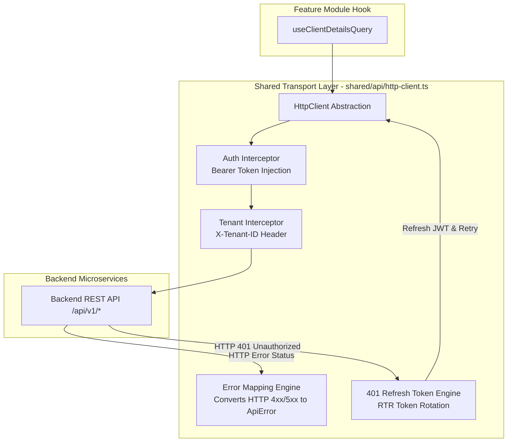
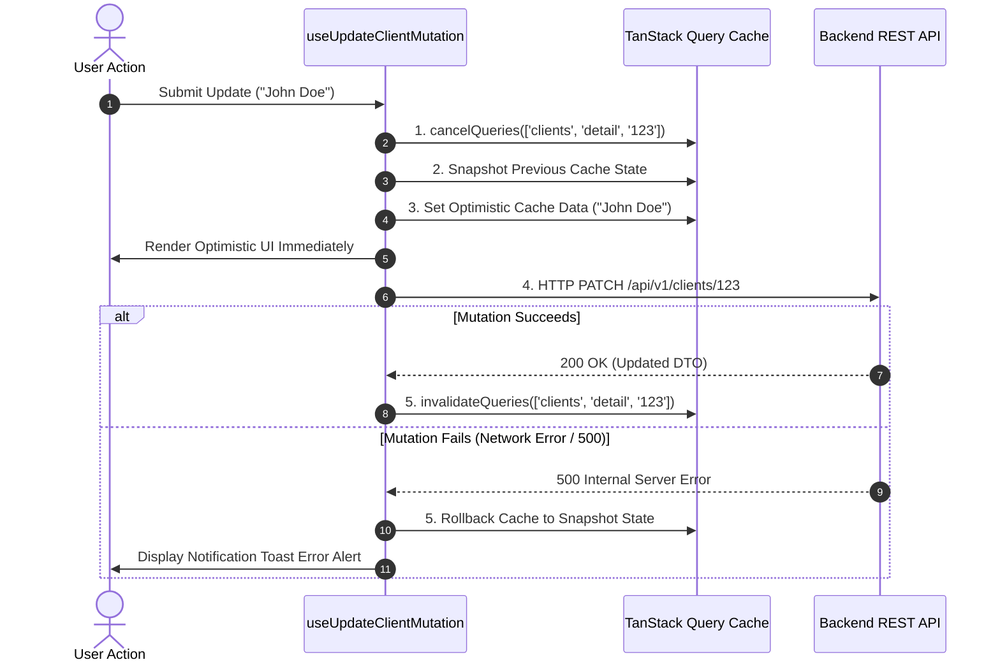
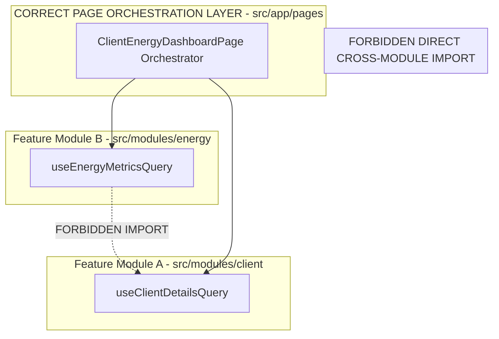

# Frontend API Architecture & Data Fetching Strategy

- **Status:** Active / Authoritative Standard
- **Scope:** `@kinergy-platform/web` (`apps/web/src/`) and Shared Packages (`packages/*`)
- **Target Application:** Kinergy Platform Web Frontend

---

## 1. Executive Summary & Core API Philosophy

The Kinergy Platform frontend (`apps/web`) interacts with backend microservices via a structured, type-safe **API Integration Architecture**.

To maintain clean architecture, strict module boundaries, and high performance, the frontend API layer is governed by six core tenets:

1. **Centralized Transport Abstraction**: All network requests pass through an HTTP transport client (`shared/api/http-client.ts`) that manages authorization headers, tenant context, generic error handling, and 401 token refresh interceptors.
2. **Co-located Feature Queries**: Feature modules co-locate their TanStack Query API hooks inside `src/modules/<domain>/api/`.
3. **Hierarchical Query Key Factories**: Every domain defines a Query Key Factory (`clientKeys`, `energyKeys`) ensuring type-safe cache invalidation without key collisions.
4. **Boundary Deserialization & Zod Validation**: Raw API payloads are parsed at the transport edge using Zod schemas (`packages/validation`) and converted into clean frontend ViewModels via pure mapper functions.
5. **Optimistic Updates & Deterministic Rollback**: State mutations update TanStack Query caches optimistically, capturing snapshot context to perform seamless rollbacks on network failures.
6. **Strict Feature Decoupling**: Feature modules NEVER import API hooks or query keys from other feature modules. Cross-domain data integration occurs at page orchestration boundaries.

---

## 2. API Transport Layer (`shared/api/http-client.ts`)

All network requests flow through a unified HTTP client wrapper around native `fetch` / `axios`:



### Transport Responsibilities

- **Base URL & Path Prefixing**: Reads API endpoint from environment configuration (`VITE_API_BASE_URL`, defaults to `/api/v1`).
- **Authorization Header Injection**: Automatically attaches `Authorization: Bearer <accessToken>` from memory session context.
- **Tenant Context Injection**: Automatically attaches `X-Tenant-ID: <tenantId>` header extracted from tenant routing parameters.
- **Automatic Token Refresh (RTR)**: Intercepts `401 Unauthorized` responses, triggers silent refresh token rotation, and transparently retries failed requests.

---

## 3. TanStack Query Conventions & Query Key Factory Pattern

TanStack Query (`@tanstack/react-query`) is the sole server state engine. To avoid query key collision across feature modules, every domain defines a formal **Query Key Factory**.

### Query Key Factory Structure

```typescript
// Location: apps/web/src/modules/client/api/client-query-keys.ts
export const clientKeys = {
  all: ['clients'] as const,
  lists: () => [...clientKeys.all, 'list'] as const,
  list: (filters: Record<string, unknown>) => [...clientKeys.lists(), { filters }] as const,
  details: () => [...clientKeys.all, 'detail'] as const,
  detail: (id: string) => [...clientKeys.details(), id] as const,
  timeline: (id: string) => [...clientKeys.detail(id), 'timeline'] as const,
};
```

### Co-Located Query Hook Example

```typescript
// Location: apps/web/src/modules/client/api/use-client-details-query.ts
import { useQuery } from '@tanstack/react-query';
import { httpClient } from '@/shared/api/http-client';
import { clientKeys } from './client-query-keys';
import { clientSchema } from '@kinergy-platform/validation';
import { mapClientDtoToViewModel, ClientViewModel } from '../mappers/client.mapper';

export const useClientDetailsQuery = (clientId: string) => {
  return useQuery<ClientViewModel, ApiError>({
    queryKey: clientKeys.detail(clientId),
    queryFn: async () => {
      const rawData = await httpClient.get(`/clients/${clientId}`);
      const validatedDto = clientSchema.parse(rawData);
      return mapClientDtoToViewModel(validatedDto);
    },
    staleTime: 1000 * 60 * 5, // 5 minutes
    enabled: Boolean(clientId),
  });
};
```

---

## 4. Mutation Strategy, Optimistic Updates & Rollback

Mutations modify server data and immediately synchronize local query caches using optimistic UI updates or targeted cache invalidation.



### Optimistic Mutation Hook Implementation

```typescript
// Location: apps/web/src/modules/client/api/use-update-client-mutation.ts
import { useMutation, useQueryClient } from '@tanstack/react-query';
import { httpClient } from '@/shared/api/http-client';
import { clientKeys } from './client-query-keys';
import { useToast } from '@/shared/hooks/use-toast';
import { ClientViewModel } from '../mappers/client.mapper';

export const useUpdateClientMutation = () => {
  const queryClient = useQueryClient();
  const { toast } = useToast();

  return useMutation({
    mutationFn: async ({ id, data }: { id: string; data: UpdateClientInput }) => {
      return httpClient.patch(`/clients/${id}`, data);
    },
    onMutate: async ({ id, data }) => {
      // Cancel outgoing refetches
      await queryClient.cancelQueries({ queryKey: clientKeys.detail(id) });

      // Snapshot previous value
      const previousClient = queryClient.getQueryData<ClientViewModel>(clientKeys.detail(id));

      // Optimistically update cache
      if (previousClient) {
        queryClient.setQueryData<ClientViewModel>(clientKeys.detail(id), {
          ...previousClient,
          ...data,
        });
      }

      return { previousClient };
    },
    onError: (err, { id }, context) => {
      // Rollback to previous state on error
      if (context?.previousClient) {
        queryClient.setQueryData(clientKeys.detail(id), context.previousClient);
      }
      toast.error('Failed to update client profile. Changes rolled back.');
    },
    onSettled: (_, __, { id }) => {
      // Always refetch after error or success
      queryClient.invalidateQueries({ queryKey: clientKeys.detail(id) });
    },
  });
};
```

---

## 5. DTO Mapping, Boundary Deserialization & Error Handling

### 1. Transport Boundary Zod Validation

Raw API responses from the network are parsed at the edge using Zod schemas (`packages/validation`). If a backend deployment introduces an unexpected breaking schema change, Zod parsing catches it at the boundary before corrupting component states.

### 2. DTO to ViewModel Mapping

Backend DTOs are mapped into UI-focused ViewModels to decouple component code from backend schema changes:

- Converts ISO string timestamps (`2026-08-04T10:00:00Z`) into formatted display strings (`"Aug 4, 2026"`).
- Combines separate fields (`firstName`, `lastName`) into display helpers (`fullName`).

### 3. Unified Domain Error Mapping

Raw HTTP errors are caught by `http-client.ts` and transformed into structured `ApiError` domain models:

```typescript
export class ApiError extends Error {
  constructor(
    public readonly statusCode: number,
    public readonly code: string,
    message: string,
    public readonly details?: Record<string, string[]>,
  ) {
    super(message);
    this.name = 'ApiError';
  }
}
```

---

## 6. Mock Service Worker (MSW) Strategy

To enable offline feature development, visual prototyping, and rapid unit/integration testing without backend microservice dependencies, the platform uses **Mock Service Worker (MSW v2)**.

- **MSW Handlers**: Co-located mock handlers in `src/test/mocks/handlers.ts` intercept HTTP requests at the browser network level using Service Workers.
- **Testing Integration**: Vitest tests wrap components in `QueryClientProvider` while MSW handlers mock backend responses without network calls.

```typescript
// Location: apps/web/src/test/mocks/handlers.ts
import { http, HttpResponse } from 'msw';

export const handlers = [
  http.get('/api/v1/clients/:id', ({ params }) => {
    return HttpResponse.json({
      id: params.id,
      name: 'Acme Energy Solutions',
      status: 'ACTIVE',
      createdAt: '2026-01-15T08:00:00Z',
    });
  }),
];
```

---

## 7. Future API Versioning & BFF Compatibility

### 1. Path-Based Versioning Strategy

- API endpoints are prefixed with version segments (`/api/v1/clients`, `/api/v2/clients`).
- When backend APIs increment versions, `shared/api/http-client.ts` or specific query function endpoints update smoothly without refactoring domain components.

### 2. Backend-For-Frontend (BFF) Readiness

- As dashboard views require complex multi-domain aggregates (e.g., combining Client Profile + Energy Consumption + Billing Invoices), a dedicated BFF layer (GraphQL or Read-Optimized REST Aggregator) can be introduced.
- The Query Key Factory and ViewModel mapper architecture ensures that components consume aggregated BFF ViewModels seamlessly without component rewrite.

---

## 8. Feature Module API Interaction & Decoupling Rules

Feature modules MUST remain strictly decoupled:



### Mandatory Decoupling Rules

1. **Forbidden Direct Imports**: `src/modules/energy` MUST NEVER import query hooks or query keys from `src/modules/client`.
2. **Page Orchestration**: When a dashboard view requires data from both `Client` and `Energy` contexts, the top-level Page component (`src/app/pages/client-energy-dashboard-page.tsx`) invokes both hooks and passes required data down as primitive props.
3. **Shared Contracts**: Common types and validation schemas belong in workspace packages (`packages/types`, `packages/validation`).

---

## 9. Architectural Decision Records (ADR Style)

---

### [ADR-FE-0017] Centralized Transport Layer with Automatic Auth Interceptors

- **Decision**: Centralize all HTTP network communication in `shared/api/http-client.ts` with automatic `Bearer` token injection, `X-Tenant-ID` header binding, and 401 refresh token retries.
- **Context**: Duplicating `fetch` or `axios` setups across feature modules leads to inconsistent error handling and security vulnerabilities.
- **Rationale**: A unified transport layer guarantees consistent header injection, security token refresh, and unified error mapping across all features.
- **Consequences**: Direct use of native `window.fetch` or un-configured `axios` is strictly prohibited.
- **Future Evolution**: Supports adding client-side telemetry tracking and request duration metrics to HTTP headers.

---

### [ADR-FE-0018] Hierarchical Query Key Factory Governance

- **Decision**: Standardize all TanStack Query keys using domain-level Query Key Factories (`clientKeys`, `energyKeys`).
- **Context**: Hardcoded string array query keys (`['clients', id]`) cause typos, duplicate keys, and broken cache invalidation.
- **Rationale**: Query Key Factories enforce strict TypeScript typing and hierarchical cache management (`invalidateQueries({ queryKey: clientKeys.all })`).
- **Consequences**: Requires creating a `query-keys.ts` file in every feature module's `api/` directory.
- **Future Evolution**: Enables automated query key documentation generation.

---

### [ADR-FE-0019] Transport Boundary Zod Validation & ViewModel Mapping

- **Decision**: Validate raw API response payloads using Zod schemas at the transport edge and transform them into frontend ViewModels via pure mappers.
- **Context**: Backend DTO changes can cause silent runtime UI crashes if un-validated raw API objects are used directly in component views.
- **Rationale**: Boundary Zod parsing catches invalid API payloads immediately, while ViewModel mappers insulate UI components from backend schema refactoring.
- **Consequences**: Requires defining Zod schemas and mapper functions for API integrations.
- **Future Evolution**: Enables sharing Zod schemas between NestJS backend DTO validators and Vite frontend parsers via `packages/validation`.

---

### [ADR-FE-0020] Network Level API Mocking with Mock Service Worker (MSW)

- **Decision**: Adopt Mock Service Worker (MSW v2) as the platform standard for API mocking during unit/integration testing and offline development.
- **Context**: Mocking fetch calls via Jest/Vitest spy functions leads to brittle test setups and leaks transport implementation details.
- **Rationale**: MSW intercepts requests at the browser/node network layer, providing authentic REST API responses without modifying application transport code.
- **Consequences**: Test suites configure MSW handlers instead of mocking HTTP client modules.
- **Future Evolution**: MSW handlers can be shared with Storybook component documentation.

---

### [ADR-FE-0029] Shared Runtime Infrastructure & Standard Mutation Pipeline

- **Decision**: Standardize all async mutations on `useStandardMutation` and centralize transport interceptors inside `HttpClient` and `AuthTokenStore`.
- **Context**: Unifying HTTP transport headers, 401 RTR token refresh queues, error normalization, toast alerts, and optimistic updates prevents divergent feature implementations.
- **Rationale**:
  - **Single Transport Core**: `HttpClient` wraps native fetch with `Authorization` bearer token and `X-Tenant-ID` header injection.
  - **Concurrency-Safe RTR**: Intercepts 401 responses and queues concurrent failing requests during single refresh token execution to `/api/v1/auth/refresh`.
  - **Standard Mutation Pipeline**: `useStandardMutation` unifies error normalization (`normalizeQueryError`), toast notifications (`useNotification`), query cache invalidation (`queryClient.invalidateQueries`), and opt-in 3-phase optimistic updates (`executeOptimisticUpdate` / `rollbackOptimisticUpdate`).
  - **Opt-In Optimistic Safety**: Optimistic updates are explicitly opt-in (`isOptimistic: true`), requiring safe predictability before mutating cache.
- **Responsibilities**:
  - `shared/api`: Owns `HttpClient` transport adapter and authentication transport support.
  - `shared/query`: Owns `useStandardMutation` lifecycle pipeline and error normalizer.
  - Feature Modules: Consume `useStandardMutation` and `HttpClient` without custom fetch or mutation boilerplate.
- **Consequences**: Direct `fetch` calls and manual mutation handling in feature modules are superseded by `HttpClient` and `useStandardMutation`.

---

## 10. Cross-References & Related Documentation

- [Frontend Architecture Vision](./architecture.md)
- [Frontend Engineering Principles](./principles.md)
- [Frontend Folder Structure & Architectural Boundaries](./folder-structure.md)
- [Frontend Routing Architecture & Navigation Strategy](./routing.md)
- [Frontend State Management Architecture & State Governance](./state-management.md)
- [Frontend UI Architecture & Design System Strategy](./ui-architecture.md)
- [Frontend Testing Strategy & Quality Assurance Architecture](./testing.md)
- [Frontend Error Handling Strategy & Fault Tolerance Architecture](./error-handling.md)
- [Frontend Technical Glossary](./glossary.md)
- [Master Platform Documentation Index](../README.md)
