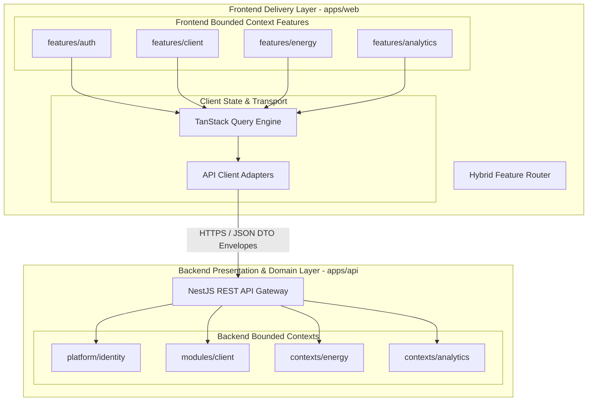
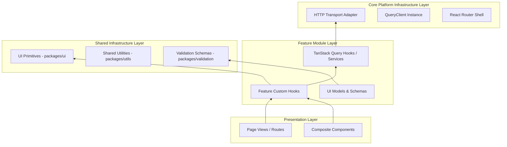
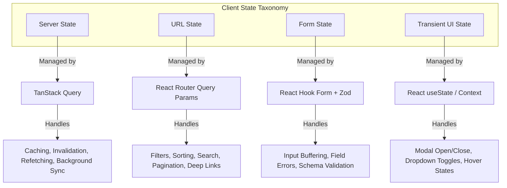
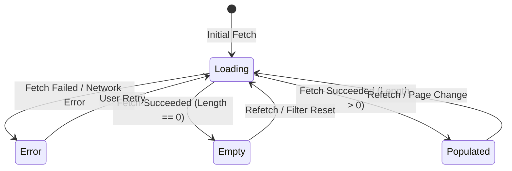

# Frontend Architecture Vision & System Design

- **Status:** Active / Authoritative Architecture Standard
- **Scope:** `apps/web`, `packages/*`, and Frontend Workspace Architecture
- **Target Application:** `@kinergy-platform/web` (React 18 + Vite)

---

## 1. Executive Summary & Purpose of the Frontend

The **Kinergy Platform Frontend** (`apps/web`) serves as the primary presentation and user interaction delivery layer for the enterprise energy management and monitoring system. Designed as a high-performance single-page web application (SPA), its core responsibilities are:

1. **Energy Monitoring & Dashboard Visualization**: Rendering real-time and historical telemetry data, energy asset states, analytics metrics, and system alerts with minimal latency.
2. **Enterprise User Experience**: Providing intuitional, responsive, and accessible workflows for administrators, facility managers, and enterprise operators.
3. **Decoupled Client Architecture**: Operating as a stateless client that delegates all business invariant enforcement, security decisions, and data persistence to backend bounded contexts while maintaining a resilient, local presentation layer.

---

## 2. Relationship with Backend Architecture

The frontend is designed to **mirror and complement** the backend's Modular Monolith architecture (Clean Architecture + DDD).



### Key Integration Contracts

- **Contract-Driven DTO Alignment**: Frontend data contracts strictly align with backend presentation DTOs and OpenAPI specifications.
- **Unified Result Envelope (`Result<T, E>`)**: API responses conform to standardized platform result payloads, allowing predictable client-side error handling without relying on unhandled runtime exceptions.
- **Stateless Bearer Authentication**: Auth tokens (JWT access tokens with Refresh Token Rotation) are managed via secure memory storage and httpOnly cookies, seamlessly passing authorization headers to backend controllers.

---

## 3. Overall Frontend Layering

The frontend application strictly isolates concerns into four clean architectural layers, enforcing an inward-only dependency flow.



### Layer Responsibilities

1. **Presentation Layer (`apps/web/src/routes/`, `apps/web/src/layouts/`)**:
   - Layout shells, view compositions, and route definitions.
   - Zero direct HTTP fetching; delegates state resolution to feature hooks.
2. **Feature Module Layer (`apps/web/src/features/<feature>/`)**:
   - Domain-aligned feature modules encapsulating feature-specific UI, TanStack Query hooks, forms, schemas, and types.
   - High cohesion, self-contained, and context-bounded.
3. **Shared Infrastructure Layer (`packages/ui`, `packages/utils`, `packages/validation`)**:
   - Pure UI design system primitives, formatting helpers, and environment configurations.
   - **Strict Rule**: Contains **ZERO business logic** or domain-specific entities.
4. **Core Platform Infrastructure Layer (`apps/web/src/providers/`, `apps/web/src/lib/`)**:
   - Application context providers, global query client settings, Axios/Fetch HTTP interceptors, and router shells.

---

## 4. Domain-Driven Design (DDD) Alignment

The frontend mirrors backend Bounded Contexts using **Feature-First Bounded Modules**.

| Backend Bounded Context | Frontend Feature Module           | Domain Responsibility                                              |
| :---------------------- | :-------------------------------- | :----------------------------------------------------------------- |
| `platform/identity`     | `apps/web/src/features/auth`      | User login, session renewal, password reset, RBAC view protection. |
| `modules/client`        | `apps/web/src/features/client`    | Client profile administration, contact mapping, status management. |
| `contexts/energy`       | `apps/web/src/features/energy`    | Telemetry dashboards, meters, grid status, real-time consumption.  |
| `contexts/analytics`    | `apps/web/src/features/analytics` | Energy usage trends, forecasting, carbon intensity reporting.      |

### DDD Tactical Patterns in Frontend

- **Frontend UI Entities**: Rich UI representation of domain concepts with client-side computed properties (e.g., `ClientStatusBadge` derived from state enum).
- **DTO Mappers**: Dedicated conversion functions mapping backend JSON DTOs to internal view models.
- **Context Boundaries**: Features must never reach into another feature's internal directory. All inter-feature communication occurs via explicit shared package contracts or URL navigation.

---

## 5. Feature Module Philosophy

Features are organized following a **Feature-First Directory Convention**:

```
apps/web/src/features/client/
├── api/                    # TanStack Query options, query keys, API fetchers
│   ├── use-client-query.ts
│   └── use-update-client.ts
├── components/             # Feature-specific UI components
│   ├── client-card.tsx
│   └── client-form.tsx
├── hooks/                  # Feature-specific custom React hooks
│   └── use-client-filters.ts
├── routes/                 # Feature route declarations
│   ├── client-detail-page.tsx
│   └── client-list-page.tsx
├── types/                  # Feature DTOs and view models
│   └── index.ts
├── utils/                  # Pure feature-specific formatting & calculations
│   └── client-formatters.ts
└── index.ts                # Public API surface of the feature module
```

### Public API Boundary (`index.ts`)

Every feature module exports an explicit public surface via `index.ts`. External components and routes may only import from `@/features/<feature-name>`. Importing internal feature paths directly (e.g., `@/features/client/components/internal-item`) is strictly forbidden by ESLint boundaries.

---

## 6. Design System Philosophy

The design system enforces visual consistency, accessibility, and modern aesthetics across the platform.

### Architecture

```
packages/ui/                # Base Atomic UI Primitives (Button, Dialog, Input, Card)
apps/web/src/styles/        # Global CSS, Design Tokens, Tailwind Variables
apps/web/src/components/    # Composite & App-specific non-domain components
```

### Core Design Rules

1. **Design Tokens**: Color, typography, spacing, border radii, and shadows are defined as CSS variables using HSL channels (`--primary`, `--background`, `--foreground`).
2. **Tailwind CSS + shadcn Integration**: Styling is achieved via utility classes with `clsx` and `tailwind-merge` (`cn()` utility).
3. **Atomic Primitives in `packages/ui`**: Atomic design components remain 100% domain-agnostic and customizable via standard props (`variant`, `size`, `className`).
4. **Rich Aesthetics & Dark Mode**: Native support for dark/light themes, subtle gradients, accessible contrast ratios (WCAG AA), smooth transitions, and loading skeletons.

---

## 7. Shared Infrastructure Philosophy

Shared workspace packages (`packages/*`) serve as shared utilities across web applications and services.

### Shared Infrastructure Rules

> [!IMPORTANT]
> **Business logic NEVER belongs in `shared/` or `packages/*`.**

- `packages/ui`: Pure visual components, layout primitives, and icons. Zero knowledge of APIs, domain models, or state management frameworks.
- `packages/utils`: Pure utility functions (date formatting, string manipulation, math helpers).
- `packages/validation`: Zod schemas for shared primitives (email rules, password strength, pagination query schemas).
- `packages/types`: Shared contract types, standard HTTP response interfaces, pagination DTOs.

---

## 8. State Management Architecture

State is strictly categorized and managed using dedicated, single-purpose state mechanisms:



### 1. Server State (TanStack Query)

- **Tool**: `@tanstack/react-query`
- **Scope**: All backend data fetching, caching, synchronization, and optimistic updates.
- **Rule**: Never copy server data into local `useState` or `useEffect`. Consume query hooks directly in components.

### 2. URL State (Search, Filters, Sorting, Pagination)

- **Tool**: React Router (`useSearchParams`) or search parameter state hooks (`useQueryParam`).
- **Scope**: Active data table filters, sorting order, search terms, pagination offset/limit, active tabs.
- **Rule**: All view filtering must be bookmarkable and shareable via URL parameter encoding.

### 3. Form State (React Hook Form)

- **Tool**: `react-hook-form` + `@hookform/resolvers/zod`
- **Scope**: User input, field validation, submission handlers, dirty/touched tracking.
- **Rule**: All forms require type-safe Zod validation schemas.

### 4. Transient UI State (React Native State)

- **Tool**: React `useState`, `useReducer`, or local React Context.
- **Scope**: Temporary visual interactions (is modal open, active dropdown index, drawer expanded state).

---

## 9. Mandatory 4-State UI Contract

Every feature view and data-driven component **MUST** explicitly implement and handle the following 4 states:



1. **Loading State**: Visual skeleton loaders (`Skeleton`), spinners, or layout placeholders matching the final layout shape. Avoid jarring layout shifts.
2. **Empty State**: Friendly illustration/icon, clear explanation message, and actionable Call-to-Action (CTA) (e.g., "No clients found. [Create New Client]").
3. **Error State**: Non-destructive error alert/card with error summary, actionable error message, and a "Retry" trigger.
4. **Populated State**: Full data view complete with interactive controls, pagination, sorting, and contextual actions.

---

## 10. Authentication Lifecycle & Session Recovery Architecture

The frontend authentication system enforces a strict boundary between **Shared Transport Infrastructure** (`shared/auth/`) and **Authentication Feature Domain** (`modules/auth/`).

### Canonical State Model (`AuthStatus`)

Authentication state is governed by an explicit state machine:

- **`BOOTSTRAPPING`**: Startup state while executing silent refresh (`POST /api/v1/auth/refresh`) and fetching current user profile (`GET /api/v1/auth/me`). Protected routes render a loading fallback without prematurely redirecting to `/auth/login`.
- **`AUTHENTICATED`**: Valid access token in memory (`authTokenStore`), current user session loaded (`UserSession`). Protected routes grant access according to permissions.
- **`UNAUTHENTICATED`**: Session invalidated or logged out. Memory credentials cleared. Protected routes redirect to `/auth/login?redirect=...`.
- **`AUTHENTICATION_ERROR`**: Temporary network failure during session recovery. Renders a connection recovery screen with manual retry option (`retryBootstrap()`).

For detailed architectural governance, see [ADR 0041: Frontend Authentication Bootstrap & Session Recovery Architecture](../adr/0041-frontend-authentication-bootstrap-and-session-recovery.md).

---

## 11. Architectural Decision Records (ADR) Index

The following core architectural decisions govern the frontend platform:

### [ADR-FE-0001] Bounded Context Mirroring & Feature-First Structure

- **Decision**: Adopt a feature-first monorepo directory layout inside `apps/web/src/features/` that mirrors backend bounded contexts.
- **Context**: Monolithic `components/` and `pages/` directories lead to code coupling, broken boundary isolation, and difficult maintenance.
- **Rationale**: Feature-first organization co-locates components, query hooks, routes, forms, and tests, simplifying context navigation and ownership.
- **Consequences**: Improves code discovery, enforces public API boundaries (`index.ts`), and facilitates future micro-frontend extractions.
- **Future Evolution**: Feature modules can be published as independent packages if sub-teams split development across repos.

### [ADR-FE-0002] Hybrid Feature Routing Architecture

- **Decision**: Implement a Hybrid Feature Routing pattern where `apps/web/src/routes/app-router.tsx` defines the central layout shell and delegates sub-route definitions to feature route registries (`features/<feature>/routes`).
- **Context**: Centralized monolithic route tables become massive merge-conflict prone bottlenecks as teams add new routes.
- **Rationale**: Hybrid routing keeps route definitions co-located within feature modules while preserving unified top-level application layout wrapping.
- **Consequences**: Developers modify only their feature's route file when adding pages.
- **Future Evolution**: Route definitions can easily support code-splitting and dynamic code loading via `React.lazy()` / React Router suspense.

### [ADR-FE-0003] Strict State Discipline & TanStack Query Baseline

- **Decision**: Use TanStack Query as the exclusive server state engine, prohibition of server data mirroring in React local state (`useState`), and persistence of table state in URL search parameters.
- **Context**: Ad-hoc state management causes stale state bugs, duplicate network requests, and unshareable UI states.
- **Rationale**: Clear taxonomy ensures high performance, automatic caching, background refetching, and deep-linkable URLs.
- **Consequences**: Eliminates global Redux/Zustand boilerplate for server data.
- **Future Evolution**: Easily supports real-time WebSocket cache invalidation via TanStack Query query key invalidations.

### [ADR-FE-0004] Standardized 4-State UI Specification

- **Decision**: Enforce that every feature data view explicitly renders Loading, Empty, Error, and Populated states.
- **Context**: Missing empty or error states lead to blank white screens, broken UI layouts, and degraded user experience.
- **Rationale**: Guarantees visual resilience and consistent user feedback across all platform features.
- **Consequences**: Requires explicit component handling for edge cases in every feature view.
- **Future Evolution**: Reusable `FeatureStateGuard` wrappers will automate 4-state fallback rendering.

### [ADR-FE-0033] Scalable Provider Composition & Composition Root

- **Decision**: Enforce a centralized Application Composition Root inside `apps/web/src/app/` with a strict top-down Provider Ordering Hierarchy (`RootErrorBoundary` -> `QueryProvider` -> `ThemeProvider` -> `ToastProvider` -> `RouterProvider`).
- **Context**: Unstructured or ad-hoc provider nesting creates global state pollution, circular initialization dependencies, and unhandled provider crashes.
- **Rationale**: Strict ordering ensures system-critical error boundaries wrap all lower providers, server state is available to UI and routing layers, and visual theme tokens decorate all rendered components.
- **Consequences**: Centralizes bootstrap wiring, enforces "Composition over Inheritance", and eliminates global singleton service locators.
- **Future Evolution**: Supports dynamic provider injection for multi-tenant SaaS features or Micro-Frontend sub-app shells.

---

## 11. Future SaaS Considerations

To support the future expansion into a multi-tenant SaaS platform, the frontend architecture incorporates the following forward-looking design hooks:

1. **Multi-Tenancy Context & Theme Injection**:
   - HTTP transport client automatically injects tenant identification headers (`X-Tenant-ID`).
   - CSS token infrastructure supports dynamic runtime CSS variable override per tenant branding.
2. **Micro-Frontend Extraction Readiness**:
   - Feature module isolation (`features/<module>`) and explicit public API exports (`index.ts`) make features ready for Module Federation or Vite sub-app compilation.
3. **Role & Permission UI Guard Architecture**:
   - Feature components use standard permission guards (`<HasPermission name="client:write">`) aligning with backend `@RequirePermissions()` decorators.
4. **Real-time Event Integration Strategy**:
   - TanStack Query cache invalidation pipeline is designed to subscribe to SSE/WebSocket events to instantly refetch modified domain aggregates.

---

## 12. Related Documentation

- [Frontend Engineering Principles](./principles.md)
- [Frontend Folder Structure & Architectural Boundaries](./folder-structure.md)
- [Frontend Routing Architecture & Navigation Strategy](./routing.md)
- [Frontend State Management Architecture & State Governance](./state-management.md)
- [Frontend API Architecture & Data Fetching Strategy](./api.md)
- [Frontend UI Architecture & Design System Strategy](./ui-architecture.md)
- [Frontend Testing Strategy & Quality Assurance Architecture](./testing.md)
- [Frontend Error Handling Strategy & Fault Tolerance Architecture](./error-handling.md)
- [Frontend Technical Glossary](./glossary.md)
- [Master Platform Documentation Index](../README.md)
