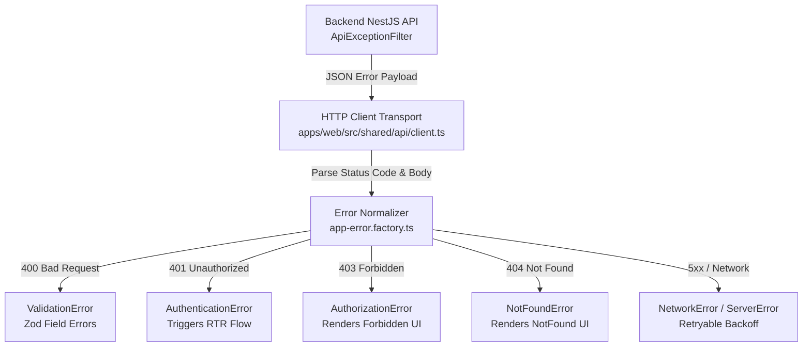
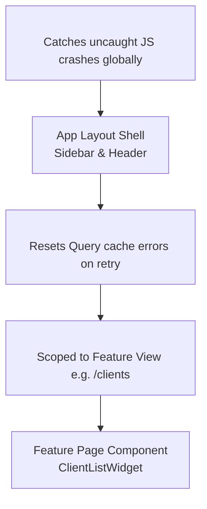
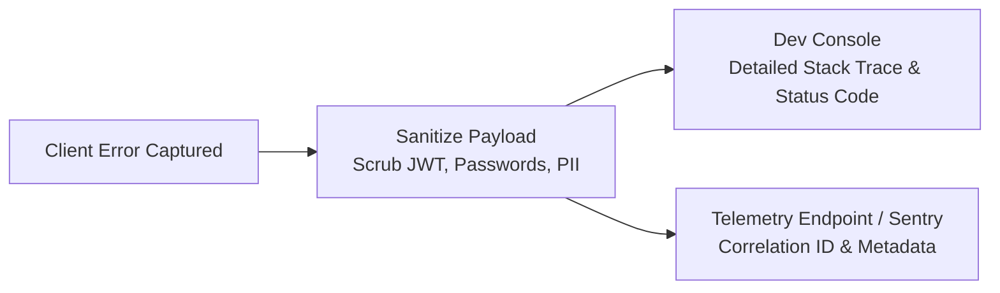

# Frontend Error Handling Strategy & Fault Tolerance Architecture

- **Status:** Active / Authoritative Standard
- **Scope:** `@kinergy-platform/web` (`apps/web/`), `@kinergy-platform/ui`, and Workspace Packages
- **Target Frameworks:** React, React Router, TanStack Query, React Hook Form, Zod, Sonner (Toasts)

---

## 1. Executive Summary & Principles

The Kinergy Platform frontend enforces a centralized, resilient **Error Handling Architecture** designed to catch errors early, preserve application state wherever possible, provide actionable remediation feedback to users, and log diagnostic telemetry for engineering teams.

The error handling strategy is built around four core principles:

1. **Backend Alignment & Contract Consistency**: Client error normalization mirrors the NestJS `ApiExceptionFilter` JSON payload contract (`{ statusCode, error, message, timestamp, path, details }`).
2. **Explicit Error Classification (Recoverable vs. Flow-Terminating)**: Errors are strictly categorized as either **Recoverable** (user can retry or fix inputs) or **Flow-Terminating** (view or session must be redirected/resetted).
3. **Layered Error Boundaries**: Component boundaries catch uncaught JavaScript runtime exceptions without crashing the entire application shell.
4. **Context-Aware Display Channels**: Validation errors are rendered inline; page data failures render component error states (`<ErrorAlert />`); background action failures trigger toast notifications (`toast.error()`).

---

## 2. Backend Exception Alignment & Client Error Normalization



### Backend JSON Error Payload Standard

All REST API errors returned by Kinergy Platform backend microservices conform to the NestJS global filter payload structure:

```json
{
  "statusCode": 400,
  "error": "Bad Request",
  "message": "Validation failed for client registration payload.",
  "timestamp": "2026-08-04T10:55:00.000Z",
  "path": "/api/v1/clients",
  "details": {
    "taxId": ["Tax ID must be a valid 9-digit alphanumeric string."]
  }
}
```

### Client Normalized Error Classes

All HTTP errors are transformed into instances of standard `AppError` base class:

```typescript
// Location: apps/web/src/shared/errors/app-error.ts
export abstract class AppError extends Error {
  abstract readonly isRecoverable: boolean;

  constructor(
    public override readonly message: string,
    public readonly statusCode: number,
    public readonly code: string,
    public readonly details?: Record<string, string[]>,
    public readonly correlationId?: string,
  ) {
    super(message);
    Object.setPrototypeOf(this, new.target.prototype);
  }
}

export class ValidationError extends AppError {
  readonly isRecoverable = true;
  constructor(message: string, details?: Record<string, string[]>) {
    super(message, 400, 'VALIDATION_ERROR', details);
  }
}

export class AuthenticationError extends AppError {
  readonly isRecoverable = true; // Recoverable via RTR token refresh
  constructor(message = 'Session expired. Please log in again.') {
    super(message, 401, 'UNAUTHORIZED');
  }
}

export class AuthorizationError extends AppError {
  readonly isRecoverable = false; // Flow-terminating: user lacks permission
  constructor(message = 'You do not have permission to perform this action.') {
    super(message, 403, 'FORBIDDEN');
  }
}

export class NotFoundError extends AppError {
  readonly isRecoverable = false; // Flow-terminating: entity does not exist
  constructor(message = 'The requested resource was not found.') {
    super(message, 404, 'NOT_FOUND');
  }
}

export class ServerError extends AppError {
  readonly isRecoverable = true; // Transient server error, retryable
  constructor(message = 'An unexpected server error occurred.') {
    super(message, 500, 'INTERNAL_SERVER_ERROR');
  }
}
```

---

## 3. Error Taxonomies & Recoverable vs. Flow-Terminating Matrix

| Error Type            | Status Code |    Classification    | Action / Remediation                                                                   | UI Render Channel                     |
| :-------------------- | :---------: | :------------------: | :------------------------------------------------------------------------------------- | :------------------------------------ |
| **Validation Errors** |    `400`    |   **Recoverable**    | User corrects form inputs and resubmits.                                               | Inline field text (`<FormMessage />`) |
| **Unauthorized**      |    `401`    |   **Recoverable**    | Automatic Refresh Token Rotation (RTR) retry; if RTR fails, redirect to `/auth/login`. | Auth Modal / Toast                    |
| **Forbidden**         |    `403`    | **Flow-Terminating** | Block action or redirect to `/403`. User lacks permission (`@RequirePermissions`).     | `<ForbiddenAlert />` Component        |
| **Not Found**         |    `404`    | **Flow-Terminating** | Redirect route or render localized 404 state. Resource missing.                        | `<NotFoundState />` Component         |
| **Server / Network**  | `500 - 504` |   **Recoverable**    | Automatic exponential backoff retry via TanStack Query; manual retry button.           | `<ErrorAlert retry={refetch} />`      |
| **Uncaught JS Crash** |    `N/A`    | **Flow-Terminating** | Caught by React Error Boundary. Prevents entire application crash.                     | `<RootErrorBoundary />` Full Page     |

---

## 4. React Error Boundary Hierarchy



### Boundary Implementation Standards

1. **Global Root Boundary (`<RootErrorBoundary />`)**: Catches uncaught runtime JavaScript exceptions at application root. Renders full-page error view with "Reload Application" and "Contact Support" options.
2. **Feature Module Boundary (`<FeatureErrorBoundary />`)**: Wraps feature routes (`/clients`, `/scheduling`). If a component inside the feature crashes, the boundary catches it and renders a localized error card inside the main page area without destroying the header navigation or sidebar.
3. **Query Error Reset Boundary**: Integrates with TanStack Query's `<QueryErrorResetBoundary />` to automatically reset query error states when users click "Try Again".

```tsx
// Location: apps/web/src/shared/components/feature-error-boundary.tsx
import React, { Component, ReactNode } from 'react';
import { Button } from '@kinergy-platform/ui';

interface Props {
  children: ReactNode;
  fallbackTitle?: string;
}

interface State {
  hasError: boolean;
  error?: Error;
}

export class FeatureErrorBoundary extends Component<Props, State> {
  public override state: State = { hasError: false };

  public static getDerivedStateFromError(error: Error): State {
    return { hasError: true, error };
  }

  public override componentDidCatch(error: Error, errorInfo: React.ErrorInfo): void {
    // Dispatch to telemetry service
    console.error('[FeatureErrorBoundary Caught Error]', error, errorInfo);
  }

  public override render(): ReactNode {
    if (this.state.hasError) {
      return (
        <div className="p-6 border border-destructive/20 rounded-lg bg-destructive/5 text-center">
          <h3 className="text-lg font-semibold text-destructive">
            {this.props.fallbackTitle || 'Failed to load feature content'}
          </h3>
          <p className="text-sm text-muted-foreground mt-2">
            An unexpected error occurred while rendering this feature view.
          </p>
          <Button className="mt-4" onClick={() => this.setState({ hasError: false })}>
            Reset Component
          </Button>
        </div>
      );
    }
    return this.props.children;
  }
}
```

---

## 5. UI Notification Channels & Display Strategy

```mermaid
graph TD
    ERR[Error Triggered] --> TYPE{Error Category}

    TYPE -->|Form Input Validation| INLINE[Inline Field Error<br/><FormMessage />]
    TYPE -->|Page Load Fetch Failure| COMP[Component 4-State Error<br/><ErrorAlert retry={refetch} />]
    TYPE -->|Background Action / Mutation| TOAST[Toast Notification<br/>toast.error()]
```

### Channel Selection Rules

1. **Inline Field Validation Errors**:
   - Used exclusively for `400 Bad Request` validation errors and Zod client form validations.
   - Displayed directly underneath the affected input element (`<FormMessage />`).
2. **Component 4-State Error Views (`<ErrorAlert />`)**:
   - Used when page data or widget fetching fails (`500`, `503`, `network error`).
   - Replaces component content with an explicit error alert card containing a **Try Again** retry button.
3. **Toast Notifications (`toast.error()`)**:
   - Used for background mutations (e.g., submitting a form, deleting a record, updating settings).
   - Keeps user on the current page while displaying a non-intrusive floating toast message detailing the failure.

---

## 6. TanStack Query Retry Policy & Exponential Backoff

All API query hooks configure explicit retry behavior based on error classification:

```typescript
// Location: apps/web/src/shared/api/query-client.ts
import { QueryClient } from '@tanstack/react-query';
import { AppError } from '../errors/app-error';

export const queryClient = new QueryClient({
  defaultOptions: {
    queries: {
      retry: (failureCount, error) => {
        // Do NOT retry client errors (400, 401, 403, 404)
        if (error instanceof AppError && error.statusCode < 500) {
          return false;
        }
        // Retry server errors and network drops up to 3 times
        return failureCount < 3;
      },
      retryDelay: (attemptIndex) => Math.min(1000 * 2 ** attemptIndex, 30000), // Exponential backoff: 1s, 2s, 4s, max 30s
    },
    mutations: {
      retry: false, // Never automatically retry mutations to prevent duplicate side effects
    },
  },
});
```

---

## 7. Logging, Telemetry & Diagnostics Strategy



### Data Sanitization & Security Rules

- **PII & Credential Scrubbing**: Before transmitting logs to Sentry or OpenTelemetry backend endpoints, all request payloads are sanitized to strip passwords, JWT tokens, credit card numbers, and health records.
- **Correlation ID Tracking**: All HTTP requests pass `x-correlation-id` headers. When an error occurs, the correlation ID is included in telemetry logs to allow instant cross-tracing with NestJS backend microservice logs.

### User-Friendly Messaging vs. Developer Diagnostics

| Viewer Target                  | Content Included                                                      | Example Output                                                                            |
| :----------------------------- | :-------------------------------------------------------------------- | :---------------------------------------------------------------------------------------- |
| **End User**                   | Plain language, actionable remediation advice, no technical jargon.   | _"Unable to save client changes. Please check your network connection and try again."_    |
| **Developer Console / Sentry** | HTTP status, backend code, correlation ID, endpoint URL, stack trace. | `[ApiError 500] POST /api/v1/clients failed. Code: DB_TIMEOUT. CID: req_98234a. Stack...` |

---

## 8. Architectural Decision Records (ADR Style)

---

### [ADR-FE-0029] NestJS ApiExceptionFilter Payload Normalization Standard

- **Decision**: Adopt NestJS `ApiExceptionFilter` JSON structure (`{ statusCode, error, message, timestamp, path, details }`) as the authoritative client error payload specification.
- **Context**: Inconsistent backend error formats cause parsing failures and unhandled generic error messages on the frontend.
- **Rationale**: Direct alignment with backend exception filters ensures predictable client error parsing and seamless form validation mapping.
- **Consequences**: All API client interceptors transform raw HTTP responses into normalized `AppError` instances.
- **Future Evolution**: Supports multi-language i18n error code translations via backend error code keys.

---

### [ADR-FE-0030] Explicit Classification of Recoverable vs. Flow-Terminating Errors

- **Decision**: Categorize every error into either a Recoverable state (Form validation, retryable 5xx, RTR 401) or a Flow-Terminating state (403 Forbidden, 404 Not Found, Uncaught JS Crash).
- **Context**: Treating all errors identically leads to poor UX (e.g. redirecting users to login on a minor form validation error).
- **Rationale**: Explicit classification governs whether a component renders a retry button, displays a field error, or triggers a full route navigation.
- **Consequences**: Developers must specify recoverability when throwing custom domain errors.
- **Future Evolution**: Enables automated UX recovery flows based on error classification metadata.

---

### [ADR-FE-0031] Scoped Feature Error Boundaries Over Global App Shell Crashing

- **Decision**: Implement `<FeatureErrorBoundary />` around all sub-routes to isolate component crashes to individual feature views.
- **Context**: A single uncaught React error in a table column can crash the entire React DOM tree, losing un-saved work in other tabs.
- **Rationale**: Scoped boundaries preserve the top navigation bar and sidebar shell, keeping the rest of the application responsive.
- **Consequences**: Uncaught rendering errors display localized fallback cards instead of blank screens.
- **Future Evolution**: Integrates with automated error reporting hooks to trigger instant developer alerts.

---

### [ADR-FE-0032] Strict Exponential Backoff for 5xx Server Errors & Zero Retries for 4xx Client Errors

- **Decision**: Configure TanStack Query default retry policy to execute 3-attempt exponential backoff for 5xx/network errors while disabling retries for 4xx client errors.
- **Context**: Retrying 400 Bad Request or 403 Forbidden requests creates unnecessary network traffic and floods backend logs.
- **Rationale**: 4xx errors require user remediation (fixing input, authenticating); only 5xx server drops benefit from automatic retries.
- **Consequences**: Network requests fail fast on client errors while gracefully recovering from transient server glitches.
- **Future Evolution**: Supports adaptive retry backoff delays based on `Retry-After` HTTP headers.

---

## 9. Cross-References & Related Documentation

- [Frontend Architecture Vision](./architecture.md)
- [Frontend Engineering Principles](./principles.md)
- [Frontend Folder Structure & Architectural Boundaries](./folder-structure.md)
- [Frontend Routing Architecture & Navigation Strategy](./routing.md)
- [Frontend State Management Architecture & State Governance](./state-management.md)
- [Frontend API Architecture & Data Fetching Strategy](./api.md)
- [Frontend UI Architecture & Design System Strategy](./ui-architecture.md)
- [Frontend Testing Strategy & Quality Assurance Architecture](./testing.md)
- [Frontend Technical Glossary](./glossary.md)
- [Master Platform Documentation Index](../README.md)
