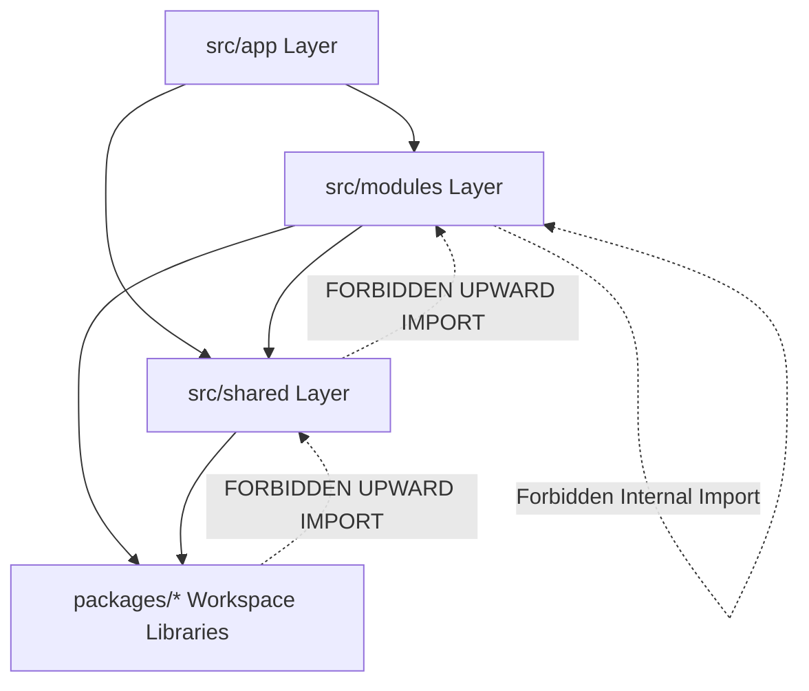

# Frontend Folder Structure & Architectural Boundaries

- **Status:** Active / Authoritative Standard
- **Scope:** `apps/web/src/` and Workspace Packages (`packages/*`)
- **Target Application:** `@kinergy-platform/web` (React 18 + Vite)

---

## 1. Overview & Architectural Goals

To prevent code decay, high coupling, and circular dependencies as the Kinergy Platform frontend grows, `apps/web/src/` enforces a **Feature-First, Modular Monolith Directory Taxonomy**.

This taxonomy guarantees:

1. **Strict Context Isolation**: Domain modules mirror backend Bounded Contexts without cross-domain leakages.
2. **Predictable Code Discovery**: Standardized internal file organization within every domain module.
3. **Encapsulated Public API Contracts**: Modules expose explicit public boundaries via `index.ts`, hiding internal implementation details.
4. **Clean Layering**: Inward-only dependency flow with zero business logic in shared packages.

---

## 2. Directory Hierarchy Overview

```
apps/web/src/
├── app/                  # Application Bootstrap & Central Shell
│   ├── layouts/          # Top-level application layout wrappers (MainLayout, AuthLayout)
│   ├── providers/        # Global providers (TanStack QueryClientProvider, RouterProvider)
│   ├── routes/           # Central hybrid router shell & top-level route declarations
│   ├── main.tsx          # Application entry point & DOM mounting
│   └── index.ts          # App shell public exports
├── modules/              # Bounded Domain Feature Modules (Domain Logic & Views)
│   ├── auth/             # Identity & Access Management Feature Module
│   ├── client/           # Client Profile Administration Feature Module
│   ├── energy/           # Energy Monitoring & Telemetry Feature Module
│   └── analytics/        # Energy Trends & Reporting Feature Module
├── shared/               # Cross-Cutting Application Infrastructure (Domain-Agnostic)
│   ├── components/       # App-specific reusable composite components (Header, Footer, Nav)
│   ├── hooks/            # Low-level browser/DOM hooks (useWindowSize, useLocalStorage)
│   ├── lib/              # Third-party client instantiations (Axios/Fetch HTTP transport)
│   ├── styles/           # Global CSS variables, HSL design tokens, Tailwind setup
│   ├── types/            # App-wide technical DTO envelopes & HTTP error interfaces
│   └── index.ts          # Shared application public exports
├── assets/               # Static Application Media & Styling Assets
│   ├── images/           # Static raster images (logos, illustrations, placeholders)
│   ├── fonts/            # Custom web fonts
│   └── icons/            # App-wide SVG icon definitions
└── test/                 # Test Infrastructure & Component Harnesses
    ├── handlers/         # MSW (Mock Service Worker) API request handlers
    ├── mocks/            # Centralized test fixtures & mock DTO factories
    ├── setup.ts          # Jest / Vitest global environment setup
    └── test-utils.tsx    # Custom React Testing Library render wrapper (Query + Router)
```

### Shared Workspace Packages (`packages/`)

```
packages/
├── ui/                   # Pure Atomic UI Design System Primitives (Button, Dialog, Input)
├── utils/                # Pure Utility Functions (formatting, date calculations, math)
├── validation/           # Shared Zod Schemas (email, password, pagination DTO validation)
├── types/                # Shared Workspace TypeScript Contracts & Standard Envelopes
└── config/               # Shared Workspace Configuration Rules
```

---

## 3. Directory Specifications & Ownership Rules

| Directory Path          | Architectural Layer | Primary Responsibility                                                                                       | Code Ownership                        |
| :---------------------- | :------------------ | :----------------------------------------------------------------------------------------------------------- | :------------------------------------ |
| `apps/web/src/app/`     | Application Shell   | App bootstrap, global providers, root layout shells, top-level hybrid router delegation.                     | **Platform Frontend Team**            |
| `apps/web/src/modules/` | Domain Layer        | Bounded domain feature modules encapsulating queries, UI components, custom hooks, forms, routes, and types. | **Domain Feature Teams**              |
| `apps/web/src/shared/`  | Application Shared  | Cross-cutting app utilities, HTTP transport adapters, generic app components, global CSS tokens.             | **Platform Frontend Team**            |
| `apps/web/src/assets/`  | Static Assets       | Static branding imagery, SVGs, custom web fonts, and visual media.                                           | **Design & UI Team**                  |
| `apps/web/src/test/`    | Test Harness        | Test setup scripts, MSW network mocks, RTL custom render function, test factories.                           | **Quality Assurance / Frontend Lead** |
| `packages/ui`           | Design System       | Pure atomic visual primitives (domain-agnostic).                                                             | **Design System Team**                |
| `packages/utils`        | Shared Utilities    | Pure utility functions (zero side-effects).                                                                  | **Platform Core Team**                |
| `packages/validation`   | Validation          | Zod schema validation rules for base DTOs and inputs.                                                        | **Platform Core Team**                |

---

## 4. Internal Architecture of a Domain Module (`src/modules/<domain>/`)

Every feature inside `apps/web/src/modules/` enforces a standardized, co-located directory structure:

```
apps/web/src/modules/client/
├── api/                    # TanStack Query options, query keys, API fetchers
│   ├── use-client-query.ts # Query hook for fetching client profile
│   ├── use-update-client.ts# Mutation hook for updating client data
│   └── query-keys.ts       # Centralized TanStack Query key factory for feature
├── components/             # Feature-specific UI components
│   ├── client-card.tsx     # Display component for client profile
│   ├── client-form.tsx     # Form component for creating/updating client
│   └── client-status.tsx   # Domain status badge component
├── hooks/                  # Feature-specific custom React hooks
│   └── use-client-filter.ts# Custom hook managing local client filter state
├── routes/                 # Feature route view declarations
│   ├── client-detail-page.tsx # Page view for client detail route
│   ├── client-list-page.tsx   # Page view for client listing route
│   └── routes.tsx          # Feature sub-route table declaration
├── types/                  # Feature DTOs, view models, and domain interfaces
│   └── index.ts            # Client module DTO definitions
├── utils/                  # Pure feature-specific formatting & domain helpers
│   └── client-formatters.ts# Client-specific formatting utilities
└── index.ts                # Mandatory Public API Contract for the feature module
```

---

## 5. Public API Contracts via `index.ts`

To enforce encapsulation, every domain module (`src/modules/<domain>/`) **MUST** maintain a top-level `index.ts` file.

### Public API Rules

1. **Expose Minimum Necessary Surface**: `index.ts` exports only the routes, public hooks, top-level components, and DTO types intended for external consumption.
2. **Hide Internal Implementation Details**: Internal helpers, private components, query keys, and fetcher instances must **NOT** be exported.
3. **No Direct Deep Imports**: External files must import from `@/modules/<domain>` or `@/features/<domain>`. Reaching into internal paths (e.g., `@/modules/client/components/internal-card`) is **strictly forbidden**.

```typescript
// Example: apps/web/src/modules/client/index.ts (Public API Contract)

// 1. Export Feature Routes & Pages
export { ClientListPage } from './routes/client-list-page';
export { ClientDetailPage } from './routes/client-detail-page';
export { clientRoutes } from './routes/routes';

// 2. Export Public Feature Components
export { ClientStatusBadge } from './components/client-status';

// 3. Export Public Custom Hooks
export { useClientQuery } from './api/use-client-query';

// 4. Export Public DTOs & Types
export type { ClientDTO, ClientStatusEnum } from './types';
```

---

## 6. Dependency Matrix & Import Rules

Dependencies must flow strictly inward. Higher layers may import lower layers, but lower layers may **NEVER** import higher layers. Inter-module dependencies at the same level are restricted.



### Layer Import Matrix

| Requesting File Location | May Import From                                                    | FORBIDDEN Imports                                    | Rationale                                                            |
| :----------------------- | :----------------------------------------------------------------- | :--------------------------------------------------- | :------------------------------------------------------------------- |
| `src/app/`               | `src/modules/*` (via Public API), `src/shared/`, `packages/*`      | Internal paths of `modules` (`/components/internal`) | App shell orchestrates modules via public contracts.                 |
| `src/modules/A/`         | `src/shared/`, `packages/*`, `src/modules/B` (**Public API ONLY**) | Deep internal paths of `modules/B/components/*`      | Prevents context leakage and maintains module independence.          |
| `src/shared/`            | `packages/*`                                                       | `src/app/`, `src/modules/*`                          | Shared layer is domain-agnostic; cannot depend on domain modules.    |
| `packages/ui`            | External visual libraries (`clsx`, `lucide-react`)                 | `src/*`, `packages/utils`, `packages/validation`     | UI primitives must be pure visual components without business logic. |
| `packages/utils`         | Pure math/date libraries (`date-fns`)                              | `src/*`, `packages/ui`, `packages/validation`        | Pure utilities must have zero side-effects.                          |

---

## 7. Concrete Import Examples & Architectural Rationale

### Correct Import Examples

#### Example 1: App Router importing Feature Module Public API

```typescript
// Location: apps/web/src/app/routes/app-router.tsx
// CORRECT: Importing explicitly from feature module public API boundary (index.ts)
import { ClientListPage, ClientDetailPage } from '@/modules/client';
import { EnergyDashboardPage } from '@/modules/energy';
import { MainLayout } from '@/app/layouts/main-layout';
```

> **Rationale**: The app router consumes feature page components through their explicit public API contract without knowing internal component directory structures.

#### Example 2: Feature Module importing Shared Infrastructure & UI Package

```typescript
// Location: apps/web/src/modules/client/components/client-card.tsx
// CORRECT: Feature component consuming pure UI primitives and shared formatting utilities
import { Button, Card, Badge } from '@kinergy-platform/ui';
import { formatDate } from '@kinergy-platform/utils';
import { useHttpClient } from '@/shared/lib/http-client';
import type { ClientDTO } from '../types';
```

> **Rationale**: Feature modules freely depend on shared UI primitives (`packages/ui`), workspace utilities (`packages/utils`), and shared application HTTP transport (`shared/lib`).

---

### Incorrect Import Examples (Forbidden Anti-Patterns)

#### Example 1: Deep Import into Feature Internal Implementation Details

```typescript
// Location: apps/web/src/modules/energy/components/energy-card.tsx
// FORBIDDEN / INCORRECT: Deep import reaching into client module internal directory!
import { InternalClientHeader } from '@/modules/client/components/internal-header';
```

> **Why it fails**: Bypasses the client module's public API contract (`index.ts`). If the client team refactors `components/internal-header`, the energy module will break.
> **Fix**: Either expose `ClientHeader` in `modules/client/index.ts` if intended for public use, or move the common header visual element to `packages/ui`.

#### Example 2: Shared Layer Importing Domain Module (Upward Leaking Dependency)

```typescript
// Location: apps/web/src/shared/components/header.tsx
// FORBIDDEN / INCORRECT: Shared application component depending on a domain feature!
import { useClientQuery } from '@/modules/client/api/use-client-query';
import type { ClientDTO } from '@/modules/client/types';
```

> **Why it fails**: Violates layer dependency discipline. Shared code must be domain-agnostic. Importing `modules/client` into `shared/` creates circular dependencies and prevents reusing `Header` in other contexts.
> **Fix**: Pass client profile data or custom slot callbacks as generic props (`userDisplayName`, `onLogout`) to the `Header` component.

#### Example 3: Shared UI Package Calling API / Importing App Code

```typescript
// Location: packages/ui/src/button.tsx
// FORBIDDEN / INCORRECT: UI primitive importing application HTTP client!
import { httpClient } from '@/shared/lib/http-client';
```

> **Why it fails**: Design system packages in `packages/ui` must remain 100% domain and transport agnostic.
> **Fix**: UI components communicate strictly via standard props (`onClick`, `disabled`, `children`).

---

## 8. Architectural Decision Records (ADR Style)

---

### [ADR-FE-0005] Canonical Folder Taxonomy Specification (`app/`, `modules/`, `shared/`, `assets/`, `test/`)

- **Decision**: Adopt `apps/web/src/` canonical folder taxonomy comprising `app/`, `modules/`, `shared/`, `assets/`, and `test/`.
- **Context**: Unstructured frontend source trees result in scattered files, duplicated helpers, and broken module boundaries as teams grow.
- **Rationale**: Categorizing code into explicit functional directories establishes a clear home for every file type, aligning frontend modules with backend Bounded Contexts.
- **Consequences**: Developers follow identical folder organization across all feature modules.
- **Future Evolution**: Feature modules in `src/modules/` are pre-structured for seamless extraction into separate monorepo workspace packages (`packages/feature-<name>`).

---

### [ADR-FE-0006] Mandatory Public API Contracts via Top-Level `index.ts`

- **Decision**: Enforce that every directory inside `src/modules/` MUST export its public interface via a top-level `index.ts` file.
- **Context**: Unrestricted imports between internal feature files create tight coupling and brittle refactoring boundaries.
- **Rationale**: Public API contracts create explicit encapsulation boundaries. Internal refactoring inside a feature module will not break external consumers if the public `index.ts` contract remains stable.
- **Consequences**: Direct deep imports into feature subdirectories are blocked by ESLint boundary rules.
- **Future Evolution**: Simplifies tracking public API changes across feature modules.

---

### [ADR-FE-0007] Strict Inward-Only Layer Dependency Matrix

- **Decision**: Enforce a strict inward-only layer dependency flow: `app` -> `modules` -> `shared` -> `packages/*`.
- **Context**: Circular dependencies and upward imports (e.g., shared components importing domain features) degrade build performance and create complex dependency graphs.
- **Rationale**: Enforcing unidirectional dependencies guarantees predictable build ordering, prevents circular reference runtime errors, and isolates core utilities.
- **Consequences**: Requires developers to keep shared components domain-agnostic via prop injection.
- **Future Evolution**: Facilitates automated tree-shaking and optimized production bundle splitting.

---

### [ADR-FE-0008] Shared Infrastructure Zero-Domain-Logic Rule

- **Decision**: Ban all domain business logic, API queries, and feature entity definitions from `src/shared/` and `packages/*`.
- **Context**: Shared UI libraries often accumulate feature-specific `if/else` checks, polluting generic components.
- **Rationale**: Keeping shared packages pure ensures high reusability across multiple web applications and partner portals.
- **Consequences**: Feature-specific UI logic must reside in feature modules (`src/modules/`), consuming shared packages purely as primitives.
- **Future Evolution**: Enables publishing `packages/ui` as an external enterprise design system library.

---

## 9. Prevention of Architectural Erosion

To ensure that these folder boundaries are strictly respected over time without relying solely on manual code reviews, the platform enforces automated linting and continuous integration checks:

### Automated Boundary Enforcement (`eslint.config.js`)

```javascript
// ESLint Module Boundary & Import Restriction Configuration
module.exports = [
  {
    files: ['apps/web/src/shared/**/*'],
    rules: {
      'no-restricted-imports': [
        'error',
        {
          patterns: [
            {
              group: ['@/modules/*', '@/app/*'],
              message:
                'Shared application infrastructure MUST NOT import from domain modules or app shell.',
            },
          ],
        },
      ],
    },
  },
  {
    files: ['packages/ui/src/**/*'],
    rules: {
      'no-restricted-imports': [
        'error',
        {
          patterns: [
            {
              group: ['@/*', '@/modules/*', '@/shared/*'],
              message: 'Packages UI primitives MUST NOT import application source code.',
            },
          ],
        },
      ],
    },
  },
];
```

---

## 10. Cross-References & Related Documentation

- [Frontend Architecture Vision](./architecture.md)
- [Frontend Engineering Principles](./principles.md)
- [Frontend Routing Architecture & Navigation Strategy](./routing.md)
- [Frontend State Management Architecture & State Governance](./state-management.md)
- [Frontend API Architecture & Data Fetching Strategy](./api.md)
- [Frontend UI Architecture & Design System Strategy](./ui-architecture.md)
- [Frontend Technical Glossary](./glossary.md)
- [Master Platform Documentation Index](../README.md)
