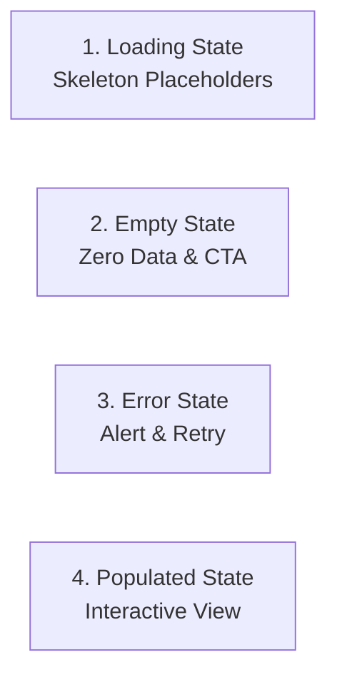
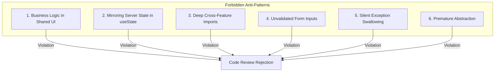

# Frontend Engineering Principles & Design Guidelines

- **Status:** Active / Authoritative Engineering Guidelines
- **Scope:** All Frontend Engineering (`apps/web`, `packages/*`)
- **Target Audience:** Frontend Engineers, Full-Stack Developers, Architects

---

## 1. Overview & Core Philosophy

This document defines the mandatory **engineering principles**, design guidelines, and code conventions for the Kinergy Platform frontend. Every frontend code addition, refactoring, and architectural choice must align with these principles to ensure high maintainability, strict boundary isolation, type safety, and optimal user experience.

---

## 2. Mandatory Engineering Principles

Each principle is structured in ADR-style format detailing the **Decision**, **Context**, **Rationale**, **Consequences**, and **Future Evolution**.

---

### Principle 1: Mirror Backend Bounded Contexts

#### Decision

Frontend feature modules (`apps/web/src/features/<feature-name>`) must directly mirror backend DDD Bounded Contexts (`platform/identity`, `modules/client`, `contexts/energy`, `contexts/analytics`).

#### Context

In complex enterprise applications, misalignment between frontend directories and backend domain boundaries leads to confusion, scattered API integrations, and inconsistent vocabulary across the stack.

#### Rationale

Mirroring backend bounded contexts establishes a single **Ubiquitous Language** across frontend and backend engineers. Domain entities, business terms, and context boundaries map 1:1, reducing cognitive load and improving maintainability.

#### Consequences

- Developers instantly know where a feature's code resides.
- Feature teams can work independently on feature modules matching backend domain teams.

#### Future Evolution

Facilitates extracting bounded context feature modules into separate Nx workspace libraries or micro-frontend packages as the platform scales.

---

### Principle 2: Feature-First Architecture

#### Decision

Organize frontend code by **Feature Modules** (`features/<domain>/`) rather than technical layers (`components/`, `hooks/`, `api/` at global root).

#### Context

Global layer directories (e.g., a top-level `components/` folder containing hundreds of files) become unmanageable as applications grow, leading to high coupling and obscure feature ownership.

#### Rationale

Feature-first organization groups related components, hooks, API queries, types, forms, and tests together within a self-contained feature directory.

```
features/client/
├── api/          # Query & mutation hooks
├── components/   # Co-located feature components
├── hooks/        # Feature custom hooks
├── routes/       # Feature route declarations
├── types/        # Feature DTOs
└── index.ts      # Enforced public API boundary
```

#### Consequences

- Deleting or refactoring a feature is clean and contained within its directory.
- Features enforce explicit public APIs via `index.ts`. Direct deep imports into internal feature paths are strictly prohibited by linting.

#### Future Evolution

Allows zero-friction migration of feature modules into dedicated NPM workspace packages when required.

---

### Principle 3: Hybrid Feature Routing

#### Decision

Use a **Hybrid Feature Routing** pattern: a central layout router (`routes/app-router.tsx`) mounts top-level layouts and delegates sub-routes to co-located feature route registries (`features/<feature>/routes`).

#### Context

Centralized monolithic routing tables cause frequent git merge conflicts and obscure route ownership when multiple developers work on different features simultaneously.

#### Rationale

Hybrid routing combines the benefits of centralized layout management with decentralized, feature-owned route definitions.

#### Consequences

- Feature additions require zero modifications to global router files.
- Simplifies lazy-loading (`React.lazy`) and dynamic route registration per feature.

#### Future Evolution

Enables dynamic feature module loading based on user roles or feature flags at runtime.

---

### Principle 4: Zero Business Logic in Shared Layer

#### Decision

Shared packages (`packages/ui`, `packages/utils`) and global UI components (`src/components/ui`) must contain **ZERO business logic**, API calls, or domain model references.

#### Context

Leaking business rules into shared UI components creates hidden dependencies, breaking reusable primitives and making design system updates hazardous.

#### Rationale

Shared code must remain strictly domain-agnostic. UI primitives (buttons, dialogs, inputs) must only handle visual presentation, layout, and accessibility, accepting generic props and callback handlers.

#### Consequences

- `packages/ui` can be tested and rendered in isolation (e.g., Storybook) without mocking backend APIs or contexts.
- Prevents visual components from becoming tightly coupled to specific backend domain schemas.

#### Future Evolution

Enables publishing `packages/ui` as a standalone enterprise design system library for external partner portals or secondary web apps.

---

### Principle 5: Composition Over Inheritance

#### Decision

Build composite UI and component behaviors through **React Component Composition** (slots, render props, `children` composition) rather than monolithic props or class inheritance.

#### Context

Monolithic components with dozens of configuration flags (`isHeaderVisible`, `showFooter`, `customCardStyle`, `hasBorder`) quickly become unmaintainable and rigid.

#### Rationale

Composition allows building complex interfaces by nesting specialized, focused components together.

```tsx
// Preferred Composition Pattern
<Card>
  <CardHeader title="Energy Telemetry" />
  <CardContent>
    <TelemetryChart data={data} />
  </CardContent>
  <CardFooter>
    <Button variant="outline">Export CSV</Button>
  </CardFooter>
</Card>
```

#### Consequences

- Dramatically reduces component prop inflation.
- Enhances visual flexibility without touching core component internals.

#### Future Evolution

Encourages building extensible slot-based design primitives across the enterprise design system.

---

### Principle 6: Just-In-Time Abstraction (Build Abstractions Only After Real Use Cases Exist)

#### Decision

Do NOT create generic utility functions, abstract wrapper components, or shared hooks until at least **3 distinct, real-world feature use cases** explicitly require them.

#### Context

Premature abstraction creates overly complex, generalized abstractions that fail to fit actual requirements, leading to code churn and technical debt.

#### Rationale

Duplicate code is far less expensive than the wrong abstraction. Waiting for concrete use cases ensures that abstractions are built against proven patterns.

#### Consequences

- Keeps code lightweight, readable, and straightforward.
- Prevents over-engineered wrapper components that obscure standard React APIs.

#### Future Evolution

Keeps the codebase clean and flexible, allowing abstractions to emerge organically when domain patterns stabilize.

---

### Principle 7: Strict State Separation Discipline

#### Decision

State MUST be categorized into dedicated channels and managed strictly by its designated tool:

| State Taxonomy         | Designated Tool                          | Responsible For                                                         |
| :--------------------- | :--------------------------------------- | :---------------------------------------------------------------------- |
| **Server State**       | TanStack Query (`@tanstack/react-query`) | Backend data fetching, caching, background refetching, invalidation.    |
| **URL State**          | React Router (`useSearchParams`)         | Search queries, data table filters, sorting, pagination, tab selection. |
| **Form State**         | React Hook Form + Zod                    | User input buffering, field validation errors, submission handling.     |
| **Transient UI State** | React `useState` / Context               | Modal open/close state, dropdown toggles, active hover indexes.         |

#### Context

Mixing server state with local `useState` or storing table filters in global state leads to stale data bugs, unshareable links, and unnecessary re-renders.

#### Rationale

Each state mechanism is optimized for its specific domain:

- TanStack Query eliminates manually managed `useEffect` fetch calls and local cache state.
- Persisting filters in URL parameters ensures every view state is shareable and bookmarkable.
- React Hook Form avoids re-rendering the whole component tree on every keystroke.

#### Consequences

- Zero duplication of server state in React local state.
- Fully shareable deep links across all data tables and dashboards.

#### Future Evolution

Simplifies adding real-time cache sync (WebSocket / SSE) by updating TanStack Query cache keys without touching component states.

---

### Principle 8: Mandatory 4-State UI Specification

#### Decision

Every feature view and data component MUST explicitly implement and support four visual states: **Loading**, **Empty**, **Error**, and **Populated**.



#### Context

Applications often fail to handle network errors or zero-data responses gracefully, leading to blank screens, layout jumps, or unhandled UI exceptions.

#### Rationale

Explicitly requiring all 4 states ensures a resilient, accessible, and high-quality user experience under all network conditions.

#### Consequences

- Code reviews enforce testing view layouts under zero-data and error conditions.
- Prevents broken UI layouts during background data refetches or API downtime.

#### Future Evolution

Enables standardized error recovery telemetry reporting when feature error states are triggered.

---

## 3. Frontend Anti-Patterns & Code Smells

To maintain high architectural standards, the following anti-patterns are strictly forbidden:



### 1. Leaking Business Logic into `shared/` or `packages/ui`

- **Anti-Pattern**: Putting API fetch calls, role permissions checks, or domain entity calculations inside `packages/ui` or `src/components/ui`.
- **Correct Approach**: Keep shared components pure; pass domain data via props or slots from feature components.

### 2. Mirroring Server Data in Local `useState` + `useEffect`

- **Anti-Pattern**:
  ```tsx
  // FORBIDDEN
  const [data, setData] = useState(null);
  useEffect(() => {
    fetch('/api/clients')
      .then((res) => res.json())
      .then(setData);
  }, []);
  ```
- **Correct Approach**: Use TanStack Query custom hooks (`useClientQuery()`).

### 3. Deep Imports Across Feature Boundaries

- **Anti-Pattern**: Importing internal feature components from another feature module:
  ```ts
  // FORBIDDEN
  import { InternalItem } from '@/features/client/components/internal-item';
  ```
- **Correct Approach**: Import only from the feature's public API (`@/features/client`) or extract shared primitives into `packages/ui`.

### 4. Unvalidated Form Inputs

- **Anti-Pattern**: Hand-crafted form state without Zod schema validation or type safety.
- **Correct Approach**: Standardize all forms on React Hook Form + Zod resolvers.

### 5. Swallowing API Errors / Missing Fallbacks

- **Anti-Pattern**: Wrapping API calls in empty `catch` blocks or rendering blank screens when data fails to load.
- **Correct Approach**: Render the explicit **Error State** card with retry triggers.

### 6. Premature Component Abstraction

- **Anti-Pattern**: Creating generic wrapper abstractions for single-use UI elements.
- **Correct Approach**: Keep UI code co-located in the feature until 3+ distinct features require identical behavior.

---

## 4. Architectural Quality Gates

Before any frontend pull request is approved, it must pass all mandatory quality gates:

1. **Format Gate**: `pnpm write` (Prettier formatting clean).
2. **Lint Gate**: `pnpm lint` (Zero ESLint warnings or boundary violations).
3. **Typecheck Gate**: `pnpm typecheck` (Zero TypeScript compilation errors).
4. **Test Gate**: `pnpm test` (100% unit and component test suites passing).
5. **Build Gate**: `pnpm build` (Successful Vite production bundle compilation).
6. **Validate Pipeline Gate**: `pnpm validate` (Full continuous integration baseline execution).

---

## 5. Related Documentation

- [Frontend Architecture Vision](./architecture.md)
- [Frontend Folder Structure & Architectural Boundaries](./folder-structure.md)
- [Frontend Routing Architecture & Navigation Strategy](./routing.md)
- [Frontend Technical Glossary](./glossary.md)
- [Master Platform Documentation Index](../README.md)
