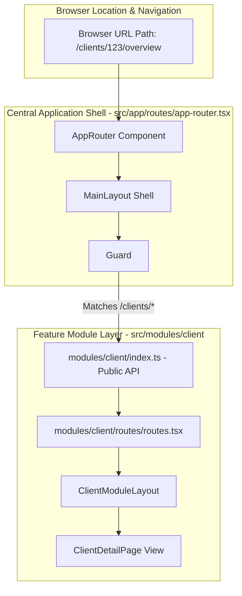
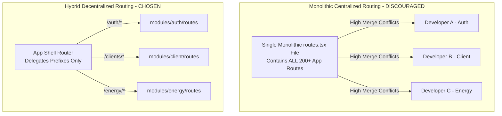
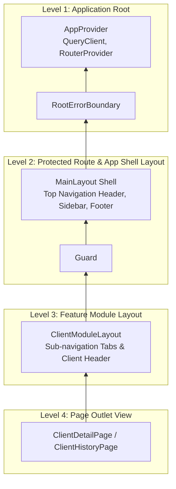
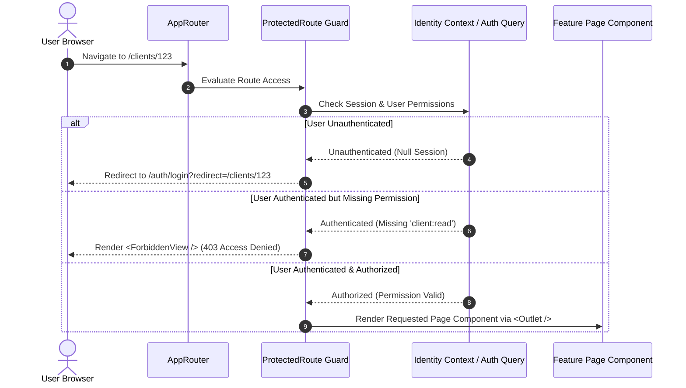
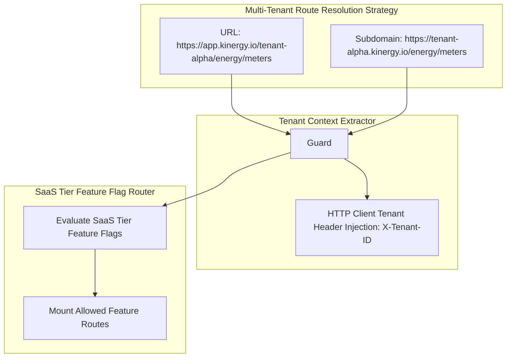

# Frontend Routing Architecture & Navigation Strategy

- **Status:** Active / Authoritative Routing Standard
- **Scope:** `apps/web/src/app/routes/`, `apps/web/src/modules/*/routes/`, and Frontend Navigation System
- **Target Framework:** React Router v6+ (`react-router-dom`) in `@kinergy-platform/web`

---

## 1. Executive Summary & Routing Philosophy

The Kinergy Platform frontend (`apps/web`) adopts a **Hybrid Feature Routing Strategy**.

Instead of maintaining a monolithic centralized route table that accumulates all application routes in a single file, routing responsibility is split into two clear architectural tiers:

1. **Central Application Router Shell (`apps/web/src/app/routes/app-router.tsx`)**: Responsible for top-level application layout wrapping, global fallback error boundaries, root provider mounting, and delegating sub-path route matching to domain modules.
2. **Decentralized Feature Module Routers (`apps/web/src/modules/<domain>/routes/`)**: Responsible for defining and co-locating domain sub-routes, view views, and layout tabs directly within their bounded feature module.

This approach guarantees zero git merge conflicts on global route files, enables lazy-loading code splitting per feature, and maintains strict Domain-Driven Design (DDD) module boundaries.

---

## 2. Hybrid Routing Strategy Architecture



### Application Router Shell (`apps/web/src/app/routes/app-router.tsx`)

The Application Router operates as the top-level orchestrator. Its responsibilities are strictly restricted to:

- Defining global top-level layout shells (`MainLayout` for authenticated app, `AuthLayout` for login/password reset).
- Mounting global top-level error boundaries (`RootErrorBoundary`) and catch-all 404 views (`NotFoundView`).
- Delegating route path prefixes (`/auth/*`, `/clients/*`, `/energy/*`, `/analytics/*`) to feature module route definitions exported via their public API contracts (`index.ts`).

### Feature Module Routers (`src/modules/<domain>/routes/`)

Each domain module encapsulates its own routing table:

- Feature routes are co-located alongside the feature's API queries, UI components, custom hooks, and forms.
- Feature routes use relative paths (`/`, `/:clientId`, `/:clientId/history`) scoped beneath the module's path prefix.
- Feature routes expose an explicit public API contract via `src/modules/<domain>/index.ts`. External application code imports routes only through the feature's top-level export.

---

## 3. Rationale: Why Hybrid Feature Routing vs. Centralized Routing

| Architectural Metric             | Centralized Routing Monolith                                      | Hybrid Feature Routing (Chosen)                                                                    | Rationale & Advantage                                                    |
| :------------------------------- | :---------------------------------------------------------------- | :------------------------------------------------------------------------------------------------- | :----------------------------------------------------------------------- |
| **Git Merge Conflicts**          | **HIGH**: Every developer adding a route modifies `routes.tsx`.   | **ZERO**: Developers add routes inside their isolated feature folder (`modules/<domain>/routes/`). | Eliminates continuous integration friction across parallel domain teams. |
| **Feature Ownership**            | **POOR**: Routes are separated from feature components and state. | **STRICT**: Routes are co-located within feature modules matching backend Bounded Contexts.        | Reinforces DDD boundary isolation and clear code ownership.              |
| **Code Splitting & Bundle Size** | **COMPLEX**: Manual setup required in global route tables.        | **AUTOMATIC**: Feature routes naturally split into on-demand JavaScript chunks via `React.lazy()`. | Optimizes initial page load performance and reduces bundle payload size. |
| **Module Extraction Readiness**  | **RIGID**: Tightly coupled to application root directory.         | **HIGH**: Feature routes export via `index.ts`, ready for extraction into standalone packages.     | Prepares frontend for future micro-frontend or sub-app architectures.    |



---

## 4. Hierarchical Nested Layout Pipeline

Routing layouts are structured hierarchically using React Router `<Outlet />` insertion points, guaranteeing clean visual inheritance without duplicated layout wrappers.



### Layout Responsibilities

1. **Root Layout (`src/app/providers/app-provider.tsx`)**:
   - Wraps the DOM tree with global providers (`QueryClientProvider`, `BrowserRouter`, `ThemeProvider`).
   - Renders the global `RootErrorBoundary` to catch unhandled JavaScript execution exceptions.
2. **Application Layout Shell (`src/app/layouts/main-layout.tsx`)**:
   - Renders sticky top navigation bar, global system branding logo, user profile dropdown, and main layout `<Outlet />`.
3. **Protected Route Wrapper (`src/app/routes/protected-route.tsx`)**:
   - Validates authentication token and authorization claims before rendering child routes via `<Outlet />`.
4. **Feature Module Layout (`src/modules/client/routes/client-module-layout.tsx`)**:
   - Renders feature-specific headers, contextual action bars, and sub-nav tab bars (`[Overview] [History] [Settings]`), delegating view rendering to inner `<Outlet />`.

---

## 5. Security & Route Guard Architecture

The routing architecture distinguishes between **Public Routes** and **Protected Routes**, aligning fine-grained client-side authorization guards with backend RBAC/ABAC security decorators (`@RequirePermissions()`).



### 1. Public Routes

Public routes bypass session verification and are accessible to anonymous visitors. Rendered inside `AuthLayout`:

- `/auth/login`: User authentication form.
- `/auth/reset-password`: Temporary password reset workflow.
- `/auth/unauthorized`: Generic 403 Forbidden alert view.

### 2. Protected Routes (`<ProtectedRoute />`)

Protected routes wrap authenticated application paths beneath `MainLayout`:

- Checks session validity with TanStack Query auth state (`useAuthQuery()`).
- Captures current location to enable post-login redirection (`redirect=/original-path`).

```tsx
// Example: Protected Route Guard Implementation
export const ProtectedRoute: React.FC = () => {
  const { user, isLoading, isAuthenticated } = useAuthQuery();
  const location = useLocation();

  if (isLoading) {
    return <PageSkeleton />;
  }

  if (!isAuthenticated || !user) {
    return (
      <Navigate to={`/auth/login?redirect=${encodeURIComponent(location.pathname)}`} replace />
    );
  }

  return <Outlet />;
};
```

### 3. Role & Permission Route Guards (`<HasPermission />`)

Fine-grained view authorization matching backend `@RequirePermissions('client:write')`:

```tsx
// Example: Declarative Permission Guard
<HasPermission name="client:write" fallback={<ForbiddenAlert />}>
  <Button onClick={handleArchiveClient}>Archive Client</Button>
</HasPermission>
```

---

## 6. Lazy Loading & Suspense Strategy

To ensure fast initial page loading times, all feature modules and secondary view pages MUST be code-split using `React.lazy()` and wrapped in `<Suspense />` boundaries.

### Code Splitting Architecture

```typescript
// Location: apps/web/src/app/routes/app-router.tsx
import React, { Suspense } from 'react';
import { Route, Routes } from 'react-router-dom';
import { MainLayout } from '@/app/layouts/main-layout';
import { ProtectedRoute } from './protected-route';
import { PageSkeleton } from '@/shared/components/skeletons';

// Lazy load feature module entry points
const ClientModule = React.lazy(() =>
  import('@/modules/client').then(m => ({ default: m.ClientRoutes }))
);
const EnergyModule = React.lazy(() =>
  import('@/modules/energy').then(m => ({ default: m.EnergyRoutes }))
);

export const AppRouter: React.FC = () => {
  return (
    <Suspense fallback={<PageSkeleton />}>
      <Routes>
        {/* Public Routes */}
        <Route path="/auth/*" element={<AuthRoutes />} />

        {/* Protected Application Routes */}
        <Route element={<ProtectedRoute />}>
          <Route path="/" element={<MainLayout />}>
            <Route path="clients/*" element={<ClientModule />} />
            <Route path="energy/*" element={<EnergyModule />} />
            <Route path="*" element={<NotFoundView />} />
          </Route>
        </Route>
      </Routes>
    </Suspense>
  );
};
```

---

## 7. Future SaaS & Multi-Tenant Routing Compatibility

The frontend routing architecture is pre-engineered to support multi-tenant SaaS requirements without requiring structural refactoring.



### 1. Tenant Context Resolution (`/:tenantId/*` or Subdomain)

- `TenantProvider` guard extracts the active tenant identifier from URL path parameters (`/:tenantId/dashboard`) or browser host subdomains (`tenant.kinergy.io`).
- Tenant ID is automatically bound to the HTTP client transport layer (`X-Tenant-ID` header) and TanStack Query cache keys (`['tenant', tenantId, 'clients']`).

### 2. SaaS Tier Feature Flag Route Mounting

- Sub-routes can be conditionally registered or guarded based on subscribed tenant SaaS tiers (e.g., Advanced Analytics routes are mounted only when `tenant.hasFeature('ADVANCED_ANALYTICS')` evaluates to `true`).

---

## 8. Navigation Ownership & Route Registration Conventions

### Ownership Matrix

| Routing File                                  | Responsible Owner          | Allowed Changes                                                                         |
| :-------------------------------------------- | :------------------------- | :-------------------------------------------------------------------------------------- |
| `apps/web/src/app/routes/app-router.tsx`      | **Platform Frontend Lead** | Adding top-level feature module path prefixes (`/new-feature/*`), global layout shells. |
| `apps/web/src/app/routes/protected-route.tsx` | **Platform Security Lead** | Authentication logic, session token checks, permission resolution algorithms.           |
| `apps/web/src/modules/<domain>/routes/`       | **Domain Feature Team**    | Adding internal feature sub-routes, module tab layouts, page views.                     |

### Step-by-Step Feature Route Registration Workflow

1. **Create Feature Routes File**: Inside `src/modules/<domain>/routes/routes.tsx`, define feature sub-routes using relative paths.
2. **Export Public Contract**: Export `FeatureRoutes` component from `src/modules/<domain>/index.ts`.
3. **Register Path Prefix in App Shell**: In `apps/web/src/app/routes/app-router.tsx`, mount the lazy-loaded feature component under its dedicated URL prefix (`<Route path="<domain>/*" element={<FeatureModule />} />`).

---

## 9. Architectural Decision Records (ADR Style)

---

### [ADR-FE-0009] Hybrid Decentralized Feature Routing Strategy

- **Decision**: Adopt a Hybrid Feature Routing pattern where `apps/web/src/app/routes/app-router.tsx` delegates sub-route matching to feature module route definitions (`src/modules/<domain>/routes/`).
- **Context**: Centralized monolithic route tables create continuous git merge conflicts and break DDD boundary isolation as engineering teams grow.
- **Rationale**: Hybrid routing combines centralized layout wrapping with feature-owned route co-location, eliminating merge conflicts and enforcing domain encapsulation.
- **Consequences**: Requires feature modules to export their route components through top-level public API contracts (`index.ts`).
- **Future Evolution**: Facilitates extracting domain feature modules into standalone Nx library packages or micro-frontend sub-applications.

---

### [ADR-FE-0010] Declarative Role & Permission Route Guard Architecture

- **Decision**: Implement declarative `<ProtectedRoute />` wrappers and `<HasPermission name="...">` components that mirror backend RBAC/ABAC security decorators (`@RequirePermissions()`).
- **Context**: Imperative security checks scattered across page components lead to missed authorization checks and unhandled 403 states.
- **Rationale**: Centralizing security checks in declarative route guards ensures consistent session verification, automatic post-login redirection, and standard 403 fallback views.
- **Consequences**: Page components assume valid authorization, keeping view logic clean and focused.
- **Future Evolution**: Supports dynamic permission resolution based on ABAC attributes returned in JWT session claims.

---

### [ADR-FE-0011] Feature-Level Lazy Loading & Suspense Standard

- **Decision**: Require all feature module entries and secondary view pages to be lazy-loaded using `React.lazy()` and wrapped in `<Suspense fallback={<PageSkeleton />}>`.
- **Context**: Loading the entire application bundle upfront degrades initial load times and increases initial JavaScript parsing overhead.
- **Rationale**: Code splitting at feature route boundaries ensures users download only the JavaScript required for their active view, dramatically improving Core Web Vitals.
- **Consequences**: Requires fallback UI skeleton loaders matching page layout bounds.
- **Future Evolution**: Supports route prefetching on link hover to eliminate navigation loading latency.

---

### [ADR-FE-0012] Multi-Tenant & SaaS-Tier Route Resolution Strategy

- **Decision**: Pre-engineer the router architecture to support path/subdomain tenant extraction and dynamic SaaS-tier feature flag route mounting.
- **Context**: Transitioning single-tenant web apps to multi-tenant SaaS often requires massive routing refactors.
- **Rationale**: Designing URL tenant context propagation and feature-flagged route registration hooks upfront ensures seamless SaaS expansion.
- **Consequences**: All route query keys and HTTP requests bind tenant identification context.
- **Future Evolution**: Enables custom tenant UI view overrides via dynamic route resolution.

---

## 10. Cross-References & Related Documentation

- [Frontend Architecture Vision](./architecture.md)
- [Frontend Engineering Principles](./principles.md)
- [Frontend Folder Structure & Architectural Boundaries](./folder-structure.md)
- [Frontend State Management Architecture & State Governance](./state-management.md)
- [Frontend API Architecture & Data Fetching Strategy](./api.md)
- [Frontend Technical Glossary](./glossary.md)
- [Master Platform Documentation Index](../README.md)
