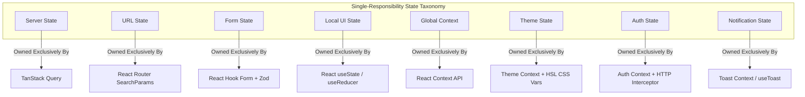
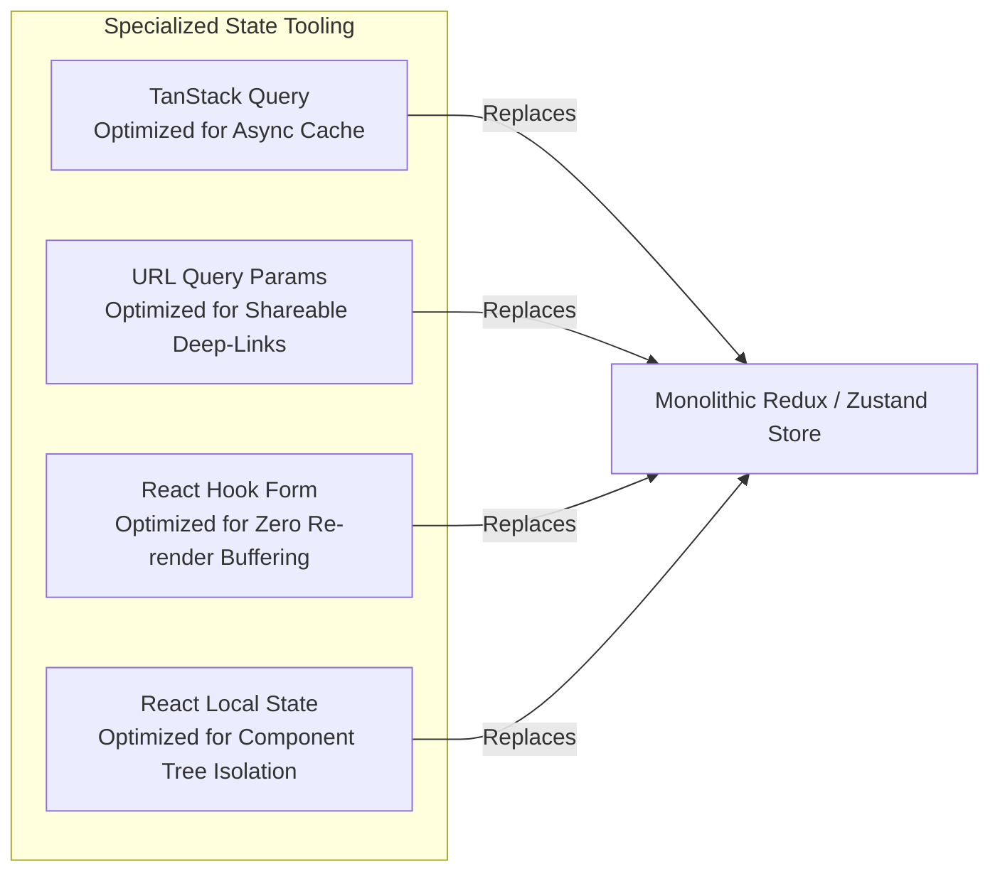
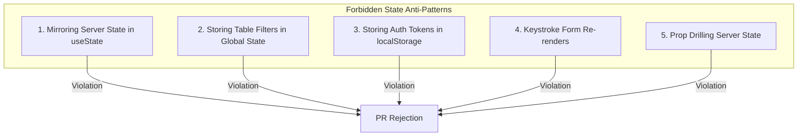

# Frontend State Management Architecture & State Governance

- **Status:** Active / Authoritative Standard
- **Scope:** `@kinergy-platform/web` (`apps/web/src/`) and Workspace Packages (`packages/*`)
- **Target Application:** Kinergy Platform Web Frontend

---

## 1. Executive Summary & Single-Responsibility Principle

State management in complex enterprise applications often degrades when global state stores (such as Redux or Zustand) are misused as dumping grounds for every piece of dynamic data. This leads to severe architectural debt: stale cache bugs, bloated memory footprints, unshareable URLs, and unmaintainable component re-render loops.

The Kinergy Platform frontend enforces a strict **Single-Responsibility State Taxonomy**. Every category of data MUST be managed by its designated tool. No single state management library is permitted to cross domain boundaries or manage multiple state categories.



---

## 2. State Ownership Breakdown & Responsibilities

### 1. Server State

- **Owner / Tool**: `@tanstack/react-query` (TanStack Query v5)
- **Scope & Responsibility**: Asynchronous server data originating from backend REST APIs (telemetry metrics, client records, asset lists). Handles fetching, caching, deduplication, background refetching, cache invalidation, and optimistic updates.
- **Mandatory Rule**: **Server data MUST NEVER be copied into React `useState` or global Context.** Components consume query hooks directly.

### 2. URL State

- **Owner / Tool**: React Router (`useSearchParams`, `useNavigate`)
- **Scope & Responsibility**: View control parameters, data table filters, sorting fields, pagination offset/limit, active navigation tabs, and search terms.
- **Mandatory Rule**: **All view filtering MUST be persisted in browser URL query parameters.** Every filtered data view must be bookmarkable and deep-linkable.

### 3. Local (Transient) State

- **Owner / Tool**: React native `useState` / `useReducer`
- **Scope & Responsibility**: Micro-interactions confined strictly to a single visual component tree (modal open/close state, dropdown menu toggles, drawer expansion, tooltip hover state).
- **Mandatory Rule**: **Transient UI state MUST remain local to the component.** It must be garbage-collected when the component unmounts.

### 4. Form State

- **Owner / Tool**: `react-hook-form` + `@hookform/resolvers/zod`
- **Scope & Responsibility**: User input buffering, dirty/touched field tracking, field-level and form-level schema validation errors prior to submission.
- **Mandatory Rule**: **All forms MUST use React Hook Form with Zod validation schemas.** Hand-crafted uncontrolled form state is forbidden.

### 5. Global Context State

- **Owner / Tool**: React Context API (`AppProvider`, `LayoutContext`)
- **Scope & Responsibility**: Application-wide non-server operational settings (sidebar collapsed state, active interface locale/language).
- **Mandatory Rule**: **Keep Context providers narrowly scoped.** Do not place frequently mutating data inside top-level Context providers to avoid app-wide re-render cascades.

### 6. Theme State

- **Owner / Tool**: Theme Context + CSS Custom Variables (HSL tokens)
- **Scope & Responsibility**: Visual appearance channel toggling (light/dark mode) and runtime multi-tenant CSS color variables.
- **Mandatory Rule**: **Theme switching operates purely via CSS custom variables (`var(--primary)`).** Components do not execute JavaScript conditional checks for visual styling.

### 7. Authentication State

- **Owner / Tool**: Auth Context + TanStack Query (`useAuthQuery`) + HTTP Transport Interceptor
- **Scope & Responsibility**: Current authenticated user session, JWT token memory state, tenant context ID, and user permission claims (`user.permissions`).
- **Mandatory Rule**: **Tokens are kept in memory/httpOnly cookies.** Tokens MUST NEVER be stored in `localStorage` or `sessionStorage` due to XSS vulnerabilities.

### 8. Notification State

- **Owner / Tool**: Toast Provider / `useToast` Hook
- **Scope & Responsibility**: Ephemeral feedback alerts, mutation error banners, success toasts, and background sync notifications.
- **Mandatory Rule**: **Toasts auto-dismiss after a fixed timeout (3000ms - 5000ms)** and must provide retry triggers for network failures.

---

## 3. Comprehensive State Management Decision Matrix

| State Category     | Designated Owner / Tool                  | Lifetime & Scope                                                               | Concrete Code Example                                        | Mandatory Governance Rules                                             |
| :----------------- | :--------------------------------------- | :----------------------------------------------------------------------------- | :----------------------------------------------------------- | :--------------------------------------------------------------------- |
| **Server State**   | TanStack Query (`@tanstack/react-query`) | Cached in memory until invalidated or stale timeout. Shared across components. | `const { data, isLoading } = useClientQuery(id);`            | Never copy into `useState`. Invalidate cache on mutations.             |
| **URL State**      | React Router (`useSearchParams`)         | Persisted in URL query string. Outlives component unmounts.                    | `const [params, setParams] = useSearchParams();`             | All table filters/sorting MUST be URL-driven for deep-linking.         |
| **Local State**    | React `useState` / `useReducer`          | Lifecycle of the component visual instance. Destroyed on unmount.              | `const [isOpen, setIsOpen] = useState(false);`               | Confined to visual interaction. Never share across feature boundaries. |
| **Form State**     | React Hook Form + Zod                    | Form editing lifecycle. Cleared on submit or component unmount.                | `const form = useForm({ resolver: zodResolver(schema) });`   | All forms require Zod validation. Un-controlled input buffering.       |
| **Global Context** | React Context API                        | Lifetime of the browser SPA application session.                               | `const { isSidebarCollapsed, toggle } = useLayoutContext();` | Narrowly scoped providers. Zero server data or heavy state trees.      |
| **Theme State**    | Theme Context + CSS Variables            | Persisted in `localStorage` preference key (`theme=dark`).                     | `const { theme, setTheme } = useTheme();`                    | Driven by CSS variable overrides (`hsl(var(--primary))`).              |
| **Auth State**     | Auth Context + HTTP Interceptor          | Session lifetime (in-memory token + httpOnly refresh cookie).                  | `const { user, isAuthenticated } = useAuthQuery();`          | No raw token exposure. Transmits `Bearer` via HTTP client interceptor. |
| **Notifications**  | Toast Provider (`useToast`)              | Ephemeral (3s - 5s auto-dismiss).                                              | `toast.error("Failed to update client profile.");`           | Ephemeral feedback. Must support actionable retry triggers.            |

---

## 4. Single-Responsibility Rationale: Why Each Technology Owns Only One Responsibility

Using a single global state management tool (e.g., Redux) to manage server data, form inputs, table filters, and UI toggles is an **architectural anti-pattern**. Here is why each technology is restricted to its single domain:



1. **Why TanStack Query owns Server State exclusively**:
   - Server data is **asynchronous, remote, and shared**. It requires background refetching, stale-while-revalidate caching, request deduplication, and cache invalidation. Hand-crafted Redux reducers require hundreds of lines of boilerplate to replicate what TanStack Query does automatically.
2. **Why React Router SearchParams owns URL State exclusively**:
   - Filter and pagination state belongs in the **browser URL**. Storing table filters in Redux makes it impossible for users to bookmark a filtered view or share a deep link with a team member.
3. **Why React Hook Form owns Form State exclusively**:
   - Form editing requires **high-frequency keystroke buffering**. Storing input values in React `useState` or global Context triggers full component tree re-renders on every single keystroke. React Hook Form uses un-controlled refs to isolate input rendering.
4. **Why React native State owns Local State exclusively**:
   - Component visual state (is modal open) has **zero domain value**. Hoisting modal toggles into global state pollutes global stores and creates ghost state bugs when navigating between views.

---

## 5. Frontend State Anti-Patterns & Code Smells

The following code smells are strictly prohibited during code reviews:



### Anti-Pattern 1: Mirroring Server Data in Local `useState` + `useEffect`

- **Violation**:
  ```tsx
  // FORBIDDEN
  const [client, setClient] = useState<ClientDTO | null>(null);
  useEffect(() => {
    fetchClient(id).then(setClient);
  }, [id]);
  ```
- **Why it breaks**: Bypasses TanStack Query cache, causes stale data bugs, and fails to handle background window refetching.
- **Correct Approach**: Consume query hook directly: `const { data: client } = useClientQuery(id);`.

### Anti-Pattern 2: Storing Table Filters in Redux / Zustand

- **Violation**: Storing grid search terms or pagination offsets in global state stores.
- **Why it breaks**: Users cannot copy/paste URLs to share specific filtered views. Navigating back resets table filters.
- **Correct Approach**: Bind table controls directly to URL search params (`useSearchParams()`).

### Anti-Pattern 3: Storing JWT Access Tokens in `localStorage`

- **Violation**: `localStorage.setItem('token', jwtToken)`.
- **Why it breaks**: Any Cross-Site Scripting (XSS) vulnerability in third-party NPM packages can instantly extract authorization tokens.
- **Correct Approach**: Keep access tokens in memory (closure/context) and refresh tokens in `httpOnly` secure cookies.

### Anti-Pattern 4: Un-validated Forms & Controlled Keystroke Re-renders

- **Violation**: Hand-crafting controlled `onChange={(e) => setVal(e.target.value)}` for 20+ form inputs without Zod validation.
- **Why it breaks**: Causes severe typing lag due to full form re-renders on every keystroke.
- **Correct Approach**: Standardize on React Hook Form + Zod schema resolvers.

---

## 6. Architectural Decision Records (ADR Style)

---

### [ADR-FE-0013] Single-Responsibility State Taxonomy & Tool Assignment

- **Decision**: Adopt a Single-Responsibility State Taxonomy assigning exactly one tool to each of the 8 state categories (Server, URL, Local, Form, Global Context, Theme, Auth, Notifications).
- **Context**: Monolithic global state stores (Redux/Zustand) accumulate mixed state types, leading to high complexity and stale data bugs.
- **Rationale**: Restricting each tool to its specialized domain simplifies state flow, eliminates Redux boilerplate, and improves performance.
- **Consequences**: Developers must follow strict tool assignment guidelines for new features.
- **Future Evolution**: Simplifies integrating real-time WebSocket cache invalidations directly into TanStack Query.

---

### [ADR-FE-0014] Exclusive Server State Governance via TanStack Query

- **Decision**: Mandate TanStack Query (`@tanstack/react-query`) as the exclusive server state management engine across `@kinergy-platform/web`.
- **Context**: Manual `useEffect` fetch management leads to duplicate network requests, lack of caching, and unhandled loading/error states.
- **Rationale**: TanStack Query provides out-of-the-box caching, automatic background refetching, request deduplication, and built-in loading/error states.
- **Consequences**: Prohibits copying server data into React local state (`useState`).
- **Future Evolution**: Supports optimistic UI mutations and automatic cache invalidation policies.

---

### [ADR-FE-0015] URL Search Parameter Persistence for Table & View States

- **Decision**: Require all data table filters, search queries, sorting orders, and pagination parameters to be persisted in browser URL search parameters (`useSearchParams`).
- **Context**: Storing table states in memory or global Context prevents users from sharing deep links or bookmarking views.
- **Rationale**: URL parameter persistence guarantees that every view state is 100% bookmarkable, shareable, and resilient to page refreshes.
- **Consequences**: Data table components accept URL search param setters as primary state drivers.
- **Future Evolution**: Enables analytical telemetry tracking on shared deep link URLs.

---

### [ADR-FE-0016] Zero-Memory-Leak Form Orchestration with React Hook Form & Zod

- **Decision**: Standardize all application forms on React Hook Form + Zod schema validation resolvers (`@hookform/resolvers/zod`).
- **Context**: Controlled form state triggers excessive re-renders during user typing, causing performance degradation on large forms.
- **Rationale**: React Hook Form uses un-controlled input buffering to eliminate keystroke re-renders, while Zod schemas enforce strict runtime type safety.
- **Consequences**: Every form requires a formal Zod schema definition matching backend DTO constraints.
- **Future Evolution**: Shared Zod schemas (`packages/validation`) can be re-used between frontend forms and backend DTO validators.

---

## 7. Cross-References & Related Documentation

- [Frontend Architecture Vision](./architecture.md)
- [Frontend Engineering Principles](./principles.md)
- [Frontend Folder Structure & Architectural Boundaries](./folder-structure.md)
- [Frontend Routing Architecture & Navigation Strategy](./routing.md)
- [Frontend API Architecture & Data Fetching Strategy](./api.md)
- [Frontend UI Architecture & Design System Strategy](./ui-architecture.md)
- [Frontend Technical Glossary](./glossary.md)
- [Master Platform Documentation Index](../README.md)
