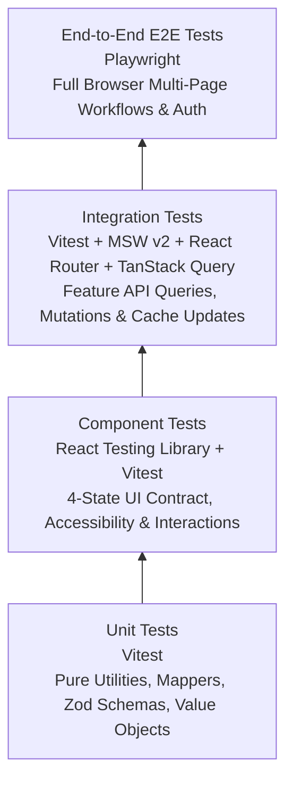
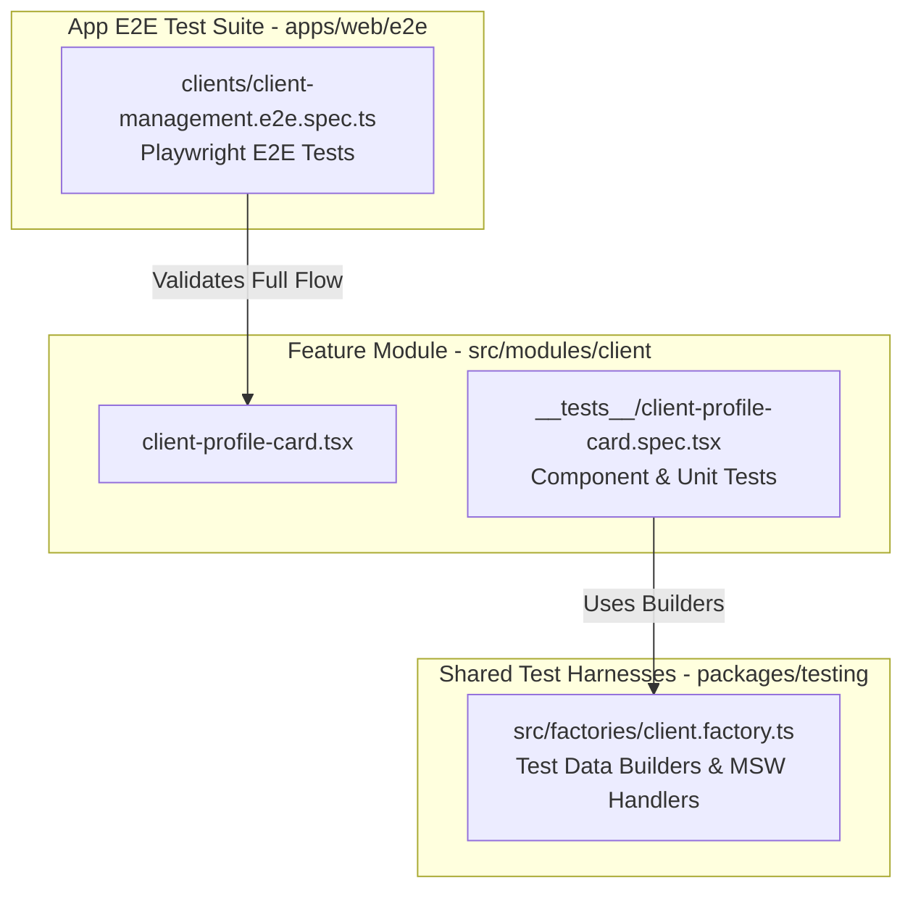
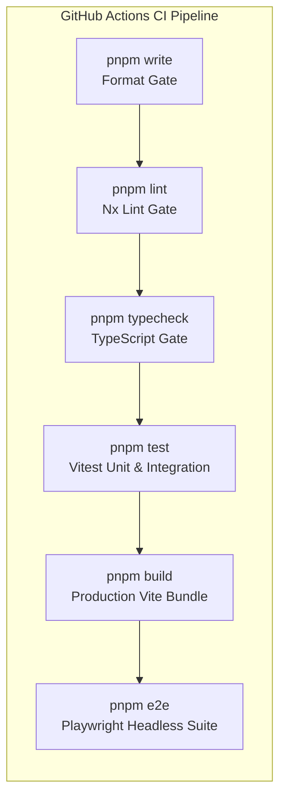

# Frontend Testing Strategy & Quality Assurance Architecture

- **Status:** Active / Authoritative Standard
- **Scope:** `@kinergy-platform/web` (`apps/web/`), `@kinergy-platform/testing` (`packages/testing/`), and Workspace Packages
- **Target Frameworks:** Vitest, React Testing Library (RTL), Mock Service Worker (MSW v2), Playwright

---

## 1. Executive Summary & Testing Philosophy

The Kinergy Platform frontend (`apps/web`) enforces a multi-layered **Testing Architecture** designed to catch regressions early, maintain high component quality, and guarantee system stability across releases.

The testing strategy is built around four core principles:

1. **Test User-Visible Behavior, Not Implementation Details**: Tests verify DOM elements accessible to screen readers and real users (`getByRole`, `getByText`) rather than inspecting internal component state, private props, or React hook internals.
2. **Network Level Mocking with MSW**: Mock Service Worker (MSW v2) intercepts network requests at the transport boundary, eliminating brittle `fetch`/`axios` spy mocks and providing authentic API contract validation.
3. **Mandatory 4-State UI Contract Testing**: Feature component test suites MUST explicitly test all four operational states: **Loading**, **Empty**, **Error**, and **Populated**.
4. **Fast Feedback via Test Co-location**: Unit and component tests are co-located directly alongside the domain code they validate, executing in parallel via Vitest and Nx.

---

## 2. Frontend Testing Pyramid & Tooling Allocation



### Tooling Matrix

| Test Layer            | Primary Tooling                | Scope & Responsibility                                                                                      | Execution Environment       | Execution Speed               |
| :-------------------- | :----------------------------- | :---------------------------------------------------------------------------------------------------------- | :-------------------------- | :---------------------------- |
| **Unit Tests**        | Vitest                         | Pure helper functions, domain mappers, Zod parsers, value objects, custom utility hooks.                    | Node.js / jsdom             | **Blazing (<10ms per test)**  |
| **Component Tests**   | React Testing Library + Vitest | Visual rendering, accessibility roles, user interactions (`@testing-library/user-event`), 4-state contract. | jsdom                       | **Fast (<100ms per test)**    |
| **Integration Tests** | Vitest + MSW v2 + QueryClient  | Feature module flows, API queries, form submissions, cache invalidation, protected route guards.            | jsdom + MSW Worker          | **Medium (<500ms per test)**  |
| **End-to-End (E2E)**  | Playwright                     | Full browser user journeys, auth token refresh flow, multi-tenant navigation, cross-browser validation.     | Chromium / Firefox / WebKit | **Coarse (1s - 5s per test)** |

---

## 3. Test Layer Ownership & Folder Conventions

To avoid duplicate testing responsibilities across layers, each test type has a designated folder location and ownership boundary:



### Folder Conventions

1. **Unit & Component Tests**: Co-located inside `src/modules/<domain>/__tests__/` using the `.spec.ts` or `.spec.tsx` extension.
2. **Shared Test Harnesses & Factories**: Reside in `packages/testing/src/` (`factories/`, `fixtures/`, `builders/`, `mocks/`).
3. **E2E Browser Tests**: Reside in `apps/web/e2e/<domain>/` using the `.e2e.spec.ts` extension.

---

## 4. Test Layer Implementation Standards

### 1. Component Testing & 4-State Verification

Component tests use React Testing Library to verify that a component handles all four UI states cleanly:

```tsx
// Location: apps/web/src/modules/client/__tests__/client-list-widget.spec.tsx
import { render, screen } from '@testing-library/react';
import userEvent from '@testing-library/user-event';
import { HttpResponse, http } from 'msw';
import { server } from '@/test/mocks/server';
import { ClientListWidget } from '../components/client-list-widget';
import { TestAppProvider } from '@/test/test-app-provider';

describe('ClientListWidget (4-State Contract)', () => {
  it('renders Loading state initially', () => {
    render(<ClientListWidget />, { wrapper: TestAppProvider });
    expect(screen.getByTestId('client-list-skeleton')).toBeInTheDocument();
  });

  it('renders Populated state with client list', async () => {
    render(<ClientListWidget />, { wrapper: TestAppProvider });
    expect(await screen.findByText('Acme Energy Solutions')).toBeInTheDocument();
  });

  it('renders Empty state when server returns empty array', async () => {
    server.use(http.get('/api/v1/clients', () => HttpResponse.json([])));
    render(<ClientListWidget />, { wrapper: TestAppProvider });
    expect(await screen.findByText('No Clients Found')).toBeInTheDocument();
  });

  it('renders Error state and supports retry trigger', async () => {
    server.use(http.get('/api/v1/clients', () => new HttpResponse(null, { status: 500 })));
    render(<ClientListWidget />, { wrapper: TestAppProvider });

    expect(await screen.findByText('Failed to load client list.')).toBeInTheDocument();

    // Test retry handler
    const retryBtn = screen.getByRole('button', { name: /try again/i });
    await userEvent.click(retryBtn);
  });
});
```

### 2. Integration Testing with MSW v2

Integration tests validate the end-to-end feature module pipeline (React Hook Form + Zod validation + HTTP transport + TanStack Query cache invalidation):

```tsx
// Location: apps/web/src/modules/client/__tests__/register-client-flow.integration.spec.tsx
describe('Register Client Integration Flow', () => {
  it('submits validated form and updates client list query cache', async () => {
    render(<RegisterClientPage />, { wrapper: TestAppProvider });

    await userEvent.type(screen.getByLabelText(/company name/i), 'Global Power Inc');
    await userEvent.click(screen.getByRole('button', { name: /submit/i }));

    expect(await screen.findByText('Client registered successfully.')).toBeInTheDocument();
  });
});
```

### 3. End-to-End (E2E) Testing with Playwright

Playwright tests validate critical user journeys in real headless browser engines (Chromium, Firefox, WebKit):

```typescript
// Location: apps/web/e2e/client-management.e2e.spec.ts
import { test, expect } from '@playwright/test';

test.describe('Client Management E2E Journey', () => {
  test('authenticated user creates client profile and views timeline audit', async ({ page }) => {
    await page.goto('/auth/login');
    await page.fill('input[name="email"]', 'admin@kinergy.io');
    await page.fill('input[name="password"]', 'SecurePassword123!');
    await page.click('button[type="submit"]');

    await expect(page).toHaveURL('/clients');
    await page.click('text=Register New Client');
    await page.fill('input[name="name"]', 'EcoGrid Solutions');
    await page.click('button:has-text("Save Client")');

    await expect(page.locator('.toast')).toContainText('Client registered successfully');
    await expect(page.locator('h1')).toContainText('EcoGrid Solutions');
  });
});
```

---

## 5. Mocking Strategy & Data Factories

```mermaid
graph TD
    subgraph Allowed Mocking Strategies
        MSW[MSW v2 Network Interception<br/>http.get / http.post]
        FACTORIES[Shared Test Data Factories<br/>UserFactory.build()]
        TIMERS[Vitest Fake Timers<br/>vi.useFakeTimers()]
    end

    subgraph FORBIDDEN MOCKING ANTI-PATTERNS
        SPY_FETCH[Spying on window.fetch]
        MOCK_STATE[Mocking React useState / Hook Internals]
    end
```

### Mocking Rules

1. **Network Requests**: Intercepted exclusively at the network boundary using **MSW v2**. Spying on `window.fetch` or mocking `axios` modules directly is strictly forbidden.
2. **Test Data Factories**: Generate deterministic test models using factories exported by `@kinergy-platform/testing` (`UserFactory.create()`, `ClientFixture`).
3. **Clocks & Time**: Use `vi.useFakeTimers()` for testing debounced inputs or scheduled time intervals.

---

## 6. Coverage Expectations & Quality Gates

The continuous integration pipeline enforces strict coverage thresholds via Vitest and Nx:

| Metric Target                    |     Minimum Threshold     | Enforcement Action               |
| :------------------------------- | :-----------------------: | :------------------------------- |
| **Domain Mappers & Utilities**   | **80% Line / 80% Branch** | Build failure in `pnpm test`     |
| **Custom Query & Form Hooks**    | **80% Line / 75% Branch** | Build failure in `pnpm test`     |
| **Feature Components (4-State)** | **75% Line / 70% Branch** | Code review quality gate         |
| **Global Infrastructure**        | **85% Line / 80% Branch** | Build failure in `pnpm validate` |

---

## 7. Future CI/CD Pipeline & Visual Regression Testing (VRT)



1. **Parallel Execution via Nx**: GitHub Actions executes `nx run-many -t test` across modified workspaces in parallel, leveraging Nx computation caching.
2. **Visual Regression Testing (VRT) Readiness**: Playwright screenshot comparison (`expect(page).toHaveScreenshot()`) can be enabled for core design system components in `@kinergy-platform/ui`.

---

## 8. Architectural Decision Records (ADR Style)

---

### [ADR-FE-0025] Behavior-Driven Testing Standard with React Testing Library

- **Decision**: Standardize all component testing on React Testing Library (RTL) and `@testing-library/user-event`, asserting accessibility roles (`getByRole`).
- **Context**: Testing internal component state or private class methods creates brittle tests that break during refactoring.
- **Rationale**: RTL tests components from the user's perspective, ensuring accessible rendering and resilient test suites.
- **Consequences**: Component tests do not inspect internal `useState` variables or instance properties.
- **Future Evolution**: Supports automated accessibility auditing via `jest-axe` / `axe-core`.

---

### [ADR-FE-0026] Network Level Mocking with Mock Service Worker (MSW v2)

- **Decision**: Mandate Mock Service Worker (MSW v2) as the exclusive network mocking tool for component and integration test suites.
- **Context**: Mocking `fetch` calls or `http-client.ts` via Jest/Vitest spy functions leaks transport details into tests and bypasses actual network serialization.
- **Rationale**: MSW intercepts requests at the network layer using Service Workers in the browser and native interceptors in Node, ensuring authentic API contract testing.
- **Consequences**: Test suites configure MSW handlers instead of spying on transport functions.
- **Future Evolution**: MSW handlers can be shared with Storybook component documentation.

---

### [ADR-FE-0027] Mandatory 4-State Contract Test Suites for Feature Components

- **Decision**: Require all feature module components to include explicit unit/component test cases for Loading, Empty, Error, and Populated states.
- **Context**: Features frequently break in production when API requests fail or return empty arrays because developers test only the happy path.
- **Rationale**: Mandating 4-state contract coverage guarantees resilient UI rendering under all network conditions.
- **Consequences**: Pull requests without 4-state test cases fail quality reviews.
- **Future Evolution**: Automated test generators can scaffold 4-state test suites for new components.

---

### [ADR-FE-0028] End-to-End Journey Automation with Playwright

- **Decision**: Adopt Playwright as the platform standard for cross-browser End-to-End (E2E) testing.
- **Context**: Cypress and Selenium present slower execution speeds and limited multi-tab / iframe testing capabilities.
- **Rationale**: Playwright provides ultra-fast parallel execution, native WebKit/Firefox engines, automatic waiting, and built-in trace viewer debugging.
- **Consequences**: E2E test scripts reside in `apps/web/e2e/` and execute as part of pre-release CI pipelines.
- **Future Evolution**: Enables automated visual regression testing (VRT) across mobile and desktop viewports.

---

## 9. Cross-References & Related Documentation

- [Frontend Architecture Vision](./architecture.md)
- [Frontend Engineering Principles](./principles.md)
- [Frontend Folder Structure & Architectural Boundaries](./folder-structure.md)
- [Frontend Routing Architecture & Navigation Strategy](./routing.md)
- [Frontend State Management Architecture & State Governance](./state-management.md)
- [Frontend API Architecture & Data Fetching Strategy](./api.md)
- [Frontend UI Architecture & Design System Strategy](./ui-architecture.md)
- [Frontend Technical Glossary](./glossary.md)
- [Master Platform Documentation Index](../README.md)
