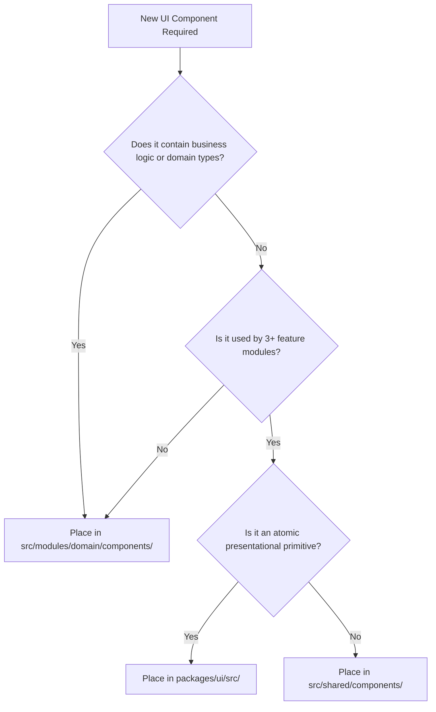
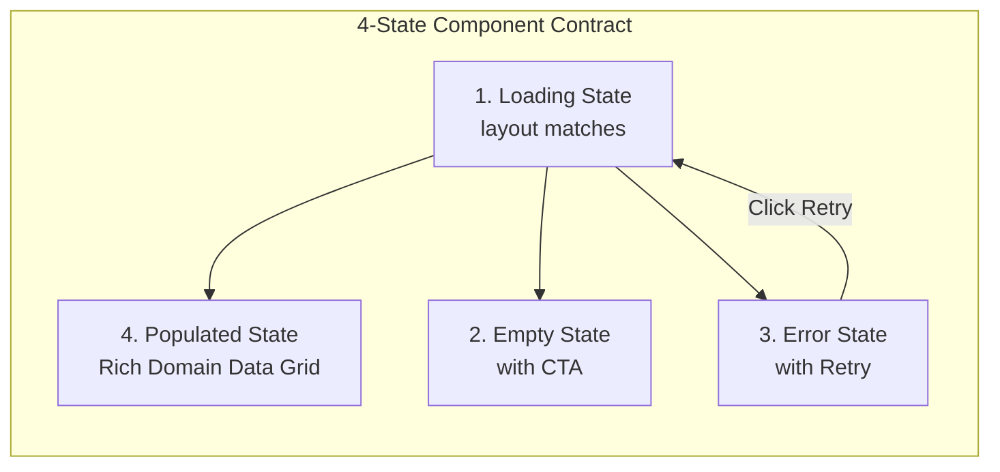
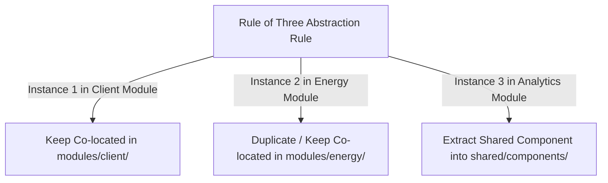

# Frontend UI Architecture & Design System Strategy

- **Status:** Active / Authoritative Standard
- **Scope:** `@kinergy-platform/web` (`apps/web/src/`) and `@kinergy-platform/ui` (`packages/ui/`)
- **Target Application:** Kinergy Platform Web Frontend

---

## 1. Executive Summary & Design System Philosophy

The Kinergy Platform frontend (`apps/web`) uses a component-driven **UI Architecture** engineered for visual consistency, high accessibility, dynamic dark-mode aesthetics, and long-term maintainability.

The UI architecture is anchored on five foundational design pillars:

1. **Utility-First Styling with Design Tokens**: Visual styling uses Tailwind CSS bound to semantic HSL CSS custom variables (`var(--primary)`, `var(--background)`), enabling instant theme switching and dynamic multi-tenant branding.
2. **Strict Component Classification**: Complete isolation between **Atomic UI Primitives** (`packages/ui` - 100% domain agnostic) and **Business Components** (`src/modules/<domain>/components/` - domain aware).
3. **Mandatory 4-State UI Contract**: Every user-facing feature component MUST support four explicit operational states: **Loading**, **Empty**, **Error**, and **Populated**.
4. **Accessible Radix UI Foundations**: Complex interactive overlay primitives (dialogs, dropdown menus, tooltips) wrap Radix UI headless components to ensure ARIA standards and keyboard navigation support out-of-the-box.
5. **Avoiding Premature Abstraction ("Rule of Three")**: Components are kept co-located inside their parent feature module until identical visual and interactive requirements emerge across at least 3 distinct domain modules.

---

## 2. Component Taxonomy & Classification

```mermaid
graph TD
    subgraph Layer 1: Design System Package - packages/ui
        ATOMIC[Atomic UI Primitives<br/>Button, Input, Badge, Skeleton, Card]
    end

    subgraph Layer 2: Shared App Layer - src/shared/components
        SHARED_COMP[Shared Application Components<br/>DataTable, FormField, ConfirmDialog, EmptyState]
    end

    subgraph Layer 3: Feature Module Layer - src/modules/<domain>/components
        BIZ_COMP[Domain Business Components<br/>ClientProfileCard, MeterTelemetryChart, ScheduleCalendarGrid]
    end

    BIZ_COMP --> SHARED_COMP
    SHARED_COMP --> ATOMIC
```

### 1. Atomic UI Primitives (`packages/ui/`)

- **Characteristics**: Pure presentational elements. 100% domain-agnostic and transport-agnostic.
- **Allowed Dependencies**: Tailwind CSS, Lucide icons, Class Variance Authority (`cva`). Zero backend types or API client imports.
- **Examples**: `<Button />`, `<Input />`, `<Modal />`, `<Badge />`, `<Skeleton />`.

### 2. Shared Application Frameworks (`apps/web/src/shared/components/`)

- **Characteristics**: Complex reusable UI patterns shared across multiple domains. Domain-neutral, but aware of application framework standards (React Hook Form, TanStack Table).
- **Examples**: `<DataTable />`, `<FormField />`, `<EmptyState />`, `<ErrorAlert />`, `<ConfirmDialog />`.

### 3. Business Components (`src/modules/<domain>/components/`)

- **Characteristics**: Domain-specific UI assemblies. Understand business domain models, view models, and domain constraints.
- **Examples**: `<ClientProfileCard />`, `<MeterTelemetryChart />`, `<AppointmentCalendarGrid />`.

---

## 3. Component Location Decision Tree

To eliminate developer confusion over component placement, use the following decision matrix:



| Component Candidate            |  Contains Business Logic?   | Shared Across Domains? | Classification       | Destination Folder                                  |
| :----------------------------- | :-------------------------: | :--------------------: | :------------------- | :-------------------------------------------------- |
| **Primary Action Button**      |             No              |          Yes           | Atomic Primitive     | `packages/ui/src/button.tsx`                        |
| **Data Grid with URL Filters** |             No              |          Yes           | Shared App Framework | `apps/web/src/shared/components/data-table.tsx`     |
| **Client Details Card**        | **Yes** (`ClientViewModel`) |           No           | Business Component   | `src/modules/client/components/client-card.tsx`     |
| **Meter Telemetry Graph**      |  **Yes** (`MeterReadings`)  |           No           | Business Component   | `src/modules/energy/components/meter-chart.tsx`     |
| **Confirm Action Modal**       |             No              |          Yes           | Shared App Framework | `apps/web/src/shared/components/confirm-dialog.tsx` |

---

## 4. Mandatory 4-State UI Contract

Every feature module component MUST explicitly support the **4-State UI Contract** to guarantee zero unhandled loading flickers or blank screen crashes:



### 1. Loading State

- Render `<Skeleton />` placeholders matching the exact container layout dimensions to eliminate layout shifts (CLS).
- Never render centered spinners for page layouts.

### 2. Empty State

- Display friendly SVG illustrations, clear explanatory text ("No active client profiles found"), and a primary action button ("Register New Client").

### 3. Error State

- Display a non-disruptive `<ErrorAlert />` banner explaining the error in plain English with an actionable "Try Again" refetch button.

### 4. Populated State

- Render full responsive interactive view components once server state resolves successfully.

```tsx
// Example: 4-State Contract Implementation
export const ClientListWidget: React.FC = () => {
  const { data: clients, isLoading, isError, refetch } = useClientsQuery();

  if (isLoading) return <ClientListSkeleton />;
  if (isError) return <ErrorAlert message="Failed to load client list." onRetry={refetch} />;
  if (!clients || clients.length === 0) {
    return (
      <EmptyState
        title="No Clients Found"
        description="Get started by adding your first client."
        actionLabel="Create Client"
        onAction={handleCreate}
      />
    );
  }

  return <ClientGrid items={clients} />;
};
```

---

## 5. Shared Complex UI Patterns & Frameworks

### 1. Forms & Field Composition

Forms combine React Hook Form and Zod validation schemas using a declarative `<FormField />` wrapper that automatically injects field error messages, labels, and ARIA accessibility attributes:

```tsx
<FormField label="Client Name" error={formState.errors.name?.message} required>
  <Input {...register('name')} placeholder="Enter company name" />
</FormField>
```

### 2. Data Tables (`<DataTable />`)

Standardized data grids built on TanStack Table (`@tanstack/react-table`):

- Synchronizes search terms, column sorting, and pagination with URL search params (`useSearchParams`).
- Renders animated table header skeletons during background refetching.

### 3. Calendar & Scheduling Views

Custom calendar grids designed for energy scheduling and appointment booking:

- Displays interactive time slot grids, therapist availability overlays, and turnaround buffer indicators.

### 4. Audit & Event Timelines

Vertical activity feeds displaying audit trails, status transitions, and security events with color-coded status badges and relative time tooltips.

### 5. Telemetry & Analytics Charts

Data visualization wrappers built with Recharts / SVG primitives:

- Displays real-time kilowatt-hour (kWh) telemetry metrics, peak load heatmaps, and sustainability performance trends.
- Fully responsive containers with dark-mode theme color variables.

### 6. Dialogs & Overlay Modals

Accessible modal overlays wrapping `@radix-ui/react-dialog`:

- Focus traps, escape key listeners, and confirmation button loading spinners.

---

## 6. Guidelines for Avoiding Premature Abstraction ("Rule of Three")

Premature abstraction is a major source of architectural complexity. Abstracting a component too early forces developers to add dozens of conditional props (`isCompact`, `hideHeader`, `customColor`), creating unmaintainable "god components".



### Abstraction Governance Rules

1. **Rule of Three**: Do NOT move a component into `apps/web/src/shared/components/` or `packages/ui` until identical visual and behavioral requirements appear in **3 separate domain modules**.
2. **Prefer Composition Over Configuration**: Instead of creating a mega-component with 20 boolean flags, compose smaller sub-components using children slots (`<Card.Header>`, `<Card.Body>`, `<Card.Footer>`).

---

## 7. Architectural Decision Records (ADR Style)

---

### [ADR-FE-0021] Utility-First Tailwind CSS & Semantic HSL Token Governance

- **Decision**: Adopt Tailwind CSS configured with semantic HSL CSS custom variables (`var(--primary)`, `var(--background)`) as the platform's exclusive styling framework.
- **Context**: Inline styles and CSS-in-JS libraries (Emotion/Styled-Components) introduce runtime JavaScript bundle overhead and complex dynamic theme switching.
- **Rationale**: Utility-first CSS compiles to zero runtime JavaScript, while semantic HSL variables enable instant dark-mode switching and multi-tenant brand customization.
- **Consequences**: CSS-in-JS libraries and plain CSS stylesheets are strictly forbidden.
- **Future Evolution**: Supports dynamic tenant theme customization via server-injected CSS variables.

---

### [ADR-FE-0022] Strict Separation of Atomic UI Primitives and Business Components

- **Decision**: Restrict `packages/ui` to 100% domain-agnostic atomic primitives, forcing all domain-aware components into `src/modules/<domain>/components/`.
- **Context**: Mixing domain concepts (API types, backend DTOs) into design system libraries breaks package reusability and causes circular dependencies.
- **Rationale**: Strict isolation ensures `packages/ui` can be published, tested, and rendered in Storybook independently of application backend code.
- **Consequences**: Shared UI primitives accept only generic props (`onClick`, `children`, `className`).
- **Future Evolution**: Prepares `packages/ui` for independent distribution across micro-frontend micro-apps.

---

### [ADR-FE-0023] Mandatory 4-State UI Component Contract

- **Decision**: Require all feature module components to explicitly render Loading, Empty, Error, and Populated states.
- **Context**: Omitting empty or error states leads to unhandled blank screens and poor user experience when API calls fail or return empty arrays.
- **Rationale**: Enforcing a 4-state contract guarantees consistent visual feedback and resilience across all platform features.
- **Consequences**: Code reviews verify that component implementations handle all four states.
- **Future Evolution**: Supports automated visual regression testing across all four UI states.

---

### [ADR-FE-0024] Premature Abstraction Prevention via Rule of Three

- **Decision**: Mandate that components remain co-located inside feature modules until identical visual patterns are required across at least 3 distinct domains.
- **Context**: Creating premature shared abstractions leads to bloated components filled with complex conditional flags.
- **Rationale**: Deferring abstraction until 3 real use cases exist produces clean, well-tailored shared components.
- **Consequences**: Feature teams create local components first before requesting shared design system additions.
- **Future Evolution**: Prevents design system bloat as the monorepo expands.

---

## 8. Cross-References & Related Documentation

- [Frontend Architecture Vision](./architecture.md)
- [Frontend Engineering Principles](./principles.md)
- [Frontend Folder Structure & Architectural Boundaries](./folder-structure.md)
- [Frontend Routing Architecture & Navigation Strategy](./routing.md)
- [Frontend State Management Architecture & State Governance](./state-management.md)
- [Frontend API Architecture & Data Fetching Strategy](./api.md)
- [Frontend Testing Strategy & Quality Assurance Architecture](./testing.md)
- [Frontend Technical Glossary](./glossary.md)
- [Master Platform Documentation Index](../README.md)
