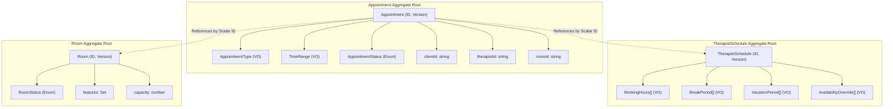
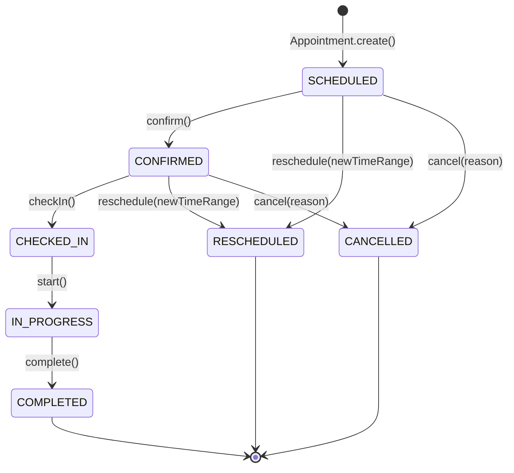
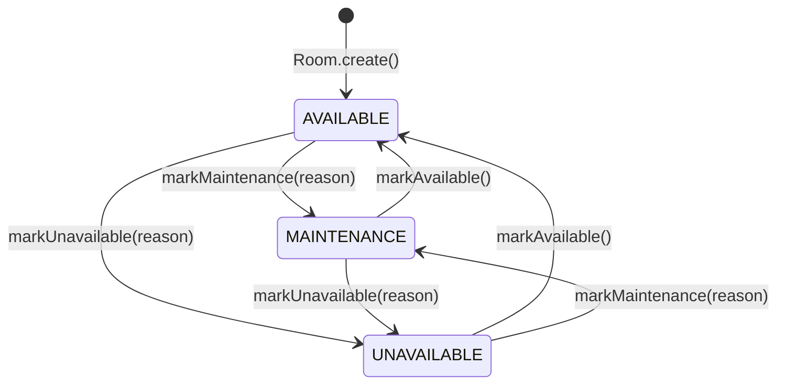

# Aggregate Boundary & State Machine Diagrams

## Aggregate Boundaries

```mermaid
graph TD
    subgraph "Appointment Aggregate Root"
        A["Appointment (ID, Version)"]
        A --> AT["AppointmentType (VO)"]
        A --> TR["TimeRange (VO)"]
        A --> AS["AppointmentStatus (Enum)"]
        A --> CID["clientId: string"]
        A --> TID["therapistId: string"]
        A --> RID["roomId: string"]
    end

    subgraph "TherapistSchedule Aggregate Root"
        TS["TherapistSchedule (ID, Version)"]
        TS --> WH["WorkingHours[] (VO)"]
        TS --> BP["BreakPeriod[] (VO)"]
        TS --> VP["VacationPeriod[] (VO)"]
        TS --> AO["AvailabilityOverride[] (VO)"]
    end

    subgraph "Room Aggregate Root"
        R["Room (ID, Version)"]
        R --> RS["RoomStatus (Enum)"]
        R --> FT["features: Set<string>"]
        R --> CAP["capacity: number"]
    end

    A -. "References by Scalar ID" .-> TS
    A -. "References by Scalar ID" .-> R
```

---

## Appointment State Machine

```mermaid
stateDiagram-v2
    [*] --> SCHEDULED: Appointment.create()
    SCHEDULED --> CONFIRMED: confirm()
    SCHEDULED --> RESCHEDULED: reschedule(newTimeRange)
    SCHEDULED --> CANCELLED: cancel(reason)

    CONFIRMED --> CHECKED_IN: checkIn()
    CONFIRMED --> RESCHEDULED: reschedule(newTimeRange)
    CONFIRMED --> CANCELLED: cancel(reason)

    CHECKED_IN --> IN_PROGRESS: start()
    IN_PROGRESS --> COMPLETED: complete()

    COMPLETED --> [*]
    CANCELLED --> [*]
    RESCHEDULED --> [*]
```

---

## Room Operational Status Transition

```mermaid
stateDiagram-v2
    [*] --> AVAILABLE: Room.create()
    AVAILABLE --> MAINTENANCE: markMaintenance(reason)
    AVAILABLE --> UNAVAILABLE: markUnavailable(reason)

    MAINTENANCE --> AVAILABLE: markAvailable()
    UNAVAILABLE --> AVAILABLE: markAvailable()

    MAINTENANCE --> UNAVAILABLE: markUnavailable(reason)
    UNAVAILABLE --> MAINTENANCE: markMaintenance(reason)
```
