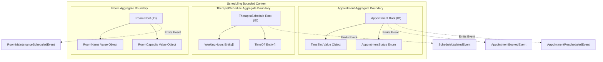
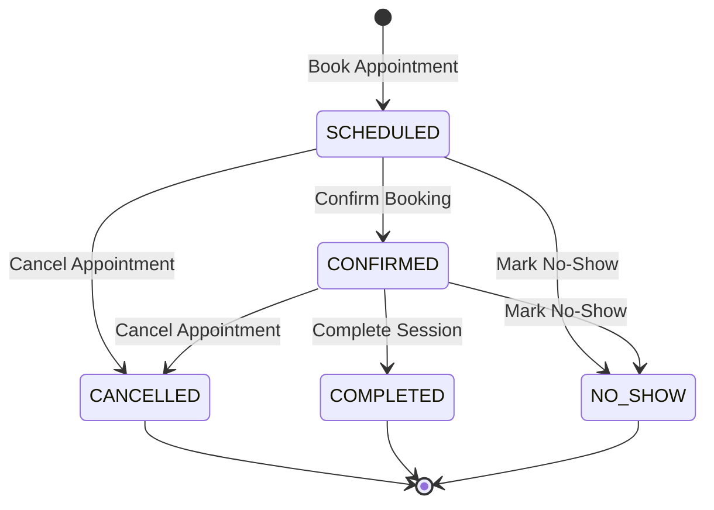
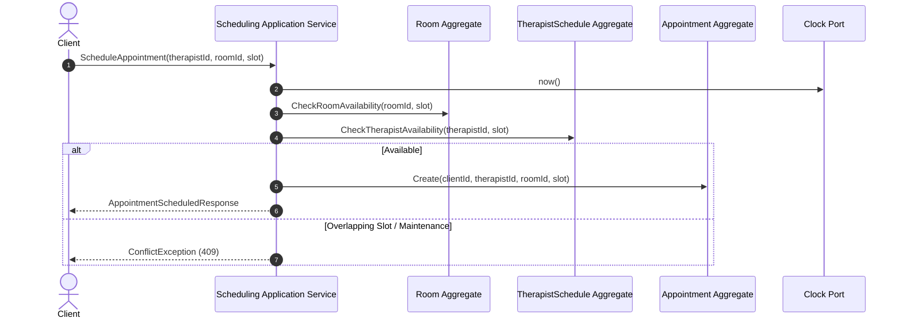

# Scheduling Bounded Context - Aggregate Boundary & State Diagrams

## 1. Overview

The Scheduling Bounded Context consists of three distinct, decoupled Aggregate Roots:

1. `Appointment`
2. `TherapistSchedule`
3. `Room`

Each aggregate operates as an independent transactional boundary with its own identity, versioning, and emitted domain events.

---

## 2. Aggregate Boundaries Diagram

---

## 3. Appointment Lifecycle State Diagram

---

## 4. Double-Booking Prevention & Domain Coordination

