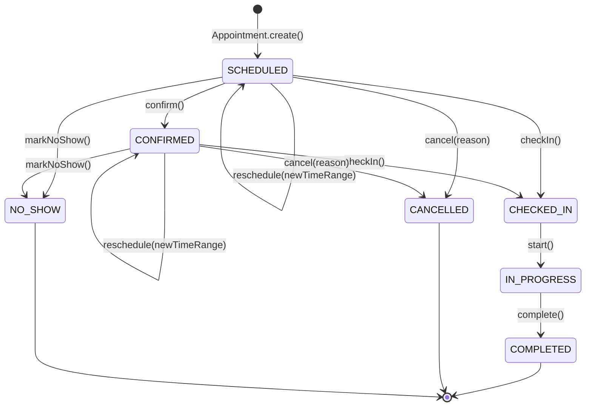
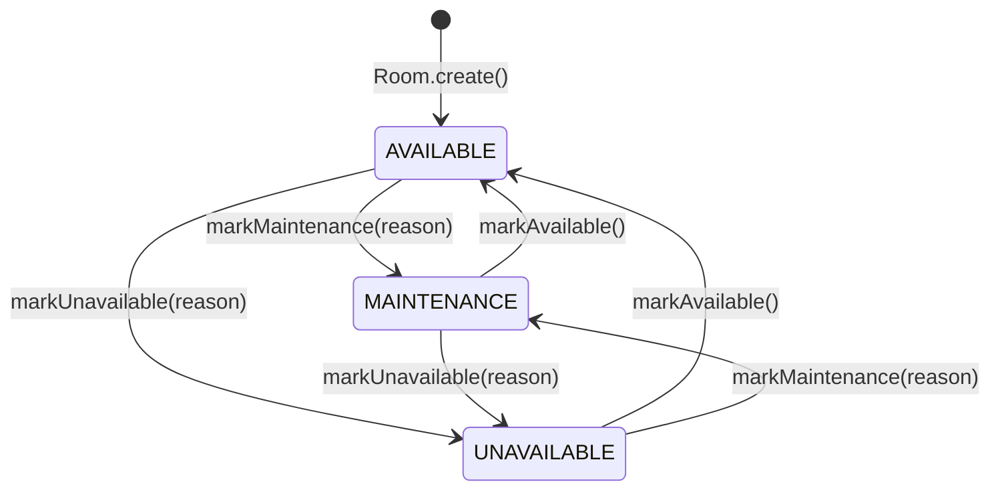

# Scheduling Bounded Context — Aggregate Boundary & State Machine Diagrams

## Executive Summary

This document presents the domain aggregate boundaries, value object encapsulation rules, and formal state machine transition diagrams for `Appointment`, `TherapistSchedule`, and `Room` aggregate roots within the Scheduling Bounded Context.

---

## Table of Contents

- [Aggregate Boundaries](#aggregate-boundaries)
- [Appointment Aggregate State Machine](#appointment-aggregate-state-machine)
- [Room Operational Status State Machine](#room-operational-status-state-machine)

---

## Aggregate Boundaries

```mermaid
graph TD
    subgraph "Appointment Aggregate Root"
        A["Appointment (ID, Version)"]
        A --> AT["AppointmentType (VO)"]
        A --> TR["TimeRange (VO)"]
        A --> AS["AppointmentStatus (Enum)"]
        A --> TB["TurnaroundBuffer (VO)"]
        A --> AN["notes: AppointmentNote[] (VO)"]
        A --> CID["clientId: string"]
        A --> TID["therapistId: string"]
        A --> RID["roomId: string"]
    end

    subgraph "TherapistSchedule Aggregate Root"
        TS["TherapistSchedule (ID, Version)"]
        TS --> WH["workingHours: WorkingHours[] (VO)"]
        TS --> BP["breaks: BreakPeriod[] (VO)"]
        TS --> VP["vacations: VacationPeriod[] (VO)"]
        TS --> AO["overrides: AvailabilityOverride[] (VO)"]
    end

    subgraph "Room Aggregate Root"
        R["Room (ID, Version)"]
        R --> RS["RoomStatus (Enum)"]
        R --> FT["features: Set<string>"]
        R --> CAP["capacity: number"]
        R --> MR["maintenanceReason?: string"]
    end

    A -. "References by Scalar ID" .-> TS
    A -. "References by Scalar ID" .-> R
```

---

## Appointment Aggregate State Machine

---

## Room Operational Status State Machine

