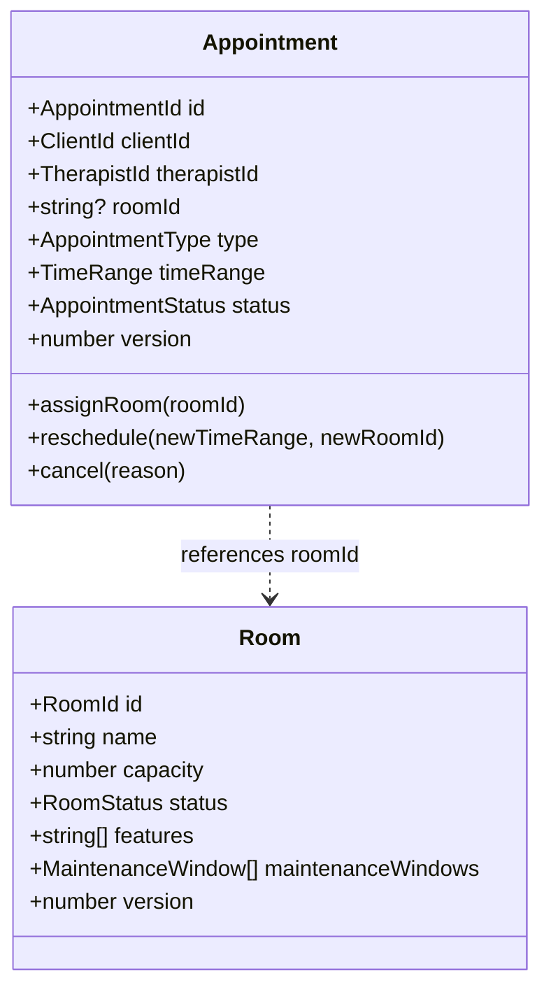
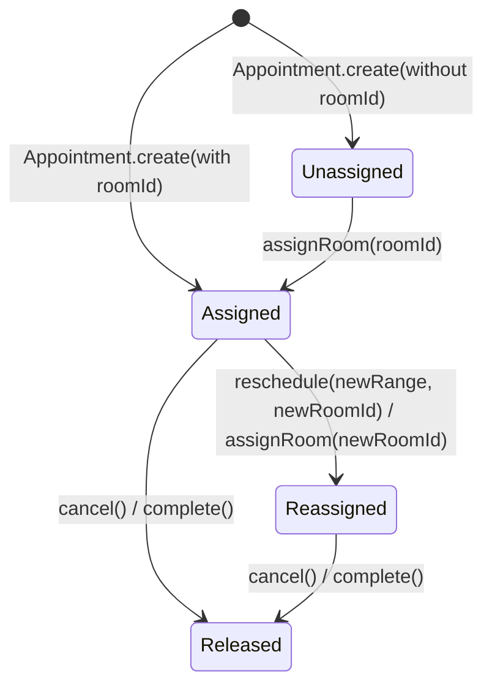

# Appointment Resource Assignment Documentation

## Overview

In Kinergy, clinical sessions require physical resources (Rooms) while keeping the `Appointment` aggregate decoupled from room-specific aggregate internals. This document outlines how appointments assign, change, and release room resources across their lifecycle.

---

## 1. Resource Assignment Model

### Assignment Cardinality & Semantics

- **Optional vs Required**: Room assignment is optional at the domain aggregate level (`roomId?: string`) to support off-site, telehealth, or unassigned clinical consultations. In standard facility bookings, `roomId` is provided during creation.
- **Identity Decoupling**: `Appointment` holds `roomId` as an immutable identifier string (`string`), avoiding direct aggregate-to-aggregate references.
- **Polymorphism Preparation**: Schedulable resource interfaces (`SchedulableResource`) ensure future resources (e.g. equipment IDs) follow identical assignment semantics.

---

## 2. Resource Lifecycle Transitions

### 1. Creation & Initial Assignment

- `CreateAppointmentCommand` accepts `roomId?: string`.
- `CreateAppointmentHandler` coordinates with `ConflictDetectionService.detectConflicts()`.
- If valid, `Appointment.create({ ... roomId })` is instantiated and persisted.

### 2. Room Reassignment & Rescheduling

- **Direct Reassignment**: `AssignRoomHandler` (`AssignRoomCommand`) verifies room availability for the appointment's existing time range and invokes `appointment.assignRoom(newRoomId)`.
- **Rescheduling with Room Migration**: `RescheduleAppointmentHandler` (`RescheduleAppointmentCommand`) accepts `newStartTime`, `newEndTime`, and optional `newRoomId`. The 4D conflict engine validates availability on the target room and frees the former room slot upon commit.

### 3. Immediate Cancellation Release

- When `CancelAppointmentHandler` executes `CancelAppointmentCommand`, the appointment transitions to `CANCELLED`.
- Cancelled appointments are classified as terminal (`isTerminal() === true`) by repositories and conflict evaluators, immediately freeing the room slot for incoming reservations without requiring background cleanup.

---

## 3. Recurring Series Resource Inheritance

When a `RecurrenceSeries` is created with a `roomId`:

1. Every materialized `Appointment` occurrence inherits the `roomId`.
2. Occurrence generation validates room availability per slot.
3. Individual occurrences can be reallocated to different rooms using `AssignRoomCommand` with `detachFromSeries: true` or by recording a `MODIFIED` exception in the series log.
