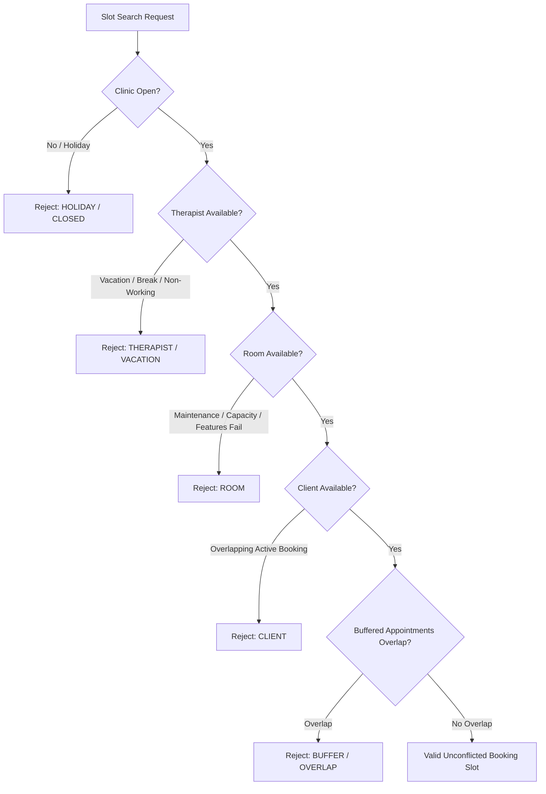

# Availability Resolution Engine Architecture & Interval Math

## Overview

The Availability Engine in the `@kinergy-platform/core` scheduling context determines valid, unconflicted booking windows for clinical sessions. Availability resolution evaluates intersections across four multi-resource vectors:

1. **Therapist Schedule Bounds & Shifts**
2. **Room Operational Status & Equipment/Capacity Features**
3. **Client Single-Active-Booking Constraints**
4. **Turnaround Buffer Policies (Prep Setup & Sanitation Cleanup)**

---

## 1. Operational Turnaround Buffer Math

Operational turnaround buffers isolate scheduling intervals to ensure sufficient prep setup time prior to sessions and sanitation cleanup time following sessions.

### Value Object: `TurnaroundBuffer`

- `prepDuration`: Setup duration before appointment start.
- `cleanupDuration`: Sanitation duration after appointment end.
- `totalDuration`: `prepDuration + cleanupDuration`.

### Interval Expansion Equation

For an appointment interval \(I = [t_{start}, t_{end})\) and buffer \(B = (d_{prep}, d_{cleanup})\):

\[\text{Buffered Range } I_{buffered} = [t_{start} - d_{prep},\; t_{end} + d_{cleanup})\]

### Overlap Detection

Two intervals \(A = [s_A, e_A)\) and \(B = [s_B, e_B)\) overlap if and only if:

\[s_A < e_B \quad \land \quad e_A > s_B\]

When evaluating candidate interval \(C\) against existing appointment \(A\) under turnaround buffer \(B\):

\[\text{Conflict}(C, A, B) = \text{overlaps}(C.\text{toBufferedRange}(B), A.\text{timeRange})\]

---

## 2. Multi-Resource Vector Availability Pipeline



### Evaluation Order & Priority

1. **Facility Level (Clinic Calendar):** Checks public holidays and facility operating hours via `BusinessCalendarService`.
2. **Therapist Level (`TherapistSchedule`):** 4-level priority check:
   - **Vacation Period (-)** \(\rightarrow\) Blocks all slots.
   - **Availability Overrides (+/-)** \(\rightarrow\) Date-specific `AVAILABLE` bypasses working hours; `UNAVAILABLE` blocks.
   - **Break Periods (-)** \(\rightarrow\) Daily recurring or specific time range breaks block.
   - **Base Working Hours Shift (+)** \(\rightarrow\) Shift hours must enclose target slot.
3. **Room Level (`Room` Aggregate):**
   - Must be in `AVAILABLE` status (not `MAINTENANCE` or `UNAVAILABLE`).
   - `room.capacity >= requiredCapacity`.
   - `room.supportsFeatures(requiredFeatures) === true`.
4. **Client Level (`ClientAvailabilityEvaluator`):**
   - Zero active non-terminal (`SCHEDULED`, `CONFIRMED`, `CHECKED_IN`, `IN_PROGRESS`) booking overlaps.

---

## 3. Discrete Time-Grid Slicing Algorithm

The `SlotFinderEngine` generates candidate slots by stepping through a search window \([W_{start}, W_{end})\) in discrete time increments \(\Delta t_{step}\) (default 15 minutes) for a requested session duration \(D_{session}\).

```
Search Window: 09:00 ------------------------------------> 11:00
Candidate 1:   [09:00 ------- 10:00) -> Validated
Candidate 2:          [09:15 ------- 10:15) -> Validated
Candidate 3:                 [09:30 ------- 10:30) -> Validated
Candidate 4:                        [09:45 ------- 10:45) -> Validated
Candidate 5:                               [10:00 ------- 11:00) -> Validated
```
