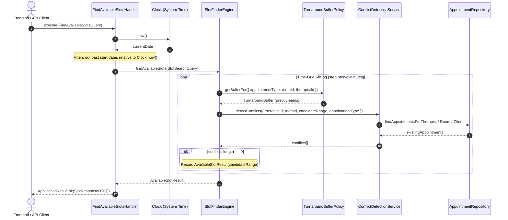
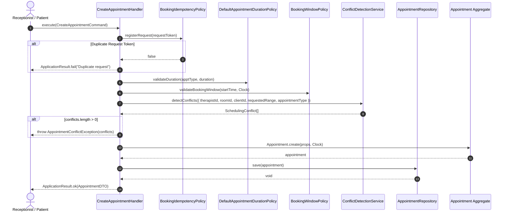
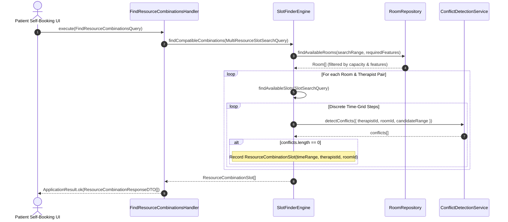

# Availability & Conflict Sequence Diagrams

This document outlines the detailed sequence flows for slot discovery, booking creation safeguards, and multi-resource matrix combination searches in the `@kinergy-platform/core` scheduling context.

---

## 1. Real-Time Slot Discovery Sequence (`FindAvailableSlotsQuery`)

---

## 2. Booking Creation Safeguard & Conflict Verification Sequence

---

## 3. Multi-Resource Combination Matrix Algorithm (`FindResourceCombinationsQuery`)

