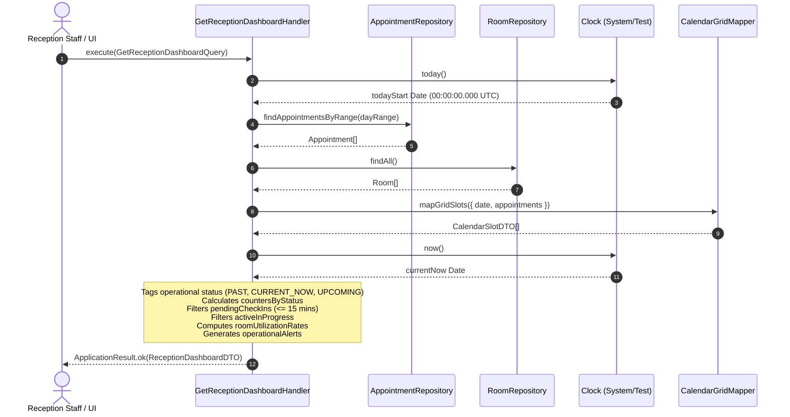
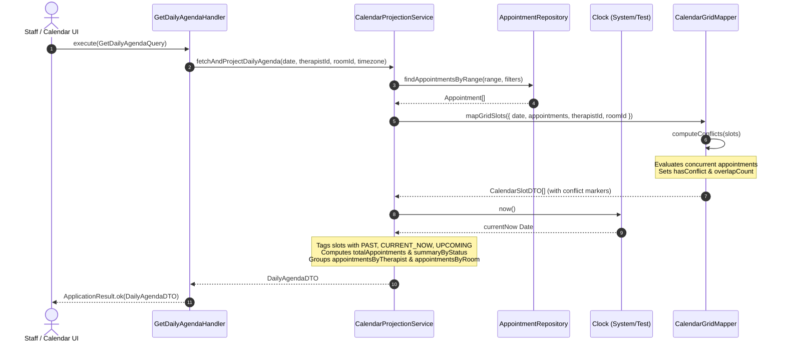
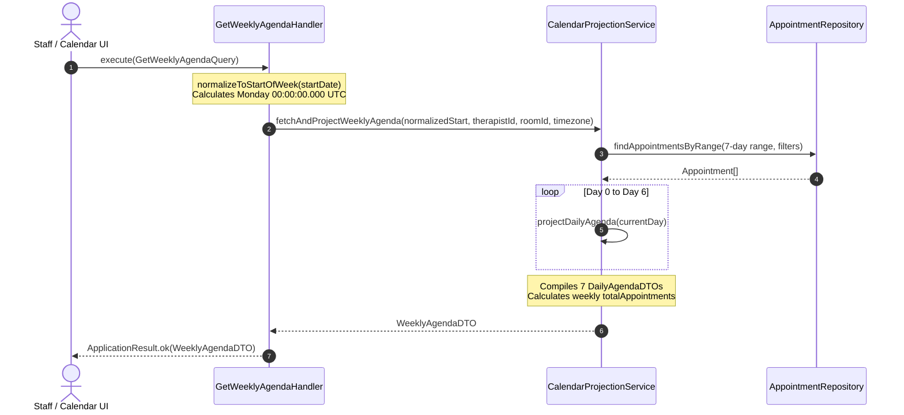

# Scheduling Bounded Context — Calendar Sequence Diagrams

This document contains Mermaid sequence diagrams illustrating calendar query execution flows and grid projection engines.

---

## 1. Reception Dashboard Query Execution Flow

---

## 2. Daily Agenda Grid Computation & Projection Flow

---

## 3. Weekly Agenda Projection & Date Normalization Flow

