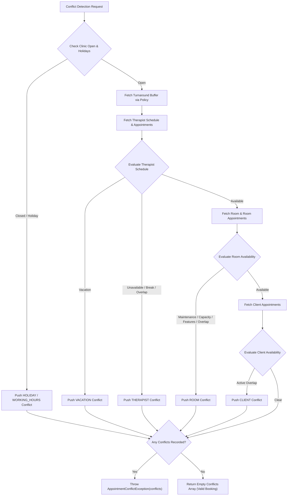

# 4D Conflict Detection Matrix & Decision Tree

## Overview

The `ConflictDetectionService` executes multi-dimensional matrix checks across Therapist, Room, Client, and Clinic Calendar vectors to guarantee zero double-bookings or resource violations bypass system persistence.

---

## 4D Conflict Matrix Categories

| Vector              | Conflict Category          | Trigger Condition                                                                         | Exception / Returned Category                                |
| :------------------ | :------------------------- | :---------------------------------------------------------------------------------------- | :----------------------------------------------------------- |
| **Clinic Calendar** | `HOLIDAY`, `WORKING_HOURS` | Requested slot falls on public holiday or outside facility hours                          | `SchedulingConflict(category: 'HOLIDAY' \| 'WORKING_HOURS')` |
| **Therapist**       | `THERAPIST`, `VACATION`    | Therapist schedule missing, on vacation/break, or has overlapping buffered booking        | `SchedulingConflict(category: 'THERAPIST' \| 'VACATION')`    |
| **Room**            | `ROOM`                     | Room is under MAINTENANCE/UNAVAILABLE, capacity insufficient, missing features, or booked | `SchedulingConflict(category: 'ROOM')`                       |
| **Client**          | `CLIENT`                   | Client already has an active non-terminal appointment during candidate interval           | `SchedulingConflict(category: 'CLIENT')`                     |

---

## Conflict Detection Decision Tree Flowchart



---

## Exception Protocol & Self-Exclusion

### 1. Structured Diagnostics

When conflicts exist, command handlers abort transactions and throw `AppointmentConflictException` containing array of `SchedulingConflict` value objects:

```typescript
export interface SchedulingConflictProps {
  readonly conflictType: ConflictType; // 'THERAPIST' | 'ROOM' | 'CLIENT' | 'HOLIDAY' | 'BUFFER'
  readonly conflictingEntityId: string;
  readonly requestedRange: TimeRange;
  readonly reason: string;
  readonly suggestedAlternativeRange?: TimeRange;
}
```

### 2. Self-Exclusion for Rescheduling

During appointment update and reschedule commands, the aggregate being modified passes `ignoreAppointmentId: appointment.id.getValue()` to ensure the current appointment slot is excluded from overlap calculations.
