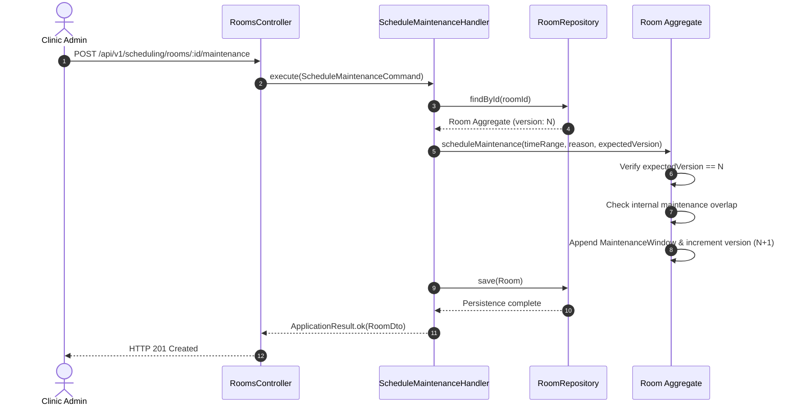

# Maintenance Scheduling Documentation

## Overview

Maintenance scheduling enables clinic administrators and facility managers to block physical rooms for sanitation, repairs, equipment calibration, and renovations. In Kinergy, maintenance is treated not as an external calendar event, but as an intrinsic temporal blocking state within the `Room` aggregate.

---

## 1. Maintenance Domain Model

The `MaintenanceWindow` Value Object (`packages/core/src/scheduling/domain/room/maintenance-window.vo.ts`) encapsulates downtime intervals:

```typescript
export interface CreateMaintenanceWindowProps {
  id?: string;
  timeRange: TimeRange;
  reason: string;
}

export class MaintenanceWindow {
  readonly id: string;
  readonly timeRange: TimeRange; // Half-open [start, end) in UTC
  readonly reason: string;
}
```

### Invariants & Business Rules

1. **Strict Temporal Ordering**: `timeRange.start < timeRange.end` in UTC ISO-8601.
2. **Mandatory Non-Empty Reason**: `reason` must be provided and trimmed.
3. **No Overlapping Windows within Same Room**: Attempting to schedule a maintenance window overlapping an existing maintenance window on the same room aggregate throws a domain validation error.
4. **Encapsulation in Room Aggregate**: Maintenance windows are owned and persisted through the `Room` aggregate root.

---

## 2. Maintenance Lifecycle Operations



### Supported Use Cases

| Operation                | Command Class                | REST Endpoint                                               | Roles Required   |
| :----------------------- | :--------------------------- | :---------------------------------------------------------- | :--------------- |
| **Schedule Maintenance** | `ScheduleMaintenanceCommand` | `POST /api/v1/scheduling/rooms/:id/maintenance`             | `settings.write` |
| **Cancel Maintenance**   | `CancelMaintenanceCommand`   | `DELETE /api/v1/scheduling/rooms/:id/maintenance/:windowId` | `settings.write` |

---

## 3. Interaction with Appointments & Recurring Series

1. **Single Appointment Creation**:
   - `ConflictDetectionService` invokes `RoomAvailabilityEvaluator`.
   - If the requested appointment interval intersects a maintenance window, `AppointmentConflictException` is thrown with `conflictType: 'ROOM'`.
2. **Appointment Rescheduling**:
   - Rescheduling an appointment into a room undergoing maintenance is rejected immediately.
3. **Recurring Series Occurrence Materialization**:
   - When `GenerateRecurringOccurrencesHandler` materializes a recurring series across a horizon containing a maintenance window, the affected occurrence is tagged in `conflictingOccurrences` with diagnostic reason `Room ... is blocked by scheduled maintenance`.
   - The generation batch completes successfully for non-conflicting occurrences without rollback or series corruption.
