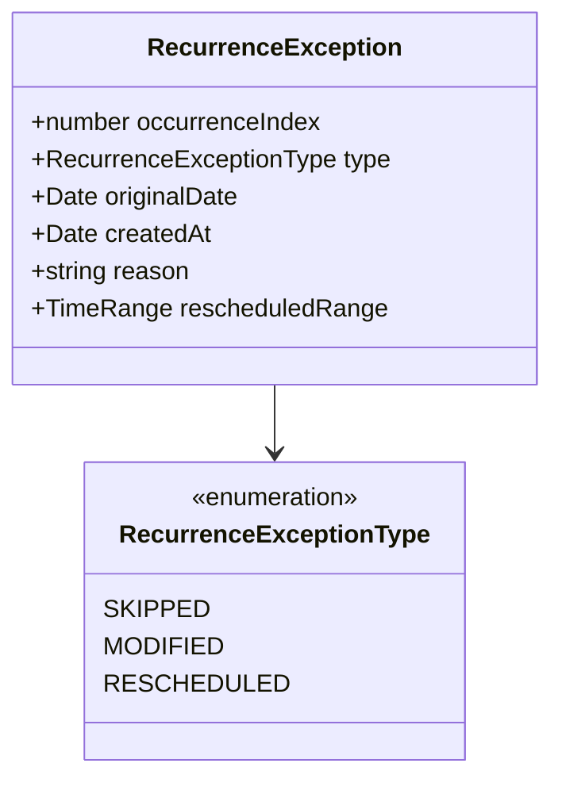

# Recurring Appointment Exceptions & Editing Semantics

## Executive Summary

This document specifies the domain rules, aggregate mutations, and operational semantics for modifying, skipping, and terminating recurring appointments in Kinergy.

---

## 1. Exception Types

The `RecurrenceSeries` aggregate maintains an immutable log of `RecurrenceException` value objects:

---

## 2. Editing & Exception Workflows

### 2.1 Skip Single Occurrence

- **Intent**: Patient is unavailable on a specific week (e.g. traveling).
- **Handler**: `SkipRecurrenceOccurrenceHandler`
- **Actions**:
  1. Appends `RecurrenceException` (`type: 'SKIPPED'`) to `RecurrenceSeries`.
  2. If the appointment aggregate was already materialized in the database, transitions its status to `CANCELLED` (`appt.cancel("Skipped by recurrence exception")`).
  3. Subsequent generation runs ignore this `occurrenceIndex`.

### 2.2 Edit & Detach Single Occurrence

- **Intent**: Patient requests a one-off reschedule to a different time/room/therapist for a single week.
- **Handler**: `EditSingleOccurrenceHandler`
- **Actions**:
  1. Validates that the requested changes pass `ConflictDetectionService`.
  2. Updates `Appointment` aggregate fields (`startTime`, `endTime`, `therapistId`, `roomId`).
  3. Sets `appointment.isDetachedFromSeries = true`.
  4. Records `MODIFIED` exception on `RecurrenceSeries`.
  5. The detached appointment maintains its `seriesId` and `occurrenceIndex` for lineage tracing, but future series-wide updates and generation runs will not overwrite it.

### 2.3 Edit Future Occurrences (Cutoff-and-Fork)

- **Intent**: Permanent schedule change from a future date onwards (e.g., switching from weekly to biweekly, or changing therapist permanently).
- **Handler**: `EditFutureOccurrencesHandler`
- **Actions**:
  1. **Truncates Old Series**: Updates the original `RecurrenceSeries` aggregate by setting `endDate` / `maxOccurrences` to end immediately before the `cutoffDate` / `fromOccurrenceIndex`.
  2. **Cancels Future Uncompleted Appointments**: Queries all materialized appointments on the old series where `startTime >= cutoffDate` and `isDetachedFromSeries === false`, and cancels them.
  3. **Spawns New Series**: Instantiates and persists a brand new `RecurrenceSeries` starting at `cutoffDate` with updated frequency, local start time, duration, therapist, or room.
  4. **Initializes Horizon**: Runs `GenerateRecurringOccurrencesHandler` on the new series.

### 2.4 Cancel Recurrence Series

- **Intent**: Patient finishes or cancels the entire treatment plan.
- **Handler**: `CancelRecurrenceSeriesHandler`
- **Actions**:
  1. Transitions `RecurrenceSeries` status to `CANCELLED`.
  2. Cancels all future non-detached appointments (`startTime > now()` and status $\in \{$ `SCHEDULED`, `CONFIRMED` $\}$).
  3. Strictly preserves past and completed appointments for clinical history, reporting, and billing integrity.
  4. Blocks all future occurrence generation requests.
