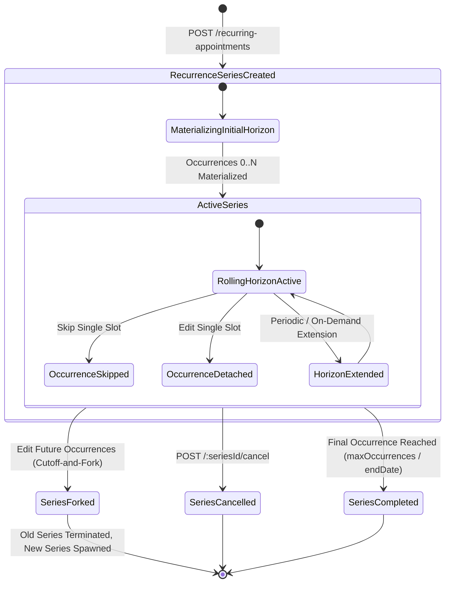

# Recurring Appointment Flow & Lifecycle Architecture

## Executive Summary

This document describes the end-to-end operational flow and lifecycle architecture for Recurring Appointments in the Kinergy Scheduling Bounded Context.

---

## 1. High-Level Lifecycle Flow

---

## 2. Operational Workflows

### 2.1 Initial Creation & Rolling Horizon Generation

1. **Client / Reception Request**: Client requests recurring treatment (e.g. Weekly on Tuesdays at 09:30 AM starting Sept 1 for 12 weeks).
2. **Aggregate Creation**: `CreateRecurrenceSeriesHandler` instantiates `RecurrenceSeries` with `RecurrencePattern` (`timezone`, `localStartTime`, `frequency`, `maxOccurrences`, `endDate`).
3. **Horizon Calculation**: `RecurrenceCalculationEngine` calculates the initial horizon (e.g. 60 days).
4. **Conflict Verification**: Each slot is checked via `ConflictDetectionService`. Unconflicted slots materialize as distinct `Appointment` aggregates (`seriesId`, `occurrenceIndex`). Conflicted slots are recorded in `conflictingOccurrences` diagnostics.

### 2.2 Clinical Adjustments & Exceptions

- **Skip Occurrence**: When a client takes vacation, `SkipRecurrenceOccurrenceHandler` logs a `SKIPPED` exception and cancels the single materialized appointment at that index. The rest of the series remains intact.
- **Reschedule / Detach Single Occurrence**: When a client needs an afternoon session for one week, `EditSingleOccurrenceHandler` modifies that `Appointment`, sets `isDetachedFromSeries = true`, and logs a `MODIFIED` exception. Subsequent series generation runs will not overwrite or duplicate this detached session.
- **Edit Future Occurrences (Cutoff-and-Fork)**: When changing therapist, room, or frequency permanently starting from a future date, `EditFutureOccurrencesHandler` truncates the old series, cancels future uncompleted appointments, and spawns a new `RecurrenceSeries` starting from the cutoff date.

### 2.3 Series Completion & Termination

- **Natural Completion**: When all `maxOccurrences` or the `endDate` is reached and generated, the series marks `isSeriesCompleted = true` and transitions to `COMPLETED`.
- **Administrative Cancellation**: Cancelling a series immediately cancels all future non-detached appointments while preserving historical completed appointments for medical records and billing.
