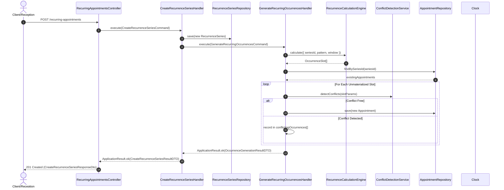
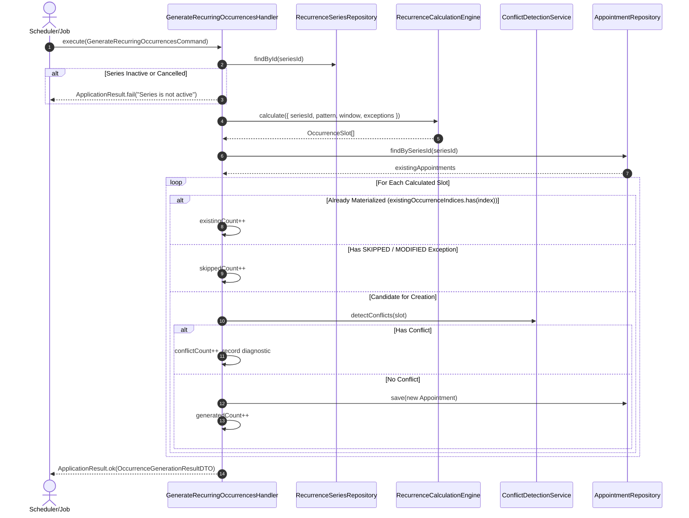
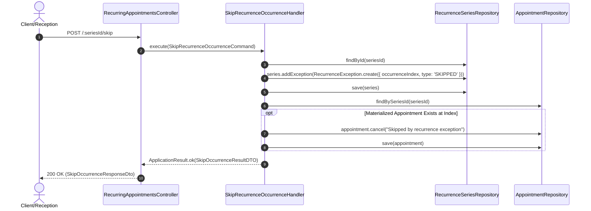
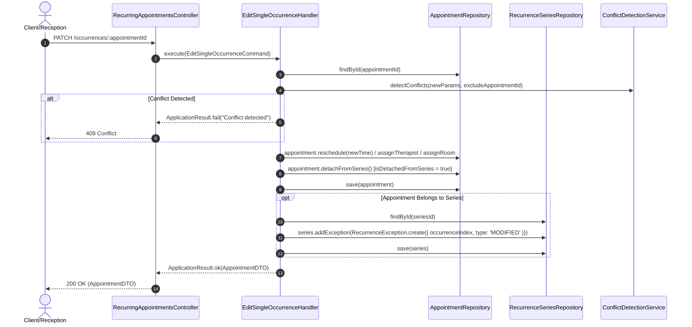
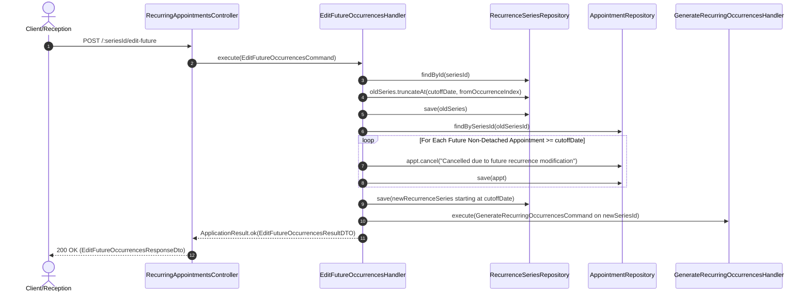
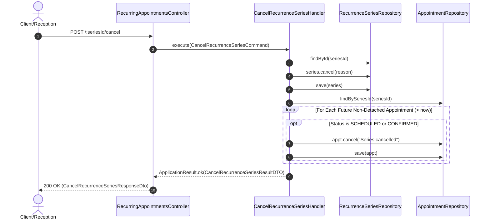
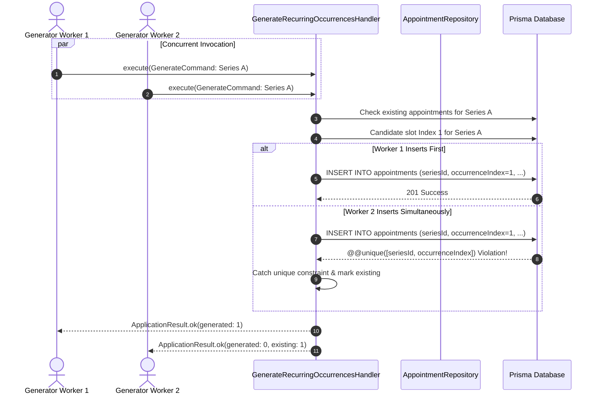

# Recurring Appointments CQRS Sequence Diagrams

## Executive Summary

This document details the CQRS sequence diagrams across all recurring appointment operations in the Kinergy Scheduling Bounded Context.

---

## 1. Create Recurring Appointment Sequence

---

## 2. Generate Occurrences (Rolling Horizon Window)

---

## 3. Skip Occurrence Sequence

---

## 4. Edit Single Occurrence (Detachment) Sequence

---

## 5. Edit Future Occurrences (Cutoff-and-Fork) Sequence

---

## 6. Cancel Recurrence Series Sequence

---

## 7. Concurrent Generation & Race Condition Invariance

