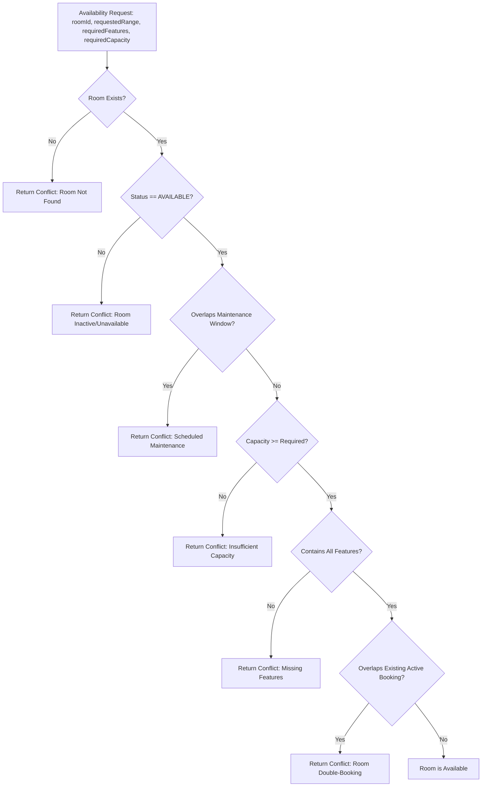

# Resource Availability Documentation

## Overview

Resource availability in Kinergy is evaluated by the domain evaluation pipeline within `@kinergy-platform/core`. Availability checks are executed during read queries (receptionist dashboard, slot finders) and write commands (appointment creation, rescheduling, series occurrence materialization).

---

## 1. Availability Evaluation Pipeline



---

## 2. The `RoomAvailabilityEvaluator` Domain Service

The `RoomAvailabilityEvaluator` (`packages/core/src/scheduling/domain/services/room-availability-evaluator.service.ts`) executes pure, deterministic domain logic on memory-loaded aggregate roots without database side-effects:

```typescript
export interface EvaluateRoomAvailabilityParams {
  readonly room: Room;
  readonly existingAppointments: Appointment[];
  readonly targetRange: TimeRange;
  readonly buffer?: TurnaroundBuffer;
  readonly requiredFeatures?: string[];
  readonly requiredCapacity?: number;
  readonly excludeAppointmentId?: string;
}

export interface EvaluatorResult {
  readonly isAvailable: boolean;
  readonly reason?: string;
  readonly conflictType?: string;
}
```

### Evaluation Stages

1. **Operational Status**: Evaluates `room.status === RoomStatus.AVAILABLE`. If `UNAVAILABLE` or `MAINTENANCE`, returns false with `room.maintenanceReason`.
2. **Scheduled Maintenance**: Evaluates `room.getOverlappingMaintenance(targetRange, buffer)`. If any window overlaps the requested range expanded by prep/cleanup buffer margins, returns false.
3. **Capacity Boundaries**: Checks `room.capacity >= requiredCapacity`.
4. **Feature Matching**: Checks `requiredFeatures.every(f => room.features.includes(f))`.
5. **Booking Overlap**: Filters `existingAppointments` for active (non-terminal) bookings overlapping `targetRange` expanded by turnaround buffers. Excludes `excludeAppointmentId` during rescheduling.

---

## 3. Turnaround Buffer Policy Interaction

Operational prep and cleanup buffers are applied to room intervals to guarantee physical room turnaround:

| Appointment Type | Prep Buffer | Cleanup Buffer | Total Turnaround Margin       |
| :--------------- | :---------- | :------------- | :---------------------------- |
| **`TREATMENT`**  | 0 minutes   | 15 minutes     | 15 minutes post-session       |
| **`EVALUATION`** | 10 minutes  | 10 minutes     | 20 minutes (10 pre / 10 post) |
| **`ASSESSMENT`** | 0 minutes   | 0 minutes      | Zero-buffer adjacency         |
| **`FOLLOW_UP`**  | 0 minutes   | 0 minutes      | Zero-buffer adjacency         |
| **`RENTAL`**     | 0 minutes   | 0 minutes      | Zero-buffer adjacency         |

During availability lookups, the query range is expanded by the buffer margin, ensuring contiguous bookings do not violate equipment sterilization or setup windows.

---

## 4. Query Use Cases

### Check Single Room Availability

- **Query**: `CheckRoomAvailabilityQuery({ roomId, startTime, endTime })`
- **Handler**: `CheckRoomAvailabilityHandler`
- **Output**: `RoomAvailabilityResponseDto` (`isAvailable: boolean`, `conflicts: string[]`).

### List Available Rooms for Time Range

- **Query**: `GetAvailableRoomsQuery({ startTime, endTime, requiredFeatures?, requiredCapacity? })`
- **Handler**: `GetAvailableRoomsHandler`
- **Output**: `RoomResponseDto[]` representing all eligible, non-conflicting rooms.
