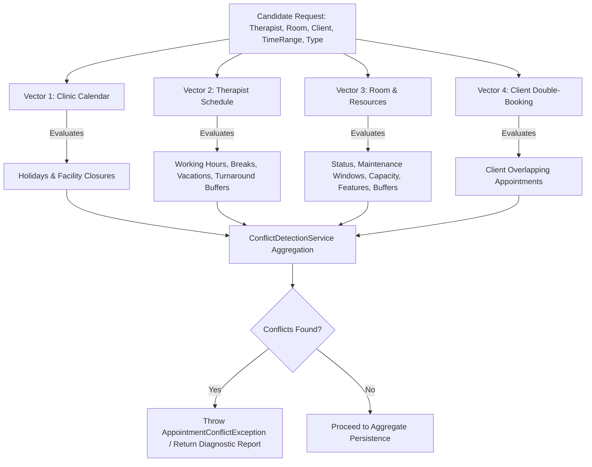

# Resource Conflict Detection Documentation

## Overview

Kinergy employs a unified 4-Dimensional Conflict Detection Engine (`ConflictDetectionService`) within `@kinergy-platform/core`. Rather than establishing separate conflict mechanisms for rooms, therapists, and clients, the engine evaluates candidate booking requests against all 4 operational vectors simultaneously.

---

## 1. The 4-Dimensional Conflict Matrix

---

## 2. Resource Conflict Rules & Topologies

The room vector (`RoomAvailabilityEvaluator`) validates all temporal interval relationships in half-open UTC $[start, end)$ space:

| Conflict Topology         | Scenario Definition                                                                       | Domain Outcome                                                                    |
| :------------------------ | :---------------------------------------------------------------------------------------- | :-------------------------------------------------------------------------------- |
| **Exact Overlap**         | Requested $[10:00, 11:00)$ matches an existing booking $[10:00, 11:00)$ in same room.     | **Rejected** (`ROOM` conflict)                                                    |
| **Partial Start Overlap** | Requested $[09:30, 10:30)$ intersects existing booking $[10:00, 11:00)$.                  | **Rejected** (`ROOM` conflict)                                                    |
| **Partial End Overlap**   | Requested $[10:30, 11:30)$ intersects existing booking $[10:00, 11:00)$.                  | **Rejected** (`ROOM` conflict)                                                    |
| **Contained Overlap**     | Requested $[09:00, 12:00)$ encloses existing booking $[10:00, 11:00)$.                    | **Rejected** (`ROOM` conflict)                                                    |
| **Adjacent Boundary**     | Requested $[09:00, 10:00)$ precedes existing booking $[10:00, 11:00)$ (zero-buffer type). | **Allowed** (Half-open boundary $[09:00, 10:00) \cap [10:00, 11:00) = \emptyset$) |
| **Turnaround Buffer**     | Requested $[10:45, 11:45)$ falls inside treatment cleanup buffer ending at 11:15.         | **Rejected** (`BUFFER` conflict)                                                  |
| **Maintenance Overlap**   | Requested interval intersects active `MaintenanceWindow`.                                 | **Rejected** (`MAINTENANCE` conflict)                                             |
| **Deactivated Room**      | Room status is `UNAVAILABLE` or `MAINTENANCE`.                                            | **Rejected** (`ROOM_INACTIVE` conflict)                                           |
| **Capacity Mismatch**     | Room capacity is less than `requiredCapacity`.                                            | **Rejected** (`INSUFFICIENT_CAPACITY` conflict)                                   |
| **Feature Mismatch**      | Room is missing one or more `requiredFeatures`.                                           | **Rejected** (`MISSING_FEATURES` conflict)                                        |

---

## 3. Half-Open Interval Semantics

All interval math in Kinergy adheres to standard half-open interval $[start, end)$:

$$\text{Overlap}(A, B) \iff A_{start} < B_{end} \land A_{end} > B_{start}$$

### Example Boundary Evaluation

- **Appointment A**: $[10:00, 11:00)$
- **Appointment B**: $[11:00, 12:00)$

Because $A_{end} = 11:00$ and $B_{start} = 11:00$, $A_{end} > B_{start}$ evaluates to `false`. Therefore, the intervals do not overlap and can be safely booked back-to-back when turnaround buffer requirements are satisfied.

---

## 4. Concurrency Hardening

When two clients attempt to book the same room for overlapping intervals concurrently:

1. **Transaction A** executes conflict detection $\rightarrow$ 0 conflicts $\rightarrow$ writes appointment to database $\rightarrow$ commits.
2. **Transaction B** executes conflict detection against the database state $\rightarrow$ queries existing active bookings $\rightarrow$ detects Appointment A $\rightarrow$ returns domain conflict $\rightarrow$ throws `AppointmentConflictException` (HTTP 409 Conflict).
3. If both transactions enter the handler simultaneously, relational table locking and database serializability ensure that one write succeeds and the competing write fails or encounters conflict on re-evaluation.
