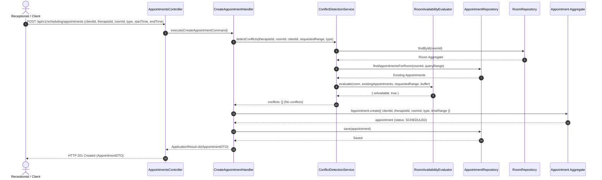
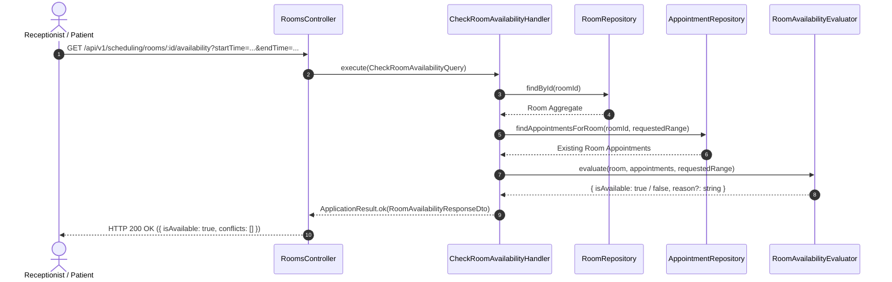
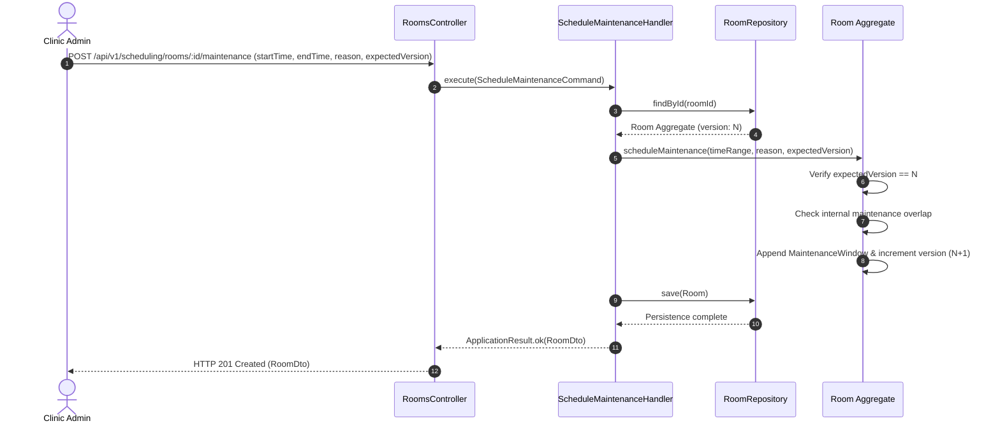
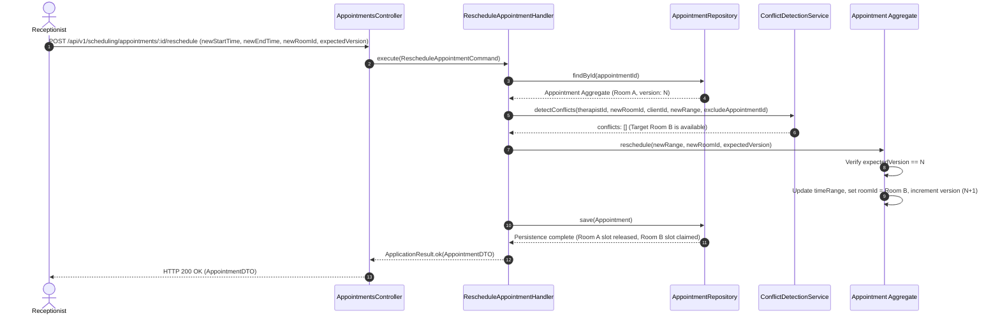
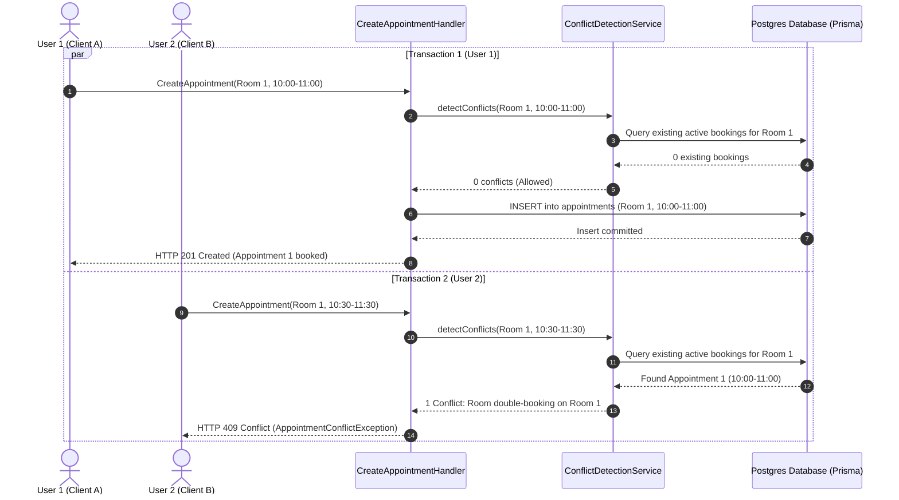

# Room Scheduling Sequence Diagrams

This document contains end-to-end Mermaid sequence diagrams for all primary room and resource scheduling workflows.

---

## 1. Reserve Room (Create Appointment with Room Assignment)

---

## 2. Check Room Availability

---

## 3. Schedule Maintenance Window

---

## 4. Appointment Rescheduling with Room Change

---

## 5. Concurrent Room Reservation (Race Condition Resolution)

