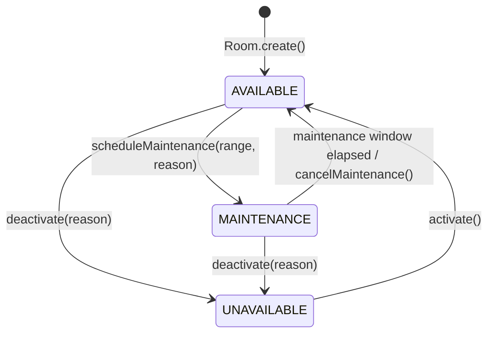

# Room & Resource Scheduling Architecture

## Executive Summary

The Room & Resource Scheduling capability in Kinergy manages physical spaces, equipment requirements, capacity bounds, and operational maintenance windows. It integrates directly into the unified 4-Dimensional conflict detection engine to guarantee double-booking prevention across the platform.

---

## 1. Room Aggregate Model & Lifecycle

The `Room` aggregate root (`packages/core/src/scheduling/domain/room/room.aggregate.ts`) encapsulates physical facility resources with strict domain invariants:

### Domain Attributes

| Property             | Type                  | Description                                        | Invariant Rules                                    |
| :------------------- | :-------------------- | :------------------------------------------------- | :------------------------------------------------- |
| `id`                 | `RoomId`              | Strongly typed UUID identifier.                    | Immutable unique identifier.                       |
| `name`               | `string`              | Human-readable room descriptor.                    | Non-empty, trimmed, cannot be whitespace only.     |
| `capacity`           | `number`              | Maximum simultaneous occupants.                    | Positive integer $\ge 1$.                          |
| `status`             | `RoomStatus`          | `AVAILABLE`, `MAINTENANCE`, `UNAVAILABLE`.         | Defaults to `AVAILABLE`.                           |
| `maintenanceReason`  | `string \| undefined` | Operational reason when deactivated.               | Required upon deactivation, cleared on activation. |
| `features`           | `string[]`            | Clinical equipment tags (e.g., `'massage_table'`). | Normalized string array.                           |
| `maintenanceWindows` | `MaintenanceWindow[]` | Temporal blocking intervals.                       | Value objects sorted by start time.                |
| `version`            | `number`              | Integer version for optimistic locking.            | Incremented on every aggregate mutation.           |

---

## 2. Capacity & Feature Requirements

Clinical booking requests may require specific physical criteria:

1. **Capacity Matching**:
   - For single-client appointments, rooms with capacity $\ge 1$ are eligible.
   - For group or specialized sessions, `requiredCapacity` is passed to `ConflictDetectionService` and `RoomAvailabilityEvaluator`. Rooms with `room.capacity < requiredCapacity` are rejected with `INSUFFICIENT_CAPACITY`.
2. **Feature Matching**:
   - When an appointment specifies `requiredFeatures` (e.g., `['hydrotherapy_tub', 'soundproof']`), the room must contain all required feature tags. Mismatches return `MISSING_FEATURES`.

---

## 3. Room Availability & Operational Status

A room is considered available for an appointment if and only if:

1. **Status is `AVAILABLE`**: If the room is `UNAVAILABLE` or globally set to `MAINTENANCE`, booking requests are rejected.
2. **No Overlapping Maintenance Window**: The requested interval does not intersect any scheduled `MaintenanceWindow` (taking into account prep/cleanup turnaround buffers).
3. **No Overlapping Active Appointments**: No other active appointment in the same room overlaps the requested interval (in half-open UTC $[start, end)$ space).
4. **Capacity & Features Satisfied**: The room satisfies any minimum capacity and required equipment features.

---

## 4. Maintenance Scheduling

Planned or emergency room downtime is encapsulated in `MaintenanceWindow` value objects:

- **Creation**: Handled via `ScheduleMaintenanceHandler` (`ScheduleMaintenanceCommand`). Rejects overlapping maintenance windows within the same room.
- **Cancellation**: Handled via `CancelMaintenanceHandler` (`CancelMaintenanceCommand`).
- **Effect on Bookings**: Blocked rooms immediately fail availability evaluations in `RoomAvailabilityEvaluator` and raise `AppointmentConflictException` on booking attempts.
- **Effect on Recurring Series**: When a recurring series generates occurrences across a maintenance window, the affected occurrence is tagged in `conflictingOccurrences` with diagnostic metadata while valid future sessions are materialized without abortion.

---

## 5. Appointment Resource Assignment

- **Creation**: An appointment can be booked with an optional `roomId`.
- **Reassignment**: Handled via `AssignRoomHandler` (`AssignRoomCommand`) or `RescheduleAppointmentHandler` (`RescheduleAppointmentCommand`).
- **Reallocation & Release**: Rescheduling or cancelling an appointment immediately frees the previously reserved room slot for other practitioners.
