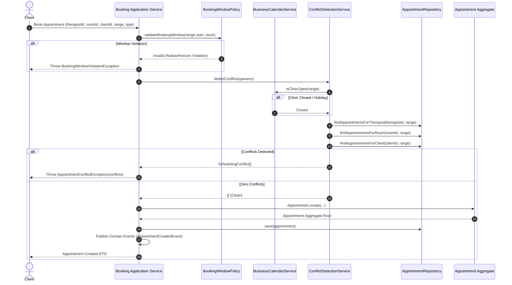

# Scheduling Workflow & Conflict Resolution Pipeline

## Booking Request Execution & Conflict Detection Workflow

---

## Multi-Aggregate Conflict Evaluation Priority

1. **Facility Open & Holiday Check**: Verifies facility is open and not observing a public holiday.
2. **Therapist Vacation & Overrides**: Checks date-specific vacation periods and availability overrides.
3. **Therapist Shift & Break Rules**: Evaluates standard working hours and daily break intervals.
4. **Room Operational Status & Equipment**: Verifies room status is `AVAILABLE` and supports required capabilities.
5. **Therapist & Room Booking Overlaps**: Queries active non-cancelled appointments for room or therapist overlap.
6. **Client Double-Booking Guard**: Asserts client has zero conflicting active appointments.
