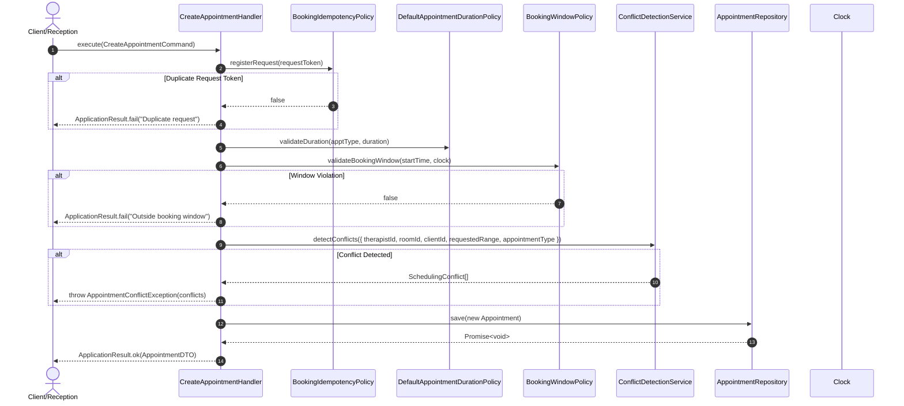
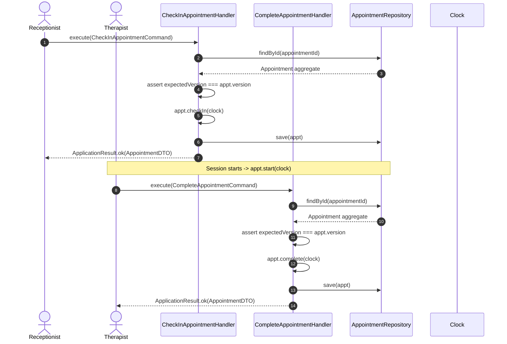
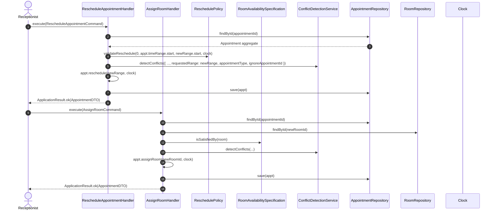

# Application Layer Command Execution Sequence Diagrams

## Executive Summary

This document presents the CQRS command execution sequence diagrams for appointment creation, check-in/completion operational workflows, and reschedule/resource reassignment execution flows.

---

## Table of Contents

- [1. Appointment Creation & Conflict Check Sequence](#1-appointment-creation--conflict-check-sequence)
- [2. Reception Desk Check-In & Completion Workflow](#2-reception-desk-check-in--completion-workflow)
- [3. Reschedule & Resource Reassignment Execution Flow](#3-reschedule--resource-reassignment-execution-flow)

---

## 1. Appointment Creation & Conflict Check Sequence

---

## 2. Reception Desk Check-In & Completion Workflow

---

## 3. Reschedule & Resource Reassignment Execution Flow

