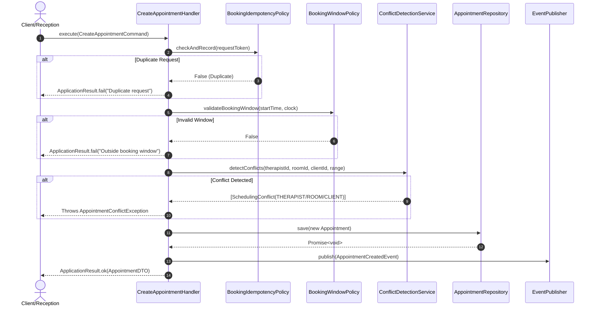
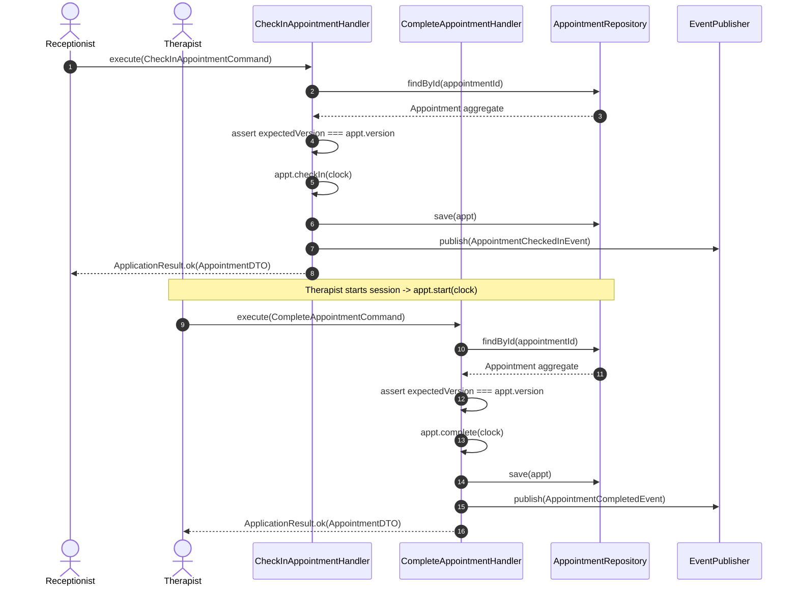
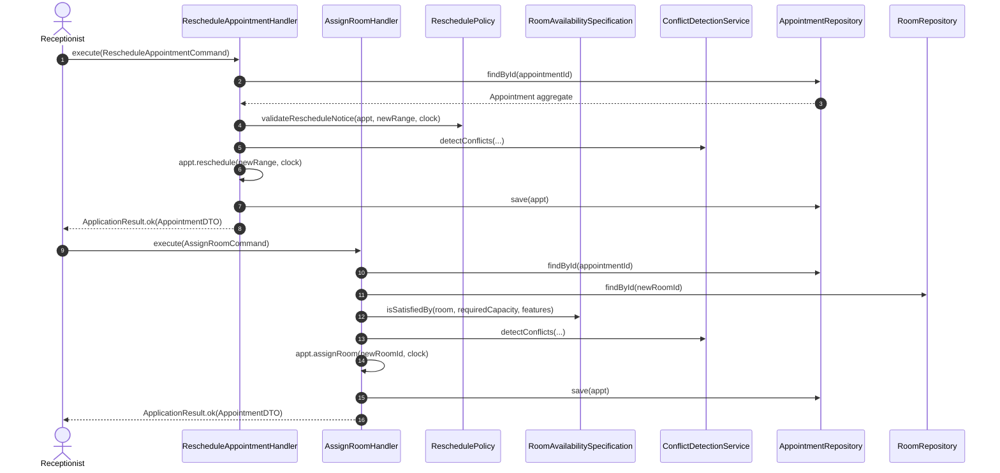

# Application Layer Sequence Diagrams

## 1. Appointment Creation & Conflict Check Sequence

---

## 2. Reception Desk Check-In & Completion Workflow

---

## 3. Reschedule & Resource Reassignment Execution Flow

