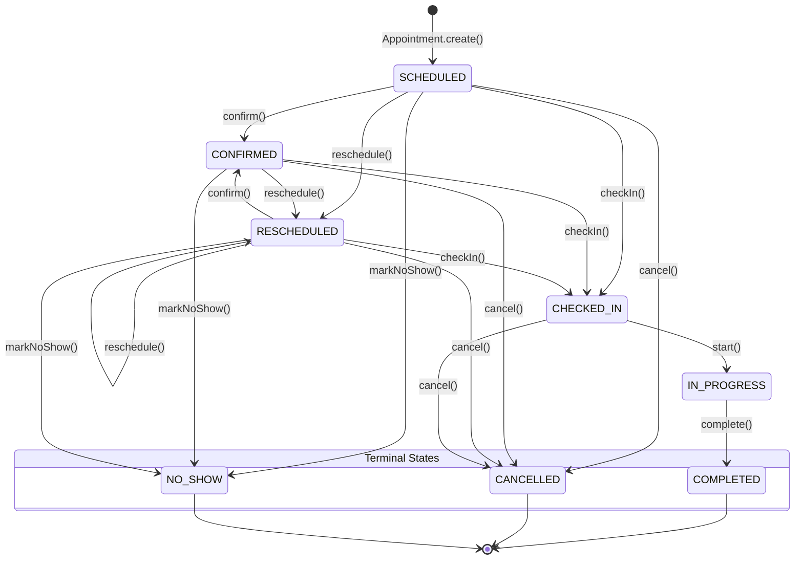

# Appointment Aggregate State Machine Specification

## Executive Summary

This document specifies the formal state machine model governing the lifecycle of an `Appointment` aggregate root within the Scheduling Bounded Context.

---

## Table of Contents

- [State Transition Diagram](#state-transition-diagram)
- [Lifecycle States](#lifecycle-states)
- [Triggers, Domain Events & Transition Rules](#triggers-domain-events--transition-rules)

---

## State Transition Diagram

---

## Lifecycle States

- **`SCHEDULED`:** Initial state upon appointment creation.
- **`CONFIRMED`:** Attendance confirmed by patient or reception.
- **`CHECKED_IN`:** Patient has arrived at facility reception desk.
- **`IN_PROGRESS`:** Session actively executing in designated treatment room.
- **`COMPLETED`:** Terminal state reached upon successful session conclusion.
- **`CANCELLED`:** Terminal state reached when booking is cancelled prior to execution.
- **`NO_SHOW`:** Terminal state reached when patient fails to appear without notice.

---

## Triggers, Domain Events & Transition Rules

1. **`create()`**: Instantiates a new appointment in `SCHEDULED` status (`version = 1`) and emits `AppointmentCreatedEvent`.
2. **`confirm()`**: Confirms attendance. Transitions state to `CONFIRMED`.
3. **`checkIn()`**: Registers arrival. Transitions state from `SCHEDULED` or `CONFIRMED` to `CHECKED_IN` and emits `AppointmentCheckedInEvent`.
4. **`start()`**: Begins clinical session. Transitions state from `CHECKED_IN` to `IN_PROGRESS`.
5. **`complete()`**: Finishes session. Transitions state from `IN_PROGRESS` to `COMPLETED` and emits `AppointmentCompletedEvent`.
6. **`reschedule(newTimeRange)`**: Mutates `timeRange` for active bookings (`SCHEDULED` or `CONFIRMED`) and emits `AppointmentRescheduledEvent`.
7. **`cancel(reason)`**: Cancels session. Transitions state to `CANCELLED` and emits `AppointmentCancelledEvent`.
8. **`markNoShow()`**: Tags absent booking. Transitions state from `SCHEDULED` or `CONFIRMED` to `NO_SHOW` and emits `AppointmentNoShowEvent`.
