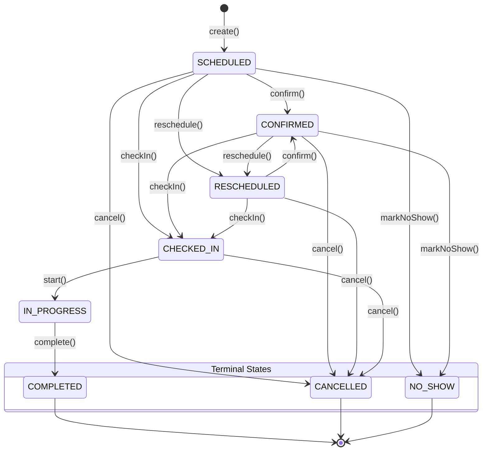

# Appointment State Machine Diagram

## Description of Triggers & Transitions

1. **`create()`**: Instantiates a new appointment in `SCHEDULED` status with `version = 1` and emits `AppointmentCreatedEvent`.
2. **`confirm()`**: Reception or client confirms attendance. Transitions state to `CONFIRMED`.
3. **`checkIn()`**: Client arrives at facility reception desk. Transitions state to `CHECKED_IN` and emits `AppointmentCheckedInEvent`.
4. **`start()`**: Therapist begins treatment session in room. Transitions state to `IN_PROGRESS`.
5. **`complete()`**: Session finishes. Transitions state to `COMPLETED` and emits `AppointmentCompletedEvent`.
6. **`reschedule()`**: Time range updated following notice policy checks. Emits `AppointmentRescheduledEvent`.
7. **`cancel()`**: Session cancelled prior to execution. Emits `AppointmentCancelledEvent`.
8. **`markNoShow()`**: Session time elapsed without arrival. Emits `AppointmentNoShowEvent`.
