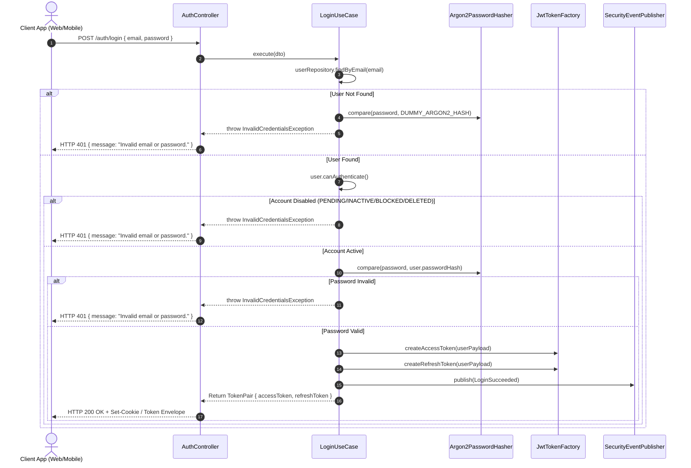
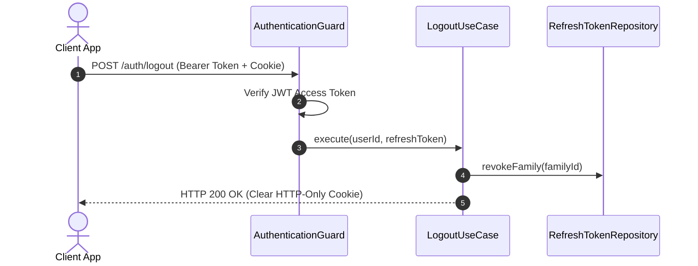
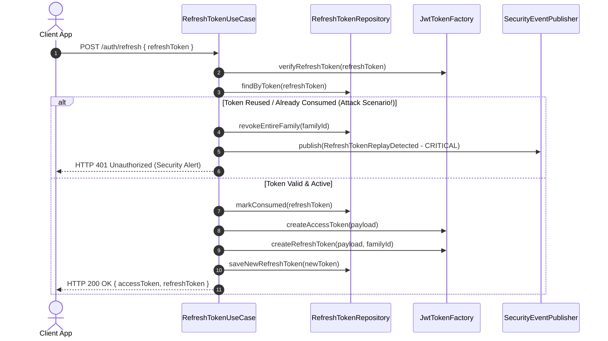

# Identity Authentication Architecture & Security Specification

- **Status:** Accepted (Authoritative Single Source of Truth)
- **Date:** 2026-07-29
- **Authors:** Principal Security Architect & Staff Software Engineer
- **Domain:** Identity & Access Management (IAM)
- **Target Subsystem:** `apps/api/src/platform/identity`

---

## Executive Summary

The Kinergy Platform Authentication Subsystem is engineered to enforce strict zero-information-disclosure principles, side-channel timing attack mitigations, fail-fast startup secret validation, account lifecycle state validation, and stateless JWT verification with Refresh Token Rotation (RTR).

---

## 1. Authentication Endpoints & Workflows

### 1.1 Login Workflow (`POST /api/v1/auth/login`)

- **Route**: `POST /auth/login` (Public route via `@Public()`, Rate-Limited via `@LoginThrottle()`).
- **Payload DTO**: `{ "email": "user@kinergy.com", "password": "SecurePassword123!" }` (Sanitized via `InputSanitizer`).
- **Use Case**: `LoginUseCase`.
- **Execution Lifecycle**:
  1. Input payload is sanitized and validated.
  2. `userRepository.findByEmail(email)` retrieves the target `User` aggregate root.
  3. **Timing Attack Protection**: If user is `null`, `LoginUseCase` executes a constant-time dummy Argon2id verification (`DUMMY_ARGON2_HASH`) and throws `InvalidCredentialsException('Invalid email or password.')`.
  4. **Account Lifecycle Check**: Evaluates `user.canAuthenticate()`. If account is `PENDING`, `INACTIVE`, `SUSPENDED`, `BLOCKED`, or `DELETED`, `LoginUseCase` throws `InvalidCredentialsException('Invalid email or password.')` to preserve zero-information disclosure while logging exact failure telemetry internally.
  5. **Password Verification**: Executes `argon2PasswordHasher.compare(plainPassword, user.passwordHash)`. If invalid, increments failed attempt counter and throws `InvalidCredentialsException`.
  6. **Token Issuance**: Generates short-lived Access Token and long-lived Refresh Token via `JwtTokenFactory` and `RefreshTokenService`.
  7. **Security Telemetry**: Dispatches `LoginSucceeded` domain event to `ISecurityEventPublisher` and `SecurityAuditHookService`.



---

### 1.2 Logout Workflow (`POST /api/v1/auth/logout`)

- **Route**: `POST /auth/logout` (Protected via `AuthenticationGuard`, Rate-Limited via `@LogoutThrottle()`).
- **Use Case**: `LogoutUseCase`.
- **Execution Lifecycle**:
  1. `AuthenticationGuard` extracts active user claims from Bearer token.
  2. `LogoutUseCase.execute(userId, refreshToken)` receives request.
  3. Invalidates active `RefreshToken` family record in repository (`refreshTokenRepository.revokeFamily(familyId)`).
  4. Instructs client to clear HTTP-Only `refreshToken` cookie.
  5. Dispatches `LogoutSucceeded` event to security telemetry pipeline.



---

### 1.3 Refresh Token Workflow (`POST /api/v1/auth/refresh`)

- **Route**: `POST /auth/refresh` (Public via `@Public()`, Rate-Limited via `@RefreshThrottle()`).
- **Use Case**: `RefreshTokenUseCase`.
- **Sliding Window RTR Lifecycle**:
  1. Verifies input refresh token signature and expiration.
  2. Retrieves active token family state from `refreshTokenRepository`.
  3. **Reuse Detection (Replay Attack)**: If token was already consumed/invalidated, triggers security breach workflow, revokes entire `familyId`, publishes `RefreshTokenReplayDetected` alert, and returns `HTTP 401 Unauthorized`.
  4. If valid, invalidates current token, issues new Access Token and new Refresh Token pair belonging to same `familyId`, and updates store.



---

### 1.4 Get Current User Workflow (`GET /api/v1/auth/me`)

- **Route**: `GET /auth/me` (Protected via `AuthenticationGuard`, Rate-Limited via `@MeThrottle()`).
- **Use Case**: `GetCurrentUserUseCase`.
- **Execution Lifecycle**:
  1. `AuthenticationGuard` validates Bearer token claims (`sub`, `tokenVersion`).
  2. `RequestContext` injects authenticated user state into request local storage.
  3. `GetCurrentUserUseCase.execute(userId)` fetches active user details and returns `CurrentUserDto` payload (`userId`, `email`, `roles`, `permissions`, `tenantId`).

---

## 2. Password Verification & Timing Attack Mitigations

Password hashing uses **Argon2id** (memory-hard password hashing algorithm).

### 2.1 Production Parameters

- **Memory Cost (`m`)**: $65536\text{ KB}$ ($64\text{ MB}$).
- **Time Cost (`t`)**: $3\text{ iterations}$.
- **Parallelism (`p`)**: $4\text{ threads}$.

### 2.2 Constant-Time Timing Attack Defense

To prevent account enumeration via timing side-channels, `LoginUseCase` maintains a pre-computed `DUMMY_ARGON2_HASH`. When a non-existent email is queried, the system performs a full Argon2id comparison against `DUMMY_ARGON2_HASH`, ensuring constant CPU time ($\sim 50\text{ ms}$) regardless of user existence.

```
Non-Existent Email ──► Execute Argon2id(password, DUMMY_HASH) ──► Latency ~50ms ──► Generic Error
Valid Email        ──► Execute Argon2id(password, USER_HASH)  ──► Latency ~50ms ──► Generic Error / OK
```

---

## 3. JWT Token Generation & Claims Specification

Access tokens are generated by `JwtTokenFactory` using cryptographic secrets (`JWT_ACCESS_SECRET`).

### 3.1 Access Token Claims Payload Schema

```json
{
  "sub": "usr_9b1deb4d-3b7d-416b-9548-52ee8c8230e5",
  "email": "operator@kinergy.com",
  "roles": ["OPERATOR"],
  "permissions": ["assets.read", "assets.update"],
  "tokenVersion": 1,
  "tenantId": "tenant_alpha",
  "iss": "kinergy-platform",
  "aud": "kinergy-api",
  "iat": 1785240000,
  "exp": 1785240900
}
```

---

## 4. Generic Authentication Errors Strategy

All public authentication failures return an uninformative, generic HTTP 401 response payload to prevent user enumeration and account harvesting.

### Client Response vs. Internal Security Telemetry Matrix

| Scenario                 | Client Response Payload (`401 Unauthorized`)                     | Internal Log / Security Telemetry Event                    |
| :----------------------- | :--------------------------------------------------------------- | :--------------------------------------------------------- |
| Missing Email / Password | `{ "statusCode": 401, "message": "Invalid email or password." }` | `Email and password are required`                          |
| Unknown Email            | `{ "statusCode": 401, "message": "Invalid email or password." }` | `LoginFailed: User not found` (+ Dummy Argon2id execution) |
| Invalid Password         | `{ "statusCode": 401, "message": "Invalid email or password." }` | `LoginFailed: Invalid password`                            |
| Pending Account          | `{ "statusCode": 401, "message": "Invalid email or password." }` | `LoginFailed: Account status disabled (PENDING)`           |
| Inactive Account         | `{ "statusCode": 401, "message": "Invalid email or password." }` | `LoginFailed: Account status disabled (INACTIVE)`          |
| Blocked Account          | `{ "statusCode": 401, "message": "Invalid email or password." }` | `LoginFailed: Account status disabled (BLOCKED)`           |
| Suspended Account        | `{ "statusCode": 401, "message": "Invalid email or password." }` | `LoginFailed: Account status disabled (SUSPENDED)`         |

---

## 5. Startup Secret Management & Fail-Fast Lifecycle

Cryptographic secrets are managed by `ConfigSecretProvider`.

- `JWT_ACCESS_SECRET` & `JWT_REFRESH_SECRET` must be $\ge 32$ characters.
- In production (`NODE_ENV=production`), developer default fallback strings are strictly forbidden.
- During `NestFactory.create(AppModule)` bootstrap, `ConfigSecretProvider.onModuleInit()` checks secrets. If invalid, it throws `SecurityConfigurationException` and halts startup immediately before port binding.

---

## 6. OWASP ASVS Compliance Matrix

| OWASP Requirement | Description                             | Status     | Implementation Verification                                                    |
| :---------------- | :-------------------------------------- | :--------- | :----------------------------------------------------------------------------- |
| **V2.1.1**        | Generic error messages on login failure | **PASSED** | `LoginUseCase` & `GlobalExceptionFilter` return generic HTTP 401 response      |
| **V2.1.12**       | Timing attack side-channel defense      | **PASSED** | Constant-time `DUMMY_ARGON2_HASH` execution on non-existent users              |
| **V2.10.1**       | Strong secret key validation            | **PASSED** | Secrets enforced $\ge 32$ chars via Zod `envSchema` & `ConfigSecretProvider`   |
| **V2.10.2**       | Fail-fast application startup           | **PASSED** | Startup exception halts port binding on missing/weak secrets                   |
| **V3.3.1**        | Audit event logging                     | **PASSED** | Emits `LoginFailed`, `LoginSucceeded`, and `RefreshTokenReplayDetected` events |
