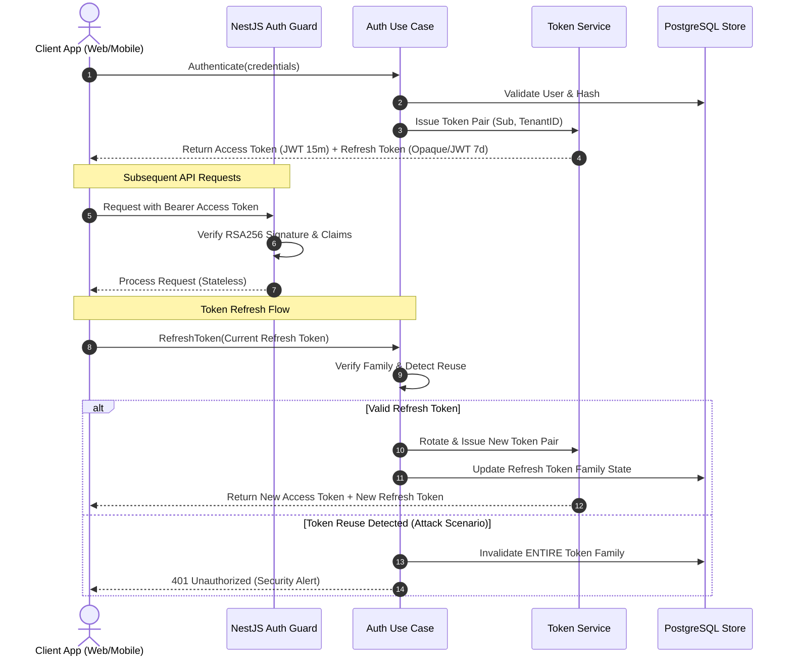
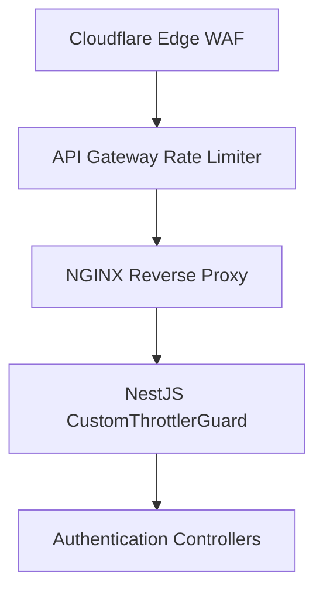

# ADR-0001: Identity Authentication Strategy & Mechanisms

- **Status:** Accepted
- **Date:** 2026-07-25
- **Authors:** Principal Security Architect & Staff Software Engineer
- **Domain:** Identity & Access Management (IAM)

---

## Context

The Kinergy Platform is an enterprise SaaS application built using NestJS, Prisma, PostgreSQL, and TypeScript, structured as a Modular Monolith with Domain-Driven Design (DDD) and Clean Architecture principles.

The platform requires a robust identity verification mechanism for human users (operators, administrators, energy managers) and machine clients (APIs, energy IoT telemetry collectors). Authentication must be stateless, resilient against session hijacking and replay attacks, scalable across distributed environments, and flexible enough to support future enterprise Single Sign-On (SSO), OAuth2/OIDC federation, and Multi-Factor Authentication (MFA).

---

## Problem

Legacy session-based authentication mechanisms relying on server-side session databases introduce statefulness and latency bottlenecks at scale. Conversely, naive stateless JWT authentication implementations often suffer from token theft, inability to invalidate sessions immediately upon logout or breach, and tight coupling to specific authentication providers.

Key challenges to address:

1. Guaranteeing secure authentication across stateless REST APIs.
2. Preventing token replay and theft via Refresh Token Rotation (RTR).
3. Implementing deterministic logout mechanisms despite stateless access tokens.
4. Structuring identity boundaries to support future OAuth2/OIDC integration and MFA step-up capabilities without refactoring core domain models.

---

## Decision

We decide to implement a **Dual-Token Asymmetric JWT Authentication Architecture** with **Refresh Token Rotation (RTR)**, executed within the Identity Bounded Context.

### 1. Dual-Token Architecture & Lifetimes

- **Access Token:**
  - **Type:** Asymmetrically signed JSON Web Token (RS256 or Ed25519).
  - **Lifetime:** Short-lived (15 minutes).
  - **Storage:** Memory (JS context) or short-lived memory storage on client.
  - **Payload Claims:** Standard claims (`sub`, `iss`, `aud`, `exp`, `nbf`, `iat`, `jti`) and domain claims (`tenant_id`, `roles`, `permissions`, `token_version`).
  - **Verification:** Stateless validation using local public key; no database lookup required for valid tokens.

- **Refresh Token:**
  - **Type:** High-entropy cryptographically secure random string (opaque) or signed token tied to a token family identifier (`family_id`).
  - **Lifetime:** 7 days sliding window; maximum absolute lifetime of 30 days.
  - **Storage:** Secure HTTP-Only, SameSite=Strict, Encrypted Cookie (Web) or Secure Keychain (Mobile).

### 2. Refresh Token Rotation (RTR) & Family Invalidation

To eliminate the risk of stolen long-lived refresh tokens:

- Every time a refresh token is presented to `/auth/refresh`, it is consumed, invalidated, and replaced by a **new** Access Token and a **new** Refresh Token.
- Tokens belong to a **Token Family** (`family_id`).
- If an already consumed (old) refresh token is presented, the system triggers **Reuse Detection**, immediately invalidating the entire Token Family and revoking all active sessions associated with that user session.

### 3. Secure Logout Strategy

Logout execution requires two simultaneous actions:

1. **Server-Side Revocation:** Revoke the active refresh token family and blacklist the current Access Token JTI in high-performance cache (Redis) if unexpired.
2. **Client-Side Clearance:** Instruct the client browser to clear the HTTP-Only cookie and purge in-memory tokens.

### 4. Future OAuth2 / OIDC Integration

The architecture decouples core identity validation from credential source via a domain port (`IFederatedIdentityProviderPort`).

- Local identity (email/password) is treated as one identity provider among equals.
- Future providers (Okta, Azure AD, Google Workspace, GitHub) will implement `IFederatedIdentityProviderPort`, mapping external OIDC claims to the internal `IdentityContext`.

### 5. Future MFA Compatibility

Multi-Factor Authentication will be integrated into the use-case pipeline via a two-stage authentication flow:

- Initial credential validation returns a temporary `MFA_PENDING` pre-authentication token.
- Successful TOTP (RFC 6238) or WebAuthn (FIDO2) verification elevates the session state, issuing the full Access/Refresh token pair with an `amr` (Authentication Methods References) claim reflecting `["pwd", "mfa"]`.

### 6. Transport Rate Limiting & Protection Layer

To protect authentication endpoints against brute-force attacks and CPU exhaustion caused by expensive Argon2id hashing, transport rate limiting is enforced via `RateLimitingModule` (`CustomThrottlerGuard`).

- **Policy Matrix**: Configurable thresholds (`AUTH_LOGIN_LIMIT`, `AUTH_REFRESH_LIMIT`, `AUTH_LOGOUT_LIMIT`, `AUTH_ME_LIMIT`).
- **Standardized Error**: Breaches throw standardized HTTP 429 (`ThrottlerException`) responses.

---

## Alternatives Considered

1. **Stateful Session IDs in Redis/PostgreSQL:**
   - _Pros:_ Instant revocation of any session by deleting key from store.
   - _Cons:_ Introduces network I/O latency and database dependency on every API request. Does not align with stateless microservice/modular monolith scalability goals.
2. **Symmetric Secret JWT Signing (HS256):**
   - _Pros:_ Simple configuration with a single shared secret key.
   - _Cons:_ Demands sharing the secret key with any service that needs to verify tokens. Asymmetric signing (RS256/Ed25519) allows public key distribution for token verification without risking signature forgery.
3. **Non-Rotating Refresh Tokens:**
   - _Pros:_ Simple client-side token refresh implementation.
   - _Cons:_ Extreme security vulnerability—if a refresh token is stolen from client storage, the attacker retains persistent access until token expiration.

---

## Consequences

### Positive

- **High Performance & Scalability:** API requests are verified statelessly using public keys without database overhead.
- **Compromise Containment:** Refresh Token Rotation with family reuse detection automatically neutralizes compromised refresh tokens.
- **Clean Architecture Alignment:** Clear separation of token generation services, authentication guards, and underlying identity providers.

### Negative

- **Public Key Management:** Requires secure key generation, storage, and eventual rotation mechanisms (e.g., JWKS endpoints).
- **Access Token Window of Exposure:** If an Access Token is compromised, it remains valid until its short 15-minute expiration unless blacklisted via Redis JTI revocation.

---

## Future Evolution

1. **JWKS Key Rotation (`/.well-known/jwks.json`):** Automated asymmetric key rotation using JSON Web Key Sets.
2. **Passkey / WebAuthn First-Class Support:** Passwordless authentication utilizing FIDO2/WebAuthn hardware authenticators.
3. **Risk-Based Adaptive Authentication:** Contextual step-up triggers monitoring IP changes, novel device signatures, or geographic anomalies.
