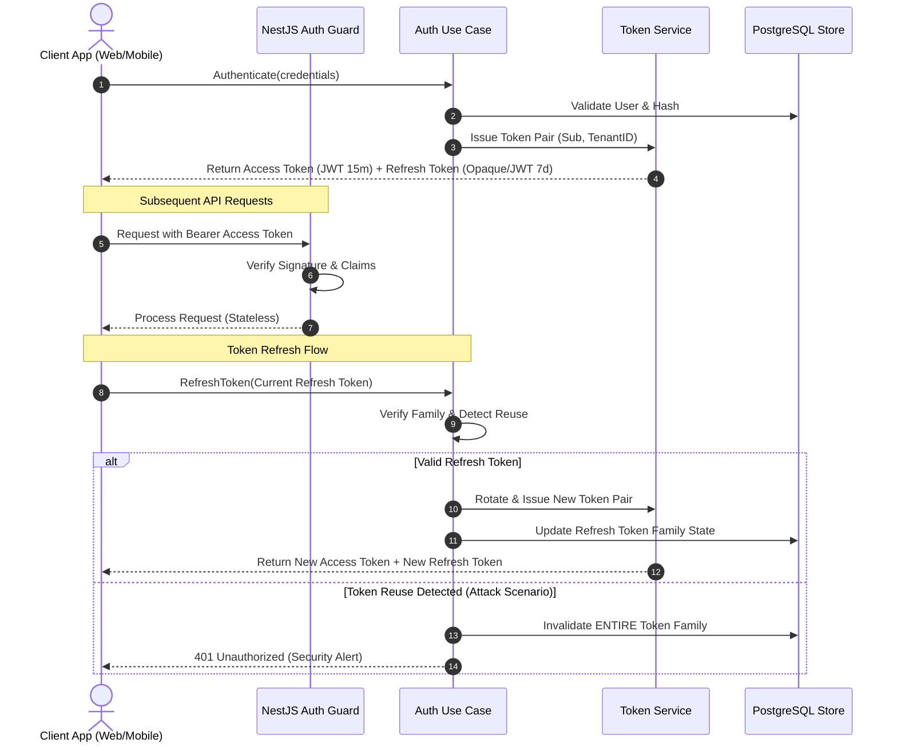

# Identity Authentication & Operational Security Specification

- **Status:** Accepted
- **Date:** 2026-07-29
- **Authors:** Principal Security Architect & Staff Software Engineer
- **Domain:** Identity & Access Management (IAM)

---

## Executive Summary

The Kinergy Platform Authentication Subsystem is engineered to enforce strict zero-information-disclosure principles, side-channel timing attack mitigations, fail-fast startup configuration validation, and stateless JWT verification with Refresh Token Rotation (RTR).

---

## 1. Core Architecture & Token Lifetimes

We implement a **Dual-Token Asymmetric JWT Authentication Architecture** with **Refresh Token Rotation (RTR)**.



### Dual-Token Architecture & Lifetimes

- **Access Token:**
  - **Type:** Asymmetrically signed JSON Web Token (RS256 or HMAC SHA-256 for symmetric configuration).
  - **Lifetime:** Short-lived (15 minutes).
  - **Payload Claims:** Standard claims (`sub`, `iss`, `aud`, `exp`, `nbf`, `iat`, `jti`) and domain claims (`tenant_id`, `roles`, `permissions`, `token_version`).
  - **Verification:** Stateless validation using local public key or secret; no database lookup required for valid tokens.

- **Refresh Token:**
  - **Type:** High-entropy cryptographically secure random string (opaque) tied to a token family identifier (`family_id`).
  - **Lifetime:** 7 days sliding window; maximum absolute lifetime of 30 days.
  - **Storage:** Secure HTTP-Only, SameSite=Strict, Encrypted Cookie (Web) or Secure Keychain (Mobile).

---

## 2. Refresh Token Rotation (RTR) & Family Invalidation

To eliminate the risk of stolen long-lived refresh tokens:

- Every time a refresh token is presented to `/auth/refresh`, it is consumed, invalidated, and replaced by a **new** Access Token and a **new** Refresh Token.
- Tokens belong to a **Token Family** (`family_id`).
- If an already consumed (old) refresh token is presented, the system triggers **Reuse Detection**, immediately invalidating the entire Token Family and revoking all active sessions associated with that user session.

---

## 3. Zero-Information-Disclosure Error Strategy

To prevent user enumeration and account state harvesting, all public authentication endpoints return generic error responses regardless of the underlying failure reason.

### Client-Facing vs. Internal Telemetry Response Matrix

| Failure Cause                | HTTP Status        | Response Payload `message`   | Internal Log / Security Event Telemetry                    |
| :--------------------------- | :----------------- | :--------------------------- | :--------------------------------------------------------- |
| **Missing Email / Password** | `401 Unauthorized` | `Invalid email or password.` | `Email and password are required`                          |
| **Email Not Found**          | `401 Unauthorized` | `Invalid email or password.` | `LoginFailed: User not found` (+ Dummy Argon2id execution) |
| **Invalid Password**         | `401 Unauthorized` | `Invalid email or password.` | `LoginFailed: Invalid password`                            |
| **Pending Status**           | `401 Unauthorized` | `Invalid email or password.` | `LoginFailed: Account status disabled (PENDING)`           |
| **Inactive Status**          | `401 Unauthorized` | `Invalid email or password.` | `LoginFailed: Account status disabled (INACTIVE)`          |
| **Blocked Status**           | `401 Unauthorized` | `Invalid email or password.` | `LoginFailed: Account status disabled (BLOCKED)`           |
| **Suspended Status**         | `401 Unauthorized` | `Invalid email or password.` | `LoginFailed: Account status disabled (SUSPENDED)`         |

> [!IMPORTANT]
> **SIEM & Security Telemetry**: While external clients receive sanitized generic error responses, internal security teams can monitor exact failure reasons via structured `LoginFailed` events emitted to `ISecurityEventPublisher` and `PlatformLogger`.

---

## 4. Timing Attack & Side-Channel Mitigation

When an authentication request specifies a non-existent email address, traditional systems fail early without executing password hashing functions, resulting in noticeable latency differences (e.g. 1ms vs 50ms).

```
Non-Existent Email Request ──► Dummy Argon2id Verification ──► Standard Response (~50ms)
Valid Email Request        ──► Real Argon2id Verification  ──► Standard Response (~50ms)
```

The Kinergy API executes a constant-time dummy Argon2id hash verification (`$argon2id$v=19$m=65536,t=3,p=4$...`) whenever `userRepository.findByEmail()` returns `null`, ensuring identical CPU time and response latency for valid and invalid user accounts.

---

## 5. Secret Management & Fail-Fast Startup Validation

Security secrets are centrally managed and validated during application bootstrap. Insecure fallbacks are strictly prohibited.

### Required Security Environment Variables

| Variable             | Min Length | Default (Non-Prod)                                  | Production Requirements                             |
| :------------------- | :--------- | :-------------------------------------------------- | :-------------------------------------------------- |
| `JWT_ACCESS_SECRET`  | 32 chars   | `kinergy-platform-dev-access-secret-min-32-chars!`  | Custom secret $\ge 32$ chars. Dev default rejected. |
| `JWT_REFRESH_SECRET` | 32 chars   | `kinergy-platform-dev-refresh-secret-min-32-chars!` | Custom secret $\ge 32$ chars. Dev default rejected. |
| `ARGON2_MEMORY_COST` | N/A        | `65536` (64 MB)                                     | Minimum 15360 KB (15 MB). Recommended 64 MB.        |
| `ARGON2_TIME_COST`   | N/A        | `3` iterations                                      | Minimum 1 iteration.                                |
| `ARGON2_PARALLELISM` | N/A        | `4` threads                                         | Minimum 1 thread.                                   |

---

## 6. OWASP Authentication Compliance Self-Review

| OWASP ASVS 4.0 Requirement | Description                                            | Status     | Evidence & Verification                                                         |
| :------------------------- | :----------------------------------------------------- | :--------- | :------------------------------------------------------------------------------ |
| **V2.1.1**                 | Generic error messages on authentication failure       | **PASSED** | `LoginUseCase` & `GlobalExceptionFilter` return `Invalid email or password.`    |
| **V2.1.12**                | Side-channel timing attack mitigation                  | **PASSED** | Dummy Argon2id hash verification on missing users                               |
| **V2.10.1**                | Cryptographic secret strength & storage                | **PASSED** | `JWT_ACCESS_SECRET` & `JWT_REFRESH_SECRET` enforced $\ge 32$ chars              |
| **V2.10.2**                | Application fail-fast on insecure secret configuration | **PASSED** | `ConfigSecretProvider.onModuleInit()` throws `SecurityConfigurationException`   |
| **V2.10.3**                | Removal of insecure hardcoded fallback credentials     | **PASSED** | Fallback constants removed; startup validation enforced across all environments |
| **V3.3.1**                 | Audit event logging for security monitoring            | **PASSED** | Detailed `LoginFailed` security events published internally for SIEM            |
