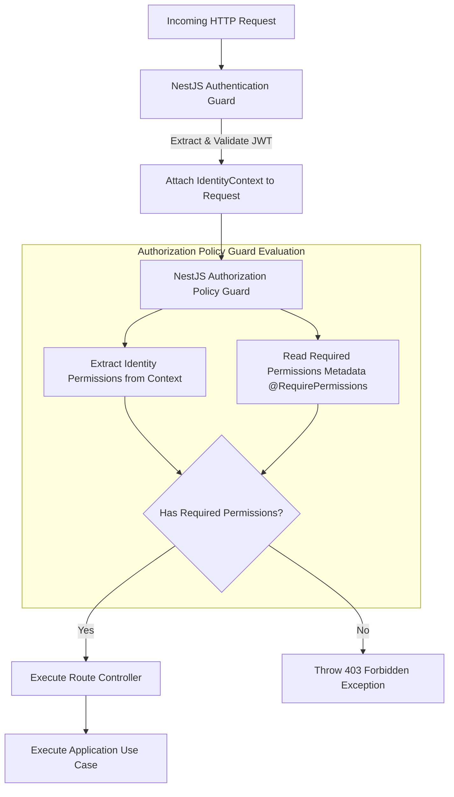

# ADR-0002: Identity Authorization Architecture (RBAC & Least Privilege)

- **Status:** Accepted
- **Date:** 2026-07-25
- **Authors:** Principal Security Architect & Staff Software Engineer
- **Domain:** Identity & Access Management (IAM)

---

## Context

The Kinergy Platform requires a comprehensive authorization framework to control access to business functions, domain entities, energy asset management capabilities, and system configuration endpoints across a future multi-tenant SaaS architecture.

Authorization must strictly enforce the **Principle of Least Privilege**, decouple identity verification (Authentication) from entitlement evaluation (Authorization), and maintain clean separation of concerns within NestJS application layers.

---

## Problem

In many applications, authorization logic is fragmented across controllers, services, and database queries using ad-hoc `if (user.role === 'ADMIN')` checks. This anti-pattern leads to:

1. Privileged logic leakages and insecure direct object references (IDOR).
2. Fragile role explosion when business demands fine-grained access rules.
3. Tight coupling between business domain logic and security access policies.
4. Difficulty auditing effective user permissions across multi-tenant boundaries.

---

## Decision

We decide to implement a **Fine-Grained Role-Based Access Control (RBAC)** architecture governed by **Explicit Permission Strings** (`resource:action`) and enforced via **NestJS Policy Guards and Interceptors**.



### 1. Separation of Authentication vs Authorization

- **Authentication (AuthN):** Verifies _who_ the caller is. Executed by `JwtAuthGuard`, extracting claims from the validated JWT token and instantiating an immutable `IdentityContext` on the request object.
- **Authorization (AuthZ):** Verifies _what_ the authenticated identity is allowed to do. Executed by `PermissionsGuard` and policy handlers prior to route controller invocation.

### 2. Fine-Grained Permission Strings (`resource:action`)

Instead of evaluating raw roles within code, all domain rights are defined as discrete permission tokens using standard notation:
`<domain_context>:<resource>:<action>`

Examples:

- `identity:user:create`
- `identity:role:assign`
- `assets:device:read`
- `assets:device:configure`
- `analytics:report:export`

### 3. Role-to-Permission Mapping Model

Roles act as administrative wrappers bundling permission sets. The platform defines system default roles and allows dynamic tenant roles:

- **System Pre-defined Roles:**
  - `SUPER_ADMIN`: All platform permissions (`*:*:*`).
  - `TENANT_ADMIN`: All tenant-scoped administrative permissions (`<tenant_id>:*:*`).
  - `OPERATOR`: Operational asset configuration and reporting permissions.
  - `VIEWER`: Read-only permissions across assigned tenant resources.

- **Domain Model Structure:**

```typescript
// Conceptual domain model (No code implementation)
// Entity: Role -> Aggregate Root
// Entity: Permission -> Value Object
// Relationship: User HAS-MANY Roles, Role HAS-MANY Permissions
```

### 4. Principle of Least Privilege & Default-Deny Baseline

- **Default-Deny Policy:** All NestJS API endpoints are protected by default. Access is rejected (403 Forbidden) unless explicitly annotated with `@RequirePermissions(...)` or `@Public()`.
- **Tenant Scope Enforcement:** Permissions are evaluated strictly within the context of the user's active `tenant_id`. Holding `assets:device:configure` in Tenant A gives zero right to access assets in Tenant B.

---

## Alternatives Considered

1. **Coarse-Grained Role Checks (`@Roles('ADMIN')`):**
   - _Pros:_ Simple to implement initially.
   - _Cons:_ Inflexible. Adding a custom role or tweaking operator rights requires changing code and redeploying backend controllers.
2. **Attribute-Based Access Control (ABAC) / Open Policy Agent (OPA):**
   - _Pros:_ Extremely dynamic, evaluating attributes like time of day, IP address, device security posture, and payload fields.
   - _Cons:_ High operational overhead, increased runtime latency, and unnecessary initial complexity for current platform requirements.
3. **Hardcoding Checks in Domain Use Cases:**
   - _Pros:_ Direct visibility within domain functions.
   - _Cons:_ Violates Clean Architecture by polluting core business logic with infrastructure security concerns.

---

## Consequences

### Positive

- **Auditable Security:** Every protected route explicitly declares required permissions via metadata decorators (`@RequirePermissions('identity:user:create')`).
- **Flexibility:** Roles can be created, updated, or reassigned by tenant admins without codebase changes.
- **Zero Business Logic Pollution:** Security policy evaluation occurs in NestJS guards, keeping domain use cases pure.

### Negative

- **Token Size:** Including permission lists in JWT claims increases access token size. (Mitigated by compressing permission tokens or caching role permissions server-side).
- **Maintenance:** Permission catalog must be strictly versioned and maintained across product updates.

---

## Future Evolution

1. **Hierarchical & Inherited Roles:** Support for parent-child role structures where child roles inherit base permission sets.
2. **Dynamic ABAC Rules:** Extending `PermissionsGuard` with condition functions (e.g., evaluating dynamic resource ownership `isOwner(userId, assetId)`).
3. **External Policy Engine Integration:** Offloading authorization policy evaluation to Open Policy Agent (OPA) or AWS Verified Permissions as scale demands.
