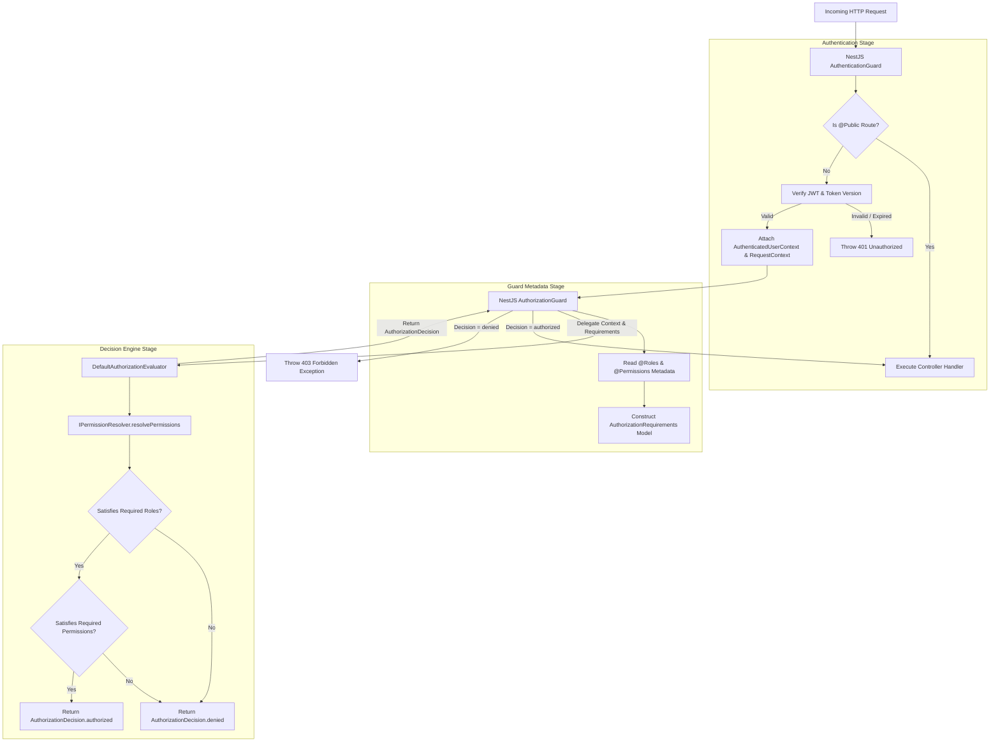

# Identity Authorization Framework & Security Policy Specification

- **Status:** Accepted (Authoritative Single Source of Truth)
- **Date:** 2026-07-29
- **Authors:** Principal Security Architect & Staff Software Engineer
- **Domain:** Identity & Access Management (IAM)
- **Target Subsystem:** `apps/api/src/platform/identity`

---

## Executive Summary

The Kinergy Platform Authorization Framework enforces strict **Principle of Least Privilege (PoLP)** and **Default-Deny** access controls across the platform. Authentication (verifying identity) is strictly separated from Authorization (evaluating entitlement decisions). Authorization logic is decoupled from HTTP guards into a dedicated application-layer decision engine (`DefaultAuthorizationEvaluator`) and permission resolution port (`IPermissionResolver`).

---

## 1. End-to-End Permission Resolution & Authorization Flow



---

## 2. Component Specifications

### 2.1 Authentication Guard (`AuthenticationGuard`)

- **Layer**: Infrastructure / Transport (`apps/api/src/platform/identity/guards/authentication.guard.ts`).
- **Responsibilities**:
  1. Checks if route is annotated with `@Public()`. If true, bypasses authentication.
  2. Extracts Bearer token from `Authorization` HTTP header.
  3. Verifies token signature and expiration via `JwtTokenFactory`.
  4. Validates user account status and `tokenVersion` to reject revoked tokens immediately.
  5. Binds authenticated user payload to `RequestContext` via `AsyncLocalStorage`.

### 2.2 Authorization Guard (`AuthorizationGuard`)

- **Layer**: Infrastructure / Transport (`apps/api/src/platform/identity/authorization/guards/authorization.guard.ts`).
- **Responsibilities**:
  1. Reads metadata annotations (`@Roles()`, `@RequirePermissions()`) from route handler and class target.
  2. Extracts active `AuthenticatedUserContext` from request local storage.
  3. Builds `AuthorizationRequirements` model object.
  4. Delegates evaluation to `IAuthorizationEvaluator` abstraction. Zero inline decision checks.
  5. If `decision.isAuthorized` is `false`, throws `ForbiddenException(decision.reason)`.

### 2.3 Authorization Decision Engine (`AuthorizationEvaluator`)

- **Layer**: Application Policy Engine (`apps/api/src/platform/identity/authorization/evaluators`).
- **Interface**: `IAuthorizationEvaluator` / Implementation: `DefaultAuthorizationEvaluator`.
- **Responsibilities**:
  - Functions as the single source of truth for authorization decisions across the application.
  - Receives `AuthenticatedUserContext` and `AuthorizationRequirements`.
  - Evaluates role compliance (`hasRequiredRole`).
  - Evaluates permission compliance via `IPermissionResolver` (`hasRequiredPermissions`).
  - Returns structured immutable `AuthorizationDecision` objects (`isAuthorized`, `reason`, `failedRequirement`, `evaluatedAt`).

### 2.4 Permission Resolver (`PermissionResolver`)

- **Layer**: Application Port (`apps/api/src/platform/identity/authorization/resolvers`).
- **Interface**: `IPermissionResolver` / Implementation: `DefaultPermissionResolver`.
- **Wildcard Permission Matching Engine**:
  - Resolves effective permissions from explicit direct permissions and assigned role permission sets.
  - Supports wildcard notation:
    - `*` matches any permission across the system.
    - `users.*` matches `users:create`, `users:read`, `users:update`, `users:delete`.
    - `clients.read` matches exact string `clients.read`.

### 2.5 Request Context (`RequestContext`)

- **Layer**: Platform Service (`apps/api/src/platform/identity/context`).
- **Implementation**: `RequestContextAccessor` backed by Node.js `AsyncLocalStorage`.
- **Attributes Exposed**: `userId`, `email`, `tenantId`, `roles`, `permissions`, `tokenVersion`, `authenticatedAt`.

---

## 3. Security Metadata Decorators

| Decorator                  | Target         | Usage & Effect                                                                                                     |
| :------------------------- | :------------- | :----------------------------------------------------------------------------------------------------------------- |
| `@Public()`                | Method / Class | Bypasses `AuthenticationGuard` and `AuthorizationGuard` (e.g. `/auth/login`, `/health`).                           |
| `@Roles(...)`              | Method / Class | Requires user to possess at least one of the specified roles (e.g., `@Roles('ADMIN', 'OWNER')`).                   |
| `@RequirePermissions(...)` | Method / Class | Requires user to possess all listed permission strings or wildcards (e.g., `@RequirePermissions('users:create')`). |
| `@CurrentUser()`           | Parameter      | Injects current `AuthenticatedUserContext` object directly into controller method parameters.                      |

---

## 4. Role Evaluation Matrix

The platform defines system built-in roles (`Owner`, `Trainer`, `Kitchen Staff`, `Receptionist`) and supports dynamic tenant roles. For the full 22-permission mapping matrix, see [Role & Permission Matrix](file:///c:/Projects/kinergy-platform/docs/security/role-permission-matrix.md).

| Role Code      | Type                    | Default Permissions Scope                        |
| :------------- | :---------------------- | :----------------------------------------------- |
| `OWNER`        | System Built-in         | Full platform wildcard control (`*`)             |
| `ADMIN`        | Tenant Admin            | `users.*`, `roles.*`, `sustainability.*`         |
| `OPERATOR`     | Facility Energy Manager | `assets.read`, `assets.update`, `telemetry.read` |
| `TRAINER`      | Operational Field Staff | `appointments.read`, `clients.read`              |
| `CLIENT`       | End Consumer            | `profile.me`, `telemetry.read_own`               |
| `RECEPTIONIST` | Front Desk Support      | `appointments.*`, `clients.read`                 |

---

## 5. Permission Notation & Resolution Algorithm

Permissions follow standard string notation: `<resource>:<action>` or `<domain>:<resource>:<action>`.

### Resolution Order Algorithm

```
1. If user permissions contain "*", ALLOW immediately (Super Admin Override).
2. For each required permission "R":
   a. Check if direct user permissions contain "R" or matching wildcard (e.g. "users.*").
   b. Check if any assigned user role permissions contain "R" or matching wildcard.
   c. If neither match, DENY request.
3. If all required permissions are satisfied, ALLOW request.
```

---

## 6. Future Extensibility & Advanced Policies

1. **Dynamic ABAC Resource Ownership Rules**: Extending `AuthorizationRequirements` with dynamic condition attributes (e.g., `isOwner(userId, assetId)` or `isTenantMember(tenantId)`).
2. **Parent-Child Role Inheritance**: Support for hierarchical role models where child roles inherit base permission sets.
3. **External PDP Offloading**: `IPermissionResolver` and `IAuthorizationEvaluator` ports can be re-bound via dependency injection to external Policy Decision Points (Open Policy Agent - OPA, OpenFGA, AWS Cedar) without changing controller handlers or guards.
