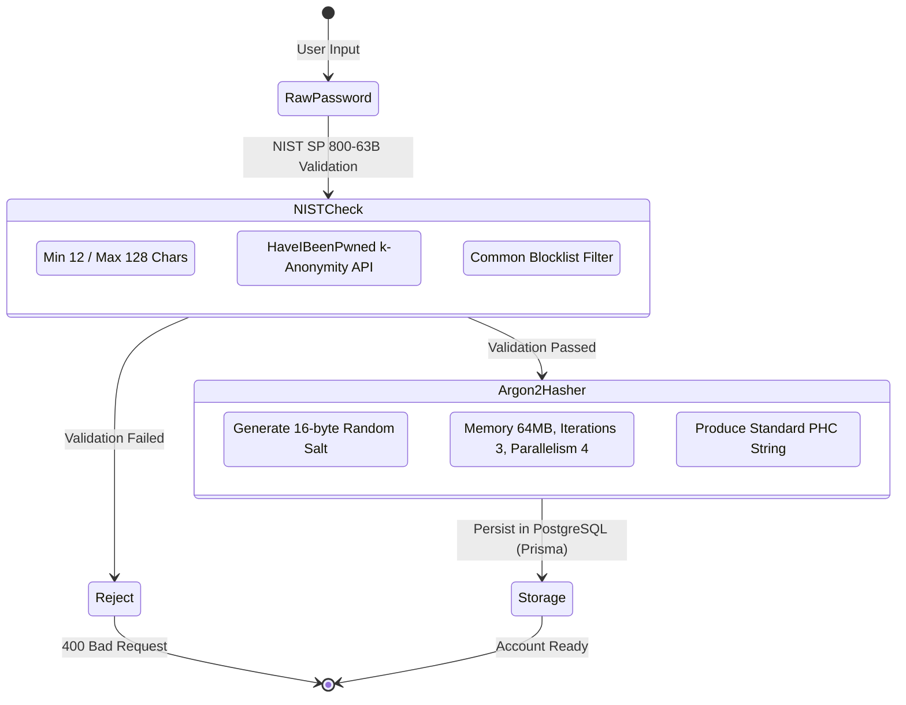

# ADR-0003: Password Hashing, Complexity, and Credential Management Strategy

- **Status:** Accepted
- **Date:** 2026-07-25
- **Authors:** Principal Security Architect & Staff Software Engineer
- **Domain:** Identity & Access Management (IAM)

---

## Context

Local account credentials (email and password) remain a primary entry point for user authentication in the Kinergy Platform. Protecting stored credentials against offline cracking (in the event of database leaks) and protecting authentication flows against online credential stuffing is a non-negotiable security requirement.

Security standards have shifted significantly from legacy composition rules (forced uppercase, numbers, symbols) toward entropy-based guidelines and breach prevention standardizations published in **NIST SP 800-63B (Digital Identity Guidelines)**.

---

## Problem

Legacy password policies introduce severe security flaws:

1. Short passwords with forced arbitrary character rules (e.g. `P@ssword1!`) lead to predictable, low-entropy choices that dictionary attacks bypass easily.
2. Fast or memory-light hashing algorithms (MD5, SHA256, low-cost bcrypt) allow attackers to crack leaked database hashes using high-throughput GPU/ASIC rigs.
3. Insecure password reset mechanisms (predictable tokens, user enumeration via status messages) expose accounts to account takeover (ATO).

---

## Decision

We decide to adopt **Argon2id Password Hashing**, **NIST SP 800-63B Password Complexity Standards**, and **Cryptographically Secure Out-of-Band Password Reset Workflows**.

### 1. Hashing Algorithm Standard: Argon2id

- **Primary Hashing Standard:** **Argon2id** (the memory-hard winner of the Password Hashing Competition, RFC 9106).
  - **Memory Cost ($m$):** 65,536 KB (64 MB).
  - **Time Iterations ($t$):** 3 passes.
  - **Parallelism ($p$):** 4 threads.
  - **Output Hash Length:** 32 bytes.
- **Fallback / Legacy Support:** **bcrypt** with a minimum work factor of 12 (used strictly for backwards compatibility when migrating legacy records).

### 2. Salt Policy

- Salts are generated using a Cryptographically Secure Pseudorandom Number Generator (CSPRNG via Node.js `crypto.randomBytes`).
- Minimum salt length: 16 bytes (128 bits).
- Salt uniqueness: Generated per-password. No global static pepper is relied upon for entropy (though optional KMS key envelope encryption can wrap hash storage).
- Format: Standard PHC string format containing salt, parameters, and digest output:
  `$argon2id$v=19$m=65536,t=3,p=4$<salt-base64>$<hash-base64>`

### 3. Password Complexity (NIST SP 800-63B Guidelines)

- **Length Constraints:** Minimum 12 characters (16+ recommended for administrative accounts); maximum 128 characters (preventing DoS via oversized hashing inputs).
- **Character Space:** Allow all Unicode characters (spaces, special symbols, international character sets, and emojis).
- **No Arbitrary Composition Rules:** Do NOT force mandatory combinations of uppercase, lowercase, numbers, or symbols.
- **Compromised Password Checking:** Validate candidate passwords against known breached password sets (e.g., HaveIBeenPwned k-Anonymity API or local bloom filters).
- **No Mandatory Periodic Expiration:** Eliminate forced 90-day password changes, as they encourage predictable iterative patterns (e.g., `Spring2026!`).

### 4. Password Change Strategy

- Requires re-authentication (verifying current password).
- Triggers immediate invalidation of **all** existing Refresh Token families and active sessions for the user account.
- Emits a `PasswordChangedEvent` to trigger an email notification to the user.

### 5. Password Reset Strategy

- **Out-of-Band Delivery:** Single-use password reset link sent via verified email/SMS.
- **Token Security:** Cryptographically secure 256-bit token generated via CSPRNG.
- **Storage:** Only the HMAC-SHA256 hash of the reset token is stored in the database with a strict 15-minute expiration timestamp (`reset_token_expires_at`).
- **Constant-Time Verification:** Token comparison is executed using `crypto.timingSafeEqual` to eliminate timing side-channel attacks.
- **Anti-Enumeration:** Reset endpoints return identical generic success responses regardless of whether the email exists in the database.

### 6. Future Password History Support

- Schema design includes a `PasswordHistory` aggregate entity linked to the Identity user.
- Stores the last $N$ (e.g., 5) hashed passwords with distinct salts to enforce non-reuse policies during password changes.

### 7. Password Lifecycle & Temporary Password Management

Password lifecycle operations are executed via dedicated application use cases in `platform/identity/use-cases/password`:

- **User Password Change (`ChangePasswordUseCase`)**:
  - Verifies current password using `IPasswordHasher.verify(...)`.
  - Validates candidate against `PasswordPolicyService`.
  - Verifies new password differs from current password.
  - Updates hash via `User.changePassword(newHash)`, invalidating active refresh tokens and incrementing `tokenVersion`.
  - Emits `PasswordChanged` security event.
- **Admin Password Reset (`ResetPasswordUseCase`)**:
  - Generates cryptographically secure temporary password via `TemporaryPasswordGeneratorService`.
  - Hashes temporary password via Argon2id.
  - Updates hash via `User.changePassword(tempHash)` and invalidates active sessions.
  - Emits `PasswordResetByAdmin` security event.
  - Securely returns temporary password once to admin. Plaintext passwords & hashes are never logged.

---

## Alternatives Considered

1. **Plain PBKDF2-HMAC-SHA256:**
   - _Pros:_ Native FIPS compliance in certain enterprise environments.
   - _Cons:_ Vulnerable to high-throughput parallel cracking on modern GPU and ASIC hardware due to lack of memory hardness.
2. **Traditional Complexity Rules (1 Upper, 1 Lower, 1 Digit, 1 Symbol):**
   - _Pros:_ Common in legacy corporate IT policies.
   - _Cons:_ Proven by NIST research to result in lower overall entropy passwords (e.g., `Password123!`) while harming user experience.

---

## Consequences

### Positive

- **Maximum Offline Resilience:** Argon2id memory hardness effectively paralyzes GPU/ASIC cracking attempts.
- **NIST SP 800-63B Compliance:** Adheres to modern international digital identity standards.
- **Secure Reset Workflow:** Resistant to token theft, timing attacks, and user enumeration.

### Negative

- **Server Memory Allocation:** 64 MB per hash operation requires rate-limiting on authentication and registration endpoints to protect against CPU/Memory exhaustion DoS attacks.

---

## Future Evolution

1. **Hardware Rate Limiting & CAPTCHA Integration:** Automated challenge invocation upon detecting repeated failed password attempts.
2. **Passwordless Transition:** Transitioning default login flows to WebAuthn / Passkeys, keeping passwords as secondary fallbacks.
