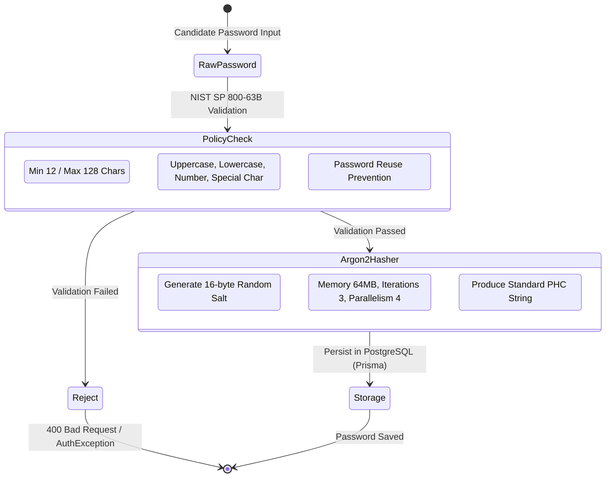

# Password Hashing, Complexity, and Credential Management Strategy

- **Status:** Accepted (Authoritative Specification)
- **Date:** 2026-07-29
- **Authors:** Principal Security Architect & Staff Software Engineer
- **Domain:** Identity & Access Management (IAM)
- **ADR Alignment:** [ADR 0036](file:///c:/Projects/kinergy-platform/docs/adr/0036-hardened-password-infrastructure-and-owasp-alignment.md) & [ADR 0031](file:///c:/Projects/kinergy-platform/docs/adr/0031-secure-password-lifecycle-management.md)

---

## 1. Context & Executive Summary

Local account credentials (email and password) remain a primary entry point for user authentication in the Kinergy Platform. Protecting stored credentials against offline cracking (in the event of database leaks) and protecting authentication flows against online credential stuffing is a non-negotiable security requirement.

Security standards follow **NIST SP 800-63B (Digital Identity Guidelines)** and **OWASP Password Storage Cheat Sheet** recommendations.

---

## 2. Hashing Algorithm Standard: Argon2id

- **Primary Hashing Standard:** **Argon2id** (the memory-hard winner of the Password Hashing Competition, RFC 9106).
  - **Memory Cost ($m$):** $65,536\text{ KB}$ ($64\text{ MB}$).
  - **Time Iterations ($t$):** $3\text{ passes}$.
  - **Parallelism ($p$):** $4\text{ threads}$.
  - **Salt Length:** Minimum 16 bytes (128 bits) generated via CSPRNG (`crypto.randomBytes`).
  - **Output Digest Format**: Standard PHC string format containing algorithm, version, parameters, salt, and digest:
    `$argon2id$v=19$m=65536,t=3,p=4$<salt-base64>$<hash-base64>`

---

## 3. Centralized Password Policy & Complexity Engine

Password policies are managed by `ConfigPasswordPolicyConfiguration` (`IPasswordPolicyConfiguration`) and enforced by `PasswordPolicyService`.

### 3.1 Policy Configuration Rules

| Policy Rule               | Config Parameter     | Default Setting         | Enforcement Description                                      |
| :------------------------ | :------------------- | :---------------------- | :----------------------------------------------------------- |
| **Minimum Length**        | `minLength`          | $12\text{ characters}$  | Rejects passwords shorter than 12 characters.                |
| **Maximum Length**        | `maxLength`          | $128\text{ characters}$ | Prevents Long Password DoS attacks against hashing CPU.      |
| **Require Uppercase**     | `requireUppercase`   | `true`                  | Requires at least 1 uppercase letter (`A-Z`).                |
| **Require Lowercase**     | `requireLowercase`   | `true`                  | Requires at least 1 lowercase letter (`a-z`).                |
| **Require Numbers**       | `requireNumber`      | `true`                  | Requires at least 1 numeric digit (`0-9`).                   |
| **Require Special Chars** | `requireSpecialChar` | `true`                  | Requires at least 1 special character (`!@#$%^&*...`).       |
| **Prevent Reuse**         | `preventReuse`       | `true`                  | Rejects candidate password if identical to current password. |

---

## 4. Password Change & Reset Workflows

### 4.1 User Password Change (`ChangePasswordUseCase`)

- Requires verifying current password via `argon2PasswordHasher.compare(...)`.
- Validates candidate against `PasswordPolicyService`.
- Verifies candidate differs from current password.
- Updates hash via `User.changePassword(newHash)`, invalidating active refresh tokens and incrementing `tokenVersion`.
- Emits `PasswordChanged` security event.

### 4.2 Admin Temporary Password Reset (`ResetPasswordUseCase`)

- Generates a cryptographically secure 16-character temporary password using `TemporaryPasswordGeneratorService` (CSPRNG `crypto.randomBytes`).
- Hashes temporary password via Argon2id.
- Updates hash via `User.changePassword(tempHash)` and invalidates active sessions.
- Emits `PasswordResetByAdmin` security event.
- Returns temporary password once to admin. Plaintext credentials are never logged or stored.
